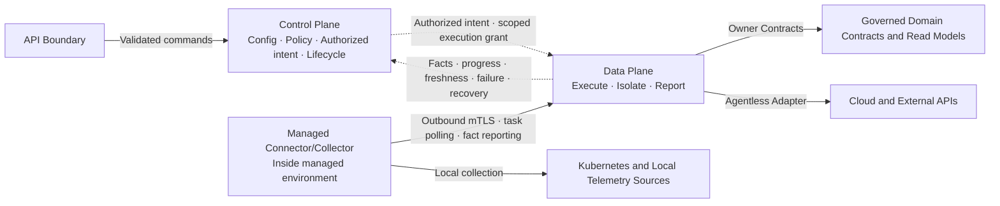

# COP 控制面与数据面

## Purpose

定义 Control Plane、Data Plane、Managed Connector/Collector 和 External Adapter Boundary 的职责、信任方向、任务与事实流、凭据边界、故障隔离及恢复语义。

## Scope

- 接入配置、authorized intent、任务编排和 lifecycle
- Agentless cloud discovery、受管环境本地采集和状态同步
- 出站 mTLS、workload identity、scoped execution grant 和 credential reference
- Facts、progress、freshness、failure、recovery 和 operational signals
- 按连接与执行边界进行的 backpressure、重试、隔离和恢复

## Non-goals

- 微服务数量、进程模型、代码包、数据库、消息系统或部署拓扑
- 云 SDK、Kubernetes client、Collector、queue、Secret/KMS、PKI 或 service mesh 产品选型
- API shape、event fields、protocol、port、poll interval、timeout、retry count、queue size 或 numerical SLO
- 云资源或业务工作负载的创建、修改、删除、remediation 或 automation
- 接受 COP 入站连接的远程执行代理

## Context

本文展开 `COP-ARCH-002` 中 Control Plane、Data Plane 与受管环境组件的执行和信任边界。`COP-DOM-004` 负责云接入领域模型，`COP-DOM-005` 负责 Telemetry 接入与资源关联语义，`COP-INFRA-004` 负责可观测技术栈。外部云平台、Kubernetes 和 Telemetry 系统继续拥有其原始状态和数据权威；本文不复制领域模型或基础设施产品设计。

## Architecture or Model

### Execution Boundary Model

采用 Contract-first 的执行边界模型：Control Plane 决定并持久化授权意图、任务 lifecycle 和恢复决策；Data Plane 执行已授权任务并隔离外部产品语义；Managed Connector/Collector 在受管环境内执行本地采集或同步，只主动建立出站连接。执行方只回报 observations、facts 和 lifecycle signals，不修改 policy、desired state 或 authorization scope。

云平台优先通过集中式 agentless Adapter 进行 discovery 和 status synchronization。Kubernetes 与 Telemetry 可以使用受管 Connector/Collector，也可以在适用时由 Data Plane 通过外部 API 接入。两种执行方式共享身份、授权、幂等、隔离和恢复 Contract，不要求形成单一物理运行单元。

### Control and Data Plane Diagram

图中 Control Plane 到 Data Plane 的虚线表示授权意图，不表示共享存储写入。Data Plane 到 Control Plane 的虚线表示事实和生命周期信号，不允许事实静默覆盖 policy 或 desired state。Connector 到 Data Plane 的单向箭头表示网络会话只能由受管环境主动建立；任务响应在该连接内返回，不产生 COP 到受管环境的入站连接要求。

### Responsibilities

#### Control Plane

- 拥有接入配置、credential reference、policy、desired state、authorized intent、任务编排和 task lifecycle。
- 在已验证的 identity、tenant、resource 和 authorization context 中接受或拒绝命令。
- 持久化任务目标、授权范围、policy/config version、取消意图和恢复决策。
- 向 Data Plane 提供短期、限租户、限资源、限操作的 execution grant。
- 不采集 raw Telemetry，不直接进入受管环境执行，不把最终 authorization decision 委托给 Data Plane。

#### Data Plane

- 执行已授权的 discovery、collection、synchronization、normalization 和 status reporting。
- 通过 Adapter 或等价 stable boundary 隔离云、Kubernetes 和 Telemetry 产品语义。
- 支持 agentless cloud discovery，并承接 Managed Connector/Collector 主动建立的任务会话。
- 处理有界 backpressure、retry、checkpoint、duplicate protection 和局部 failure isolation。
- 只提交 observations 和执行事实，不扩大 tenant、account、cluster、resource、operation 或 signal scope。

#### Managed Connector/Collector

- 位于 Kubernetes 集群或其他需要本地采集能力的受管环境。
- 只主动向 COP 建立出站 mTLS 会话；COP 不依赖进入受管环境的入站控制连接。
- 通过 polling 或受控 streaming 在既有出站会话内获取已授权任务。
- 校验任务身份、有效期、policy/config version 和 scope 后执行本地采集或同步。
- 回报 facts、progress、freshness、failure 和 recovery signals，不直接写 Control Plane 私有存储。
- 不持有可跨租户、跨账号或跨集群复用的长期高权限凭据。

#### External Adapter Boundary

- Adapter 负责协议和供应商语义转换，不把产品字段、错误码或认证机制泄漏为核心领域不变量。
- Agentless Adapter 与 Managed Connector/Collector 使用相同的 owner Contract 提交 observations。
- External identity provider、notification system 和 object storage 使用其 owning Contract，不被强制路由到 Data Plane。

### Task and Data Flows

#### Connection Configuration

API Boundary 将经过 identity、tenant 和 authorization 校验的接入配置交给 Control Plane。Control Plane 保存连接配置和 credential reference，不保存或传播原始凭据。配置变更产生新的版本；运行中任务使用其已绑定的 policy/config version，不能被未审计的隐式变更覆盖。

#### Task Creation and Authorization

Control Plane 先持久化 authorized intent、目标范围、policy/config version 和 task lifecycle，再生成短期 execution grant。授权至少约束 org、tenant、account/cluster、resource scope、operation、expiry 和 authorization context。过期、撤销、scope 不匹配或策略版本失效时 default deny。

#### Task Acquisition and Execution

Agentless cloud 任务由 Data Plane 通过对应 Adapter 执行。本地 Kubernetes 或 Telemetry 任务由 Connector/Collector 通过出站 mTLS 会话 polling 或受控 streaming 获取。执行方只能在授权范围内运行；发现新资源不能自动扩大当前任务 scope。任务可以在 checkpoint 边界取消、暂停、继续或重新同步。

#### Fact Reporting and Ownership

执行方回报 observations、facts、progress、freshness、failure 和 recovery signals。Control Plane 维护 task lifecycle 和 recovery decision；领域 owner 通过 owner Contract 接收 observations 并维护写模型及不变量。Data Plane、Connector/Collector 和 Adapter 都不得直接写入 Control Plane 或其他领域私有存储。

#### Query Path

用户查询优先使用受治理 read model，不穿过任务执行链。读模型声明 owner、source Contract、update method、freshness 和 failure semantics。需要外部实时查询时仍通过 owning integration Contract，调用方不得直接访问 Adapter、Connector 或 external credential。

### Identity, Authorization and Credentials

- Control Plane、Data Plane 和 Connector/Collector 使用可验证 workload identity；网络位置不构成信任。
- Connector/Collector 只通过双向验证的出站 mTLS 会话接入；建立连接不等于获得任务权限。
- 每个任务携带明确的 org、tenant、主体或 workload、account/cluster、resource scope、operation、policy version、expiry 和 authorization context。
- Execution grant 必须短期有效、最小权限且不可扩大范围；验证失败时 default deny。
- Credential 只通过 controlled reference 解析；原始值不得进入普通任务载荷、领域数据、事件、日志或审计正文。
- `task ID`、`attempt`、`idempotency key` 和 `checkpoint` 防止重复执行和错误重放。
- 接入、授权、下发、执行、拒绝、取消、失败、恢复和 credential reference 使用记录主体、目标、范围、时间和结果。

### Failure Isolation and Recovery

- 故障至少按 account、cluster、Connector/Collector、Adapter 和外部 dependency 隔离。
- 单一执行边界失败不得阻断无关连接、配置或不依赖该故障源的查询。
- 队列、并发和重试必须有界；backpressure 不能通过无界积压或同步等待扩散到 Experience Boundary。
- 可重试操作必须幂等或具有等价 duplicate protection，并携带明确的 attempt 和 checkpoint。
- Duplicate、out-of-order、delay 和 replay 不得破坏领域不变量。
- 同步交互区分 rejected、timeout、dependency failure、partial result 和 unknown outcome。
- 异步任务区分 pending、running、degraded、failed、cancelled、recovering 和 completed。
- Connector 离线、外部依赖不可用或数据过期时保留最后确认的 source 和 freshness，并明确显示 stale 或 unknown，不能伪装为 real-time success。
- 恢复路径包括继续执行、重新调度、resynchronization、重建派生读模型和人工介入；恢复完成必须产生可验证结果。

### Operational Signals

- 所有运行单元暴露 health 和 dependency signals。
- 承担执行、同步或复制职责的单元额外暴露 progress、freshness、backlog、error 和 recovery signals。
- Control Plane 能区分未调度、等待 Connector、执行中、外部依赖失败、回报失败和恢复中状态。
- Data Plane 能按 tenant、account/cluster、Connector/Collector、Adapter 和 dependency 识别积压与故障，但日志和指标不得泄漏 credential 或跨租户敏感信息。
- 审计回答谁在什么范围内创建、授权、执行、拒绝、取消或恢复了任务；运营 Telemetry 不替代审计记录。

### Success Criteria

- Control Plane 决策、Data Plane 执行、Connector/Collector 本地执行和外部系统权威可以独立识别。
- Control Plane 下发授权意图，执行方回报事实；不存在循环同步依赖或跨平面直接写存储。
- 云平台 agentless discovery 与 Kubernetes/Telemetry 受管 Connector/Collector 可以并存。
- Connector/Collector 只建立出站 mTLS 会话，COP 不依赖进入受管环境的入站连接。
- 每个任务具有短期、限租户、限资源、限操作的授权上下文，原始 credential 不进入任务载荷。
- 故障按连接和执行边界隔离，并具有有界 backpressure、幂等重试、checkpoint、取消和 resynchronization 路径。
- Offline、stale、unknown、degraded 和 failed 与成功明确区分，并保留 source 和 freshness。

## Constraints

- Control Plane 拥有 intent、policy、desired state、task lifecycle 和 recovery decision；Data Plane 及 Connector/Collector 只执行授权任务并回报事实。
- Managed Connector/Collector 只建立出站 mTLS 会话，不接受 COP 入站控制连接。
- Execution grant 短期有效、限租户、限资源、限操作并 default deny；网络位置不构成信任。
- 原始 credential 不进入任务、领域数据、事件、日志或审计正文，只能通过 controlled reference 使用。
- 禁止跨平面直接写存储；observations 只通过 owner Contract 提交。
- 外部产品语义通过 Adapter 或 owning Contract 隔离，不能泄漏到核心领域模型。
- Contract 必须版本化演进；重大不兼容变更进入 RFC/ADR，并具有迁移、回退或明确的 forward-recovery 方案。
- 本文不替代 `COP-ARCH-002`、`COP-DOM-004`、`COP-DOM-005` 或 `COP-INFRA-004` 的权威边界。

## Quality Attributes

- **安全性：** workload identity、tenant context、scoped execution grant、credential reference 和 no implicit trust 边界明确。
- **可靠性：** 任务可幂等重试、checkpoint、取消、隔离、恢复和重新同步。
- **可运维性：** health、dependency、progress、freshness、backlog、error 和 recovery signals 可追踪。
- **兼容性：** Agentless Adapter 与 Connector/Collector 共享稳定 Contract，核心模型不绑定外部产品。
- **可扩展性：** 故障、并发和 backpressure 按连接与执行边界隔离，不要求全局共享执行状态。
- **可演进性：** Contract 版本变更具有迁移、回退或 forward-recovery 路径。

## Implementation Guidance

在本文状态变为 `accepted` 前，Codex 只能使用本文理解设计范围，不得据此生成生产实现。

## References

- [COP-ARCH-002](logical-architecture.md)
- [COP-DOM-004](../domains/cloud-access-domain.md)
- [COP-DOM-005](../domains/observability-domain.md)
- [COP-INFRA-004](../infrastructure/observability-stack.md)
