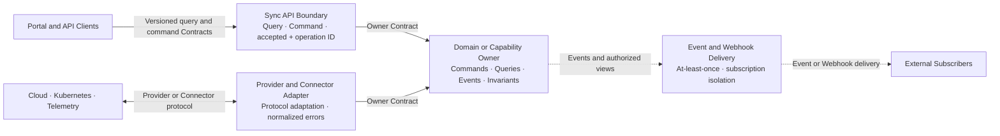

# COP 集成架构

## Purpose

按交互语义定义同步 Query、同步 Command、异步 Task/Event、Webhook 和 Provider/Connector Adapter 的 Contract 所有权、成功与失败语义、交付保证、幂等、隔离、错误归一化和兼容演进。

## Scope

- 同步 Query 和 Command 的适用边界
- 长任务、状态传播和集成事件
- Webhook subscription、delivery、重放和故障隔离
- Provider/Connector Adapter 与外部错误归一化
- Contract version、迁移、废弃、回退和 forward-recovery

## Non-goals

- REST 或 gRPC 的接口全集，以及具体业务字段或事件信封字段
- Broker、topic、queue、dead-letter、Webhook 签名算法、SDK 或 Provider 实现
- Port、timeout、retry count、backoff、payload size、rate limit 或 numerical SLO
- Exactly-once、全局排序、跨系统分布式事务或 Webhook 回滚领域事实
- 拥有领域规则、写模型或共享数据库的中央 Integration Service

## Context

本文展开 `COP-ARCH-002` 的同步/异步交互与外部 Adapter 边界。`COP-API-001` 负责 API 细则，`COP-API-002` 负责事件信封与交付细则，`COP-API-003` 负责版本、兼容和废弃流程，`COP-DOM-004` 负责云接入领域语义。本文先定义业务语义、所有权和失败行为，再由后续设计选择传输技术。

## Architecture or Model

### Integration Responsibility Model

领域或能力 owner 定义命令、查询、事件、Webhook 事件视图、业务语义和不变量，并拥有写模型及 owner Contract。API Boundary 只负责 identity/tenant/authorization context、输入校验、版本路由和协议适配。Event/Webhook Delivery 只负责订阅、投递、确认、有界重试、隔离、授权重放和可观测性。Provider/Connector Adapter 隔离外部协议、认证、产品模型、错误码和限速语义。

集成能力不拥有领域写模型，不复制领域规则，不编排未经 owner 授权的业务流程，也不形成各领域直接写入的共享数据库。路由和投递拓扑不改变 Contract 所有权。

### Integration Paths Diagram

Owner 节点拥有业务语义和不变量。Sync API、Event/Webhook Delivery 和 Adapter 是集成边界，不是中央业务服务。虚线表示 at-least-once 异步投递，不表示共享存储或分布式事务。Webhook failure 不形成从 Subscriber 回滚 Domain Owner 的反向业务关系。

### Interaction Semantics Matrix

| Interaction type | Applies to | Success semantics | Failure and recovery |
| --- | --- | --- | --- |
| Sync Query | 受治理 read model 或短时外部查询 | 返回数据及 source、freshness、partial/complete 状态 | 区分 validation、authorization、timeout、dependency failure、partial 和 unknown |
| Sync Command | 可快速完成、接受或拒绝的领域命令 | 返回 completed，或 accepted + operation/task ID + 查询位置 | accepted 不等于 completed；最终结果通过任务状态、事件或 Webhook 获取 |
| Async Task/Event | 长任务、状态传播和跨领域通知 | At-least-once；消费者确认处理结果 | 允许 duplicate、delay、out-of-order；使用 ID、幂等键、不变量、有界重试和隔离恢复 |
| Webhook | 向外部订阅方推送最小授权事件视图 | 记录 subscription、delivery、attempt 和确认结果 | 每个订阅独立重试、限速、暂停和恢复，不阻塞领域事务 |
| Provider/Connector | 云、Kubernetes、Telemetry 等外部集成 | Adapter 转换为 owner Contract | 统一错误分类并保留脱敏 source context，不直接透传供应商模型 |

每种交互显式携带适用的 tenant、identity/subject、authorization、correlation/causation、Contract version 和 audit context，但不要求机械使用同一种信封或协议。

### Synchronous Contracts

#### Sync Query

- 查询优先读取受治理 read model，并返回 source、freshness 和 complete/partial 状态。
- 实时外部查询必须通过 owning integration Contract；调用方不得直接访问 Adapter、Connector 或 external credential。
- Query 不产生未声明的写入副作用；需要状态变更时使用 Command Contract。
- Timeout 或 unknown outcome 不能用空结果或旧值伪装为完整成功。

#### Sync Command

- API Boundary 校验 identity、tenant、resource、authorization、Contract version 和 idempotency context。
- 可在同步窗口内完成的命令返回 completed 或明确失败。
- 长任务返回 accepted/rejected、稳定 operation/task ID 和查询位置；accepted 只表示意图已被授权并持久化，不表示执行完成。
- 最终结果通过任务状态 Query、事件或 Webhook 传播，并使用同一 correlation context 关联。

### Asynchronous Tasks and Events

- Async Task/Event 采用 at-least-once，不承诺 exactly-once。
- 生产方提供稳定 event/message ID、Contract version、occurred-at、tenant、source、correlation 和 causation context。
- 消费方使用业务不变量和 idempotency key 去重；duplicate、out-of-order、delay 和 replay 不能产生重复业务效果。
- 排序只在明确声明的 partition/aggregate scope 内有效，不提供全局排序保证。
- 重试有界并区分 retryable 与 terminal failure；失败可以进入逻辑隔离区，但本文不指定 broker 或 dead-letter 产品。
- 授权重放保留原始 event ID，并产生新的 delivery/processing attempt 和完整审计链。

### Webhook Delivery

- 每个 tenant/subscription 使用独立 endpoint、controlled credential reference、签名或身份校验、重放窗口、速率和重试状态。
- Payload 是领域 owner 定义的最小授权事件视图，不包含 credential、secret、内部原始事件或未授权租户数据。
- 每次 delivery 记录 subscription ID、event ID、Contract version、attempt、timestamp、correlation ID 和结果。
- Webhook 采用 at-least-once；外部消费者按 event ID 和业务不变量实现幂等。
- 订阅可以独立暂停、恢复、重放或终止；单一订阅失败不能阻断其他订阅或领域事务。
- 领域事实提交后，Webhook delivery failure 只能改变投递状态，不能回滚领域事实。
- 重放必须经过授权并保留原始 event ID 与新的 delivery attempt。

### Provider and Connector Adapters

- Adapter 只把外部产品语义转换为 owner Contract，不拥有核心领域模型。
- 外部输入先验证 workload/connection identity、tenant、scope 和 credential reference，再映射为领域 command、observation 或 query。
- 外部输出遵循 owning Contract 的最小权限和数据视图，不直接暴露内部写模型。
- 外部错误统一映射为 validation、authentication、authorization、rate limit、timeout、dependency unavailable、conflict、partial 和 unknown。
- 错误上下文只保留已脱敏 provider code、source、correlation ID、retryability 和发生阶段；外部错误消息、credential 或敏感 payload 不向领域或用户边界透传。

### Error Isolation and Recovery

- 同步调用、事件处理、Webhook delivery 和 Adapter operation 携带 correlation/causation context、Contract version、attempt、结果和适用的 latency signal。
- 自动重试只用于明确 retryable 的失败，并具有有界次数或时长及 backoff；validation、authentication、authorization 等 terminal failure 不自动重试。
- 隔离至少按 tenant、subscription、consumer、Provider/Connector 和外部 dependency；单一订阅或 Provider 故障不能阻断其他集成。
- Unknown outcome 不能自动宣称失败或成功，必须通过状态查询、对账或幂等重试确认。
- 恢复路径包括重新投递、授权重放、重新同步、订阅恢复和人工介入；恢复保留审计链并验证最终结果。
- Backlog、retrying、isolated、paused、degraded、failed 和 recovered 状态可观测，并与领域业务状态区分。

### Versioning and Compatibility

- Contract 默认采用向后兼容的增量演进；新增可选字段或能力不得改变既有字段和行为语义。
- 破坏性变更发布显式新版本，并提供双版本迁移窗口、废弃通知、消费者兼容验证和迁移证据。
- Sync API、Event、Webhook 和 Adapter Contract 声明 owner、version、适用交付/失败语义和废弃状态，但不强制使用同一种协议或信封。
- 移除旧版本前验证活跃消费者已经迁移，且没有未解决的隔离投递或重放依赖。
- 重大不兼容变更进入 RFC/ADR，并提供可回退路径；确实不可回退时明确 forward-recovery、验证证据和额外批准条件。

### Success Criteria

- 读者能按交互语义选择 Sync Query、Sync Command、Async Task/Event、Webhook 或 Provider/Connector Adapter。
- 每个 Contract 具有明确领域/能力 owner，集成边界不拥有领域写模型或复制业务规则。
- 长任务遵循同步接受、异步完成，并通过 operation/task ID 与最终状态关联。
- Async Event 和 Webhook 采用 at-least-once，消费者处理 duplicate、out-of-order、delay 和 replay。
- Webhook 按 tenant/subscription 独立建立身份、重放、限速、重试和故障隔离边界。
- Provider/Connector 错误映射为统一分类，同时保留脱敏 source context、correlation ID 和 retryability。
- Unknown outcome、partial、terminal failure 和 retryable failure 可区分并具有恢复路径。
- Contract 兼容优先演进；破坏性变更具有显式版本、迁移窗口、消费者验证及回退或 forward-recovery。

## Constraints

- 领域/能力 owner 拥有业务 Contract；集成边界不得拥有领域写模型、复制领域规则或形成共享可写数据库。
- 同步 accepted 不等于 completed；长任务必须提供 operation/task ID 和可查询最终状态。
- Async Event 和 Webhook 使用 at-least-once，消费者负责幂等、duplicate、out-of-order、delay 和 replay。
- Webhook 按 tenant/subscription 隔离 identity、endpoint、credential reference、重放、限速、重试和恢复。
- 外部错误归一化并脱敏；供应商模型、错误消息、credential 和敏感 payload 不得泄漏到核心领域或用户边界。
- Contract 兼容优先；破坏性变更使用显式版本、迁移窗口、消费者验证及回退或 forward-recovery。
- 本文不替代 `COP-ARCH-002`、`COP-API-001`、`COP-API-002`、`COP-API-003` 或 `COP-DOM-004` 的权威边界。

## Quality Attributes

- **边界清晰性：** Contract owner、集成责任和外部模型隔离可判定。
- **安全性：** tenant、identity、authorization、credential reference、Webhook 最小视图和重放保护明确。
- **可靠性：** 至少一次投递、幂等、有界重试、局部隔离、对账和恢复可验证。
- **可运维性：** Correlation、attempt、backlog、retrying、isolated、paused、degraded、failed 和 recovered 可追踪。
- **兼容性：** 增量演进、显式破坏版本、迁移窗口和消费者验证明确。
- **可演进性：** 集成模式不绑定单一协议、broker、Provider 或中央业务服务。

## Implementation Guidance

在本文状态变为 `accepted` 前，Codex 只能使用本文理解设计范围，不得据此生成生产实现。

## References

- [COP-ARCH-002](logical-architecture.md)
- [COP-API-001](../api/api-design-guidelines.md)
- [COP-API-002](../api/event-contracts.md)
- [COP-DOM-004](../domains/cloud-access-domain.md)
