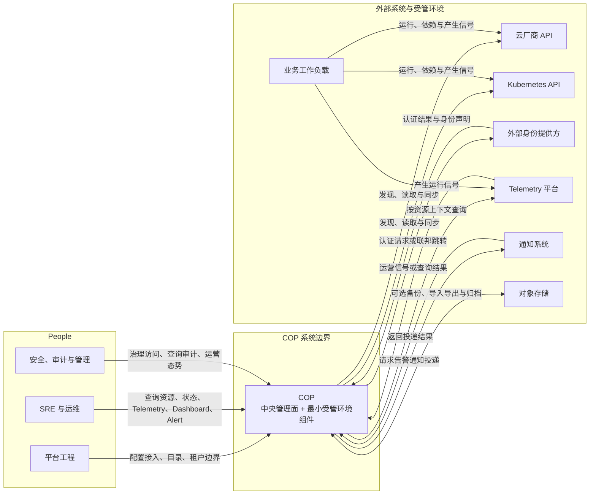

# COP 系统上下文

## Purpose

本文定义 COP、用户、受管环境、业务工作负载和外部平台之间的系统级关系、责任归属与关键边界，为后续架构设计和一致性评审提供共同上下文。

## Scope

本文覆盖 COP 系统边界和用户角色；受管云、Kubernetes 集群与业务工作负载；身份、Telemetry、通知和对象存储集成；以及权威数据、信任、网络、数据传输与失败边界。

## Non-goals

本文不定义 COP 内部组件、服务或部署单元拆分，不定义 API、event、message 或 database 细节，不选择供应商、端口或容量参数，也不定义数值化 SLO；本文不授予 COP 云资源或业务工作负载 lifecycle control。

## Context

本文承接 `COP-VIS-002` 的产品范围与非目标，遵循 `COP-PRI-001` 的架构原则。COP 是资源与运营上下文的集成协调层，不替代任何外部平台；云厂商、Kubernetes、身份、Telemetry、通知和对象存储平台继续保有各自的执行或产品语义。COP 的内部逻辑架构和领域边界由 `COP-ARCH-002` 与 `COP-DOM-001` 负责。

## Architecture or Model

### System Boundary

COP 包含自行部署的中央管理面及受管环境中的最小采集、连接、状态上报组件；两者合并为一个 COP 系统边界，本文不展开其内部服务。平台工程、SRE 与运维、安全、审计与管理三类用户，以及所有外部平台和业务工作负载均位于边界外。外部平台保留实际执行、最终状态和产品语义，COP 负责统一的资源与运营上下文协调。

### System Context Diagram

图中的 COP 节点代表完整系统而非单一进程。COP 不控制业务工作负载生命周期；工作负载只通过云、Kubernetes 和 Telemetry 形成运行、依赖或信号关系。

### User Roles

| 用户角色 | 主要目标 | 与 COP 的系统级交互 |
| --- | --- | --- |
| 平台工程 | 建立受管环境接入和统一资源目录，维护组织与租户边界 | 配置接入、目录、租户边界，并查看同步状态；角色分组不规定组织结构，也不映射为内部组件 |
| SRE 与运维 | 观察资源健康、运营信号和告警，支持故障处置 | 查询资源、状态、Telemetry、Dashboard 与 Alert；角色分组不规定组织结构，也不映射为内部组件 |
| 安全、审计与管理协作用户 | 治理访问、复核审计证据和掌握运营态势 | 治理访问、查询审计和查看运营态势；角色分组不规定组织结构，也不映射为内部组件 |

### External Systems and Interactions

| 外部系统 | 关键交互 | COP 责任边界 | 外部权威职责 |
| --- | --- | --- | --- |
| 云厂商 API | COP 仅发现、读取和同步云资源及状态 | 维护统一身份、目录、关系、来源和同步状态 | 保留资源实际执行、最终状态、供应商产品语义和调度 |
| Kubernetes API | COP 仅发现、读取和同步集群资源及状态 | 维护统一身份、目录、关系、来源和同步状态 | 保留资源实际执行、最终状态、Kubernetes 产品语义和调度 |
| 外部身份提供方 | COP 发起认证请求或联邦跳转并接收声明 | 验证声明，维护 org/tenant membership、role mapping、authorization decision 与 audit | 保留认证、身份 lifecycle 和 claims |
| Telemetry 平台 | COP 按资源上下文查询并接收运营信号或结果 | 维护接入配置、资源关联、查询上下文、同步状态及必要派生状态 | 保留原始指标、日志、追踪、query execution 和 capacity |
| 通知系统 | COP 请求告警通知投递并接收投递结果 | 维护用户可见 Alert definition、resource correlation、notification policy、target reference、request status 与 audit | 负责渠道适配和最终投递 |
| 对象存储 | COP 可选地用于备份、导入导出和大对象归档 | 管理用途、引用、保留意图和业务 lifecycle | 保留持久化、availability 和 storage implementation |
| 业务工作负载 | 在云、Kubernetes 和 Telemetry 中运行并产生信号 | 仅维护资源和运营信号上下文 | 保留构建、发布、托管、运行 lifecycle |

### Authority and Data Ownership

| 领域 | COP 负责 | 外部系统保留的权威职责 |
| --- | --- | --- |
| 资源 | stable identity、unified model、catalog、relationships、sync status | actual state、execution 和 vendor semantics |
| 身份与访问 | org/tenant membership、role mapping、authorization decision、audit | authentication、identity lifecycle、claims |
| Telemetry | Telemetry integration config、resource correlation、query context、必要 derived state | raw telemetry 和 query engine internals |
| Alert | user-visible alert definitions、correlation、status、policy | Telemetry engine 的 data calculation 和 execution semantics |
| 通知 | delivery request、target reference、policy context、audit | channel adaptation、final delivery、channel result |
| 对象存储 | object purpose、reference、retention intent、business lifecycle | persistence、availability、storage implementation |
| 业务工作负载 | 资源和运营信号上下文 | build、release、hosting、runtime lifecycle |

Credentials 只以 controlled reference 使用，Secret/KMS 产品后续定义。Object storage 是 optional dependency，不是 COP core transactional data 或 raw Telemetry authoritative store。

### Trust, Network, and Failure Boundaries

- Managed-environment component 主动向 central management plane 建立 encrypted outbound connection，默认不要求 inbound connection。
- 每个 external platform 使用独立 identity、least privilege 和 auditable credential reference；不因网络位置而互信。
- 每个请求和交互显式包含 org、tenant 与 resource ownership context，default deny。
- External identity claim 必须先验证并映射 tenant/role，之后才能作出授权决定。
- 每个 external connection 暴露 source、last successful time、freshness、error status 和 retry status；stale 状态不得伪装为 real-time fact。
- Sync、report 和 delivery retry 具有 idempotent semantics 或 duplicate protection。
- 单一账号、集群或依赖的 failure 必须隔离；unknown、stale、degraded、failed 与 success 状态可区分。
- Vendor semantics 通过 Adapter 或等价 stable boundary 隔离，不得泄漏到 unified resource identity 或 core domain model。
- 关键 onboarding、authorization、config changes、sync 和 notification 均可 observable、traceable、auditable。

### Success Criteria

- 可识别 COP 系统边界、三类用户及所有外部系统和受管工作负载。
- 每项交互都能判断 initiator、data direction 和 ownership。
- 各领域的外部权威来源明确，COP 的派生上下文不会成为新的权威。
- 不存在默认 inbound；tenant、identity、credential、network 和 data boundary 均显式定义。
- 连接 freshness、error 和 retry 可观察，且单一依赖失败能够隔离。
- 新增外部适配不改变 core semantics、统一资源身份或领域模型。

## Constraints

- 遵循 RFC/ADR 流程及相关 `accepted` 文档约束。
- 云厂商 API 与 Kubernetes API 的 current scope 仅限 read、discover、sync。
- Managed-environment component 使用 encrypted outbound connection。
- Tenant、resource、identity 和 credential context 必须显式，采用 default deny 与 least privilege。
- 外部系统保留 execution、authentication、raw data、final delivery 和 persistence；COP 的 derived context 不得成为新权威。

## Quality Attributes

- **边界清晰性**：系统边界、角色、交互发起方和权威职责易于识别。
- **安全性**：身份、租户、凭据和网络信任显式隔离，默认拒绝且可审计。
- **可靠性**：连接状态、重试语义和依赖故障隔离可区分并可恢复。
- **可运维性**：同步、Telemetry、告警和通知上下文可观察、可追踪、可审计。
- **兼容性**：外部产品语义通过 Adapter 隔离，统一模型保持稳定。
- **可演进性**：新增平台适配不改变 COP core semantics 或既有权威边界。

## Implementation Guidance

在本文状态变为 `accepted` 前，Codex 只能使用本文理解设计范围，不得据此生成生产实现。

## References

- [COP-VIS-002](../vision/scope-and-non-goals.md)
- [COP-ARCH-002](logical-architecture.md)
- [COP-DOM-001](../domains/domain-landscape.md)
