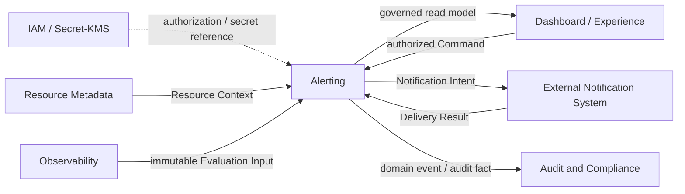

# COP 告警领域

## Purpose

定义受治理 Rule 如何消费不可变 Evaluation Input，形成可追溯的 Evaluation、Alert Instance、状态转换、人工处置、抑制判定和 Notification Intent，使 COP 在不接管原始 Telemetry、Resource Metadata 或通知渠道权威的前提下提供可靠、隔离且可审计的告警能力。

## Scope

- 稳定 Rule identity、不可变 Rule version、管理权类别和作用域。
- Evaluation 请求、结果、失败、幂等和顺序判定。
- Alert Instance 活跃去重、`Pending`、`Firing`、`Resolved` 生命周期和 predecessor 关联。
- Acknowledgement 与 Suppression Policy 的独立处置和编排语义。
- Notification Intent、Delivery Result Reference 和通知失败边界。
- Tenant isolation、双阶段授权、Secret Reference、领域事件和连续审计链。

## Non-goals

- 保存完整原始 Metrics、Logs、Traces 或成为新的 Telemetry Backend。
- 创建或修改 Resource Identity、Resource Metadata 私有事实或 Observability 私有事实。
- 实现通知渠道 Adapter、供应商协议或保存 credential material。
- 承担自动修复 Workflow、完整事件响应流程或 Dashboard 布局。
- 选择 Rule Engine、scheduler、消息系统、数据库、缓存、通知供应商或部署产品。
- 定义 REST 路径、表结构、retention 数值、重试次数、持续窗口默认值或 SLO。

## Context

Alerting 是消费 Resource Context 和不可变 Evaluation Input 的 Core bounded context，拥有 Rule、Evaluation outcome、Alert Instance、state transition 和 notification orchestration。Observability 保留 Signal、Binding、Query 和 Evaluation Input 权威；Telemetry Backend 保留原始 Telemetry；Resource Metadata 保留 Resource Identity；外部通知系统保留渠道执行与最终 Delivery Result；Audit and Compliance 定义审计与保留约束。本文保持 `draft`，仅用于设计讨论，不能作为 `cop-platform` 的强制实现依据。

## Ubiquitous Language

| Term | Meaning |
| --- | --- |
| Rule | Tenant 内具有稳定身份、管理权、作用域和当前激活版本的告警规则 |
| Rule Version | 固定条件、持续窗口、严重级别、Resource selector、输入 Contract 和 Notification Policy version 的不可变版本 |
| Evaluation Input | Observability 已提交、不可变、带完整性和 provenance 的 Signal 输入事实 |
| Evaluation | 固定 Rule/Input/Resource/授权上下文的一次求值事实，结果为 Matched、NotMatched 或 Failed |
| Alert Instance | 同一去重身份的一次连续告警发生，具有不可重开的生命周期 |
| Acknowledgement | 不改变 Alert lifecycle 的独立人工处置事实 |
| Suppression Policy | 只影响 Notification Orchestration 的版本化、带作用域和有效期的策略 |
| Notification Intent | 状态转换提交后生成、固定策略与目标引用的不可变通知编排事实 |
| Delivery Result | 外部通知系统拥有的最终投递事实，Alerting 只保存受控结果引用 |

## Bounded Context

### Alerting Responsibility Boundary

Alerting 拥有 Rule identity/version/management authority、Evaluation request/outcome/failure、Alert Instance identity/lifecycle、Acknowledgement、Suppression decision、Notification Intent 和连续审计关联。IAM 拥有 Principal、Tenant 与授权决策；Secret/KMS 拥有 credential material；Resource Metadata 拥有 Resource Identity 和 Resource Context；Observability 拥有 Signal 与不可变 Evaluation Input；Telemetry Backend 拥有原始遥测；外部通知系统拥有渠道 Adapter 和最终 Delivery Result。

Alerting 不读取或改写其他领域私有存储，不复制完整原始 Telemetry，不创建 Resource Identity，不实现通知供应商协议。Dashboard/Experience 只能发出授权 Command 和读取受治理 read model，不能直接产生 Evaluation outcome、Alert state 或 Delivery Result。

### Rule and Management Authority Model

Rule 使用稳定 `rule_id`，只属于一个 Tenant，并通过不可变 Rule version 演进。Rule version 固定条件、持续窗口、严重级别、Resource selector、Signal/Evaluation Input Contract、管理权类别以及 Alerting-owned Notification Policy。Notification Policy 是 Rule version 内的不可变通知编排配置，使用稳定 `notification_policy_id` 和不可变 `notification_policy_version`，其管理权跟随 owning Rule 的 `Tenant-managed` 或 `Platform-managed` 类别；它不是独立 Aggregate。条件、窗口、严重级别、作用域、关联 Contract 或 Notification Policy 的语义变化创建新版本，历史 Evaluation、Alert Instance、Notification Decision 和 Notification Intent 继续引用原版本。

Rule 分为 `Tenant-managed` 与 `Platform-managed`。两者共享 Evaluation 和 Alert lifecycle Contract，但创建、修改、激活、禁用和 Notification Policy 权限分离；Tenant 不得修改平台规则，平台也不得静默改写 Tenant 规则。只有已激活版本接受新 Evaluation；Rule version 变为 inactive、superseded 或 disabled 后继续拒绝新 Evaluation。此前已接受的 in-flight Evaluation 可以完成或被显式取消，其结果保持可审计，但在 Rule version inactive 后不得创建或推进任何 Alert Instance。新版本激活、Rule 禁用或 Resource scope 撤销时，以受治理终止动作结束旧版本活跃实例，并记录 actor、reason、expected version、time 和 correlation。

### Evaluation and Input Contract

Evaluation 使用稳定 `evaluation_id` 和 idempotency key，并固定 Tenant、Rule version、计划求值时间、Evaluation Input、Resource Context version 和授权上下文。Alerting 只消费 Observability 已提交、不可变的 Evaluation Input；执行前重新验证 Tenant、Rule version、Resource Context、完整性、授权、敏感级别和引用状态，任一项无法确认时 fail closed。

完整成功的 outcome 只能是 `Matched` 或 `NotMatched`；失败使用 `Failed` 和标准失败分类。`Partial`、`Unavailable`、timeout、Contract violation 或敏感级别冲突不能转换为正常布尔结果、零值、最近值或“无数据”。Evaluation failure 不推进 Alert state，也不得推断告警已恢复。

同一告警身份按 Rule version 和计划求值时间推进。duplicate、late、out-of-order 或 replay 结果保留审计事实，但不得覆盖较新的 Alert 状态。Alerting 不依赖 exactly-once、跨 Tenant 全局顺序或跨领域分布式事务。

### Alert Instance Lifecycle

Alert Instance 使用稳定 `alert_instance_id` 表示一次连续告警发生。活跃去重键为 `Tenant + Rule version + Resource Identity + normalized dimensions`；同一去重键同时只能存在一个活跃实例。

首次完整 `Matched` 创建 `Pending`；持续窗口满足后进入 `Firing`。立即触发规则可以在一次受控处理内记录创建并进入 `Firing`，但必须保留创建和触发原因。`Pending` 或 `Firing` 收到完整 `NotMatched` 后进入 `Resolved`。Rule version superseded、Rule disabled 或 Resource scope revoked 也可以通过受治理终止动作进入 `Resolved`，并使用区别于 condition cleared 的明确原因。

`Resolved` 是终态，不得重新打开。相同条件再次命中时创建新的 Alert Instance，并通过 predecessor reference 关联前一实例。Evaluation failure、Acknowledgement、Suppression 和 Delivery status 不改变核心生命周期。

### Acknowledgement and Suppression Model

Acknowledgement 是独立、可审计的处置事实，记录 Alert Instance、actor、time、reason、expected version 和 correlation。它可以影响后续通知策略，但不能直接把 Alert Instance 转为 `Resolved`，也不能改写 Evaluation outcome。

Suppression Policy 使用稳定身份和不可变版本，固定 Tenant、作用域、有效期、管理权和通知编排语义。Suppression 只影响 Notification Orchestration；Evaluation 与 Alert lifecycle 继续推进。命中 Suppression 时记录 policy version、作用域、原因和时间，但不请求外部投递。到期、撤销或版本变化不反向修改历史编排决定。

### Notification Orchestration Model

Alert state transition 提交后，Alerting 形成具有稳定 `notification_decision_id` 和业务 idempotency key，并固定 Rule version 与 Notification Policy version 的 Notification Decision。该决定以 Alert transition occurred time 为基准，使用当时生效的 Suppression Policy version 求值，并固定记录命中的 policy version 或明确的 `no-match` 结果；retry 和 replay 必须复用该固定结果。未被抑制时生成不可变 Notification Intent，固定 Tenant、Alert Instance、触发转换、Rule version、Notification Policy version、target Reference、idempotency key、time 和 correlation。

Alerting 只保存受治理目标和 Secret/KMS Reference，不保存 credential material 或供应商可执行 token。外部通知系统负责渠道适配、供应商协议、投递重试和最终 Delivery Result；Alerting 记录 Delivery Result Reference、标准结果分类、time 和 correlation。Delivery failure 不回滚 Alert state，也不改变 Evaluation outcome。Intent 和 Result 的 duplicate、out-of-order 与 replay 必须幂等处理。

### Alerting Relationship Map

箭头不表示共享可写存储、credential material 复制、跨领域同步事务或部署拓扑。Observability 保留 Signal 输入权威，Resource Metadata 保留 Resource 权威，外部通知系统保留最终投递权威，Dashboard/Experience 不产生核心告警事实。

### Failure, Security, and Consistency

仅标准化为 transient/retryable 的依赖故障执行有界 backoff；无效 Rule、授权拒绝、Tenant/作用域不匹配、Contract violation 和敏感级别冲突不自动重试。重试耗尽记录明确 Evaluation failure 或 Delivery failure，不推断 condition cleared，也不改变无关 Alert Instance。

重试、并发、限流和故障隔离至少按 Tenant 与 Rule/Notification target scope 隔离。核心事实先持久化，领域事件和 Notification Intent 使用稳定 ID 支持幂等重放；Observability、Alerting 与外部通知系统之间不要求分布式事务。read model 允许最终一致，但必须声明 `as_of`、更新时间、完整性或 stale 状态。

所有核心对象、Command 和 Event 携带 Tenant identity。双阶段授权由 management Command validation 和 Evaluation/Notification execution validation 组成；两阶段分别校验 Tenant、授权、Resource scope、敏感级别和引用状态，任何一层无法确认时 fail closed。日志、事件、审计和普通查询只保存最小必要字段及受控证据引用，不泄漏 Secret、原始 Telemetry、完整敏感 Evaluation Input 或通知内容。

### Validation Strategy

- **Rule contract:** 验证稳定 Rule ID、不可变版本、Notification Policy 稳定 ID/不可变版本及其随 owning Rule 管理权、激活校验、旧版本终止和 Tenant-managed/Platform-managed 权限分离；验证 inactive 前已接受的 in-flight Evaluation 可完成或显式取消且结果可审计，但不能创建或推进 Alert Instance。
- **Evaluation contract:** 验证稳定 ID、幂等键、固定引用及 `Matched`、`NotMatched`、`Failed` 互斥语义。
- **Input completeness:** 验证 `Partial`、`Unavailable`、timeout 和 Contract violation 均不触发正常 Alert state transition。
- **Alert lifecycle:** 验证 `Pending -> Firing -> Resolved`、终态不可重开、终态后再次命中新建实例。
- **Deduplication and concurrency:** 验证同一去重键只有一个活跃实例，以及 duplicate、late、out-of-order、replay、expected version 和并发冲突。
- **Disposition and suppression:** 验证 Acknowledgement 不等于 Resolved，Suppression 只影响 Notification Orchestration。
- **Notification boundary:** 验证 Notification Decision 的稳定 ID/幂等身份、以 Alert transition occurred time 和当时有效 Suppression Policy version 固定 matched/no-match 结果、Intent 在状态提交后形成、Delivery failure 不回滚状态，以及外部系统保留最终投递权威。
- **Tenant isolation and secrecy:** 验证 management Command validation 与 Evaluation/Notification execution validation 的双阶段授权、跨 Tenant 操作默认拒绝，以及 Secret、credential 和敏感完整载荷不进入普通事件、日志或审计。
- **Traceability:** 验证 Rule version 到 Delivery Result Reference 的连续关联链，以及 Command/Event 与 `COP-API-002` 的兼容方向。
- **Ownership separation:** 验证 Alerting 不创建 Resource Identity，不保存原始 Telemetry，不实现渠道 Adapter 或自动修复 Workflow。

### Success Criteria

读者能识别 Alerting、Observability、Telemetry Backend、Resource Metadata、IAM、Secret/KMS、外部通知系统、Audit 与 Dashboard/Experience 的事实权威。Rule version、Evaluation、Alert lifecycle、处置与抑制、Notification Intent、management Command validation 与 Evaluation/Notification execution validation 构成的双阶段授权、完整性、故障隔离、幂等和审计语义均可验证；文档不引入未经批准的产品、API、部署、数值或跨领域实现决策。

## Aggregates and Entities

| Aggregate or entity | Ownership | Key references and boundaries |
| --- | --- | --- |
| Rule | 稳定 Rule identity、Tenant、管理权、激活版本和作用域 | 不可变版本内含稳定 ID/不可变版本的 Notification Policy，并引用 Evaluation Input Contract 和 Resource selector；Notification Policy 不是独立 Aggregate，不包含 Backend 查询语言 |
| Evaluation | 一次固定上下文的 Matched、NotMatched 或 Failed 事实 | 引用 Rule version、Evaluation Input、Resource Context 与授权；失败不推进 Alert state |
| Alert Instance | 活跃去重身份、生命周期、状态转换原因和 predecessor | 不复制 Resource 主数据；Resolved 不重开 |
| Acknowledgement | 独立人工处置事实 | 可以影响通知策略，但不等于 Resolved |
| Suppression Policy | 版本化作用域、有效期和编排判定 | 只影响 Notification Orchestration，不暂停 Evaluation |
| Notification Intent | 状态提交后的不可变通知编排事实 | 固定 Rule/Policy/target Reference；不保存 credential material |
| Delivery Result Reference | 外部最终投递事实的受控关联 | Delivery failure 不回滚 Alert state |

Alert Instance 状态转换如下：

| Current state | Input or command | Next state | Condition |
| --- | --- | --- | --- |
| None | Complete `Matched` | `Pending` | 创建新的活跃 Alert Instance |
| `Pending` | Complete `Matched` | `Firing` | 持续窗口满足；立即触发语义保留创建与触发原因 |
| `Pending` | Complete `NotMatched` | `Resolved` | condition cleared |
| `Firing` | Complete `Matched` | `Firing` | 保持实例并记录最新成功 Evaluation |
| `Firing` | Complete `NotMatched` | `Resolved` | condition cleared |
| `Pending` or `Firing` | Governed termination | `Resolved` | rule version superseded、Rule disabled 或 Resource scope revoked |
| `Resolved` | Complete `Matched` | New instance | 原实例不重开；新实例引用 predecessor |

`Failed` Evaluation 不进入该转换表；它只记录失败事实并保持当前 Alert state。

## Commands and Queries

### Commands

Rule 命令包括 CreateRule、CreateRuleVersion、ActivateRuleVersion、DisableRule、SupersedeRuleVersion；Evaluation 命令包括 RequestEvaluation、RecordEvaluationResult、RecordEvaluationFailure；Alert Instance 命令包括 ApplyEvaluationResult、TerminateAlertInstance；处置与抑制命令包括 AcknowledgeAlert、CreateSuppressionPolicy、CreateSuppressionPolicyVersion、ActivateSuppressionPolicyVersion、ExpireSuppressionPolicy、RevokeSuppressionPolicy；通知命令包括 RecordNotificationDecision、RecordDeliveryResult。

所有管理命令携带 Tenant、actor/source、idempotency key、expected version、reason 和 correlation 中适用的字段，并校验 Rule/Policy version、Resource Context、Evaluation Input、授权、敏感级别和状态转换。非法命令与并发冲突显式拒绝，不使用 last-write-wins 或跨领域分布式事务。

### Queries

查询提供 Rule identity、当前/历史版本、管理权类别、作用域、激活/禁用状态；Evaluation outcome、失败分类、输入完整性、固定引用、计划时间；Alert Instance 当前状态、转换历史、去重身份、predecessor 和 Resource reference；Acknowledgement、Suppression decision、Notification Intent 和 Delivery Result Reference；以及带 `as_of`、完整性或 stale 标记的受治理 read model。

查询应用 Tenant isolation、Resource scope、Rule ownership、敏感级别和字段级授权。普通接口不返回 Secret、credential material、原始 Telemetry、完整敏感 Evaluation Input、供应商可执行 token 或未授权通知内容。

## Domain Events

### Events

事件覆盖 Rule version created/activated/superseded 和 Rule disabled；Evaluation requested/matched/not matched/failed；Alert Instance created/pending/firing/resolved；Alert acknowledged；Suppression Policy version created/activated/expired/revoked 和 Notification suppressed；Notification Intent created 与 Delivery Result Reference recorded。

事件采用与 `COP-API-002` 兼容的最小 Contract，携带稳定 event ID、Tenant、aggregate ID/version、Rule/Policy version、状态或结果分类、time、correlation 和必要受控 reference，不携带 Secret、credential material、原始 Telemetry、完整敏感输入或供应商可执行 token。消费者使用 event ID、aggregate version 和业务 idempotency key 处理 duplicate、out-of-order 和 replay，不依赖全局顺序。

### Audit

Rule version、Evaluation Input、Evaluation、Alert transition、Acknowledgement/Suppression decision、Notification Decision、Notification Intent 和 Delivery Result Reference 形成连续审计链。审计保留 actor/source、Tenant、版本、状态或结果、reason、time、correlation 和受控证据引用；具体 retention 由 `COP-SEC-003` 治理，不在本文决定。审计与普通日志不得复制 credential、原始 Telemetry 或完整敏感 payload。

## Invariants

- Rule、Rule version 内的 Notification Policy、Evaluation、Alert Instance、Suppression Policy、Notification Decision 和 Notification Intent 各自只属于一个 Tenant。
- Rule、Rule version 内的 Notification Policy 与 Suppression Policy 使用稳定 ID 和不可变版本；Notification Policy 管理权跟随 owning Rule，历史引用不得漂移到最新版本。
- 只有已激活 Rule version 可以接受新的 Evaluation；inactive 前已接受的 in-flight Evaluation 可以完成或显式取消并保留审计结果，但不得在 Rule version inactive 后创建或推进 Alert Instance。
- 只有完整成功的 `Matched` 或 `NotMatched` 可以推进 Alert lifecycle。
- 同一活跃去重键同时只能存在一个 Alert Instance；`Resolved` 实例不得重新打开。
- Acknowledgement 不等于 Resolved；Suppression 不暂停 Evaluation 或 Alert state transition。
- Notification Decision 使用稳定 ID 和幂等身份，固定 Rule/Notification Policy version，并以 Alert transition occurred time 及当时有效 Suppression Policy version 固定 matched Suppression Policy version 或 `no-match` 结果；Notification Intent 只在核心事实提交后形成，Delivery failure 不回滚 Alert state。
- 所有状态变更使用 idempotency key 和 expected version；冲突显式拒绝。
- late、duplicate、out-of-order 和 replay 结果不得覆盖更新状态。
- management Command validation 或 Evaluation/Notification execution validation 无法确认 Tenant、授权、Resource scope、敏感级别或引用状态时 fail closed。
- Alerting 不拥有原始 Telemetry、Resource 主数据、渠道 Adapter、credential material 或自动修复 Workflow。

## Relationships

- [COP-DOM-001](domain-landscape.md)
- [COP-DOM-005](observability-domain.md)
- [COP-API-002](../api/event-contracts.md)
- [COP-SEC-003](../security/audit-and-compliance.md)

## Constraints

- 不得绕过 RFC/ADR 流程引入重大架构决策。
- 不得将 `Partial`、`Unavailable` 或 Failed Evaluation 转换为正常 Alert state transition。
- 不得跨 Tenant 关联、去重、查询或路由 Rule、Alert Instance、Suppression 或 Notification Intent。
- 不得把 Acknowledgement、Suppression 或 Delivery status 混入核心 Alert lifecycle。
- 不得依赖 exactly-once、全局顺序、共享可写存储或跨领域分布式事务。
- 不得在本文选择 Rule Engine、通知供应商、存储、消息、部署产品或数值参数。
- 不得与相关 `accepted` 权威文档产生冲突。

## Quality Attributes

- **Security:** management Command validation 与 Evaluation/Notification execution validation 分别校验 Tenant 与权限，Secret 只通过受控 Reference 使用。
- **Reliability:** 完整性、失败、幂等、并发和乱序语义明确，单一规则或渠道故障不扩散到无关 Tenant。
- **Auditability:** Rule version 到 Delivery Result Reference 的事实链连续、可关联且使用最小必要载荷。
- **Consistency:** 核心状态使用 expected version；read model 声明 `as_of`、完整性或 stale 状态。
- **Compatibility:** Domain Event 与 `COP-API-002` 保持兼容方向，不假设 exactly-once 或全局顺序。
- **Evolvability:** Rule、Suppression Policy 和外部 Contract 使用不可变版本，历史引用不漂移。

## Implementation Guidance

本文不指定 Rule Engine、scheduler、数据库、消息系统、缓存、渠道 Adapter、API 路径或部署拓扑。`cop-platform` 的实现必须等待相关文档和 ADR 达到 `accepted`，并在实现任务中保持 Rule/Evaluation/Alert、Observability、Resource Metadata 与通知系统的私有存储和事实权威分离。

## References

- [COP-DOM-001](domain-landscape.md)
- [COP-DOM-005](observability-domain.md)
- [COP-API-002](../api/event-contracts.md)
- [COP-SEC-003](../security/audit-and-compliance.md)
