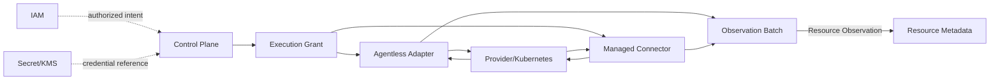

# COP 云接入领域

## Purpose

定义受治理的外部云与 Kubernetes 接入边界：以 Credential Binding 受控关联 Credential Reference，以 Provider Capability 声明发现支持范围，保存版本化 Discovery Intent，编排同步执行，并交付可追溯、可判断完整性的 Resource Observation。

## Scope

- Cloud Connection 的身份、生命周期和健康语义。
- Credential Reference 与版本化 Credential Binding 的受控关联。
- Provider Capability、版本化 Discovery Intent、Sync Job 与短期 Execution Grant。
- Agentless Adapter 与 outbound-only Managed Connector 的统一 Adapter Contract。
- Observation Batch、Resource Observation、完整性和缺失候选输入语义。

## Non-goals

- 永不保存可用的原始凭据或凭据材料。
- 不执行资源变更、remediation 或 automation。
- 不提供成本或 FinOps 分析。
- 不形成统一 Resource Identity，也不直接确认资源删除。
- 不选择产品、SDK、数据库、消息系统、运行时或部署方式。

## Context

Cloud Provider 与 Kubernetes 保持实际资源状态权威。Cloud Access 将经授权、受限范围的发现结果发布为 Resource Observation；Resource Metadata 才拥有统一身份、合并和删除确认。本文保持 `draft`，仅用于设计讨论，不能作为 `cop-platform` 的强制实现依据。

## Ubiquitous Language

- **Cloud Connection**：Tenant 内对一个 Provider 与一个外部账号或集群身份的受治理接入记录。
- **Credential Reference**：指向 Secret/KMS 所拥有凭据材料的受控引用，不含材料本身。
- **Credential Binding**：Cloud Connection 对 Credential Reference 的可审计版本化绑定。
- **Provider Capability**：声明 Provider、资源类型、发现方式、认证方式和 Adapter Contract 支持范围的版本化能力。
- **Discovery Intent**：不可变、可版本化的发现目标，规定 scope、资源类型、触发方式和所需 Capability。
- **Sync Job**：固定 Connection、Intent、Binding、scope 与 Capability/Contract 版本的执行记录。
- **Execution Grant**：给一次 Job attempt 的短期、不可扩展授权。
- **Observation Batch**：一次输出的规范化观察批次，带有范围、游标窗口、完整性和幂等语义。
- **Resource Observation**：对外部资源的不可变观察事实，不是 COP 的统一资源身份。

## Bounded Context

### Cloud Access Responsibility Boundary

Cloud Access 拥有 Connection、Binding、Capability、Intent、Job、Execution Grant 引用和 Batch 语义。IAM 拥有 Tenant、Principal 与授权；Secret/KMS 拥有凭据材料；Control Plane 治理 Intent 与 Job 调度；Data Plane/Connector 只执行有效 Grant；Adapter 拥有 Provider 协议规范化；Provider/Kubernetes 拥有实际状态；Resource Metadata 拥有统一身份、合并和删除确认。Cloud Access 仅发布 Observation。

### Connection and Credential Model

Cloud Connection 使用不可变内部 `connection_id`；每个 Connection 只对应一个 Tenant、一个 Provider 和一个外部账号或集群身份。身份边界变化必须创建新的 Connection。生命周期状态仅为 `Pending`、`Validating`、`Active`、`Degraded`、`Suspended`、`Revoked`；`Revoked` 为终态且 ID 不复用，`Degraded` 表示健康而非身份。跨 Tenant 使用默认拒绝，unresolved state、身份或授权无法解析时 fail closed。

Cloud Access 仅保存受控 Credential Reference 和 Credential Binding version，不保存凭据材料。Rotation 创建新的 Binding version；旧版本保持可审计，但不得用于新的 Job。已有 Job 固定其 Binding version。Credential Reference 或 Credential Binding 的 suspension 或 revocation，以及 Connection 进入 `Suspended` 或 `Revoked`，都停止新 Job 的创建或派发，并使未使用的 Execution Grant 失效；Job 进入 `Cancelled` 或 `Expired` 也使相关执行工作和未使用的 Grant 失效。

### Discovery and Execution Model

Discovery Intent 不可变且版本化，包含 scope、资源类型、触发方式和 Capability。Sync Job 固定 Connection ID、Intent version、Binding version、scope 以及 Capability/Contract version；Job 状态仅为 `Queued`、`Dispatched`、`Running`、`Succeeded`、`Failed`、`Cancelled`、`Expired`。仅 `Succeeded` 不足以建立权威 snapshot。

创建 Sync Job 前，必须验证 Discovery Intent 所需 Provider Capability 位于 Adapter Contract 支持范围内；验证失败时拒绝创建或派发。Job 仅固定已验证的 Capability/Contract version，执行中不得切换版本。

每次 dispatch 或 retry 产生 short-lived、non-expandable 的 Execution Grant，绑定 Tenant、Connection、Job、scope、operation、attempt 和 expiry。自动 retry 在同一 Job 上创建新的 attempt；手动 rerun 创建新的 Job。

### Adapter Contract and Execution Modes

Agentless Adapter 与 outbound-only Managed Connector 使用同一 Adapter Contract；Connector 只主动建立出站连接。Provider Capability 声明 Provider、资源发现、认证与 Contract 支持，Sync Job 固定其版本。Adapter 输入包括 Connection、Intent version、Binding reference、Grant 和 cursor；输出包括规范化 Batch、progress 和 error。

Adapter 内部规范化 Provider authentication exchange、endpoint、pagination、throttling、error code、payload 和 retry hint。标准错误类别仅为 `AuthenticationFailed`、`AuthorizationDenied`、`RateLimited`、`ProviderUnavailable`、`InvalidScope`、`UnsupportedCapability`、`ContractViolation`，并携带 retryability 与 retry/backoff hint。只有明确标记为 retryable 的标准化错误允许有界自动重试；`AuthenticationFailed`、`AuthorizationDenied`、`InvalidScope`、`UnsupportedCapability`、`ContractViolation` 不自动重试。`RateLimited` 与 `ProviderUnavailable` 仅在 Adapter 标记为 retryable 且给出 retry/backoff hint 时允许有界自动重试。原始响应仅是受控诊断证据，不是下游 Contract 或日志内容。

### Observation and Completeness Model

每个 Observation Batch 引用 Tenant、Connection、Job、Intent version 与 Contract version，并包含 mode、scope、cursor/window、start/end、completeness 和 idempotency。Snapshot 是完整枚举；Delta 仅表达明确变化，绝不推断缺失。只有已完成、scope-closed 的 Authoritative Snapshot 才能产生 missing/deletion candidate。pagination、throttling、permission、connector 或 scope 失败导致的 Incomplete 不得产生 candidate；多个页面 Batch 不得自行声明权威。

Resource Observation 不可变，包含 external key、type、normalized attributes、source version、observed time、evidence 与 correlation。Cloud Access 不分配统一身份，也不确认删除。

### Cloud Access Relationship Map

箭头不表示共享存储、跨领域直接写入、credential 复制、分布式事务或部署拓扑。

### Failure and Recovery

队列、并发、throttling state、Circuit Breaker 和 retry budget 按 Connection 加 Adapter 隔离。仅对可 retry 的规范化错误采用有界 backoff/jitter；cursor 仅在一致时恢复，否则开始新的 Snapshot。`Degraded` 保持身份不变。Connector、页面、permission 或 scope 失败产生 Incomplete。Suspended、Revoked、Cancelled 或 Expired 会使工作失效。恢复后必须重新验证 Connection、Binding、Capability 和 scope；验证失败时保持或标记为 `Degraded`，不得重新派发。Secret、IAM 或 Grant 状态未知时 fail closed；reconciliation 与 replay 必须幂等。

### Validation Strategy

验证以以下可判定断言覆盖 Connection identity、Tenant isolation、credential authority、Intent determinism、Grant confinement、Contract conformance、Adapter normalization、snapshot completeness、Delta semantics、idempotency/concurrency、failure isolation、traceability 与 secrecy：

- 跨 Tenant 对 Connection、Binding、Intent、Job、Grant 或 Observation 的操作必须被拒绝，且不得泄漏对象存在性。
- 扩大 Execution Grant 的 scope 或复用既有 attempt 必须被拒绝。
- Cloud Access 的持久化、事件和日志不得包含 credential material；Credential rotation 不得改变 Connection ID；旧 Binding 保持审计可查，但不得用于新的 Job。
- Job 固定的 Connection、Intent、Binding、Capability/Contract version 在执行中不得漂移。
- Provider authentication、pagination、throttle、error 和 payload 只在 Adapter 内规范化；核心模型和下游仅见标准 Contract。
- Connector、分页或部分 scope 失败必须产生 Incomplete，且不得产生 candidate。
- 只有完整、scope-closed 的 Authoritative Snapshot 可以产生 candidate。
- Delta 不得推断删除或缺失。
- Agentless Adapter 与 Managed Connector 必须通过同一 Adapter Contract conformance suite。
- 单一 Connection/Adapter 故障不得影响其他 Connection 或 Adapter。
- duplicate、out-of-order 与 replay 必须保持幂等；expected version 冲突显式拒绝，不丢更新。
- Connection、Binding、Intent、Job/attempt、Grant、Adapter、cursor/Batch 与 candidate 必须可关联审计，且不得包含 credential、Secret 或完整 Provider payload。

### Success Criteria

边界清晰：每项事实可识别 owner，且 Observation 不越过 Resource Metadata 的身份边界。隔离与安全：Tenant、凭据引用和 Grant 均最小化并 fail closed。可靠性与故障隔离：不完整结果不伪装为权威 snapshot，局部重试不扩散。可追溯与可演进：版本、attempt、证据和 Contract 可审计演进。draft gate 保持有效；本文不含未经批准的产品、API、部署或数值设计。

## Aggregates and Entities

| Aggregate or Entity | Ownership | References and boundaries |
| --- | --- | --- |
| Cloud Connection | Cloud Access | 固定 `connection_id`、Tenant、Provider 和外部身份；不拥有实际 Provider/Kubernetes 状态。 |
| Credential Binding | Cloud Access | 引用 Secret/KMS 的 Credential Reference；仅保存版本和审计关联，不保存材料。 |
| Discovery Intent | Cloud Access | 不可变版本，规定 scope、资源类型、trigger 与 Capability；Control Plane 治理调度。 |
| Sync Job | Cloud Access | 固定 Connection、Intent、Binding、scope、Capability/Contract；不修改外部资源。 |
| Provider Capability | Cloud Access | 声明 Provider 与 Adapter Contract 支持范围；不暴露 Provider 私有协议语义。 |
| Execution Grant | Cloud Access | 受控引用短期授权，限 Tenant、Connection、Job、scope、operation 与 attempt。 |
| Observation Batch | Cloud Access | 持有规范化 Observation 与完整性语义；仅发布给 Resource Metadata，不赋予资源身份。 |

## Commands and Queries

### Commands

命令包括 RegisterCloudConnection、ValidateCloudConnection、SuspendCloudConnection、ResumeCloudConnection、RevokeCloudConnection；BindCredentialReference、RotateCredentialBinding、RevokeCredentialBinding；CreateDiscoveryIntent、ReviseDiscoveryIntent、ActivateDiscoveryIntent、SuspendDiscoveryIntent；CreateSyncJob、DispatchSyncJob、StartSyncJob、CompleteSyncJob、FailSyncJob、CancelSyncJob、ExpireSyncJob；AppendObservationBatch、CloseAuthoritativeSnapshot、MarkObservationBatchIncomplete。每个命令携带 Tenant、actor/source、idempotency key 和 expected version，并校验 Connection、Binding、Intent、Capability、Grant、scope 和状态转换；非法命令与冲突必须显式拒绝，不使用 last-write-wins 或分布式事务。

### Queries

查询提供 Connection identity/lifecycle/health/current binding，binding history（不含材料），Intent version/scope/capability，Job/attempt/Execution Grant reference、状态与非敏感审计元数据/progress/error/batch，capability/contract support，以及 Batch completeness/scope/cursor/publish state。Execution Grant 查询禁止返回可执行 token 或 credential material。所有查询应用 IAM 与 Tenant isolation，且不得泄漏未经授权对象的存在性。

## Domain Events

### Events

事件覆盖 Connection 注册、验证、健康与生命周期；Binding 创建、轮换与撤销；Intent 创建、修订与状态变化；Job 与 attempt 状态；Grant 签发与失效；Batch 追加、闭合与标记 Incomplete；以及 missing candidate 的产生。采用 at-least-once 最小事件，携带 ID、Tenant、version、scope reference、status、error、time 和 correlation；不得携带原始 credential、Secret 或完整 payload。消费者必须处理 duplicate、out-of-order 与 replay。未来事件必须符合 COP-API-002；只有 COP-API-002 为 `accepted` 时才具有实现约束力。

### Audit

审计链持续关联 Connection、Binding、Intent、Job、attempt、Grant、Adapter、cursor、Batch 和 candidate。管理命令必须关联 actor、IAM 授权决策和审计记录；审计记录说明 actor/source、作用域、版本、时间、结果与相关性，不得记录原始 credential、Secret 或完整 Provider payload。

## Invariants

- Connection 身份稳定且单一 Tenant；跨 Tenant 默认拒绝并 fail closed。
- 凭据材料与 Cloud Access 分离；Binding version 可审计，Job 固定版本，新的 Job 不使用已轮换或已撤销版本。
- Discovery Intent 不可变且版本化；Sync Job 固定所有 Connection、Intent、Binding、scope 与 Capability/Contract 引用。
- Execution Grant 仅限其 Tenant、Connection、Job、scope、operation、attempt 与 expiry，不可扩大。
- 两种执行模式只使用一个 Adapter Contract。
- 只有 scope-closed 的 Authoritative Snapshot 可以产生 missing/deletion candidate。
- Cloud Access 只发布 Observation；统一身份与删除确认始终属于 Resource Metadata。
- 所有命令使用 idempotency key 与 expected version；并发冲突显式拒绝。

## Relationships

- [COP-DOM-001](domain-landscape.md)
- [COP-DOM-003](resource-metadata-domain.md)
- [COP-ARCH-003](../architecture/control-plane-data-plane.md)
- [COP-SEC-001](../security/security-architecture.md)

## Constraints

- 不绕过 IAM、Secret/KMS、Control Plane、Data Plane/Connector、Adapter、Provider/Kubernetes 或 Resource Metadata 的事实归属。
- 无有效 Tenant、授权、Credential Reference、Binding version、Capability/Contract、Grant 或完整性状态时拒绝执行或发布。
- 只通过版本化 Contract 发布 Resource Observation；不共享可写存储，不直接写入其他领域私有存储。
- 重大边界或兼容性变化必须先经 RFC/ADR；本文不决定实现产品或部署。
- `COP-DOM-004` 保持 `draft`；未经人类显式接受，不得成为 `cop-platform` 的实现约束。

## Quality Attributes

- **Boundary clarity：** owner、引用和禁止跨域写入可明确识别。
- **Isolation：** Tenant、Connection 与 Adapter 的队列、并发和故障相互隔离。
- **Security：** 凭据不离开 Secret/KMS，Grant 短期、最小范围且 fail closed。
- **Reliability：** 版本固定、幂等、受控重试、明确 Incomplete 和可重放 reconciliation。
- **Failure isolation：** Circuit Breaker 与 retry budget 局部生效，不阻塞无关 Connection。
- **Traceability：** 从授权意图到 candidate 的版本、attempt、证据和 correlation 连续可审计。
- **Evolvability：** Provider Capability 与 Adapter Contract 可版本化演进，Provider 私有语义不泄漏。
- **Draft gate：** 在获得人类批准前保持 `draft`，并避免未经批准的产品、API、部署或数值设计。

## Implementation Guidance

在本文状态变为 `accepted` 前，Codex 只能以其讨论范围理解 Cloud Access，不得据此生成生产实现。任何实现候选都应先验证 Tenant、IAM 决策、Binding version、Capability/Contract 和 Grant，再以幂等方式发布最小 Observation Contract；具体 API、数据库、消息、运行时和部署决策留待经治理的 RFC/ADR。

## References

- [COP-DOM-001](domain-landscape.md)
- [COP-DOM-003](resource-metadata-domain.md)
- [COP-ARCH-003](../architecture/control-plane-data-plane.md)
- [COP-SEC-001](../security/security-architecture.md)
