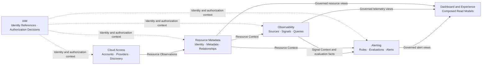

# COP 领域全景

## Purpose

定义 COP 的子域分类、有界上下文、事实归属、上下游关系、跨域 Contract、一致性与故障隔离边界，作为详细领域设计的共同约束。

## Scope

- MVP 的 Core、Supporting 与 Generic 子域。
- 五个业务能力有界上下文。
- Dashboard/Experience 作为组合读模型。
- 上游事实流，以及同步 Contract 和异步 Domain Event。
- Projection 的 freshness、失败、恢复与验证。

## Non-goals

- 微服务、部署、包或数据库拆分。
- 完整的 aggregates、entities、value objects、API 字段或事件 payload。
- broker、topic、queue、Provider SDK 或 Telemetry Backend 产品选型。
- exactly-once、全局顺序或分布式事务。
- Workflow、Automation、FinOps、plugin marketplace 或 AI-RAG 领域。

## Context

COP-ARCH-002 定义逻辑归属与读模型原则；COP-ARCH-003 的技术平面不替代业务有界上下文；COP-ARCH-004 定义交互语义；COP-DOM-002 至 COP-DOM-006 分别拥有其内部模型。外部权威保持不变：Cloud Provider/Kubernetes 拥有实际资源状态；Telemetry Backend 保留原始 Metrics 和 Logs 权威；External Identity Provider 保留外部认证事实权威。

## Ubiquitous Language

- **Bounded Context**：拥有自身写模型、invariants 与 Contract 的业务边界。
- **Upstream**：定义事实并向下游发布 Contract 的事实拥有者。
- **Downstream**：消费上游稳定引用、查询结果或 Projection 的上下文。
- **Resource**：COP 内具有稳定 Resource Identity 的云或 Kubernetes 管理对象。
- **Resource Observation**：Provider 或 Kubernetes 发现的资源观察结果，尚不是 COP 的统一资源身份。
- **Resource Context**：Resource Metadata 对外发布的受治理资源上下文。
- **Telemetry**：由外部 Telemetry Backend 保存的原始 Metrics 或 Logs。
- **Signal**：可查询、可关联且可作为告警评估输入的遥测信号。
- **Alert**：Alerting 根据规则和评估事实管理的告警实例及其生命周期。
- **Principal**：在 IAM 中被识别并参与授权判定的用户或工作负载主体。
- **Organization**：IAM 中表达组织结构与归属关系的管理边界，不替代 Tenant 的隔离边界。
- **Tenant**：身份、数据、授权、事件和投影的隔离范围。
- **Projection**：基于拥有者事实构建，并标明来源和时间边界的读模型。

术语与 COP-STD-001 对齐；任何差异均须显式评审。

## Bounded Context

### Subdomain Classification

| Type | Bounded Context or Capability | Classification rationale |
| --- | --- | --- |
| Core | Resource Metadata | 形成 COP 统一 Resource Identity、规范化元数据与关系模型。 |
| Core | Observability | 形成资源关联、统一查询语义与 Signal 绑定模型。 |
| Core | Alerting | 形成规则、求值和告警状态流转模型。 |
| Supporting | Cloud Access | 支持账户接入、受控凭据引用、发现与同步。 |
| Generic | IAM | 提供通用主体、组织、Tenant、角色和授权能力。 |
| Experience | Dashboard | 组合受治理读模型以提供体验，不形成独立 Core 领域。 |

分类体现投入和建模重点，而非安全、部署或运行时优先级。IAM 始终是独立拥有者；Dashboard 是 Experience 能力，不建立独立核心领域。

### Context Ownership

- IAM 拥有 Principal、Organization、Tenant、Role、授权意图和授权决策；消费者使用稳定引用或决策结果，不复制 IAM 写模型；External Identity Provider 保留外部认证事实的权威。
- Resource Metadata 拥有 COP Resource Identity、规范化元数据和关系；负责解析、合并和去重 Resource Observation；Cloud Provider/Kubernetes 保留实际状态的权威。
- Cloud Access 拥有账户接入、受控凭据引用、Provider、发现和同步生命周期；产生 Resource Observation；不创建统一 Resource Identity，也不写入 Resource Metadata 的私有存储。
- Observability 拥有 Telemetry Source、Signal Binding、统一查询语义和资源关联；使用 Resource Context；不拥有 Resource 主数据或 Alert 生命周期；不反向拥有 Resource 或原始 Telemetry；Telemetry Backend 保留原始 Metrics 和 Logs 权威。
- Alerting 拥有 alert rules、evaluation results、alert instances、state transitions 和 notification orchestration；消费 Resource Context、Signal Context 及 evaluation facts；不拥有 Resource 或原始 Telemetry。Observability 提供的 evaluation facts 仅指已提交、不可变的 Signal 输入事实，不包含告警规则求值结果；规则求值、evaluation outcome 和 alert state transitions 只由 Alerting 产生和拥有。
- Dashboard/Experience 组合受治理的 Resource、Telemetry 和 Alert 读模型；不创建核心事实，不拥有上游写模型，也不是直接跨域写入入口。

### Domain Relationship Map

实线表示事实或受治理视图，虚线表示跨切 IAM 上下文。上下文之间没有共享存储、直接写入或分布式事务；Experience 没有任何向外的事实边。

### Upstream and Downstream Relationships

| Upstream | Contract fact or view | Downstream | Ownership constraint |
| --- | --- | --- | --- |
| IAM | identity ref/auth decision | all protected contexts | IAM 保持身份和授权定义；下游仅消费稳定引用或决策结果。 |
| Cloud Access | Resource Observation | Resource Metadata | Cloud Access 仅发布观察，Resource Metadata 拥有统一 Resource Identity。 |
| Resource Metadata | Resource Context | Observability | Observability 只保留引用或 Projection。 |
| Resource Metadata | Resource Context | Alerting | Alerting 只保留引用或 Projection。 |
| Observability | Signal Context and evaluation facts | Alerting | 仅传递已提交、不可变的 Signal 输入事实；Alerting 独占规则求值、evaluation outcome 和 alert state transitions。 |
| Resource Metadata, Observability, Alerting | governed read views | Dashboard/Experience | Dashboard/Experience 仅组合读模型。 |

上游拥有定义、写模型、invariants，并发布 Contract；下游只能使用稳定引用或 Projection，且不能在上游失败时接管其职责。

### Collaboration Contracts

- 命令提交、授权判定、资源详情和交互式查询使用 owner 提供的同步 Contract。
- 长任务的同步 Contract 只接受或拒绝意图并返回稳定 operation/task ID；accepted 不等于 completed，最终结果通过任务状态或异步事实传播。
- 已提交事实的传播使用异步 Domain Events，且不携带跨域事务。
- 拥有者定义请求、响应、权限、冲突、超时与不可用语义。
- 不允许绕过拥有者直接写入；禁止共享数据库、跨领域直接写私有存储、last-write-wins、共同所有权与隐式双向写入。
- 需要实时授权或强一致性的受保护命令，在无法确认时 fail closed。
- 查询不得将 timeout、unknown、partial 或 stale 伪装为完整成功。

### Projection Consistency

- 每个 Projection 声明拥有者、来源、`as_of`、freshness 和 failure semantics。
- 普通读取可在明确标记时返回 stale、partial 或 degraded。
- Dashboard 展示每个来源的时间边界，且不伪造全局快照。
- Domain Event 描述已提交事实；事件包含 `tenant_id`、`aggregate_id`、`aggregate_type`、`version`、`occurred_at` 和 schema version，以及适用的 correlation、causation、audit。
- 消费者必须幂等，并检测 duplicate、out-of-order、replay 和不可恢复的 schema incompatibility。
- 采用 at-least-once；不依赖 exactly-once 或全局排序。

### Failure Isolation and Recovery

- Cloud Access 保留 cursor 和已确认结果，不删除未确认资源。
- Resource Metadata 隔离无法解析的 Resource Observation，且不创建不完整的 Resource Identity。
- Telemetry Backend 故障时，Resource 和 Alert 写入继续运行，查询明确报告 unavailable 或 partial。
- Alerting 记录 evaluation failure，而非将其记为正常结果。
- IAM 不可用时，受保护命令和敏感查询 fail closed。
- 事件消费失败使用有限重试、隔离和可观测的人工恢复流程；禁止无限重试持续阻塞同一消费分区。
- Projection 可从保留的 Domain Event 重建；reconciliation 检测缺失引用、版本缺口和长期 stale。

单个 Provider、Telemetry Backend、IAM 依赖、消费者或 Projection 的故障不会改变另一拥有者；恢复过程保留 tenant、correlation、causation 与 audit。

### Validation Strategy

- **Ownership：** 验证每个核心事实恰有一个拥有者，消费者不写入其私有存储。
- **Contract：** 验证同步 Contract 明确请求、响应、权限、冲突、超时与不可用语义；长任务返回稳定 operation/task ID，并区分 accepted 与 completed。
- **Event compatibility：** 验证事件 schema version 可被兼容消费者处理，无法兼容时可观测且隔离。
- **Tenant isolation：** 验证 tenant_id、身份、授权和作用域阻止跨 Tenant 的读取、写入与 Projection 泄漏。
- **Freshness：** 验证 Projection 输出拥有者、来源、`as_of`、freshness，并显式标记 stale、partial 或 degraded。
- **Failure isolation：** 验证任一外部依赖、消费者或 Projection 失败不改变其他拥有者的写模型或事实归属。
- **Traceability：** 验证同步跨域调用和事件传播都保留 correlation、audit，以及适用的 causation context。
- **Reconciliation：** 验证可发现缺失引用、版本缺口、duplicate、out-of-order、replay 和长期 stale，并从保留事件重建 Projection。

### Success Criteria

- 可识别 3 个 Core、1 个 Supporting、1 个 Generic 与 1 个 Experience。
- 每个事实仅有一个拥有者，不存在共享归属。
- 图、表格与文字中的上下游关系和所有权约束一致。
- 同步 Contract、异步 Domain Event 与组合读模型的语义清晰，且长任务区分 accepted 与 completed。
- 消费者能够处理重复、乱序、replay 和 schema 不兼容。
- 不将 stale、partial、degraded、unavailable 或 evaluation failure 伪装为成功。
- dependency failure 不改变事实所有权或其他拥有者的写模型。
- tenant、授权、correlation、causation 与 audit 贯穿同步调用、事件和恢复过程。

## Aggregates and Entities

本景观只识别拥有者；COP-DOM-002 至 COP-DOM-006 定义内部模型。跨域只使用稳定引用和受治理 Projection。

## Commands and Queries

命令由拥有者处理，并执行 tenant、授权与 invariant 检查；查询使用受治理的拥有者视图，或标明来源和 freshness 的 Projection。Dashboard 查询不创建写事务，并保留 partial、stale 与 unavailable 状态。失败语义为拒绝、冲突、timeout、unavailable、partial 或 unknown，且不得以补偿性直接写入处理。

## Domain Events

拥有者只在事实提交后发布 Domain Event，并遵循 COP-API-002。事件包含 tenant、aggregate ID、aggregate type、version、时间、schema version，以及适用的 correlation、causation 与 audit；消费者处理 at-least-once、幂等、顺序、replay 和 schema 兼容性。不提供全局顺序或跨域事务。

## Invariants

- 一个事实只有一个拥有者。
- Cloud Access 只产生 Resource Observation，Resource Metadata 是 Resource Identity 的拥有者。
- Observability 不拥有 Resource 主数据，Alerting 不拥有 Resource 或原始 Telemetry。
- Alerting 独占规则求值、evaluation outcome 和 alert state transitions。
- Dashboard/Experience 不产生核心写入。
- 外部系统保留原始事实权威。
- 所有写入均经拥有者 Contract，且不存在共享可写存储。
- 所有操作都处于 Tenant 作用域，并应用适用的身份与授权。
- 无法确认保护条件时 fail closed。

## Relationships

- [COP-ARCH-002](../architecture/logical-architecture.md)
- [COP-DOM-002](iam-domain.md)
- [COP-DOM-003](resource-metadata-domain.md)
- [COP-DOM-004](cloud-access-domain.md)
- [COP-DOM-005](observability-domain.md)
- [COP-DOM-006](alerting-domain.md)

## Constraints

不允许隐式信任；必须执行身份、Tenant、授权与作用域检查；采用默认拒绝、最小权限和最小事实视图。事件和读模型不得包含凭据、密钥、原始外部错误或未经授权的 Tenant 数据。重大边界、所有权或兼容性变更须使用 RFC/ADR，且不得与 accepted 文档冲突；不得以基础设施拓扑或细节替代本领域边界。

## Quality Attributes

- **Boundary clarity**：每个事实的拥有者、Contract 和下游使用边界可识别。
- **Security**：Tenant 与授权检查、最小事实视图及 fail closed 保护边界。
- **Reliability**：at-least-once、幂等消费、故障隔离与可重建 Projection 支撑恢复。
- **Operability**：freshness、失败状态、audit 和 reconciliation 可观察。
- **Compatibility**：schema version 与不可恢复不兼容的隔离保护消费者。
- **Evolvability**：有方向的 Contract 与独立写模型支持上下文演进。

## Implementation Guidance

后续领域文档和实现按拥有者与方向细化 Contract；不得复制写模型，也不得将技术平面与业务有界上下文混淆。本 draft 不是生产权威。

## References

- [COP-ARCH-002](../architecture/logical-architecture.md)
- [COP-DOM-002](iam-domain.md)
- [COP-DOM-003](resource-metadata-domain.md)
- [COP-DOM-004](cloud-access-domain.md)
- [COP-DOM-005](observability-domain.md)
- [COP-DOM-006](alerting-domain.md)
