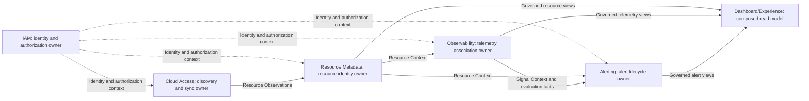

## Purpose

定义 COP 的子域分类、有界上下文、事实归属、上下游关系、跨域 Contracts、一致性与故障隔离边界，作为详细领域设计的共同约束。

## Scope

- MVP 的 Core、Supporting 与 Generic 子域。
- 五个业务能力有界上下文。
- Dashboard/Experience 作为组合读模型。
- 上游事实流，以及同步 Contracts 和异步 Domain Events。
- 投影新鲜度、失败、恢复与验证。

## Non-goals

- 微服务、部署、包或数据库拆分。
- 完整的 aggregates、entities、value objects、API 字段或事件 payloads。
- broker、topic、queue、Provider SDK 或 Telemetry backend 产品选型。
- exactly-once、全局顺序或分布式事务。
- Workflow、Automation、FinOps、plugin marketplace 或 AI-RAG 领域。

## Context

COP-ARCH-002 定义逻辑归属与读模型原则；COP-ARCH-003 的技术平面不替代业务有界上下文；COP-ARCH-004 定义交互语义；COP-DOM-002 至 COP-DOM-006 分别拥有其内部模型。外部权威保持不变：Cloud Provider/Kubernetes 拥有实际资源状态，Telemetry Backend 拥有原始 Metrics/Logs，External Identity Provider 拥有认证事实。

## Ubiquitous Language

- **Bounded Context**：拥有自身写模型、invariants 与 Contracts 的业务边界。
- **Upstream**：定义事实并向下游发布 Contract 的事实拥有者。
- **Downstream**：消费上游稳定引用、查询结果或投影的上下文。
- **Resource**：COP 统一识别并治理的资源身份与元数据。
- **Resource Observation**：Provider 或 Kubernetes 发现的资源观察结果，尚非 COP 统一资源身份。
- **Resource Context**：Resource Metadata 对外发布的受治理资源上下文。
- **Telemetry**：由 Telemetry Source 提供并由 Observability 关联的监测数据。
- **Signal**：可查询、可关联且可被告警评估使用的遥测信号。
- **Alert**：Alerting 管理的规则评估结果和告警实例生命周期。
- **Principal**：IAM 所拥有的主体身份引用。
- **Tenant**：IAM 所拥有的组织隔离与授权作用域。
- **Projection**：基于拥有者事实构建、带来源和时间边界的读模型。

术语与 COP-STD-001 对齐；任何差异均须显式评审。

## Bounded Context

### Subdomain Classification

| Type | Bounded Context or Capability | Classification rationale |
| --- | --- | --- |
| Core | Resource Metadata | 形成 COP 统一资源身份、规范化元数据与关系模型。 |
| Core | Observability | 形成资源关联、通用查询语义与 Signal 绑定模型。 |
| Core | Alerting | 形成规则、评估和告警生命周期模型。 |
| Supporting | Cloud Access | 支持账户接入、受控凭据引用、发现与同步。 |
| Generic | IAM | 提供通用主体、组织、租户、角色和授权能力。 |
| Experience | Dashboard | 组合受治理读模型以提供体验，不形成独立核心领域。 |

classification is investment and modeling focus，而非安全、部署或运行时优先级。IAM 始终是独立拥有者；Dashboard 不是独立核心领域。

### Context Ownership

- IAM 拥有 Principal、Organization、Tenant、Role、authorization intent 和 decisions；消费者使用稳定 refs/results，不复制 IAM write model；external IdP 保留 external authentication authority。
- Resource Metadata 拥有 COP Resource Identity、normalized metadata 和 relationships；负责 resolves/merges/deduplicates observations；providers/Kubernetes 保留 actual-state authority。
- Cloud Access 拥有 account onboarding、controlled credential references、Provider、discovery 和 sync lifecycle；产生 Resource Observations；不创建 unified identity，也不写入 Resource Metadata private storage。
- Observability 拥有 Telemetry Source、Signal Binding、common query semantics 和 resource association；使用 Resource Context；不拥有 Resource master 或 Alert lifecycle；Telemetry Backend 拥有 raw data。
- Alerting 拥有 alert rules、evaluation results、alert instances、state transitions 和 notification orchestration；消费 Resource/Signal Context 及 evaluation facts；不拥有 Resource/raw Telemetry。
- Dashboard/Experience 组合 governed Resource/Telemetry/Alert read models；不创建 core facts，不拥有 upstream write model，也不是 a direct cross-domain write entry。

### Domain Relationship Map

实线表示事实或受治理视图，虚线表示跨切 IAM 上下文。上下文之间没有 shared storage、direct writes 或 distributed transaction；Experience 没有任何向外的事实边。

### Upstream and Downstream Relationships

| Upstream | Contract fact or view | Downstream | Ownership constraint |
| --- | --- | --- | --- |
| IAM | identity ref/auth decision | all protected contexts | IAM 保持身份与授权定义；下游仅消费稳定结果。 |
| Cloud Access | Resource Observation | Resource Metadata | Cloud Access 仅发布观察，Resource Metadata 拥有统一身份。 |
| Resource Metadata | Resource Context | Observability | Observability 只保留引用或投影。 |
| Resource Metadata | Resource Context | Alerting | Alerting 只保留引用或投影。 |
| Observability | Signal Context and evaluation facts | Alerting | Alerting 不取得遥测原始数据所有权。 |
| Resource Metadata, Observability, Alerting | governed read views | Dashboard/Experience | Experience 仅组合读模型。 |

上游拥有定义、write model、invariants，并发布 Contract；下游只能使用 refs/projections，且不能在上游失败时接管其职责。

### Collaboration Contracts

- commands、auth、resource details 与 interactive queries 使用同步 owner Contract。
- 已提交事实通过异步 Domain Events 传播，且不携带跨域事务。
- 拥有者定义 requests/responses、permissions、conflict、timeout 与 unavailable 语义。
- 不允许 bypass writes；禁止 shared DB、private-storage direct writes、last-write-wins、common ownership 与 implicit bidirectional writes。
- real-time auth 或 strong-consistency protected commands 在无法确认时 fail closed。
- query 不得将 timeout、unknown、partial 或 stale 伪装为 full success。

### Projection Consistency

- 每个 projection 声明 owner、source、as_of、freshness 和 failure semantics。
- ordinary reads 可在明确标记时返回 stale、partial 或 degraded。
- Dashboard 展示每个来源的 time boundary，且不伪造 snapshot。
- events 描述 committed facts；event 包含 tenant_id、aggregate_id、aggregate_type、version、occurred_at、schema version，以及适用的 correlation、causation、audit。
- consumers 必须 idempotent，并检测 duplicate、out-of-order、replay 与 unrecoverable schema incompatibility。
- 采用 at-least-once；不承诺 exactly-once 或 global order。

### Failure Isolation and Recovery

- Cloud Access 保留 cursor/confirmed results，不删除 unconfirmed resources。
- Resource Metadata 隔离 unparseable observations，且不创建 incomplete identity。
- Telemetry Backend 故障时 Resource/Alert writes 继续运行，queries 报告 unavailable/partial。
- Alerting 记录 evaluation failure，而非将其记为 normal。
- IAM 不可用时 protected commands 与 sensitive queries fail closed。
- 使用 finite retry、isolation 和 observable manual recovery，不无限阻塞在 partition 上。
- projections 从 retained domain events 重建；reconciliation 检测 missing refs、version gaps 与 long staleness。

单个 Provider、Telemetry Backend、IAM dependency、consumer 或 projection 的故障不会改变另一拥有者；恢复保留 tenant、correlation、causation 与 audit。

### Validation Strategy

- **Ownership**：验证每个核心事实恰有一个拥有者，消费者不写入其私有存储。
- **Contract**：验证同步 owner Contract 明确请求、响应、权限、冲突、超时与不可用语义。
- **Event compatibility**：验证事件 schema 版本可被兼容消费者处理，无法兼容时可观测且隔离。
- **Tenant isolation**：验证 tenant_id、身份、授权和作用域阻止跨租户读取、写入与投影泄漏。
- **Freshness**：验证 projection 输出 owner/source/as_of/freshness，并显式标记 stale、partial 或 degraded。
- **Failure isolation**：验证任一外部依赖、consumer 或 projection 失败不改变其他拥有者的写模型或事实归属。
- **Traceability**：验证事件和恢复链路保留 tenant、correlation、causation 与 audit。
- **Reconciliation**：验证可发现 missing refs、version gaps、重复、乱序、replay 和 long staleness，并从保留事件重建投影。

### Success Criteria

可识别 3 个 Core、1 个 Supporting、1 个 Generic 与 1 个 Experience；不存在共享归属；图与文本一致；同步、events 与 read-model 语义清晰；消费者处理 duplicate、out-of-order、replay 与 schema incompatibility；不将 stale、partial、degraded、unavailable 或 evaluation failure 伪装为成功；dependency failure 不改变所有权；tenant、auth、correlation、causation 与 audit 贯穿全程。

## Aggregates and Entities

本景观仅识别 owners；COP-DOM-002 至 COP-DOM-006 定义内部模型。跨域仅使用 stable refs 与 governed projections。

## Commands and Queries

commands 绑定拥有者，并执行 tenant、auth 与 invariant checks；queries 使用受治理 owner views 或显式 source/freshness projections。Dashboard query 不创建 write transaction，并保留 partial、stale 与 unavailable。失败语义为 rejected、conflict、timeout、unavailable、partial 或 unknown，且不得以 compensating direct write 处理。

## Domain Events

拥有者仅在 committed fact 后发布事件，并遵循 COP-API-002。事件包含 tenant、aggregate ID/type/version、time、schema version，以及适用的 correlation、causation 与 audit；消费者处理 at-least-once、idempotency、order、replay 和 schema compatibility。不提供 global ordering 或 transaction。

## Invariants

- 一个事实只有一个 owner。
- Cloud Access 只产生 observations，Resource Metadata 是 identity owner。
- Observability 不拥有 Resource master，Alerting 不拥有 Resource/raw telemetry。
- Experience 不产生 core write。
- 外部系统保留 raw authority。
- 所有 writes 均经 owner Contract，且无 shared writable storage。
- 所有操作都处于 tenant scope，并应用适用的 identity/auth。
- 无法确认保护条件时 fail closed。

## Relationships

- [COP-ARCH-002](../architecture/logical-architecture.md)
- [COP-DOM-002](iam-domain.md)
- [COP-DOM-003](resource-metadata-domain.md)
- [COP-DOM-004](cloud-access-domain.md)
- [COP-DOM-005](observability-domain.md)
- [COP-DOM-006](alerting-domain.md)

## Constraints

不允许 implicit trust；必须执行 identity、tenant、auth 与 scope checks；采用 default deny、least privilege 和 minimum fact views。events/read models 不得包含 credentials、secrets、raw external errors 或 unauthorized tenant data。重大 boundary、ownership 或 compatibility 变更须使用 RFC/ADR，且不得与 accepted documents 冲突；不得以基础设施 topology 或细节替代本领域边界。

## Quality Attributes

- **Boundary clarity**：每个事实的 owner、Contract 和下游使用边界可识别。
- **Security**：tenant 与授权检查、最小事实视图及 fail closed 保护边界。
- **Reliability**：at-least-once、幂等消费、故障隔离与可重建投影支撑恢复。
- **Operability**：freshness、失败状态、审计和 reconciliation 可观察。
- **Compatibility**：schema version 与不可恢复不兼容的隔离保护消费者。
- **Evolvability**：方向化 Contracts 与独立 write models 支持上下文演进。

## Implementation Guidance

后续领域文档和实现按 owner 与 direction 细化 Contracts；不得复制 write models，也不得将技术平面与业务有界上下文混淆。本 draft 不是生产权威。

## References

- [COP-ARCH-002](../architecture/logical-architecture.md)
- [COP-DOM-002](iam-domain.md)
- [COP-DOM-003](resource-metadata-domain.md)
- [COP-DOM-004](cloud-access-domain.md)
- [COP-DOM-005](observability-domain.md)
- [COP-DOM-006](alerting-domain.md)
