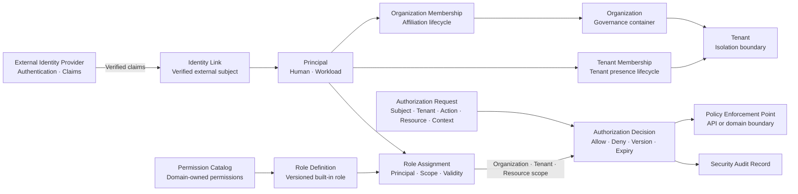

# COP IAM 领域

## Purpose

定义身份、主体、组织、租户、归属和授权判定的领域模型与边界。本文件保持领域模型与安全机制分工，不替代 `COP-SEC-002` 的认证协议和策略评估细节。

## Scope

- 稳定内部 `Principal` 及 `Human`、`Workload` 类型
- `Identity Link`、`Organization`、`Tenant` 和两级 `Membership`
- `Permission Catalog`、平台内置 `Role Definition`、`Role Assignment`
- `Authorization Decision`、`Temporary Platform Elevation` 及其审计事实
- 相关命令、查询、领域事件、不变量、失败恢复和验证边界

## Non-goals

- IdP 产品、Secret Manager、Policy Engine 或 Audit 产品选型
- 登录协议、登录页面、MFA、session、token 或 credential 格式
- Tenant 自定义 Role、内部 Group、Group nesting、完整 ABAC 或自定义 policy language
- Permission API 字段、数据库拆分、缓存产品、部署拓扑、审计保留期或完整安全控制实现

## Context

本文保持 `draft` 状态，仅作为 IAM 领域设计讨论和评审材料。只有显式变更为 `accepted` 后，本文才形成 `cop-platform` 的实现约束。`COP-DOM-001` 定义 IAM 为独立通用子域；`COP-SEC-001` 定义整体信任、凭据、加密和安全控制边界；`COP-SEC-002` 负责认证集成、Tenant isolation、RBAC 和策略评估的安全机制细节。

## Ubiquitous Language

- `Principal`：IAM 管理的稳定内部主体，分为 `Human` 与 `Workload`。
- `Identity Link`：Principal 与已验证外部 issuer/subject 或 workload identity 的关联。
- `Organization`：治理与归属容器。
- `Tenant`：身份、数据、授权、事件和 Projection 的严格 isolation boundary。
- `Membership`：Principal 在 Organization 或 Tenant 中的归属，不等同于 Role 或 Permission。
- `Permission Catalog`：业务领域 owner 发布的 Permission 引用、版本和兼容状态。
- `Role Definition`：平台内置、版本化的 Permission 组合。
- `Role Assignment`：Principal 在明确 scope 和有效期内获得 Role 的记录。
- `Authorization Decision`：对具体请求返回的 allow/deny 结果及其版本、有效期和审计关联。
- `Policy Decision Point (PDP)`：IAM 计算授权判定的职责；API 和业务边界是 `Policy Enforcement Point (PEP)`。

## Bounded Context

### IAM Responsibility Boundary

External Identity Provider 保留认证、identity lifecycle 和 claims 权威。IAM 维护稳定内部 `Principal`，并拥有 `Identity Link`、`Organization`、`Tenant`、Organization Membership、Tenant Membership、`Permission Catalog`、内置 `Role Definition`、`Role Assignment`、`Authorization Decision` 和 `Temporary Platform Elevation`。IAM 不保存密码、token、完整 claims 或原始 Secret；Principal Profile 仅保留最小 display name、受验证 contact reference、identity source、`last_synced_at` 和必要状态。

各业务领域 owner 定义本领域 Permission 的 `action/resource` 语义并发布版本化 reference；IAM 只治理 Permission Catalog、内置 Role、Assignment 和授权判定，不复制业务语义。

### Identity and Tenant Model

- IAM 维护稳定内部 Principal，并明确区分 `Human` 与 `Workload`；两者的认证方式和生命周期不能隐式互换。
- Human Principal 通过 Identity Link 关联已验证外部 issuer/subject；Workload Principal 关联短期 workload identity 或受控 credential reference，IAM 不保存原始 Secret。
- Organization 是治理与归属容器，可以包含多个 Tenant；Tenant 是严格 isolation boundary。
- MVP 中每个 Tenant 只属于一个 Organization。
- Organization Membership 表达 Principal 在 Organization 中的归属；Tenant Membership 表达 Principal 在 Tenant 中的归属。
- Tenant Membership 必须依赖同一 Organization 内有效且匹配的 Organization Membership。
- Membership 只表示归属，不直接授予 Role 或 Permission；外部 group claim 只能用于受控身份映射，不能直接成为授权事实。
- Organization Role 只授予组织治理能力，不继承 Tenant 数据访问；Tenant 数据访问必须有显式 Tenant Role Assignment。

### Authorization Model

- MVP 使用 scoped RBAC，不引入完整 ABAC 或自定义 policy language。
- Role Definition 是平台内置、版本化且不可由 Tenant 修改的 Permission 组合；MVP 不支持 custom role。
- Role Assignment 显式绑定 Principal、Role、Organization/Tenant/Resource scope、有效期和 Role/Permission version，scope 不能隐式扩大。
- IAM 是 PDP；API 与业务领域是 PEP，不得复制 IAM 策略计算或默认信任上游判定。
- `EvaluateAuthorization` 接收 Principal、Organization/Tenant、action、resource 和 context，返回 decision ID、allow/deny、reason code、Role/Permission version、expiry 和 audit correlation。
- 允许短期 scope-bound decision/grant cache，必须绑定 Principal、Tenant、action、resource、Role/Membership version 和 expiry。
- 敏感操作与 Platform Elevation 必须实时判定；未知 Permission、过期、版本或 scope 不匹配、IAM 不可用或无法确认时 fail closed。
- JIT 只能在预配置映射下创建或关联 Principal，不能自动授予 Membership 或 Role Assignment。

### IAM Relationship Map

图中 IdP 只提供已验证认证事实，Identity Link 将外部 subject 关联到稳定 Principal。Membership 与 Role Assignment 分离；Permission Catalog 和 Role Definition 向 Assignment 提供版本化输入。箭头不表示共享存储、跨领域直接写入、scope 继承、分布式事务、exactly-once 或全局排序。

### Failure and Recovery

- IdP 不可用或 claims 无法验证时，不创建 Identity Link、不执行 JIT、不接受新的认证上下文；已有 Principal 不能替代认证证明。
- 单个 Permission producer 版本不兼容时，只隔离受影响 Permission，不阻断无关领域判定。
- Permission 未知、Role/Membership version 不匹配、scope 不匹配、decision 过期或 IAM 无法确认时 fail closed。
- 事件发布失败不回滚已提交事实；使用持久化 outbox、有限重试、隔离和授权重放恢复。
- 敏感操作或 Platform Elevation 无法实时判定或记录审计时拒绝执行。
- Profile 同步失败时保留最小 Profile、source、`last_synced_at` 和 stale 状态；陈旧 claims 不能作为新的授权依据。
- 恢复 Principal、Membership、Assignment 或 Elevation 时重新验证当前 version、scope、expiry 和领域不变量。
- Credential、Secret、token、完整 claims 和无关个人数据不得进入 Domain Event、普通日志或授权缓存。

### Validation Strategy

验证 identity authority、Tenant isolation、Membership invariants、Role scope、last administrator、revocation、decision determinism、concurrency、failure isolation、privacy 和 traceability。验证应覆盖 IdP、Permission producer、审计、事件发布和 Profile 同步的失败、隔离、恢复及 fail closed 语义。

### Success Criteria

- 读者能识别所有 IAM 聚合或 capability 的单一 ownership，且不混淆 Human/Workload、Organization/Tenant、Membership/Role Assignment。
- scoped RBAC、内置 Role、Permission Catalog、PDP/PEP 和短期 decision/grant 约束完整。
- Tenant isolation、Organization Role 不继承 Tenant 数据访问、Platform Elevation 和最后管理员不变量明确。
- 生命周期、撤销、版本、幂等、并发冲突、缓存失效、Domain Event 与 Authorization Audit 分工可验证。
- IdP、Permission producer、审计、事件和 Profile 故障具备 fail closed、隔离和恢复语义。

## Aggregates and Entities

下表为单一 ownership 表；引用不表示跨聚合共享存储或隐式授权继承。

| Aggregate or capability | Ownership | Key references and boundaries |
| --- | --- | --- |
| Principal | 稳定内部主体、类型、状态和最小 Profile | Identity Link、Organization/Tenant Membership 引用；不拥有外部认证事实 |
| Identity Link | Principal 与已验证外部身份或 workload identity 的关联 | issuer、subject、source、sync metadata；不保存 token 或完整 claims |
| Organization | 治理容器和 Tenant 归属 | Tenant references；不形成 Tenant 数据访问继承 |
| Tenant | 严格 isolation boundary 及 Organization 归属 | MVP 每个 Tenant 只属于一个 Organization |
| Organization Membership | Principal 与 Organization 的归属生命周期 | Principal、Organization、status、version |
| Tenant Membership | Principal 与 Tenant 的归属生命周期 | Principal、Tenant、同 Organization 的 Organization Membership、status、version |
| Permission Catalog | 领域 owner 发布的 Permission 引用、版本和兼容状态 | 不重新定义业务 action/resource 语义 |
| Role Definition | 平台内置、版本化的 Permission 组合 | MVP 不允许 Tenant 自定义或修改 |
| Role Assignment | Principal、Role、scope、有效期和状态 | Organization、Tenant 或 Resource scope；不能隐式扩大 |
| Authorization Decision | 带 ID、理由、版本和有效期的 allow/deny 结果 | 短期结果和审计关联，不成为长期聚合 |
| Temporary Platform Elevation | 跨 Tenant 恢复或治理的短期授权意图 | target Tenant、reason、scope、expiry、强审计 |

生命周期状态如下：

- Principal：`Active`、`Suspended`、`Disabled`。
- Organization Membership：`Invited`、`Active`、`Suspended`、`Removed`。
- Tenant Membership：`Invited`、`Active`、`Suspended`、`Removed`。
- Role Assignment：`Active`、`Revoked`、`Expired`。
- Temporary Platform Elevation：`Active`、`Revoked`、`Expired`。

Removed、Revoked、Expired 记录保留审计链；重新加入或授予时创建新记录，不复用历史授权记录。父级 Principal 或 Organization Membership 暂停、禁用后，下游记录保留但授权立即无效。活动 Tenant 至少保留一个有效的内置 Tenant Administrator Assignment。

## Commands and Queries

### Commands

- `RegisterPrincipal`、`LinkExternalIdentity`、`RegisterWorkloadPrincipal`
- `SuspendPrincipal`、`DisablePrincipal`
- `CreateOrganization`、`CreateTenant`
- `InviteOrganizationMember`、`ActivateOrganizationMembership`、`SuspendOrganizationMembership`、`RemoveOrganizationMembership`
- `InviteTenantMember`、`ActivateTenantMembership`、`SuspendTenantMembership`、`RemoveTenantMembership`
- `AssignRole`、`RevokeRole`
- `GrantTemporaryPlatformElevation`、`RevokeTemporaryPlatformElevation`

命令表达领域意图，不预设 REST 路径、服务拆分或数据库结构。管理命令必须携带 idempotency key 和 expected version，并校验 actor、Organization/Tenant scope、授权及相关不变量；并发版本冲突显式拒绝，不使用 last-write-wins，也不使用分布式事务。

### Queries

- Principal、Identity Link 和最小 Profile 查询
- Organization / Tenant Membership 查询
- Permission Catalog、Role Definition 和 Role Assignment 查询
- `EvaluateAuthorization`：输入 Principal、Tenant、action、resource 和 context，返回 decision ID、allow/deny、reason code、Role/Permission version、expiry 和 audit correlation

查询必须应用调用者授权和 Tenant isolation，不得泄漏未经授权的数据存在性、Profile、Membership 或 Assignment。

## Domain Events

### Events

事件包括 Principal 注册、身份关联与状态变化，Organization/Tenant 创建与状态变化，Organization/Tenant Membership 生命周期变化，Permission Catalog 或 Role Definition 版本变化，Role Assignment 创建/撤销/过期，以及 Temporary Platform Elevation 创建/撤销/过期。

状态变更事件采用最小数据集和 at-least-once 语义，只携带稳定 ID、Organization/Tenant scope、状态、version、发生时间及必要 Permission/Role reference。消费者根据 event ID、aggregate version 和业务不变量处理 duplicate、out-of-order 与 replay。Authorization Decision 不产生高频 Domain Event，而产生 Security Audit Record。事件、普通日志和缓存不得包含 token、Secret、完整 claims 或无关个人数据。

### Authorization Audit

每次 Authorization Decision 只生成 Security Audit Record 和可观测指标，不发布高频 Domain Event。审计至少包含 actor/subject、Organization/Tenant、action、resource、decision、reason code、Role/Permission version、decision ID、时间和 correlation context，不记录 token、Secret 或完整 claims。

IAM 管理命令与对应状态变更审计必须原子关联；无法持久化审计时，不提交 Principal、Membership、Role Assignment 或 Temporary Platform Elevation 状态变更。敏感操作和 Platform Elevation 无法确认审计记录时 fail closed。

## Invariants

- 每个外部 issuer/subject 至多关联一个活动 Human Principal，除非经过受审计迁移流程。
- Human 与 Workload Principal 的认证方式和生命周期不能隐式互换。
- Tenant Membership 只能在有效且同 Organization 的 Organization Membership 下生效。
- Membership 不授予 Permission；授权必须通过有效 Role Assignment。
- Role Assignment scope 必须处于 Membership 允许的边界内，不能隐式扩大。
- 活动 Tenant 至少保留一个有效的内置 Tenant Administrator Assignment。
- 暂停或禁用 Principal、Organization Membership 后，下级记录保留但授权立即无效。
- Break-glass/Temporary Platform Elevation 是独立、短期、强审计流程，不成为普通长期 Assignment。
- 所有管理命令携带 idempotency key 和 expected version；冲突显式拒绝。
- 未知 Permission、过期 decision、版本或 scope 不匹配、无法确认授权时 fail closed。

## Relationships

- [COP-DOM-001](domain-landscape.md)
- [COP-SEC-001](../security/security-architecture.md)
- [COP-SEC-002](../security/iam-and-authorization.md)

## Constraints

- External Identity Provider 是 authentication、identity lifecycle 和 claims 的权威；IAM 不保存密码、token、完整 claims 或原始 Secret。
- IAM 只维护稳定 Principal、Membership、Role Assignment 和授权判定，不复制业务领域 Permission 语义。
- Organization Role 不继承 Tenant 数据访问；跨 Tenant Platform Administrator 操作必须使用临时、明确 scope、强审计 elevation。
- JIT 不自动授予 Membership 或 Role Assignment。
- API 与业务边界必须作为 PEP 执行 IAM 的 PDP 决策；不可用或无法确认时拒绝。
- 不得绕过 RFC/ADR 流程引入重大架构决策，不得修改相关安全文档或目录索引。

## Quality Attributes

- **Identity authority：** 外部认证事实与 COP Principal ownership 清晰分离。
- **Tenant isolation：** Organization Role 不继承 Tenant 数据权限，跨 Tenant 请求默认拒绝。
- **Membership invariants：** Tenant Membership 依赖有效且同 Organization 的 Organization Membership。
- **Role scope：** Assignment 不能越过 Organization、Tenant 或 Resource scope。
- **Last administrator：** 任意状态变化不能移除活动 Tenant 的最后有效管理员。
- **Revocation：** Principal、Membership、Assignment 或 version 变化立即使相关 decision cache 失效。
- **Decision determinism：** 相同主体、scope、action、resource 和版本产生一致判定与 reason code。
- **Concurrency：** 重复命令幂等，并发版本冲突不丢失更新。
- **Failure isolation：** 单个 IdP、Permission producer 或事件消费者故障不会扩大授权。
- **Privacy：** Profile、Audit、Domain Event 和缓存不包含 token、Secret、完整 claims 或无关个人数据。
- **Traceability：** Membership、Assignment、Elevation、状态变化和授权判定可关联 actor、decision ID 与 audit record。

## Implementation Guidance

本文状态为 `draft`，不得据此生成生产实现。实现评审应保留稳定 ID、显式 version、expected version、idempotency key、最小事件数据、审计原子关联、outbox 和 fail-closed 行为；具体协议、产品、数据存储、部署和安全控制实现由相应权威文档与后续 RFC/ADR 定义。

## References

- [COP-DOM-001](domain-landscape.md)
- [COP-SEC-001](../security/security-architecture.md)
- [COP-SEC-002](../security/iam-and-authorization.md)
