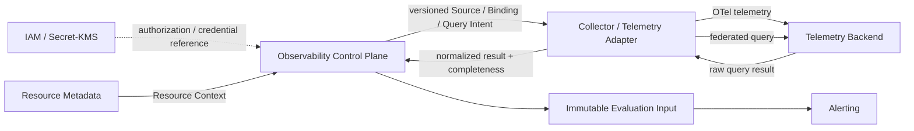

# COP 可观测领域

## Purpose

定义受管环境的遥测来源、信号、查询、结果完整性和供告警评估使用的不可变输入事实；将其与原始 Telemetry Backend、资源元数据、身份授权和告警生命周期明确分离。

## Scope

- 管理 Telemetry Source、Telemetry Capability、Signal Definition、Signal Binding、Query Intent、Query Job、result completeness 和 Evaluation Input。
- 以 versioned Telemetry Adapter Contract 接入 Metric、Log、Trace、OpenTelemetry（OTel）以及查询能力。
- 对跨 Source 的联邦查询、受控同步查询、异步查询和 Evaluation Input 提供可审计的语义。

## Non-goals

- 不拥有 Telemetry Backend 的原始 Metrics、Logs、Traces、查询引擎内部实现或其存储。
- 不拥有 IAM 的 Principal、Tenant 或认证授权决策，不保存 Secret/KMS credential material。
- 不拥有 Resource Metadata 的 Resource Identity、Resource Context，也不创建 Resource Identity。
- 不拥有 Alerting 的规则评估、outcome 或 Alert lifecycle，亦不定义 Infrastructure Collector、Backend 或 Platform Observability runtime。
- 不定义 Dashboard 布局、完整遥测镜像、REST/API、表结构、retention 数值、产品选择或部署选择。

## Context

COP-DOM-005 是 `draft`，用于在 RFC 评审完成前描述可观测领域的候选边界；它不是 `cop-platform` 的强制实现依据。受管环境的 Observability 与 Platform Observability 分离：前者管理外部受管环境的遥测接入和受控结果，后者是 Infrastructure 对 COP 自身运行时的观测职责。

## Ubiquitous Language

Telemetry Source 是租户下指向一个 Backend identity 的稳定接入标识。Telemetry Capability 是某一 versioned Adapter Contract 所声明的可用能力。Signal Definition 定义稳定的 `signal_id`、Metric/Log/Trace 类型、语义、单位、允许的 dimensions 和 sensitivity。Signal Binding 将 Source 的 backend selector 映射至 Signal Definition 和 Resource Context。Query Intent 是不可变的查询意图；Query Job 是其可取消、分页和审计的执行实例。result completeness 表示每个 Source/Signal/Resource/window 的 Complete、Partial、Stale 或 Unavailable 状态。Evaluation Input 是已提交的、供 Alerting 消费的不可变信号输入事实。

## Bounded Context

### Observability Responsibility Boundary

Observability 独立拥有 Telemetry Source、Telemetry Capability、Signal Definition、Signal Binding、Query Intent、Query Job、result completeness 和 Evaluation Input。IAM 拥有 Principal、Tenant 与认证授权决策；Secret/KMS 拥有 credential material；Resource Metadata 拥有 Resource Identity 与 Resource Context；Telemetry Backend 拥有原始 Metrics、Logs、Traces 及 query-engine internals；Alerting 拥有 rule evaluation、outcome 与 Alert lifecycle；Infrastructure 拥有 Collector、Backend 与 Platform Observability runtime。领域之间不得共享可写存储，亦不得跨领域写入私有数据。

### Telemetry Source and Capability Model

`source_id` 不可变，且只对应一个 Tenant 和一个 Backend identity。Source 持有 config、Credential Reference 与 Capability 的版本引用，但绝不保存 credential material。Tenant 或 Backend identity 变化必须创建新的 Source；endpoint、routing 或 credential reference 变化创建新版本。状态只能为 Pending、Validating、Active、Degraded、Suspended、Revoked；Revoked 为终态，且 ID 不得复用。新执行使用当前有效版本，既有 Job 固定其已引用的旧版本。

Telemetry Capability 由 versioned Telemetry Adapter Contract 声明，覆盖支持的 Signal types、OTel ingest、queries、time ranges、pagination/streaming、aggregation 与 correlation。每次查询固定 Capability/Contract version，运行时不得自动切换。

### Signal Definition and Binding Model

Signal Definition 的 `signal_id` 稳定且版本化，类型仅为 Metric、Log 或 Trace，并定义 semantics、unit、allowed dimensions 与 sensitivity；语义变化必须生成新版本，历史 Intent、Job 和 Evaluation Input 固定其既有版本。三类 Signal 共用 Contract，但必须保留各自的时间语义、结果形态、aggregation 能力与敏感性差异。Signal Binding 的版本把同一 Tenant 内的 Source backend selector 映射至 Signal Definition 和 Resource Context；backend names、selectors 和 query language 始终封装在 Adapter 中。未解析、歧义、跨 Tenant、schema-incompatible 或 sensitivity-conflicting 的映射必须进入 Unresolved 或 Quarantined，且绝不创建 Resource Identity。暂停、撤销或隔离的 Binding 版本不得用于新 Job。OpenTelemetry 是 Contract，不是实体。

### Query Intent and Execution Model

Query Intent 是不可变版本，明确 Signal、Resource/Source scope、time window、filter、aggregation、completeness、result limits 与 execution mode。受控同步查询和异步 Query Job 共享同一 Query Intent 及统一结果 Contract；小且有界的查询可同步执行，cross-Source、long-window、export 及 Evaluation Input 必须使用可取消、可分页、可审计的 Query Job。Job 逐项固定 Intent version、Source/config version、Signal Definition version、Binding version、Resource Context reference、Capability/Contract version 和 authorization context。Job 状态只能为 Queued、Dispatched、Running、Succeeded、Failed、Cancelled、Expired；Cancellation 或 expiry 使未开始执行失效，Succeeded 不表示 complete。

### Result Completeness and Evaluation Input Model

每个 Source/Signal/Resource/window 的结果状态为 Complete、Partial、Stale 或 Unavailable；不得把缺失强制为 zero、latest、empty 或 no-data。联邦查询不承诺跨 Backend 全局一致 snapshot、exactly-once、global ordering 或 distributed transactions；分页/流中断或部分 Source 失败不得拼成 Complete。projection、cache、index summary 必须声明 owner、source、as_of、freshness、retention、completeness 和 rebuildability，且永不成为 raw telemetry authority。

Evaluation Input 是已提交的不可变 Signal input fact，包含 query/job、source/config、signal、binding、resource、window、contract references、provenance、completeness、content hash、idempotency 与 correlation。它不包含 rule、threshold、outcome 或 Alert state；Alerting 必须把不完整输入视为 evaluation failure。发布语义为 at-least-once，消费者以 event ID、aggregate version 及 Job/Input idempotency key 处理 duplicate、out-of-order 和 replay。

### Observability Relationship Map

箭头仅描述受控引用或消息流，不表示 shared writable storage、credential copying、cross-domain direct writes、distributed transactions 或 deployment topology。Telemetry Backend 保留 raw facts 的权威；Alerting 只消费 Immutable Evaluation Input。

### Failure and Recovery

按 Tenant + Source + Adapter 隔离 retry、concurrency、throttling、Circuit Breaker 和 retry budget；只对 retryable errors 使用有界 backoff/jitter。错误分类仅为 AuthenticationFailed、AuthorizationDenied、RateLimited、BackendUnavailable、InvalidQuery、InvalidScope、UnsupportedCapability、BindingUnresolved、ContractViolation；AuthenticationFailed、AuthorizationDenied、InvalidScope、ContractViolation 和 sensitivity-conflicting 不得自动重试，raw diagnostics 只保留受控 reference。恢复前逐项重新验证 Source/config、Binding、Resource Context、Capability/Contract、authorization 与 sensitivity。授权分两阶段执行：先验证 Tenant/Principal/Source/Intent，再验证 Resource Context/Signal scope/sensitivity；未知状态必须 fail closed。普通 events、logs、audit 不得包含 credentials、executable tokens、raw sensitive logs/traces 或 diagnostic payload。

### Validation Strategy

验证必须覆盖 Source identity/rotation、Tenant isolation、credential authority、Signal semantics、Binding resolution、Query determinism、Adapter conformance、federated completeness、Evaluation boundary、idempotency/concurrency、failure isolation、traceability/secrecy，以及 managed-environment 与 Platform ownership separation。验证还必须覆盖状态迁移、expected version、Contract 固定、两阶段授权、completeness 传播、重复投递和乱序 replay；针对每个 Source/Adapter 的验证应受限于其隔离预算，并在 Capability 或 config 变更后重新执行。

### Success Criteria

可观测领域能以确定的版本、scope 和 completeness 产出可审计的受控查询结果与 Evaluation Input；失败不跨 Tenant、Source 或 Adapter 扩散；任何输入都不泄露秘密或把原始遥测提升为本领域权威数据。

## Aggregates and Entities

| Aggregate or capability | Ownership | Key references and boundaries |
| --- | --- | --- |
| Telemetry Source | Observability | immutable source_id；Tenant、Backend identity、config/Credential Reference/Capability versions；不保存 credential material。 |
| Telemetry Capability | Observability | versioned Telemetry Adapter Contract；不拥有 Backend internals。 |
| Signal Definition | Observability | stable versioned signal_id、类型、语义、单位、dimensions、sensitivity。 |
| Signal Binding | Observability | Source selector 至 Signal Definition 与 Resource Context；不创建 Resource Identity。 |
| Query Intent | Observability | immutable version；同步与异步执行共享统一结果 Contract。 |
| Query Job | Observability | 逐项固定 Intent、Source/config、Signal Definition、Binding、Resource Context、Capability/Contract versions 与 authorization context；执行不拥有 raw telemetry。 |
| Evaluation Input | Observability | immutable fact、provenance、completeness、hash、idempotency、correlation；不含 Alerting state。 |

## Commands and Queries

### Commands

批准的命令为 RegisterTelemetrySource、ValidateTelemetrySource、ReviseTelemetrySourceConfig、SuspendTelemetrySource、ResumeTelemetrySource、RevokeTelemetrySource；DefineSignal、ReviseSignalDefinition；CreateSignalBinding、ResolveSignalBinding、QuarantineSignalBinding、ActivateSignalBinding、SuspendSignalBinding、RevokeSignalBinding；CreateQueryIntent、ReviseQueryIntent；CreateQueryJob、DispatchQueryJob、StartQueryJob、CompleteQueryJob、FailQueryJob、CancelQueryJob、ExpireQueryJob；CommitEvaluationInput、InvalidateEvaluationInput。所有管理命令必须携带 Tenant、actor/source、idempotency key、expected version，并显式拒绝无效状态迁移与并发冲突；还必须校验 Source、Binding、Resource Context、Signal、Capability、authorization 与 sensitivity，禁止 last-write-wins。

### Queries

查询覆盖 Source、Signal、Binding、Intent、受控同步执行、Job/progress/error/completeness，以及 Evaluation Input 的 provenance/completeness/audit。必须强制 IAM/Tenant/Source/Resource/Signal/sensitivity 授权；不得返回 credentials、executable token、raw diagnostics 或未授权 payload。

## Domain Events

### Events

至少以 at-least-once 发布 Source、Signal、Binding、Job 和 Evaluation Input 生命周期事件；每个事件的最小载荷为 stable ID、Tenant、version、scope、status、标准 error category 或 controlled reference、time、correlation 与 completeness，并受未来 COP-API-002 接受门禁约束。事件消费者使用 event ID、aggregate version 和 Job/Input idempotency key 去重并处理 out-of-order/replay。

### Audit

持续记录 Source、Binding、Intent、Job、Adapter/Capability、authorization、completeness 与 Evaluation Input 的连续链，以及 actor、auth、version、scope 和 correlation。高流量 OTel/query 可批量审计，但不得隐藏 identity、scope、version、completeness 或 failure。

## Invariants

- 仅 Observability 写入其七类 aggregate/capability；跨领域仅通过受控引用或事件交互，不能共享 writable storage 或私有写入。
- Source ID 与 Signal ID 稳定且不可复用；Source 的 Tenant 或 Backend identity 变更只能创建新 Source，查询执行固定全部引用版本。
- 结果完整性是显式事实，缺失不可推断为零值、最新值、空结果或无数据；Succeeded Job 也必须保留 completeness。
- 未知授权、Binding、Contract 或 sensitivity 状态必须 fail closed，且没有任何普通记录可携带秘密或原始敏感遥测。
- 不得扩大既定 scope，不得采用 last-write-wins、exactly-once、global ordering 或 distributed transaction 语义。

## Relationships

- [COP-DOM-001](domain-landscape.md)
- [COP-DOM-003](resource-metadata-domain.md)
- [COP-INFRA-004](../infrastructure/observability-stack.md)
- [COP-API-002](../api/event-contracts.md)

## Constraints

受管环境 Observability 仅协调版本化接入和受控结果，Platform Observability 仍由 Infrastructure 负责。禁止 shared writable storage、direct writes、scope expansion、last-write-wins、exactly-once、global ordering 和 distributed transaction。所有确定性、失败隔离、secrecy 和 completeness 约束必须在 Source、Adapter、Query Job 与 Evaluation Input 边界执行。本文仍为 draft；任何重大演进先经 RFC，且 COP-API-002 事件契约须在其被接受后才可成为实现门禁。

## Quality Attributes

安全性要求 Tenant、Source 和 Adapter 隔离、两阶段授权和秘密零泄露；可靠性要求有界重试、Circuit Breaker、可恢复验证和 at-least-once 去重；一致性要求固定版本、确定的状态迁移及显式 completeness；可运维性要求可审计 provenance、correlation 和受控 diagnostics reference。Projection、cache 与 index summary 必须可重建并声明 freshness、retention 和 owner。

## Implementation Guidance

在本文保持 draft 期间，不得将其作为生产实现约束。后续实现只能在相关 RFC 已接受、必要 ADR 已链接、COP-API-002 已接受且不与权威文档冲突时进行；实现必须保持领域所有权、版本确定性、completeness、失败隔离和 secrecy，并持续区分 managed-environment Observability 与 Platform Observability。

## References

- [COP-DOM-001](domain-landscape.md)
- [COP-DOM-003](resource-metadata-domain.md)
- [COP-INFRA-004](../infrastructure/observability-stack.md)
- [COP-API-002](../api/event-contracts.md)
