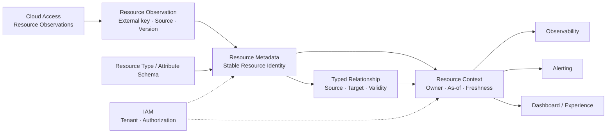

# COP 资源与元数据领域

## Purpose

定义 COP 内部稳定 Resource Identity、Resource Type、Attribute、Relationship、Resource Observation、Resource Context 和资源生命周期的所有权、来源、命令、查询、事件、不变量、失败恢复与验证边界。本文保持领域模型与 Cloud Provider/Kubernetes 实际状态、技术平面和 IAM 安全机制的分工。

## Scope

- COP Resource Identity、规范化资源元数据、Resource Type/Attribute schema 和关系模型。
- Cloud Access 发布的 Resource Observation 的解析、幂等合并、冲突隔离和 reconciliation。
- 外部事实字段与 COP 管理字段的来源、版本、freshness 和生命周期。
- Tenant 作用域、受治理 Resource Context、Projection consistency 和下游 Contract。
- Resource Metadata 的 Commands、Queries、Domain Events、Audit、失败恢复和验证。

## Non-goals

- Provider、CMDB、数据库、缓存、消息、部署或 Provider SDK 产品选择。
- 原始 Metrics、Logs、告警状态、云凭据、External Identity 或外部资源实际状态。
- Resource 同时属于多个 Tenant、共享可写存储或隐式跨 Tenant 授权。
- 将 Resource Observation 直接视为统一 Resource Identity，或依赖 last-write-wins、exactly-once 或全局排序。
- REST 路径、API 字段全集、表结构、物理拓扑或数值 SLO。
- 修改 `COP-DOM-001`、`COP-DOM-002`、`COP-DOM-004`、`COP-DOM-005` 或目录索引。
- 将 `COP-DOM-003` 标记为 `accepted`。

## Context

本文落实 `COP-DOM-001` 对 Resource Metadata Core bounded context 的所有权判断。Cloud Provider/Kubernetes 保留实际资源状态权威；Cloud Access 拥有账号接入、credential reference、Provider、发现和同步生命周期，只发布 Resource Observation，不创建统一 Resource Identity。IAM 拥有 Principal、Organization、Tenant、Membership 和授权决策；Observability、Alerting 和 Dashboard/Experience 只消费受治理 Resource Context。本文保持 `draft`，在明确接受前不构成 `cop-platform` 的强制实现约束。

## Ubiquitous Language

- **Resource：** COP 内具有不可变内部 `resource_id`、单一 Tenant 归属和规范化元数据的资源身份。
- **Resource Observation：** Cloud Provider/Kubernetes 经 Cloud Access 发布的外部资源观察，尚不是 COP 统一 Resource Identity。
- **Resource Type：** 稳定规范化类型标识及其 schema version。
- **Attribute：** 带 namespace/key、值类型、来源、schema version 和敏感级别的资源字段。
- **Relationship：** Resource 之间类型化、有向、带有效期和版本的关系边。
- **Resource Context：** Resource Metadata 发布的、声明 owner/source/as_of/freshness/failure semantics 的受治理资源读模型。
- **External fact：** Provider/Kubernetes 实际状态的只读事实投影。
- **Managed attribute：** 由 Resource Metadata 管理的标签、归属、环境或治理字段，不被发现同步覆盖。
- **Tombstone：** 已确认删除 Resource 的可审计保留记录；不允许复用其 Resource ID。
- **Stale / Partial / Degraded：** 明确标记数据新鲜度或完整性不足的读取状态，不等同于成功快照。

## Bounded Context

### Resource Metadata Responsibility Boundary

Resource Metadata 拥有 COP 内部稳定 Resource Identity、规范化元数据、Resource Type/Attribute schema、Relationship 和生命周期状态。Cloud Provider/Kubernetes 仍拥有实际资源状态；Cloud Access 只发布 Resource Observation，不创建统一 Resource Identity，也不写入 Resource Metadata 私有存储。Resource Metadata 负责 Observation 的解析、幂等合并、冲突隔离、关系维护和受治理 Resource Context 发布。Provider/Kubernetes 来源字段属于外部事实投影；COP 自有标签、归属、环境和治理状态由 Resource Metadata 独占，发现同步不得覆盖。本领域不决定 CMDB、数据库、缓存、消息、部署或 Provider SDK。

### Identity, Tenant, Type and Attribute Model

- Resource 持有不可变内部 `resource_id`；外部定位键由 `provider`、`account/cluster`、`resource_type` 和 `external_id` 构成，用于去重与重发现。外部键变更不复用旧内部 ID。
- MVP 中每个 Resource 只属于一个 Tenant；跨 Tenant 访问默认拒绝，共享资源通过受治理引用或 Projection 表达。
- Resource Type 使用稳定规范化类型标识，并带 schema version；Provider/Kubernetes 类型映射不改变 Resource Identity。
- Attribute 使用 namespace/key、值类型、来源、schema version 和敏感级别；未知或不兼容属性隔离保留，不阻塞其他字段合并。
- 外部事实字段与 COP 管理字段分离：外部字段只读投影；COP 标签、归属、环境和治理状态由 Resource Metadata 独占。
- 每个字段保留 source、observed-at/version 和 freshness；确定性优先级解决多来源冲突，禁止 last-write-wins。

### Observation and Lifecycle Model

- Resource Observation 携带 provider/account/cluster、外部资源键、resource type、观测版本或时间、来源和 correlation；接收采用幂等 upsert。
- 重复、乱序和 replay 通过 observation key、source version/observed-at 与 aggregate version 识别；无法解析的 Observation 进入隔离区，不创建不完整 Resource Identity。
- Resource 生命周期显式区分 `Discovered`、`Active`、`Stale`、`Deleted`；同步失败只能产生 `Stale` 或 degraded 事实，不能直接推断 `Deleted`。
- 外部确认删除后保留 Resource tombstone、最后来源和删除时间；只有 `Stale` 可在新观察确认后回到 `Active`，已确认 `Deleted` 的资源重发现必须创建新 Resource ID，可通过 predecessor reference 保留历史关联，不复用已失效身份。
- 父级 Tenant 暂停或授权撤销不会删除 Resource 记录，但下游查询和 Projection 必须立即应用 Tenant isolation 与授权约束。
- Observation 传播使用 at-least-once Domain Events；Resource Metadata 发布已提交 Resource Context，不承诺 exactly-once 或全局排序。

### Relationship and Resource Context Model

- Relationship 是类型化、有向、带有效期和版本的边，包含 source/target Resource ID、relationship type、source、observed-at/valid-from、valid-to、schema version 与 correlation。
- 发现关系与治理关系分开建模：Provider/Kubernetes 产生外部观察事实；COP 手工或规则产生治理事实；合并读视图保留各自来源和失效语义。
- 关系更新采用显式替换、失效或撤销，不通过隐式双向写入；目标 Resource 不存在或 Tenant 不匹配时，关系进入待解析/隔离状态。
- Resource Context 是对 Observability、Alerting 和 Dashboard 提供的受治理读模型，声明 owner、source、`as_of`、freshness 和 failure semantics。
- 普通查询可返回明确标记的 `stale`、`partial` 或 `degraded`；不得把不同时间边界的来源伪装成一致快照。
- Resource Metadata 不拥有原始 Metrics/Logs，也不产生 Alert lifecycle；下游只消费稳定引用或 Projection。

箭头不表示共享存储、跨领域直接写入、Tenant 继承、分布式事务或部署拓扑；Cloud Access 仍不拥有统一 Resource Identity，下游只消费受治理 Resource Context。

### Failure and Recovery

- Provider/Kubernetes 不可用、权限变化或观察超时时，保留最后成功事实并标记 `Stale`/`degraded`，不自动删除 Resource。
- 单个 Observation 无法解析、schema 不兼容或关系目标缺失时隔离该输入，不阻塞无关资源和字段。
- 同步重放、reconciliation 和关系重建必须幂等，可检测 duplicate、out-of-order、replay、版本缺口和长期 stale。
- IAM 不可用、Tenant 不匹配或敏感字段授权无法确认时 fail closed。
- Projection 可从保留事件重建；reconciliation 不能改变 Cloud Provider/Kubernetes 的事实权威。

### Validation Strategy

- **Resource Identity：** 验证内部 ID 不可变、外部键可去重、键变更不复用 ID、Deleted tombstone 不被重发现复用。
- **Tenant isolation：** 验证 Resource 单一 Tenant 归属、跨 Tenant 读取/关系/Projection 默认拒绝。
- **Source merge：** 验证 source、observed-at/version、freshness 和确定性优先级，且发现不会覆盖 Managed Attribute。
- **Attribute schema：** 验证 namespace/key、值类型、schema version、敏感级别以及未知/不兼容字段隔离。
- **Relationship：** 验证方向、类型、Tenant、来源、有效期、版本、显式失效和待解析关系。
- **Observation consistency：** 验证幂等 upsert、duplicate、out-of-order、replay、reconciliation 和 expected version 冲突。
- **Projection freshness：** 验证 owner、source、`as_of`、freshness、failure semantics，以及 stale/partial/degraded 标记。
- **Failure isolation：** 验证 Provider、schema、IAM、关系目标、消费者和 Projection 故障不会扩大资源事实归属。
- **Privacy and audit：** 验证事件、日志、缓存和 Resource Context 不包含 credential、Secret、完整 Provider payload 或未经授权 Tenant 数据。

### Success Criteria

- 读者能识别 Resource Metadata、Cloud Access、Cloud Provider/Kubernetes、IAM、Observability、Alerting 和 Dashboard/Experience 的事实所有权。
- Resource ID、外部定位键、Tenant 单一归属、tombstone、source/freshness/version、Attribute schema、关系和 Observation 幂等语义完整。
- Provider/Kubernetes 外部事实与 COP 管理字段、发现关系与治理关系没有事实覆盖或隐式合并。
- Resource Context 的 owner、source、`as_of`、freshness、failure semantics 和 Tenant/授权边界清晰。
- Commands、Queries、Domain Events、Audit、fail closed、reconciliation 和 Projection recovery 可验证。
- 文档不引入未批准的产品、部署或 API 设计，并保持 `draft` 门禁。

## Aggregates and Entities

| Aggregate or capability | Ownership | Key references and boundaries |
| --- | --- | --- |
| Resource | 不可变 Resource Identity、单一 Tenant 归属、生命周期和规范化元数据 | 外部定位键、Resource Type、Attribute、tombstone；不拥有 Provider 实际状态 |
| Resource Observation | 外部观察输入、来源、版本和解析状态 | provider/account/cluster、external key、observed-at、source version；不可直接成为统一身份 |
| Resource Type / Attribute Schema | 稳定类型、namespace/key、值类型、schema version 和敏感级别 | 未知/不兼容 schema 隔离；不改变 Resource Identity |
| Relationship | 类型化有向边、来源、有效期、版本和失效状态 | source/target Resource ID；发现关系与治理关系分离 |
| Resource Context Projection | 对下游发布 owner/source/as_of/freshness/failure 的受治理读模型 | 不产生新事实、不拥有原始 Telemetry 或 Alert lifecycle |

Resource 状态为 `Discovered`、`Active`、`Stale`、`Deleted`。只有 `Stale` 可回到 `Active`；`Deleted` 保留 tombstone，重发现创建新 Resource ID。未知 Observation、schema 不兼容和缺失关系目标保留在隔离状态，不污染已提交核心事实。

## Commands and Queries

### Commands

- `IngestResourceObservation`、`ReconcileObservation`、`QuarantineObservation`
- `SetManagedAttribute`、`RemoveManagedAttribute`、`ChangeResourceLifecycle`
- `UpsertDiscoveredRelationship`、`CreateGovernedRelationship`、`ExpireRelationship`

所有命令携带 Tenant、actor/source、idempotency key 和 expected version；并发冲突显式拒绝，不使用 last-write-wins 或分布式事务。

### Queries

- Resource identity/detail、Resource Type 与 Attribute schema 查询。
- 按 Tenant、type、attribute 和生命周期状态查询 Resource。
- Relationship 邻接、类型、有效期和受治理路径查询。
- 带 owner、source、`as_of`、freshness 和 failure semantics 的 Resource Context 查询。

查询应用 IAM 授权、Tenant isolation 和字段敏感级别，不泄漏未经授权的资源存在性。

## Domain Events

### Events

- Resource 注册、外部键关联与生命周期变化。
- 规范化 Attribute 变化、Resource Type/Attribute schema version 变化。
- Relationship 创建、替换、失效与撤销。
- Resource Observation 解析、隔离和 reconciliation 事实。

事件采用 at-least-once，只携带稳定 ID、Tenant、版本、来源与必要变更引用；不携带完整 Provider payload、credential、Secret 或原始错误。消费者处理 duplicate、out-of-order、replay 和 schema incompatibility；高频 Observation 使用受控批次/摘要，不隐藏 Resource Identity 与版本变化。

### Audit

高风险治理命令、Tenant 作用域变化和敏感字段操作产生审计记录。无法确认 IAM、Tenant 或审计持久化时 fail closed；Resource Context 和普通事件不包含未经授权 Tenant 数据。

## Invariants

- 一个 Resource 只有一个不可变内部 Resource Identity；外部定位键用于去重，不替代内部 ID。
- MVP 中每个 Resource 只属于一个 Tenant；跨 Tenant 资源读取、关系和 Projection 默认拒绝。
- Cloud Access 只产生 Resource Observation；Resource Metadata 是 Resource Identity、规范化元数据和关系的唯一 COP owner。
- Provider/Kubernetes 外部事实字段不可被 COP 管理字段覆盖。
- Attribute schema version、值类型和敏感级别必须可验证；未知或不兼容字段隔离。
- Relationship 必须有明确类型、方向、Tenant、来源、有效期和版本，不能隐式扩大 scope 或产生双向写入。
- `Deleted` 资源保留 tombstone；重发现不复用已失效 Resource ID。
- 所有命令携带 idempotency key 和 expected version；并发冲突显式拒绝。
- 无法确认 IAM、Tenant、source version 或敏感字段授权时 fail closed。

## Relationships

- [COP-DOM-001](domain-landscape.md)
- [COP-DOM-004](cloud-access-domain.md)
- [COP-DOM-005](observability-domain.md)
- [COP-STD-001](../standards/terminology.md)

Cloud Access 通过 Resource Observation 向 Resource Metadata 提供上游输入；Resource Metadata 通过 Resource Context 向 Observability、Alerting 和 Dashboard/Experience 提供下游读模型。IAM 提供 Tenant 与授权上下文；Cloud Provider/Kubernetes 保留实际状态权威。

## Constraints

- `COP-DOM-003` 保持 `draft`；只有显式接受后才形成 `cop-platform` 实现约束。
- 不得保存或传播 credential、Secret、完整 Provider payload、原始错误或未经授权 Tenant 数据。
- 不得共享可写存储、跨领域直接写入、隐式双向关系或 last-write-wins。
- Unknown/stale/partial/degraded/unavailable 不得伪装为完整成功；授权、Tenant 或 source version 无法确认时 fail closed。
- 重大边界、所有权或兼容性变更必须经过 RFC/ADR，不以本文决定产品、部署或 API 细节。

## Quality Attributes

- **Boundary clarity：** 每个事实、字段、关系和 Projection 的 owner 可识别。
- **Tenant isolation：** Resource 单一 Tenant 归属，跨 Tenant 默认拒绝。
- **Consistency：** 幂等 Observation、expected version、确定性 source merge 和关系版本。
- **Reliability：** at-least-once、隔离、reconciliation、Projection 重建和 tombstone 保留。
- **Freshness transparency：** owner、source、`as_of`、freshness 和 failure semantics 可观察。
- **Privacy and security：** 最小事实视图、敏感字段控制、IAM 授权和 fail closed。
- **Evolvability：** Resource Type/Attribute schema version 和有方向的 Contract 支持演进。

## Implementation Guidance

实现应以稳定 Resource ID、Tenant、source、expected version 和 idempotency key 为输入，先验证当前状态、不变量和来源优先级，再提交 Resource/Attribute/Relationship 事实并发布最小 Domain Event。Observation、reconciliation 和 Projection 消费按 event ID、source version 和 aggregate version 幂等处理；`Stale`、`Partial`、`Degraded` 和 `Deleted` 必须保留明确语义。本文不规定 API 字段、数据库、缓存、消息、部署拓扑、Provider SDK 或 CMDB 产品。

## References

- [COP-DOM-001](domain-landscape.md)
- [COP-DOM-004](cloud-access-domain.md)
- [COP-DOM-005](observability-domain.md)
- [COP-STD-001](../standards/terminology.md)
