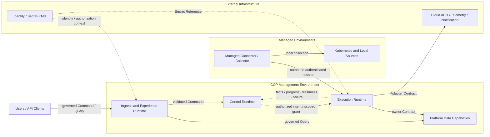

# COP 基础设施总览

## Purpose

定义 COP 的基础设施责任、逻辑部署区域、信任与故障边界、受治理运行路径、恢复语义和演进 Profile，为专项基础设施设计提供稳定的跨文档不变量。

本文保持 `draft`。在状态变为 `accepted` 前，本文只用于设计评审与一致性检查，不构成 `cop-platform` 的强制实现约束。

## Scope

- COP Management Environment、Managed Environments 与 External Infrastructure 的责任、信任和故障边界。
- Management Environment 内部 capability 的逻辑隔离与允许的物理共置。
- Command、Execution、Query 与 Event 的受治理路径和数据 authority。
- identity、Tenant、authorization、Secret Reference、audit、故障降级和恢复分类。
- MVP Self-hosted Baseline、Resilient Self-hosted 与 SaaS-ready Isolation 的演进边界。
- Kubernetes、Network、Storage 与 Observability 专项文档必须保持的跨文档不变量。

## Non-goals

- 不选择 Kubernetes distribution、transactional store、cache、broker、object storage、Telemetry、Secret/KMS、service mesh、ingress controller 或 cloud managed service 产品。
- 不固定 service、process、package、database、cluster、namespace、node、replica、availability zone、region 或 network segment 的数量和映射。
- 不定义 capacity、port、protocol、cipher、certificate lifetime、retry count、queue size、retention、RPO/RTO、failover timing 或数值 SLO。
- 不提供安装手册、Infrastructure as Code module、Helm value、Kubernetes manifest、database schema 或 API payload。
- 不复制领域写模型、外部原始事实、专项基础设施拓扑，或扩展 Workflow、Automation、FinOps、AI/RAG 与 SaaS 商业运营范围。
- 不依赖 exactly-once、全局顺序、共享可写存储、跨边界分布式事务或网络位置形成的隐式信任。

## Context

`COP-ARCH-002` 定义 Experience Boundary、Control Plane、Data Plane 和 Platform Data Services 的逻辑责任；`COP-ARCH-003` 定义 Control Plane、Data Plane、Managed Connector/Collector 和 External Adapter Boundary 的执行与信任关系；`COP-ROAD-002` 定义 MVP 能力范围。本文只把这些逻辑责任映射为产品中立的基础设施 capability 和部署边界，不把 logical plane 固定为 service、process、cluster 或 database。

领域文档继续拥有业务事实和不变量。Cloud/Kubernetes actual state、external identity、raw Telemetry 和 external Delivery Result 继续由相应外部系统拥有。所有关联文档当前均为 `draft`；只有状态为 `accepted` 的权威文档和 ADR 才能形成实现约束。

## Architecture or Model

### Infrastructure Responsibility Model

本文拥有三类逻辑部署区域、Management Environment capability、跨区域依赖方向、运行路径、安全边界、故障隔离、恢复分类和 Evolution Profile 的跨专项不变量。它不拥有领域写模型、产品选型、容量模型、数值 SLO 或专项拓扑。

逻辑隔离必须能够通过 workload identity、permission、data access、resource boundary、health、dependency 和 audit signal 验证，但不要求每个逻辑 capability 都有独立的物理运行单元。MVP 可以物理共置这些 capability，只要责任和边界仍可判定。

专项文档负责细化实现，同时保持本文定义的不变量：

| Document | Owns | Must preserve from overview |
| --- | --- | --- |
| `COP-INFRA-002` Kubernetes Topology | cluster、namespace、workload placement、scheduling 与 runtime isolation | 三类区域、逻辑隔离、workload identity、failure domain 与 Profile 语义 |
| `COP-INFRA-005` Network and Ingress | external entry、service traffic、managed connection 与 network trust | governed ingress、private data capability、outbound-only managed session 与 no implicit trust |
| `COP-INFRA-003` Data Storage Architecture | state category、storage responsibility、backup/restore、retention 与 migration | Preserve、Rebuild、Reconcile、no new authority 与 product-neutral capability role |
| `COP-INFRA-004` Observability Stack | collection、Metrics/Logs/Traces、query path 与 operational telemetry | external raw Telemetry authority、freshness、degradation 与 dependency isolation |

专项文档不得改变领域 ownership，不得将 logical plane 强制映射为固定 deployment unit，也不得通过具体产品绕过 Tenant、authorization、Secret 或 recovery Contract。改变区域、数据 authority、安全边界或 Profile 不变量，需要先经过 RFC，接受后关联 ADR 并同步受影响的权威文档。

### Deployment Zone Model

基础设施分为三个逻辑部署区域：

- **COP Management Environment：** COP runtime、Platform Data Capabilities 和 cross-cutting operational control 所在的 operator-controlled trust boundary。
- **Managed Environments：** COP 所连接的 customer/target trust boundary，保留本地系统和业务 workload 的执行 authority。
- **External Infrastructure：** Cloud/Kubernetes API、External Identity Provider、Secret/KMS、Telemetry Backend、Notification System 等保留自身事实 authority 的系统。

这些区域表达 responsibility、trust 与 failure boundary，不是固定的 cluster、service、process、network segment、机房或物理位置。物理共置不合并 authority；物理分离也不改变 owning Contract。

由 COP operator 控制、专用于 COP 且遵循 COP backup、identity、network 与 recovery Contract 的 managed capability，即使托管在外部云服务中，也可逻辑归入 Management Environment。归属依据是责任与信任 Contract，而不是物理位置。

### Management Environment Capabilities

Management Environment 包含四类可逻辑隔离的 capability：

- **Ingress and Experience Runtime：** 承载外部入口、API boundary 与 governed read access；校验 request identity、Tenant、scope 和 authorization context，并将 Command 或 Query 路由到 owning Contract。它不承载领域规则，也不直接读取私有存储。
- **Control Runtime：** 承载 policy、authorized intent、task orchestration 与 lifecycle；持久化经过验证的意图和恢复决策，通过 scoped execution grant 调用 Execution Runtime。它不采集 raw Telemetry，也不把最终 authorization 委托给执行方。
- **Execution Runtime：** 承载 Adapter、discovery、collection、synchronization 与 fact reporting；隔离 external dependency，执行有界 backpressure、retry、checkpoint 和 duplicate protection，并通过 owner Contract 提交事实。它不得扩大 Tenant、account、cluster、resource、operation 或 signal scope。
- **Platform Data Capabilities：** 为权威状态、可重建加速、事件传输和受控对象提供产品中立的数据能力，并保持 owner、authority 与恢复语义。

Data Infrastructure Capability 按角色定义。前四项是 Management Environment 内部的 Platform Data Capabilities；Telemetry Backend 即使由 COP operator 部署并与其物理共置，也保留独立的外部 raw Telemetry authority：

| Capability role | Authority and use | Failure and recovery semantics |
| --- | --- | --- |
| Transactional State | 保存由领域 owner 提交的 COP authoritative fact、intent 与 lifecycle；基础设施本身不获得领域 ownership | 归入 Preserve；需要受控 backup、restore verification、version 与 audit continuity |
| Ephemeral Acceleration | 提供 cache、coordination、session acceleration 或等价可替换能力 | 不是 authority；失败时允许显式降级，并从 authoritative state Rebuild |
| Event Transport | 传播已提交事实与异步任务信号 | 采用 at-least-once；处理 duplicate、delay、out-of-order 与 replay；不提供分布式事务或全局顺序 |
| Durable Object Capability | 保存受控 object 或 reference，遵循 owner、retention、encryption 与 access Contract | object 与 metadata 必须可验证关联；普通对象、事件和日志不得包含 credential material |
| Telemetry Backend | 保存 Metrics、Logs、Traces 等 raw Telemetry，并提供外部查询能力 | 保留独立外部 authority；不可用、partial 或 stale 必须显式，不得伪装为完整成功 |

前四项可以使用自建或 managed implementation，但逻辑责任和 recovery Contract 不随产品变化。Telemetry Backend 可以由 COP 部署或连接，物理位置不把 raw Telemetry authority 转移给 COP 领域。

### Managed Environment Boundary

Managed Environments 包括 Kubernetes cluster、本地 Telemetry source 和其他需要 Managed Connector/Collector 的 customer/target 环境。Managed Connector/Collector 只主动建立到 COP 的 outbound authenticated session，通过受控 polling 或 streaming 获取 scoped task，并回报 observation、fact、progress、freshness、failure 与 recovery signal；COP 不要求或依赖进入受管环境的 inbound control access。

Managed Environment 保留本地执行 authority。Connector/Collector 只执行 scoped collection、discovery 或 synchronization，不拥有 Control Plane policy、最终 authorization 或跨 Tenant credential。会话和任务必须绑定 workload identity、Tenant、scope、授权上下文与可审计的 correlation context。

### External Infrastructure Boundary

External Infrastructure 保留 Cloud/Kubernetes actual state、external identity、raw Telemetry、Secret/KMS 与 external Delivery Result 的 authority。COP 仅通过 owning Contract 或 Adapter Contract 与其交互。

外部产品字段、credential、供应商错误和私有存储模型不得成为 COP 领域不变量。External Infrastructure 不能通过共享存储获得 COP 写权限；COP 也不得绕过 owner 直接依赖其私有模型。由 COP operator 部署或与 Management Environment 物理共置，不改变这些 Contract boundary。

### Runtime and Data Flows

四类路径均保持 identity、Tenant、authorization、owner Contract、freshness 和 failure semantics：

- **Command Path：** Ingress and Experience Runtime 校验 identity、Tenant、scope、authorization 与 request Contract，再把 Command 交给 owning Control/Domain Contract。Control Runtime 持久化 authorized intent 和 task lifecycle，并明确返回 accepted、rejected、conflict、timeout、dependency failure 或 unknown outcome；accepted 不等于 completed。
- **Execution Path：** Control Runtime 向 Execution Runtime 提供短期、限 Tenant、限资源、限操作的 execution grant 及必要的 Secret/KMS Reference。Execution Runtime 调用 External Infrastructure 或处理 Managed Connector/Collector 会话，只回报 observation、fact、progress、freshness、failure 与 recovery signal。Credential material 不进入普通 task、event、log 或领域数据。
- **Query Path：** Query 使用 governed read model 或 owner Query Contract，不要求经过 Execution Runtime。Read model 声明 owner、source、`as_of`、freshness 与 failure semantics，并区分 complete、stale、partial、degraded 和 unavailable；调用方不得绕过 owner 读取私有存储。
- **Event Path：** Domain Event 只在 authoritative fact 成功提交后发布。Event Transport 提供 at-least-once 传播；消费者使用稳定 event ID、aggregate version 与业务 idempotency key 处理 duplicate、out-of-order 和 replay，不依赖 exactly-once、全局顺序或跨边界分布式事务。

Command 被接受只表示持久化了合法意图，不证明外部执行完成。Event 只能描述已提交事实，不能把 queue、缓存状态或未知外部结果提升为权威事实。

### Security and Trust Boundaries

- 每次跨区域交互显式携带 workload/subject identity、Tenant、scope 和适用的 authorization context；网络位置、cluster membership 或共享基础设施不产生隐式信任。
- 自托管单组织 Profile 仍保留显式 Tenant semantics、identity、authorization、data partition、audit 和 Secret boundary，不能推迟到 SaaS 阶段重构。
- Secret 和 credential 只通过受控 Secret/KMS Reference 使用，不得进入 task payload、Domain Event、ordinary log、backup metadata、read model 或普通领域数据。
- 外部入口由 Ingress boundary 统一治理；Platform Data Capabilities 不暴露为未经授权的公共入口。
- Managed Connector/Collector 只建立 outbound authenticated session；任务响应在已建立的受控会话内返回。
- 权限遵循 default deny 和 least privilege。无法确认 identity、Tenant、scope、authorization、Secret Reference 或 dependency integrity 时 fail closed。
- 关键配置、授权、task intent、execution result、backup、restore、reconciliation 与 recovery action 保留 actor/source、target、time、result、version 和 correlation audit context。

具体 protocol、certificate lifecycle、port、cipher、network policy 与 encryption implementation 由安全、网络或专项设计决定。

### Failure Isolation and Degradation

- 故障至少按 Tenant、connection、managed environment、Adapter 与 dependency 隔离；单一失败不得无边界阻塞其他 Tenant、连接或环境。
- Execution Runtime 和 Event Transport 使用 bounded queue、backpressure、retry 与 isolation，不以无限重试或无界积压维持虚假可用。
- validation、authentication、authorization、scope mismatch 与 incompatible Contract 属于 terminal failure，不自动重试。
- 只有明确 retryable 的 dependency failure 执行有界 backoff；unknown outcome 通过状态查询、idempotent retry 或 reconciliation 确认，不得自动宣称成功或失败。
- stale、partial、degraded、unavailable、unknown、isolated、recovering 和 failed 必须显式呈现，任何一种都不得表示为 success。
- External Infrastructure 故障不改变事实 authority。物理共置的内部 capability 也必须保留可判定的 workload identity、permission、data access、resource boundary 与 failure signal，防止故障静默扩散。

### Backup, Recovery, and Reconciliation

恢复责任分为四类：

- **Preserve：** committed domain fact、task intent/lifecycle、Tenant、version、audit 与 correlation context。需要 backup、restore、integrity 和 continuity 验证。
- **Rebuild：** cache、index、governed read model、derived projection 与 ephemeral coordination。必须能从 authoritative state 或保留事件重建，不能成为唯一恢复来源。
- **Reconcile：** Cloud/Kubernetes actual state、Telemetry association、external Delivery Result 与 Managed Environment freshness。恢复后通过 resync、query 或 reconciliation 验证外部 authority 与 COP 引用。
- **Never infer：** 不把 unknown 解释为 success，不把 partial 解释为 complete，不把 queue/cache 解释为 authority，不把网络位置解释为 authorization。

backup、restore、rebuild、resync 和 reconciliation 必须具有可执行路径与验证证据。本文不规定 replica count、RPO/RTO、availability zone、region topology、capacity、retention 数值、failover topology 或数值 SLO；这些参数只能由专项文档或经过治理的 RFC/ADR 决定。

### Evolution Profiles

Profile 表达 capability maturity 和 isolation 强度，不是产品套餐、环境名称或固定拓扑。进入下一 Profile 需要风险、合规、负载、故障与运营成熟度证据：

| Evolution Profile | Capability and isolation | Invariants and entry evidence |
| --- | --- | --- |
| MVP Self-hosted Baseline | capability 可在共享 Kubernetes 或等价运行基础设施上物理共置；提供基础 backup/restore、rebuild、reconciliation 与 dependency failure 证据 | workload identity、permission、data access、resource boundary、health、Tenant context 与 audit signal 显式；不预设物理拓扑数量 |
| Resilient Self-hosted | 根据风险、合规、负载和已观察故障证据拆分 runtime 或 data capability，并增强 failure domain、redundancy、backpressure、restore drill 与 recovery verification | 物理拆分不改变 Contract、data authority、Tenant context 或跨区域依赖方向；进入条件来自验证证据 |
| SaaS-ready Isolation | 增强 Tenant、workload、network 与 data partition isolation，支持按风险和负载拆分运行单元与故障域 | 延续自托管 Profile 的 identity、Tenant、authorization、audit 与 Secret boundary；不假设跨 region 全局事务、全局顺序或共享高权限 credential |

### Infrastructure Relationship Map

下图只表达三个逻辑区域及允许的受治理流向：

图中区域表示 responsibility、trust 与 failure boundary，不表示固定 cluster、service、process、network segment 或物理位置。箭头表示受治理的 Contract 与 context 流向，不表示共享存储、固定物理拓扑或跨边界分布式事务；虚线表示 authorized intent、fact signal 或 cross-cutting security context。

### Validation Strategy

- 验证三个区域、四类 Management Environment capability 和外部 authority 可独立识别，且 MVP 物理共置时逻辑隔离仍可验证。
- 验证 Command、Execution、Query 和 Event 不形成共享写存储、循环同步依赖或跨边界直接私有访问。
- 验证 Managed Connector/Collector 只建立 outbound authenticated session，scoped task 与 fact reporting 保留 identity、Tenant、authorization 和 correlation context。
- 验证五类 Data Infrastructure Capability 的 authority 与恢复语义互不混淆，尤其是 Telemetry Backend 的独立外部 raw Telemetry authority。
- 验证自托管 Profile 也保留 Tenant boundary，Secret/credential 不进入普通 task、event、log、backup metadata 或 read model。
- 验证 Tenant、connection、managed environment、Adapter 和 dependency 故障有界隔离，并显式报告 stale、partial、degraded、unavailable 与 unknown。
- 验证 Preserve、Rebuild、Reconcile 和 Never infer 分类，以及 backup、restore、rebuild、resync 与 reconciliation evidence。
- 验证 Evolution Profile 只增强 capability 和 isolation，不改变 ownership、Contract 或持续安全不变量。
- 验证 Kubernetes、Network、Storage 和 Observability 细节分别由四份专项文档拥有，总览不复制专项实现。

### Success Criteria

- 读者能够区分三个区域的 responsibility、trust 和 failure boundary，而不会把区域误读为固定物理拓扑。
- Management Environment 的四类 capability 可逻辑隔离，并可按 Profile 和风险物理共置或拆分。
- 四条运行路径保持 owner Contract、identity、Tenant、authorization、Secret Reference、freshness 与 failure semantics。
- Platform Data capability 不获得新的领域 authority，Telemetry Backend 继续拥有独立的外部 raw Telemetry authority。
- Managed Connector/Collector 保持 outbound-only connection、scoped execution 和 fact reporting，不要求 COP 入站进入受管环境。
- degraded、partial、stale、unavailable 与 unknown 不伪装为 success；恢复职责和验证 evidence 可执行。
- 三个 Evolution Profile 共用稳定边界与不变量，仅增强 isolation 与 operational capability。
- 文档保持 `draft`，不引入产品选型、固定拓扑、容量参数或未经批准的实现约束。

## Constraints

- 只有 `accepted` 权威文档和 ADR 才是实现约束；本文在 `draft` 状态下只用于评审。
- 逻辑 capability 必须保持可验证隔离，物理共置或拆分不得改变 ownership、authority、Contract 和跨区域依赖方向。
- 所有跨区域访问必须经过 owning Contract 或 Adapter Contract，不得通过共享数据库、私有存储或网络位置绕过授权。
- committed fact 先于 Event，accepted 不等于 completed；异步传播按 at-least-once 设计，不假设 exactly-once、全局顺序或分布式事务。
- 不得在本文或实施任务中固定产品、服务映射、拓扑数量、capacity、RPO/RTO、region topology 或数值 SLO。

## Quality Attributes

- **Security：** 显式 identity、Tenant、authorization、data partition、audit 与 Secret Reference；default deny、least privilege 和 fail closed。
- **Reliability：** 按 Tenant、connection、managed environment、Adapter 与 dependency 隔离故障，以 bounded queue、backpressure、retry 和 reconciliation 控制影响。
- **Recoverability：** Preserve、Rebuild、Reconcile 与 Never infer 责任可验证，并保留 backup、restore、rebuild、resync 和 reconciliation evidence。
- **Observability：** health、freshness、degradation、failure、dependency 和 recovery 状态可关联至 actor/source、target、time、result、version 与 correlation context。
- **Evolvability：** Profile 增强隔离和运行能力而不重建核心 authority、Contract、Tenant 或安全模型。
- **Portability：** capability 以责任和 Contract 定义，不绑定产品、固定 deployment unit 或物理位置。

## Implementation Guidance

实现仓库只能在本文及其依赖文档变为 `accepted` 后将其作为约束。届时应先验证 logical/physical separation、跨区域依赖方向、Tenant 与 Secret boundary、数据 authority、失败语义和 recovery evidence，再由专项文档决定具体 Kubernetes、Network、Storage 与 Observability 设计。

实现不得根据图中的节点推导固定 service、process、cluster 或 database，不得把箭头实现为共享可写存储或同步分布式事务，也不得将 Telemetry Backend、cache、queue、index 或 object storage 提升为新的领域 authority。

需要改变三个区域、数据 authority、安全边界、恢复分类或 Evolution Profile 不变量时，必须先创建或更新 RFC；RFC 被接受后关联 ADR，并同步所有受影响的权威文档。本文不得在实施任务中直接承载重大架构决定。

## References

- [COP-ARCH-002](../architecture/logical-architecture.md)
- [COP-ARCH-003](../architecture/control-plane-data-plane.md)
- [COP-ROAD-002](../roadmap/mvp-definition.md)
- [COP-INFRA-002](kubernetes-topology.md)
- [COP-INFRA-003](data-storage.md)
- [COP-INFRA-004](observability-stack.md)
- [COP-INFRA-005](network-and-ingress.md)
