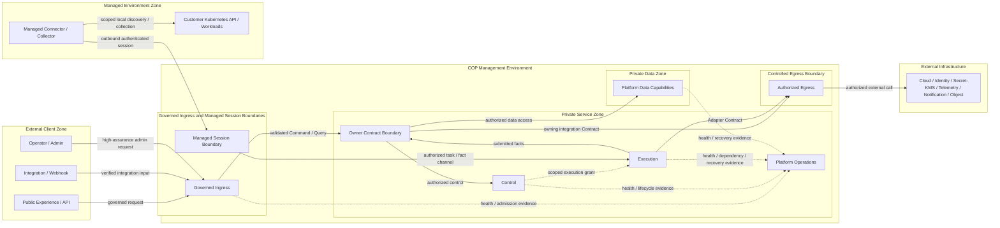

# COP 网络与入口架构

## Purpose

定义 COP external ingress、internal service traffic、controlled egress、Managed Session、TLS/identity propagation、DNS/service discovery、流量治理、故障隔离和阶段演进边界，使网络可达性与业务授权保持分离。

本文保持 `draft`；在状态变为 `accepted` 前，不构成 `cop-platform` 的强制实现约束。

## Scope

- Public Experience/API、Integration/Webhook、Operator/Admin 和 Managed Session 四类入口。
- External Client、Governed Ingress、Private Service、Private Data、Controlled Egress、Managed Session 和 Managed Environment Trust Zone。
- Management Environment 内部 service traffic 与 Placement Class 的允许流向。
- default-deny egress、External Adapter destination governance 与 dependency isolation。
- Managed Connector/Collector 的 outbound-only authenticated session。
- TLS termination、hop identity、header provenance、DNS/service discovery 和 trust material lifecycle Contract。
- Command/Query、Event、Telemetry/Bulk、Managed Session 和 External Adapter 五类流量。
- admission、rate/quota、request boundary、timeout、backpressure、load shedding 和 network failure semantics。
- 三个基础设施 Evolution Profile 的 network isolation、failure domain 与 operational evidence。

## Non-goals

- 固定 DNS、CDN、Load Balancer、Gateway、proxy、service mesh、CNI、firewall、WAF、PKI 或 certificate 产品。
- 固定 domain、IP、port、protocol、cipher、certificate lifetime、subnet、VPC、network segment、Gateway 或 proxy 数量。
- 定义 NetworkPolicy、route、firewall rule、certificate issuance、DNS record、Load Balancer 或 Gateway 配置操作手册。
- 使用 mTLS、network location、DNS name、IP、namespace 或 cluster membership 替代 owner Contract、Tenant 或 authorization。
- 管理客户业务网络、业务 workload topology 或 External Infrastructure 内部 route。
- 定义 API payload、Event schema、Telemetry product、data authority、RPO/RTO、capacity 或数值 SLO。

## Context

`COP-INFRA-001` 定义 COP Management Environment、Managed Environments、External Infrastructure、governed ingress、Private Data、outbound-only Managed Session、no implicit trust 和三个 Evolution Profile。`COP-INFRA-002` 定义 Placement Class、workload identity、host-level isolation 和 Kubernetes failure boundary。本文只定义 network reachability 与 Traffic Contract，不改变 workload placement、domain ownership 或 data authority。

`COP-ARCH-003` 定义 Control Plane、Data Plane、Managed Connector/Collector、outbound mTLS、scoped execution grant 和 fact reporting。`COP-ARCH-004`、`COP-API-001` 和 `COP-API-002` 定义 API、Event、Webhook 和 Provider/Connector Contract。本文不固定 protocol 或 payload shape。

当前相关文档均为 `draft`，只用于设计一致性检查。只有状态为 `accepted` 的权威文档和 ADR 才能形成实现约束。

## Architecture or Model

### Network Responsibility Model

采用 `Traffic Contracts + Trust Zones + Evolution Profiles`。Network and Ingress 只定义 connection path、initiator、direction、transport identity、reachability、admission 和 failure isolation，不获得 Tenant、authorization、data ownership、task 或 lifecycle authority。

专项文档职责保持分离：

| Document | Owns | Must preserve from Network and Ingress |
| --- | --- | --- |
| `COP-INFRA-001` Infrastructure Overview | deployment zone、runtime/data flow、recovery class 与 Evolution Profiles | governed ingress、Private Data、outbound-only Managed Session、no implicit trust 与 authority boundary |
| `COP-INFRA-002` Kubernetes Topology | namespace、Placement Class、workload identity、resource、scheduling 与 host-level isolation | network policy 不替代 identity/RBAC/owner Contract，不强制固定 namespace、node pool 或 cluster |
| `COP-ARCH-004` Integration Architecture | API/Event/Webhook/Provider Contract、version、replay 与 delivery semantics | route 和 transport 不获得 owner authority；Webhook 与 integration isolation 可验证 |
| `COP-SEC-001` Security Architecture | authentication、authorization、Secret/KMS、PKI、encryption、audit 与 security control | TLS termination、identity provenance、trust lifecycle、least privilege 与 fail closed |
| `COP-INFRA-003` Data Storage Architecture | data authority、storage responsibility、backup/restore 与 retention | Private Data 不暴露 bypass；network reachability 不产生 data authority |
| `COP-INFRA-004` Observability Stack | Telemetry pipeline、Collector、Metrics/Logs/Traces、query 与 platform observability | Telemetry/Bulk backpressure、freshness、failure isolation 与 no authority transfer |

### Trust Zone Model

Trust Zone 是 responsibility、identity、allowed direction 和 failure boundary，不等于固定 subnet、VPC、cluster、Gateway 或 network segment：

- **External Client Zone：** Portal user、CLI、API client、Webhook producer、integration client 和 operator/admin client；所有输入均视为不可信。
- **Governed Ingress Boundary：** 负责受控 TLS policy、connection admission、request boundary、identity bootstrap、Tenant/context validation、rate control 和 route selection。
- **Private Service Zone：** 承载 Owner Contract、Control、Execution 和 Platform Operations；内部 hop 没有隐式信任。
- **Private Data Zone：** 承载 Platform Data capability；不提供未经 Owner Contract 授权的 public 或 internal bypass。
- **Controlled Egress Boundary：** 治理到 Cloud/Kubernetes API、External Identity、Secret/KMS、Telemetry Backend、Notification System 和 Object Capability 的调用。
- **Managed Session Boundary：** 只接受 Managed Connector/Collector 主动建立的 authenticated session；connection identity 与 task authorization 分离。
- **Managed Environment Zone：** 客户或目标环境；保留业务网络、Kubernetes API、workload、node、storage 和 actual state authority。

### Ingress Classes

| Ingress class | Primary consumers | Required boundary |
| --- | --- | --- |
| Public Experience/API | Portal、CLI、API client | 强 identity validation、Tenant/scope、bounded admission、明确 timeout、idempotency context 与 error semantics |
| Integration/Webhook | 外部系统、subscription 和 callback producer | 独立 endpoint identity、签名或等价验证、replay protection、subscription isolation、bounded retry 与最小 event view |
| Operator/Admin | platform operator 与高风险管理操作 | 更严格 identity、authorization、audit、exposure、session 与 fail-closed policy；不得继承普通 Public API policy |
| Managed Session | Connector/Collector | 仅受管环境主动建立 authenticated session；connection identity 不等于 task authorization；支持 expiry、revocation、backpressure 与 freshness |

入口可以共用或拆分物理 Gateway、Load Balancer 或 network unit。共用 infrastructure 不得导致 identity、rate、route、authorization、failure 或 audit policy 相互继承。

### Internal Service Traffic

- 每个 internal hop 显式验证 workload identity，并携带适用的 Tenant、scope、authorization context、Contract version 和 correlation/causation context。
- mTLS、NetworkPolicy、namespace、IP、DNS、sidecar、node 或 cluster membership 只限制 channel 与 reachability，不能替代 Owner Contract 或 authorization decision。
- External-facing capability 只把已验证 Command/Query 或 integration input 路由到 Owner Contract。
- Authority-sensitive capability 接收受治理 Command，并向 Execution 发出 scoped intent 或 execution grant。
- Dependency-facing capability 只通过 Owner Contract 提交 fact，并通过 Controlled Egress 调用允许的 external dependency。
- State-preserving capability 只接受 Owner Contract 授权的数据访问。
- Cluster-integrated Connector/Collector 只经 Managed Session Boundary 连接 Execution。
- Platform Operations 只接收 health、audit、freshness、failure 和 recovery evidence，不获得业务写权限或 lifecycle authority。

默认拒绝未声明流向，尤其禁止 External Client、Ingress、Execution、Connector、Adapter、Platform Operations 或 External Infrastructure 绕过 Owner Contract 访问 Private Data，也禁止共享 namespace、sidecar、node、service identity 或 network location 形成隐式 permission inheritance。

### TLS, Identity Context, and Trust Material

TLS 可以在 CDN、Load Balancer、Gateway 或等价受控边界终止，但 termination point 必须属于明确 Trust Zone。后续 hop 仍使用受保护 channel 和可验证 workload identity；edge termination 不会把 internal network 变为 trusted zone。

- 外部传入的 user、Tenant、role、scope、client certificate 和 forwarding header 默认不可信。
- owning authentication boundary 验证原始 credential/claim 后，重新建立受保护的 identity 与 authorization context。
- proxy 追加的 source、scheme、client identity 或 route metadata 必须具有可验证 provenance，并覆盖或拒绝未受信输入。
- downstream workload 只接受来自允许 upstream identity 的 context。
- TLS peer identity 只证明 connection peer，不自动授予 Command、Query、task、data 或 admin permission。

Trust material 具有明确 owner、scope、audience 和 expiry；rotation 支持受控 overlap；revocation、expiry 和 trust bundle change 可传播、可审计并具有 rollback 或 forward-recovery evidence。identity 或 trust 无法确认时 fail closed。issuer、revocation service、authorization dependency 或 trust distribution 暂时不可用时按 dependency failure 处理，不伪装为明确 identity denial 或 success。

CA hierarchy、certificate lifetime、issuance、key storage、rotation tooling 和 trust distribution implementation 由 Security 专项设计拥有。

### DNS and Service Discovery

DNS 与 service discovery 只提供 endpoint/location resolution，不产生 identity、Tenant、authorization 或 data ownership：

- public/private naming boundary、record owner、lifecycle、version、staleness 和 resolution failure 必须可判定。
- DNS response、IP allowlist、service name、cluster-local name 或 discovery registration 不能单独证明 destination identity。
- unknown host、stale record、split-horizon mismatch、unexpected redirect 或 destination identity change 不得隐式扩大 authorization。
- route 和 discovery change 需要 owner、version、audit、rollback 或 forward-recovery evidence。
- 本文不规定 domain hierarchy、record type、TTL、service name 或 discovery product。

### Controlled Egress

Management Environment egress 默认拒绝。每条允许规则绑定 owning Contract、caller workload identity、destination class、可验证 endpoint identity、Tenant/account/cluster/resource/operation scope、credential/Secret Reference、timeout、retry、backpressure、audit 和 failure isolation。

DNS allowlist、IP allowlist、proxy route 或 network reachability 只限制 destination，不能单独证明目标 identity 或调用 authorization。实现可以使用 direct egress、proxy、gateway 或等价机制，但不同 Adapter、Tenant、connection 和 dependency 的 failure/resource impact 必须可隔离。

redirect、DNS change、certificate mismatch 和 destination identity change 不得隐式扩大 authorization。rejected、timeout、partial、dependency failure 和 unknown outcome 明确区分。ordinary event、task、log、metric 和 trace 不携带 credential material。

### Managed Session

- Connector/Collector 只从 Managed Environment 主动建立双向验证的 outbound authenticated session。
- connection identity 与 task authorization 分离；session established 不产生 cluster、resource 或 operation permission。
- task 另行验证 Tenant、cluster、resource、operation、policy/config version、expiry 和 scoped execution grant。
- 支持 polling 或 controlled streaming，不固定 protocol。
- session 具有 expiry、revocation、bounded queue、backpressure、heartbeat/freshness、disconnect/reconnect、checkpoint 和 reconciliation。
- COP 不要求进入 Managed Environment 的 inbound control connection，也不要求客户开放业务 workload inbound path。
- session failure、TLS success、transport acknowledgement 或 reconnect success 都不改变客户环境 authority，也不能断言 task completed。

### Traffic Classes

| Traffic class | Direction and purpose | Required semantics |
| --- | --- | --- |
| Command/Query | Client → Governed Ingress → Owner Contract | identity/Tenant/scope validation、bounded timeout、idempotency context；Query 不穿过 Execution，也不直读 Private Data |
| Event | Owner → Event Transport → Consumer | committed fact first、at-least-once、stable event ID、duplicate/out-of-order/replay handling；不假设 exactly-once 或全局顺序 |
| Telemetry/Bulk | Collector/Adapter → owning ingestion/query boundary | bounded batch/stream、backpressure、freshness、partial/stale/degraded 状态；不得阻塞 Command control path |
| Managed Session | Connector/Collector → Managed Session Boundary → Execution | outbound-only、mutual identity、独立 task authorization、expiry/revocation、checkpoint/reconnect |
| External Adapter | Execution/Owner → Controlled Egress → External Infrastructure | destination identity、credential reference、rate/backoff、unknown outcome 与 dependency isolation |

Traffic Class 不固定 HTTP、gRPC、WebSocket、broker、OTLP 或其他 protocol。Protocol choice 必须保持对应 direction、identity、authorization、version、backpressure 和 failure Contract。

### Ingress Admission and Routing

每类入口独立定义 connection/request shape、client/workload identity、Tenant/scope、request/body/batch/frame boundary、concurrency、rate、quota、timeout、connection lifetime、replay/idempotency、authorization、audit、error response 和 load-shedding priority。本文不规定数值，数值由 deployment Profile、capacity evidence、risk 和经过治理的 SLO 决定。

Route 只选择目标 Contract，不授予目标 permission：

- unknown host、path、service、Tenant 或 Contract version 默认拒绝。
- route change 需要 owner、version、audit、rollback 或 forward-recovery evidence。
- Operator/Admin、Integration/Webhook 和 Managed Session 不因共用 Gateway 而继承 Public API policy。
- health endpoint 不暴露 Secret、Tenant data、internal topology 或 dependency credential。
- Private Data 和 internal-only endpoint 不提供 public route。

### Failure, Overload, and Recovery Semantics

- validation、明确 authentication failure、authorization denial、scope mismatch、forbidden destination 和 incompatible Contract 属于 terminal rejection。
- DNS、issuer、revocation service、Gateway、proxy、external API、Kubernetes API 或 network path 暂时不可用属于 dependency failure，只执行 bounded retry/backoff。
- timeout 后结果未知时保持 `unknown`，通过 status query、idempotent retry 或 reconciliation 确认。
- admission queue、retry queue、connection pool、buffer 和 batch 必须有界。
- overload 时使用 load shedding、backpressure 和明确 degraded/unavailable，不通过 unbounded backlog 维持虚假可用。
- 单一 Tenant、client、subscription、Connector、Adapter、route 或 dependency failure 不得无边界阻塞其他隔离单元。
- unknown、partial、stale、degraded、unavailable、recovering 和 rejected 不得伪装为 healthy、success 或 completed。
- network success、TLS success、route match、transport acknowledgement、session established 或 reconnect success 都不能断言业务 `completed`。

### Operational Signals and Audit Boundary

网络与入口提供 admission accepted/rejected/shed、active connection、queue/backlog、saturation、capacity constrained、authentication/authorization result 分类、dependency health、DNS/TLS/route/proxy/egress/Managed Session failure、retry、timeout、unknown outcome、freshness、disconnect/reconnect 和 recovery signal。

信号至少可按 ingress class、Tenant、client/subscription、Connector、Adapter、route 和 dependency 隔离。Operational Telemetry 不替代 Audit，也不得泄漏 credential、完整 token、未经授权 Tenant、sensitive request body 或 private endpoint inventory。Audit 记录适用的 actor/source、target、Tenant、scope、action、result、time、version 和 correlation context。

### Evolution Profiles

| Evolution profile | Network capability and isolation | Invariants and entry evidence |
| --- | --- | --- |
| MVP Self-hosted Baseline | ingress class 与 internal capability 可以共享 network infrastructure；identity、policy、default-deny egress、Managed Session、bounded admission 和 failure signal 必须逻辑可分 | evidence 证明共享 Gateway/path 不导致 policy inheritance、Private Data bypass、implicit trust 或 unbounded failure propagation；不预设 physical topology |
| Resilient Self-hosted | 增强 ingress/egress redundancy、failure-domain separation、route/DNS/TLS recovery，并可按风险拆分 Gateway、proxy 或 network unit | risk、compliance、load、observed failure 和 operational maturity evidence 表明 baseline isolation、capacity 或 recovery capability 需要增强 |
| SaaS-ready Isolation | 增强 Tenant、client、subscription、workload、network 与 regional isolation，可按风险拆分 ingress 和 egress unit | 不依赖跨 region global connection state、single Gateway、shared privileged identity 或 implicit Tenant trust；evidence 证明需要增强 Tenant 或 regional failure isolation |

Profile 表达 network governance capability maturity，不是产品套餐、环境名称或固定 topology。

### Network Relationship Map

Trust Zone 表示 responsibility、identity、allowed direction 和 failure boundary，不表示固定 VPC、subnet、Gateway、proxy、cluster 或 network segment。Owner Contract Boundary 是逻辑治理边界，不是单独 deployment unit；Ingress、Execution、Connector、Platform Operations 和 External Infrastructure 都不得绕过它访问 Private Data。Managed Session 只允许 Connector 主动连接 COP，不产生反向 inbound control requirement。箭头不表示 permission inheritance、共享写存储或分布式事务。

### Validation Strategy

- **Trust Zone：** 验证 External Client、Governed Ingress、Private Service、Private Data、Controlled Egress、Managed Session 和 Managed Environment 可独立识别。
- **Ingress：** 验证四类入口具有独立 identity、authorization、admission、rate、failure 和 audit policy，共享 Gateway 时不发生 policy inheritance。
- **Internal traffic：** 验证每个 hop 显式验证 workload identity 与适用 context，NetworkPolicy、mTLS、DNS、namespace 和 cluster membership 不替代 Owner Contract。
- **Data boundary：** 验证 External Client、Ingress、Execution、Connector、Platform Operations 和 External Infrastructure 都不能绕过 Owner Contract 访问 Private Data。
- **Egress：** 验证 destination identity、owning Contract、scope、credential reference 和 dependency isolation，默认拒绝未授权 destination。
- **Managed Session：** 验证仅 outbound initiated，connection identity 与 task authorization 分离，支持 expiry、revocation、backpressure、reconnect 和 reconciliation。
- **TLS/Identity：** 验证 termination、header provenance、hop protection、rotation、revocation 和 issuer/trust dependency failure。
- **Traffic Class：** 验证五类流量的 direction、timeout、backpressure、freshness、retry 和 unknown outcome 不互相混淆。
- **Failure isolation：** 验证 Tenant、client、subscription、Connector、Adapter、route 和 dependency failure 有界，overload 不通过 unbounded queue 传播。
- **Profile：** 验证三个 Profile 只增强 isolation、redundancy 和 operational capability，不改变 authority、Contract、Tenant 或 security boundary。
- **Delegation：** 验证 Kubernetes、Integration、Security、Storage 和 Observability 细节保持由专项文档拥有。

### Success Criteria

- 读者可以判断每条 traffic 的 initiator、source/destination zone、identity、authorization、data direction 和 failure semantics。
- 不能从文档推导固定 DNS、CDN、Load Balancer、Gateway、proxy、VPC、subnet、port、protocol 或 certificate lifetime。
- Public、Integration/Webhook、Operator/Admin 和 Managed Session 不因共享 infrastructure 而继承 policy。
- Private Data 与 External Infrastructure 不存在未经 Owner Contract 或 Controlled Egress 治理的 bypass。
- Managed Connector/Collector 保持 outbound-only connection，session established 不等于 task authorization。
- TLS、DNS、IP、network location、route match 和 session establishment 都不被解释为 business authorization 或 completed。
- overload、dependency failure、unknown、partial、stale、degraded 和 unavailable 具有明确、有界、可恢复语义。
- 三个 Evolution Profile 只增强 network isolation 与 operational capability。
- 文档保持 `draft`，不创建 RFC/ADR，不引入产品、数值阈值、固定 topology 或操作手册。

## Constraints

- 只有 `accepted` 权威文档和 ADR 才能形成实现约束；本文在 `draft` 状态下只用于评审。
- network reachability、mTLS、DNS、IP、route、Gateway 和 session establishment 不产生 identity、Tenant、authorization、data authority 或 lifecycle authority。
- ingress、internal traffic、egress 和 Managed Session 都必须携带或重建适用 identity、Tenant、scope、authorization、version 和 correlation context。
- Egress 默认拒绝；允许规则绑定 owning Contract、caller identity、destination identity、scope、credential reference 和 failure policy。
- Managed Connector/Collector 只建立 outbound authenticated session；COP 不依赖进入 Managed Environment 的 inbound control connection。
- queue、retry、connection、buffer、batch 和 admission 必须有界；unknown、partial、stale、degraded 和 unavailable 不得伪装为 success。
- Network、Security、Kubernetes、Storage 和 Observability 细节不得通过本文形成产品或 physical topology binding。
- 不得在本文或实施任务中固定产品、domain、IP、port、protocol、cipher、certificate lifetime、topology count、capacity 或数值 SLO。

## Quality Attributes

- **Security：** explicit identity、Tenant、authorization、header provenance、trust lifecycle、default-deny egress、least privilege 与 fail closed。
- **Reliability：** bounded admission、backpressure、retry、load shedding、failure isolation、DNS/TLS/route recovery 与 reconciliation。
- **Operability：** ingress、connection、route、DNS、TLS、egress、Managed Session、dependency、freshness 和 recovery signal 可关联。
- **Scalability：** Traffic Class、Tenant/client/subscription isolation、bounded queue 和 Profile 支持按风险与负载演进。
- **Portability：** Traffic Contract 与 Trust Zone 不绑定 DNS、CDN、Load Balancer、Gateway、proxy、service mesh、CNI、firewall 或 cloud provider。
- **Evolvability：** ingress、egress 和 network unit 可按 evidence 拆分，不重建核心 identity、Tenant、authority 或 Contract。
- **Auditability：** high-risk route、admin access、identity/trust change、egress authorization 和 Managed Session lifecycle 具有可验证 audit context。

## Implementation Guidance

实现仓库只能在本文及其依赖约束变为 `accepted` 后将其作为实现依据。实现时先识别 ingress class、Traffic Class、initiator、source/destination Trust Zone、owner、identity、Tenant、authorization、data direction、backpressure 和 failure semantics，再选择 DNS、CDN、Load Balancer、Gateway、proxy、NetworkPolicy、service mesh 或 direct path。

实现不能根据关系图生成固定 network topology，也不能把 allow rule、route、mTLS 或 session established 解释为业务授权。具体 domain、IP、port、protocol、cipher、certificate lifetime、request size、rate、quota、timeout、queue、retry、connection pool、Gateway count、proxy placement 和 NetworkPolicy 由 `cop-platform` 或后续经过治理的专项设计决定。

需要改变 Trust Zone、Ingress Class、outbound-only connection、Private Data boundary、identity propagation、default-deny egress 或 Evolution Profile 不变量时，必须先创建或更新 RFC；RFC 被接受后关联 ADR，并同步所有受影响的权威文档。

## References

- [COP-ARCH-003](../architecture/control-plane-data-plane.md)
- [COP-ARCH-004](../architecture/integration-architecture.md)
- [COP-API-001](../api/api-design-guidelines.md)
- [COP-API-002](../api/event-contracts.md)
- [COP-INFRA-001](infrastructure-overview.md)
- [COP-INFRA-002](kubernetes-topology.md)
- [COP-INFRA-003](data-storage.md)
- [COP-INFRA-004](observability-stack.md)
- [COP-SEC-001](../security/security-architecture.md)
