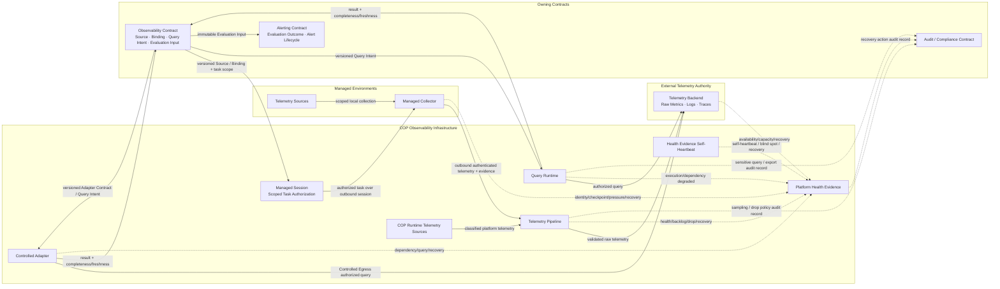

# COP 可观测技术栈

## Purpose

定义 COP 的 Observability infrastructure capability、Managed-Environment Observability 与 Platform Observability 数据路径、raw Telemetry authority、受控查询、过载与损失、security/lifecycle、failure/degradation 和 recovery evidence，使采集、存储、查询或自监控能力不会获得领域 authority，也不会把缺少 Telemetry 误判为系统健康。

本文保持 `draft`；在状态变为 `accepted` 前，不构成 `cop-platform` 的强制实现约束。

## Scope

- Collector/Adapter、Telemetry Pipeline、Telemetry Backend、Query Runtime 和 Platform Health Evidence 五类逻辑角色。
- Managed Collector outbound path、Controlled Egress Adapter path 与 Platform Telemetry path。
- Metrics、Logs、Traces 的验证、最小化、脱敏、规范化、过滤、路由、采样、缓冲、存储和查询边界。
- `at-least-once`、bounded buffer/retry、backpressure、duplicate、delay、out-of-order、drop、sampling、throttling 与 freshness degradation。
- Query Intent、query result、completeness、freshness 与 immutable Evaluation Input 边界。
- Tenant/Source/signal/pipeline/query isolation、classification、authorization、Secret/KMS Reference 和 export control。
- raw Telemetry 与 COP-owned metadata/reference/Evaluation Input 的 retention、deletion、legal hold 与 reconciliation。
- failure/degradation、Resume/Replay/Reconcile/Never infer 和三个 Evolution Profile。

## Non-goals

- 固定 Collector、Metrics、Logs、Traces、Backend、Query、Dashboard、Alerting 或其他产品。
- 固定 service、process、Deployment、namespace、node、cluster、region、replica 或 failure-domain 数量。
- 固定 protocol、port、endpoint、certificate、payload schema、attribute set、label、index、partition 或 storage schema。
- 固定 capacity、retention 数值、sampling ratio、queue size、batch size、timeout、retry 次数、RPO/RTO 或数值 SLO。
- 定义 Resource Identity、Telemetry Source、Signal Binding、Query Intent、Evaluation Input、Rule、Alert outcome 或 Alert lifecycle 的领域模型。
- 定义 Dashboard 内容、告警规则、查询语言、runbook、Helm values 或生产部署手册。
- 把 raw Telemetry、ordinary operational log、query result、cache、health signal 或 Dashboard 状态提升为领域事实、Audit Evidence 或业务完成状态。

## Context

`COP-ARCH-002` 定义 Experience、Control Plane、Data Plane、Platform Operations 和跨切面能力的逻辑责任。`COP-ARCH-003` 定义 Managed Connector/Collector、outbound authenticated session、scoped execution grant 和 fact reporting。`COP-ARCH-004` 与 `COP-API-002` 定义 Contract version、at-least-once、duplicate、out-of-order 和 replay 语义。

`COP-DOM-003` 拥有 Resource Identity 与 Resource Context；`COP-DOM-005` 拥有 Telemetry Source、Signal Binding、Query Intent、result completeness 和 Evaluation Input；`COP-DOM-006` 拥有 Rule、Evaluation outcome、Alert Instance 和 notification orchestration。Infrastructure 只拥有 Collector、pipeline、backend/query runtime 与 Platform Observability runtime。

`COP-INFRA-001` 定义 Telemetry Backend external authority、Managed Environment、Platform Operations、恢复分类和 Evolution Profiles。`COP-INFRA-002`、`COP-INFRA-003` 与 `COP-INFRA-005` 分别定义 Collector placement、raw Telemetry lifecycle、Controlled Egress、Managed Session 和 Telemetry/Bulk traffic。`COP-SEC-001` 与 `COP-SEC-003` 分别拥有 security control 和 Audit/Compliance 语义。

当前相关文档均为 `draft`，只用于设计一致性检查。Telemetry Backend 始终拥有 raw Metrics、Logs、Traces 及 query-engine internals 的 authority；由 COP operator 部署、物理共置或统一运维不会把 raw Telemetry authority 转移给 Observability、Alerting、Platform Operations 或其他 COP owner。

## Architecture or Model

### Responsibility and Authority Model

采用 `Capability + Data Path + Evidence Contract`。Observability Stack 同时服务 Managed-Environment Observability 与 Platform Observability，但不合并其 authority：

- **Managed-Environment Observability：** Observability Contract 拥有 Source、Binding、Query Intent、completeness 与 Evaluation Input。Managed Collector 只执行受授权采集；Adapter 只经 Controlled Egress 调用既有 Telemetry Backend。
- **Platform Observability：** Infrastructure 对 COP runtime 提供 health、dependency、processing、freshness、backlog、drop、error 与 recovery evidence。Platform Operations 可以观察和运维 capability，但不获得业务、Tenant、authorization、lifecycle、Alert 或 raw Telemetry authority。
- 两类来源可以共享物理 Collector、pipeline、Backend 或 Query capability，但 Source、Tenant、scope、signal type、time、version、classification、provenance、authorization 与 failure propagation 必须可独立验证。
- 物理共置、统一运维、共享 endpoint、network、service account、index 或 cache 不产生 authority、Tenant、permission、retention、classification 或 failure inheritance。
- “没有返回 Telemetry”不能解释为“没有异常”；必须区分 source silence、collection gap、pipeline drop、Backend unavailable、query partial、authorization denial 与真实零值结果。

### Capability Matrix

| Capability role | Responsibility | Must not own or infer | Recovery contract |
| --- | --- | --- | --- |
| Collector / Adapter | 验证 Source、identity、Tenant、scope 与 task authorization；采集、最小化、脱敏、batch、checkpoint，并报告 health/freshness | 不扩大 scope，不生成 Resource、Alert 或业务事实，不复制 credential | `Resume` 或 `Reconcile`；验证 checkpoint、gap、version、scope 与 source availability |
| Telemetry Pipeline | 规范化、过滤、路由、受治理采样、有界缓冲、retry/backpressure 和 provenance preservation | 不修正领域语义，不跨 Tenant 合并 authority，不静默 drop，不承诺 exactly-once | `Replay` 或 `Resume`；保留 stable identity、Tenant、time、version 与 drop/gap evidence |
| Telemetry Backend | 保存 raw Metrics、Logs、Traces，执行 owning Contract 的 retention/deletion/hold/export，并提供 external query capability | 不拥有 Query Intent、Resource、Alert、Audit 或业务完成语义 | `Reconcile`；恢复 association、freshness、query state，不以 COP cache 替代 raw authority |
| Query Runtime | 验证 Query Intent、Tenant、scope、time range 与 authorization；执行查询并返回 `as_of`、freshness、completeness 与 failure semantics | 不生成 Rule evaluation、Alert outcome、completed 或 authorization decision | `Reconcile`；验证 Backend、query version、coverage、freshness 与 result integrity |
| Platform Health Evidence | 暴露 component health、dependency、backlog、drop、blind spot、recovery 和自身可见性 | 不替代 Audit，不成为业务 authority，不因缺少 Telemetry 声称 healthy | `Never infer` 与最小 evidence continuity；主 pipeline 故障时仍说明不可见范围与恢复进度 |

五项均为逻辑责任角色，不表示五个固定产品、service、process、cluster 或 deployment unit。实现可以合并或拆分角色，但职责、identity、access、failure 与 evidence 必须可独立验证。

### Managed Collector Path

Managed Collector 位于受管环境，只主动建立 outbound authenticated session。它获取限时、限 Tenant、限 Source、限 signal/operation 的 scoped collection task，采集本地 Telemetry 并回报 checkpoint、progress、freshness、failure 与 recovery evidence。

- session identity 与 task authorization 独立验证；连接建立不表示当前任务被授权。
- Collector 不接受未受治理的 inbound control connection，不持有跨 Tenant credential，不修改 Source 或客户 workload lifecycle。
- source discovery 不能自动扩大 task scope；新 Source 需要重新授权或更新 owning Contract。
- disconnect、checkpoint gap、local buffer pressure 和 source unavailable 按 managed environment、connection、Source 与 Tenant 隔离。

### Controlled Adapter Path

对于已有 Telemetry Backend 或无需本地 Collector 的 Source，Adapter 经 Controlled Egress 执行受控 query、poll 或 stream。Adapter Contract 限定 external endpoint reference、identity、Tenant/account/source scope、allowed operation、time boundary、version 与 authorization context。

- network reachability、stored endpoint、cached result 或 successful authentication 不产生 query authorization。
- Adapter 不复制长期 credential，只使用受控 Secret/KMS Reference。
- external result completeness 中的 `Partial`、`Stale` 或 `Unavailable` 必须保留；execution/dependency health 的 `degraded` 单独报告，不能通过 cache 或历史结果伪装 `Complete` 或 current。

### Platform Telemetry Path

COP runtime 产生的 Metrics、Logs、Traces 进入相同逻辑 capability 模型，但使用独立 Source identity、classification、pipeline/query scope、access policy 与 failure evidence。Platform Telemetry 不得携带 ordinary business payload、credential、Secret 或未经授权的跨 Tenant 内容。

Platform Telemetry 可以与 Managed-Environment Telemetry 物理共用 capability，但必须能够分别授权、限流、查询、降级、恢复和审计。共享 pipeline 或 Backend 的可用状态不能代表每个 Source、Tenant 或 signal path 都健康。

### Transform and Provenance Boundary

Collector 与 Telemetry Pipeline 只允许执行：

- schema/Contract validation；
- timestamp、unit、name 或 encoding 的受治理规范化；
- classification-driven filtering、redaction 与 minimization；
- Tenant、Source、signal、time、version 与 provenance 的补全或验证；
- routing、batching、compression、bounded buffering 与 governed sampling；
- 明确、可审计且版本化的 enrichment reference。

转换不得生成或修改 Resource Identity、Resource Context、Rule、Alert outcome、Alert Instance 或业务 lifecycle；不得将未知 Source、Tenant、scope、time、version 或 provenance 静默映射到默认值；不得使用 last-write-wins 隐藏 version conflict、late data 或 incompatible schema；不得以 drop、sampling 或 normalization 改变 raw authority、classification、retention 或 legal hold。

### Delivery, Backpressure, and Loss Semantics

Telemetry pipeline 使用 `at-least-once` 和有界资源模型：

- batch、queue、buffer、retry、concurrency 与 resource consumption 必须有界。
- duplicate、delay、out-of-order、replay 与 late arrival 是正常可处理情况；不能假设 exactly-once 或全局顺序。
- overload 至少按 Tenant、Source、signal type、pipeline stage、Backend dependency 与 managed environment 隔离。
- Telemetry/Bulk traffic 不得阻塞 Command control path、Managed Session authorization 或最小 Platform Health Evidence。
- sampling、drop、throttling、queue eviction、version rejection、authorization denial 与 Backend rejection 都必须产生可关联 evidence。
- 数据损失、覆盖缺口或 freshness degradation 必须传播到 query completeness 与 Platform Health Evidence。

未确认的 delivery outcome 保持 `unknown`。connection success、buffer acceptance、pipeline acknowledgement、Backend connectivity 或 queue drain 都不等于端到端数据连续、查询完整或 recovery success。

### Telemetry Backend and Lifecycle Boundary

Telemetry Backend 保存 raw Metrics、Logs、Traces，并执行 owning external Contract 的 classification、retention、deletion、legal hold、encryption、export 与 recovery。COP 只管理自身的 Source、Binding、Query Job、reference、association、freshness、reconciliation state 与适用 Evaluation Input。

- raw Telemetry lifecycle 不因 COP operator 部署 Backend 而转移给 Observability Domain。
- COP 通过 reference、status、query 或 reconciliation 验证 external retention、deletion、hold 与 availability state，不直接推断。
- cache、projection、export、backup 或 query result 延续源 classification、Tenant、scope、retention 与 deletion Contract，不降低保护级别。
- Evaluation Input 是 Observability Contract 拥有的 immutable governed fact，具有独立 version、classification、retention 与 audit context；它不是 raw Telemetry 的完整副本。
- raw Telemetry unavailable、deleted、`Partial` 或 retention state unknown 时，对应 query 与 Evaluation Input generation 显式失败或降级。held 数据的可见性与授权由 owning Contract 决定，并传播 hold state 与 provenance；只有 hold policy 导致数据不可访问、无法证明结果 current/complete，或 hold state 未知时才失败或降级，可访问且授权成立的 held 数据不因 held 状态本身被判定为失败。

### Governed Query and Evaluation Input

Observability Contract 提交 versioned Query Intent；Query Runtime 只负责验证和执行。每次 query 至少绑定 identity、Tenant、Source/signal scope、purpose、time range、query/Contract version、authorization context 与 correlation context。

Query result 必须包含适用的 `as_of`、covered time range、Source、Tenant、scope、query version、freshness、observed lag、completeness、failure evidence、provenance 与 result integrity reference。result completeness 仅为 `Complete`、`Partial`、`Stale` 或 `Unavailable`，四种状态不得互相替代。`degraded` 只描述 query execution 或 dependency health，不形成第五种 completeness；execution degraded 时仍必须单独给出适用的四态 completeness。

只有 Observability Contract 可以基于受治理结果形成 immutable Evaluation Input。Alerting 只消费该输入并拥有后续 evaluation outcome 与 Alert lifecycle。Query Runtime、Backend、Collector、Dashboard 或 cache 都不能直接生成 Alert outcome、completed evidence 或业务事实。

### Platform Health Evidence

Platform Observability 提供独立于 ordinary business query 的最小 health/evidence path，但不要求完全独立产品或技术栈。该路径覆盖：

- Collector/Adapter identity、connection、checkpoint、source reachability 与 local pressure；
- pipeline throughput、queue/backlog、retry、drop、sampling、throttling、version rejection 与 dependency；
- Backend ingestion/query availability、capacity constrained、latency、retention/deletion operation 与 recovery state；
- Query Runtime authorization rejection、四态 result completeness、coverage、result integrity 与独立的 execution/dependency degraded health；
- evidence path 自身的 heartbeat、last-known-good、blind spot、unavailable scope 与 recovery progress。

主 pipeline 故障时，最小路径仍说明从何时开始不可见、影响哪些 Tenant/Source/signal/pipeline stage、已知 drop/gap、当前 recovery stage 及哪些结论无法判断。缺少 operational Telemetry 不得解释为 component healthy、无 backlog、无 drop 或业务正常。

ordinary operational Metrics、Logs、Traces 不自动成为 Audit Evidence。关键配置、授权、敏感 query、export、retention/deletion/hold、sampling policy 与 recovery action 按 Audit/Compliance Contract 产生结构化 audit record。

### Security and Isolation

- Source registration、Collector/Adapter workload identity、Tenant、scope、task/query authorization 与 purpose 独立验证；默认拒绝并遵循 least privilege。
- 所有 Telemetry 默认视为潜在敏感数据；classification、minimization、redaction 与 access policy 从 Source 传播到 pipeline、Backend、query result、cache、export 与 Evaluation Input。
- credential 与 Secret 只通过受控 Secret/KMS Reference 使用，不进入 ordinary Metric、Log、Trace、attribute、label、body、metadata、error、checkpoint 或 queue payload。
- 物理共置、共享 endpoint、service account、network、index、cache 或 Backend 不产生 permission、Tenant、Source 或 classification inheritance。
- 跨 Tenant 默认拒绝；无法确认 identity、Tenant、Source、scope、classification、authorization、version 或 provenance 时 fail closed。
- query、export、敏感字段访问、retention/deletion/hold、sampling policy、Collector enrollment 与 recovery action 保留 actor/source、target、Tenant、scope、time、version、result 与 correlation audit context。
- SaaS-ready Profile 可以增强 Tenant 级 pipeline、storage、query、key、quota、audit 与 failure-domain isolation，但不能重建或延后 MVP 的 Tenant semantics。

### Failure and Degradation Semantics

| Stage | Explicit states |
| --- | --- |
| Collect | connected、delayed、denied、checkpoint-gap、source-unavailable、isolated |
| Process | accepted、sampled、throttled、dropped、duplicate、version-rejected、backlogged |
| Store | committed、duplicate、capacity-constrained、retention-blocked、unavailable |
| Query | completeness: Complete、Partial、Stale、Unavailable；execution/dependency: healthy、degraded、authorization-denied |
| Health Evidence | current、blind-spot、degraded、unavailable、recovering |

任一 stage 无法确认时，不把下游 empty result 解释为“无异常”。状态按 Tenant、Source、signal、time range、pipeline stage 与 dependency 保留适用 scope。validation、authentication、authorization、scope mismatch 和 incompatible Contract 是 terminal failure；只有明确 retryable 的 dependency failure 执行有界 retry。

### Recovery Classification

- **Resume：** 从 checkpoint 继续 collection/transfer；验证 identity、Tenant、scope、version、time continuity、gap 与 duplicate。
- **Replay：** 从受保留 source/buffer 重放；保持 stable identity、Tenant、time、version 与 provenance，接收方幂等处理。
- **Reconcile：** External Source/Backend 恢复后重建 reference、association、freshness 与 query state；COP cache 不成为 raw authority。
- **Never infer：** 无法验证 coverage、gap、deletion、authorization、query completeness 或 health evidence 时保持 unknown、partial 或 unavailable。

Recovery success 必须验证 identity/Tenant、source/Contract version、checkpoint continuity、time coverage、drop/gap、Backend acceptance、query freshness/completeness、authorization、association consistency 与 Platform Health Evidence。进程重启、连接建立、队列清空、Backend 可读、单次 query 返回或 Dashboard 显示数据都不等于恢复成功。

### Evolution Profiles

| Evolution profile | Observability capability and isolation | Invariants and entry evidence |
| --- | --- | --- |
| MVP Self-hosted Baseline | 允许物理共享 Collector、pipeline、Backend 和 Query capability；具备逻辑 Tenant/Source/pipeline/query isolation、有界缓冲、显式 drop/freshness、checkpoint 与最小 health evidence | identity、Tenant、scope、classification、authorization、provenance、failure 与 audit 可验证；不固定产品或 topology |
| Resilient Self-hosted | 根据已观测风险拆分 failure domain，增强 pipeline/Backend redundancy、replay/reconciliation、capacity evidence、recovery drill 与长期 health evidence | 物理拆分不改变 Source/Query/Telemetry authority；以 overload、failure、recovery 与 compliance evidence 作为演进依据 |
| SaaS-ready Isolation | 增强 Tenant 级 identity、quota、pipeline、storage/query、key、audit、noisy-neighbor 与 failure-domain isolation | 延续 MVP 的 Tenant/security semantics；不引入跨 Tenant authority、共享高权限 credential、全局顺序或分布式事务 |

### Observability Relationship Map

箭头只表示受治理 Contract、authority-preserving Telemetry flow、evidence flow 或最小 audit record submission，不表示固定 deployment topology、共享可写存储、隐式 trust、跨 Tenant access 或分布式事务。Managed Session 节点只表达 outbound session identity 与 scoped task authorization 的逻辑边界；Platform Telemetry source、Collector、Adapter 与 self-heartbeat 的 evidence flow 只表达最小可判定 health path，不要求独立产品或固定部署。Audit/Compliance 只拥有审计策略与记录语义；Pipeline、Query Runtime 与 Health Evidence 只提交关键管理操作的结构化记录，不获得 audit authority。

### Validation Strategy

- **Authority：** 验证 raw Telemetry、Source/Binding/Query Intent/Evaluation Input、Alert outcome/lifecycle、Resource Identity 与 Audit semantics 的 owner 可独立识别。
- **Dual observability：** 验证 Managed-Environment 与 Platform Observability 可以共享 capability，但 Source、Tenant、pipeline/query scope、authorization 与 failure propagation 不混淆。
- **Collection：** 验证 Managed Collector outbound-only、Managed Session identity 与 scoped task authorization 分离、checkpoint、freshness，以及 Adapter 只接收 owning Observability Contract 的 versioned input 并经 Controlled Egress 查询。
- **Transform：** 验证只执行 validate、normalize、filter、redact、route、sample 并保留 provenance，不生成领域事实。
- **Delivery：** 注入 duplicate、delay、out-of-order、drop、sampling、throttling、backpressure 与 version mismatch，验证端到端 evidence。
- **Query：** 验证 Query Intent、authorization、time coverage、`as_of`、freshness、四态 completeness，以及 execution/dependency degraded 独立表达；Alerting 只消费 immutable Evaluation Input。
- **Health path：** 中断 Collector、Adapter、主 pipeline、Backend 或 Query，验证最小 evidence path 及 self-heartbeat 仍表达 blind spot、影响范围与 recovery progress。
- **Security：** 验证跨 Tenant/Source 默认拒绝、敏感字段最小化/脱敏、Secret 泄漏阻断、query/export/administration audit。
- **Lifecycle：** 验证 raw Telemetry 与 COP metadata/Evaluation Input 的 retention/deletion/hold authority 分离及 reconciliation，并验证 held 数据可见性由 owning Contract 决定且传播 hold state/provenance。
- **Recovery：** 验证 checkpoint resume、replay、gap detection、reconciliation、query completeness 与 health evidence continuity。
- **Profile：** 验证三个 Profile 只增强 isolation、redundancy、capacity、recovery 与 governance，不改变 authority。

### Success Criteria

- 读者可以判断五类 capability role 的职责、输入、输出、禁止行为、failure semantics 与 recovery Contract。
- Managed-Environment Observability 与 Platform Observability 使用一致能力模型，但不会共享 authority、Tenant、query permission 或故障结论。
- raw Telemetry 始终由 Telemetry Backend owning Contract 拥有；Observability 拥有 Query Intent/completeness/Evaluation Input，Alerting 拥有 outcome/lifecycle。
- Collector/Adapter、pipeline、Backend acknowledgement、query result、cache、Dashboard 或 health signal 不会被解释为业务事实、Alert outcome、Audit Evidence 或 completed。
- `at-least-once`、bounded buffer/retry、backpressure、duplicate/delay/out-of-order/drop/sampling/throttling 具有显式 evidence。
- empty、unknown 与 blind-spot 不会伪装为无异常；`Partial`、`Stale` 或 `Unavailable` 不会伪装为 `Complete`，execution/dependency degraded 也不会被误写为 completeness。
- 主 pipeline 故障时仍存在最小可判定的 Platform Health Evidence。
- classification、Tenant、scope、authorization、Secret、retention/deletion/hold 与 provenance 随数据路径传播。
- 三个 Evolution Profile 只增强 isolation 与 operational capability。
- 文档保持 `draft`，不创建 RFC/ADR，不固定产品、schema、protocol、topology、capacity、retention 数值、RPO/RTO 或数值 SLO。

## Constraints

- 只有 `accepted` 权威文档和 ADR 才能形成实现约束；本文在 `draft` 状态下只用于评审。
- Infrastructure capability 不获得 Resource、Observability、Alerting、Audit、Tenant、authorization、lifecycle 或 raw Telemetry authority。
- Managed 与 Platform Observability 可以物理共享 capability，但 identity、Tenant、Source、classification、authorization、pipeline/query scope、failure 与 evidence 必须可独立验证。
- Telemetry pipeline 使用 `at-least-once` 与有界资源，不假设 exactly-once、全局顺序、无损传输或分布式事务。
- unknown、empty、blind-spot 和 recovering 不得伪装为 healthy、current 或 success；result completeness 仅使用 `Complete`、`Partial`、`Stale`、`Unavailable`，execution/dependency degraded 必须独立表达。
- 不得在本文或实施任务中固定产品、service mapping、protocol、schema、topology count、capacity、retention、sampling 数值、RPO/RTO 或数值 SLO。

## Quality Attributes

- **Boundary clarity：** raw Telemetry、Source/Binding/Query/Evaluation Input、Alert outcome、Resource 与 Audit authority 可独立识别。
- **Security：** identity、Tenant、scope、classification、authorization、redaction、Secret Reference、audit 与 fail closed 沿数据路径传播。
- **Reliability：** bounded queue/retry、backpressure、drop evidence、Tenant/Source/stage isolation 与 dependency degradation 可判定。
- **Recoverability：** Resume、Replay、Reconcile、Never infer、checkpoint、gap、query completeness 与 health evidence continuity 可验证。
- **Observability：** health、dependency、processing、freshness、backlog、drop、blind spot、error 与 recovery state 可关联。
- **Scalability：** capability 可按 Tenant、Source、signal、pipeline stage 与 failure domain 演进，不依赖全局顺序或共享高权限 credential。
- **Portability：** capability 与 Contract 不绑定 Collector、Backend、Query、Dashboard、cloud provider 或 deployment topology。
- **Evolvability：** Profile 只增强 isolation、redundancy、capacity、recovery 与 governance，不重建 authority 或 Tenant semantics。

## Implementation Guidance

实现仓库只能在本文及其依赖约束变为 `accepted` 后将其作为实现依据。届时应先识别 Source owner、Tenant、signal type、classification、authorization、pipeline/query scope、delivery/loss、lifecycle、failure 与 recovery Contract，再选择 Collector、pipeline、Backend、Query 和 health evidence implementation。

实现不能根据 capability matrix 或关系图生成固定 service、Deployment、cluster、Backend、index 或 network topology，不能将 arrow 实现为共享可写存储或隐式 trust，也不能把 connection、queue acceptance、Backend availability、query result、Dashboard 或 missing Telemetry 解释为 authorization、business fact、Alert outcome、Audit Evidence、completed 或 healthy。

具体 protocol、schema、attribute、label、index、partition、capacity、retention、sampling、queue、batch、timeout、retry、RPO/RTO、replica、failure domain、product mapping 和 Dashboard 由 `cop-platform` 或后续经过治理的专项设计决定。需要改变 raw Telemetry authority、Managed/Platform boundary、Query/Evaluation Input boundary、security/lifecycle、recovery classification 或 Evolution Profile 不变量时，必须先创建或更新 RFC；RFC 被接受后关联 ADR，并同步所有受影响的权威文档。

## References

- [COP-ARCH-002](../architecture/logical-architecture.md)
- [COP-ARCH-003](../architecture/control-plane-data-plane.md)
- [COP-ARCH-004](../architecture/integration-architecture.md)
- [COP-API-002](../api/event-contracts.md)
- [COP-DOM-003](../domains/resource-metadata-domain.md)
- [COP-DOM-005](../domains/observability-domain.md)
- [COP-DOM-006](../domains/alerting-domain.md)
- [COP-INFRA-001](infrastructure-overview.md)
- [COP-INFRA-002](kubernetes-topology.md)
- [COP-INFRA-003](data-storage.md)
- [COP-INFRA-005](network-and-ingress.md)
- [COP-SEC-001](../security/security-architecture.md)
- [COP-SEC-003](../security/audit-and-compliance.md)
