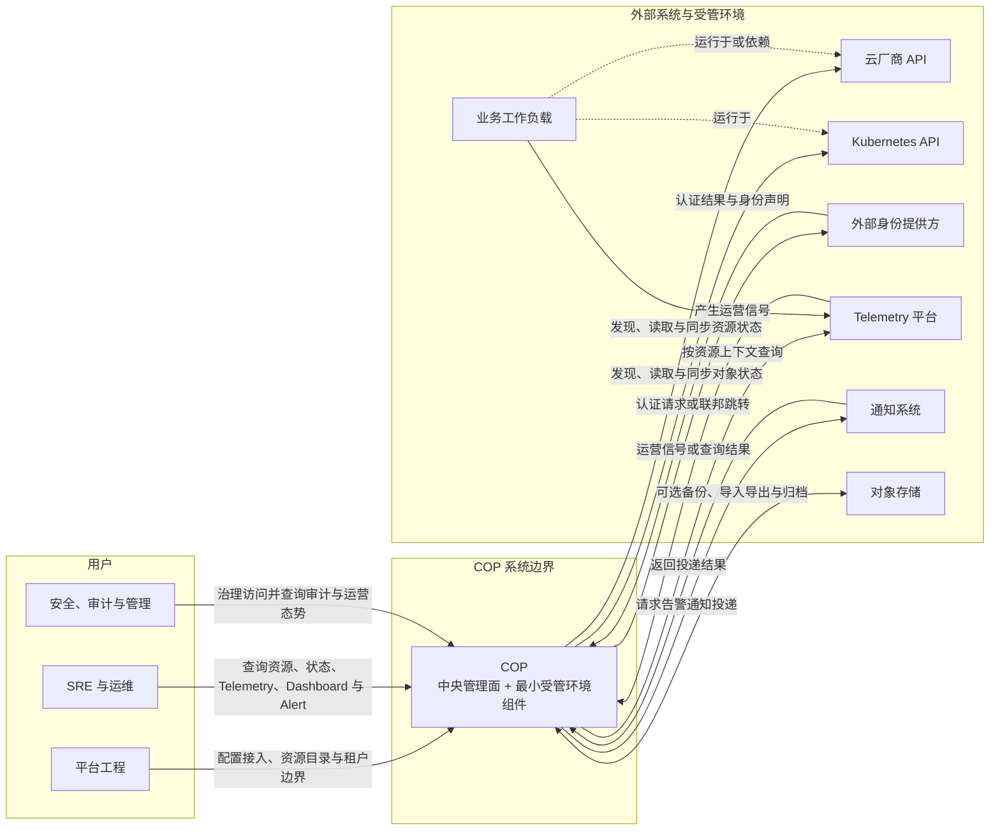

# COP 系统上下文内容实施计划

> **For agentic workers:** REQUIRED SUB-SKILL: Use superpowers:subagent-driven-development (recommended) or superpowers:executing-plans to implement this plan task-by-task. Steps use checkbox (`- [ ]`) syntax for tracking.

**Goal:** 在保持稳定 ID 和 `draft` 门禁的前提下，将 `COP-ARCH-001` 初始化骨架替换为已批准的系统边界、上下文图、用户角色、外部系统责任、权威数据归属以及信任、网络与失败边界。

**Architecture:** 继续使用权威文档的一级模板结构，在 `Architecture or Model` 下以一个 Mermaid 系统上下文图建立整体认识，再通过用户、交互、权威责任和边界表述消除图中歧义。COP 在图中保持为单一系统边界，内部只用文字说明其跨中央管理面与受管环境分布，不引入服务或部署拓扑。

**Tech Stack:** Markdown、YAML front matter、Mermaid `flowchart`、PowerShell 验证、Git。

---

### 任务 1：编写并验证 COP 系统上下文

**文件：**
- 修改：`docs/architecture/system-context.md`
- 测试：在 worktree 中运行 PowerShell 元数据、结构、Mermaid、链接和范围检查

- [ ] **步骤 1：运行失败的结构检查（RED）**

编辑前从 worktree 根目录运行：

```powershell
$ErrorActionPreference = 'Stop'
$path = 'docs/architecture/system-context.md'
$content = Get-Content -Raw -Encoding UTF8 $path
$required = @(
  'version: 0.2.0',
  '### System Boundary',
  '### System Context Diagram',
  '### User Roles',
  '### External Systems and Interactions',
  '### Authority and Data Ownership',
  '### Trust, Network, and Failure Boundaries',
  '### Success Criteria'
)
foreach ($value in $required) {
  if (-not $content.Contains($value)) { throw "Missing: $value" }
}
```

预期结果：以 `Missing: version: 0.2.0` 失败，证明初始化骨架不满足已批准设计。

- [ ] **步骤 2：用批准内容替换目标文档**

将 `docs/architecture/system-context.md` 完整替换为以下内容：

````markdown
---
id: COP-ARCH-001
title: COP System Context
status: draft
version: 0.2.0
owners:
  - architecture
last_updated: 2026-08-04
related:
  - COP-VIS-002
  - COP-ARCH-002
  - COP-DOM-001
rfc: []
adr: []
---

# COP 系统上下文

## Purpose

描述 COP、用户、受管环境、业务工作负载和外部平台之间的系统级关系、责任归属与关键边界。

## Scope

- COP 系统边界和用户角色
- 受管云、Kubernetes 集群与业务工作负载
- 身份、Telemetry、通知和对象存储集成
- 权威数据、信任、网络、数据传输与失败边界

## Non-goals

- COP 内部组件、服务或部署单元拆分
- 服务 API、事件字段、消息协议或数据库表
- 供应商产品、网络端口、容量参数或数值化 SLO
- 云资源和业务工作负载的创建、变更、删除或生命周期控制

## Context

本文承接 `COP-VIS-002` 的平台责任与部署边界，并遵循 `COP-PRI-001` 的安全、数据正确性、故障隔离和开放集成原则。COP 是资源与运营上下文的集成和协调层，不替代云厂商、Kubernetes、身份提供方、Telemetry 平台、通知系统、对象存储或业务应用平台。`COP-ARCH-002` 和 `COP-DOM-001` 分别负责内部逻辑架构与领域边界，本文不复制其设计。

## Architecture or Model

### System Boundary

COP 系统边界包含由使用组织自行部署和运营的中央管理面，以及部署在受管环境中的最小采集、连接和状态上报组件。两者共同构成一个 COP 系统；本文不展开其内部服务或部署单元。

平台工程、SRE 与运维、安全、审计与管理人员位于 COP 系统边界之外。云厂商、Kubernetes、外部身份提供方、Telemetry 平台、通知系统、对象存储和业务工作负载同样位于 COP 系统边界之外。云资源、Kubernetes 对象和业务工作负载的实际执行、最终状态与产品语义始终由外部平台负责。

### System Context Diagram



图中的 COP 节点表示完整系统边界，不表示单一进程。业务工作负载通过云、Kubernetes 与 Telemetry 关系进入运营上下文，COP 不直接托管或控制其生命周期。

### User Roles

| 用户角色 | 主要目标 | 与 COP 的系统级交互 |
| --- | --- | --- |
| 平台工程 | 建立并维护一致的平台接入和资源目录 | 配置云账号与集群接入，维护组织、租户、资源归属和连接状态 |
| SRE 与运维 | 查看状态、定位异常并核查运行结果 | 查询资源、关系、Telemetry、Dashboard 和 Alert，追踪影响范围与运营上下文 |
| 安全、审计与管理协作用户 | 治理访问并追溯平台行为 | 管理访问策略，查看授权上下文、审计记录和运营态势 |

这些角色是系统上下文中的责任分组，不规定组织结构，也不直接映射为 COP 内部组件。

### External Systems and Interactions

| 外部系统 | 与 COP 的关键交互 | COP 责任边界 | 外部权威职责 |
| --- | --- | --- | --- |
| 云厂商 API | 使用最小权限凭据发现、读取并持续同步资源元数据与状态 | 维护统一资源身份、目录、关系、来源和同步状态 | 保留云资源执行、最终状态、产品语义和基础设施实现 |
| Kubernetes API | 发现、读取并持续同步集群对象、关系与状态 | 建立跨集群资源上下文，不控制工作负载生命周期 | 保留对象执行、调度和工作负载最终状态 |
| 外部身份提供方 | 处理认证或联邦流程并提供身份声明 | 验证声明，维护组织/租户成员关系和角色映射，作出最终授权决策并审计 | 保留用户认证、身份生命周期和身份声明 |
| Telemetry 平台 | 接收 COP 查询，或向 COP 提供指标、日志、追踪等运营信号 | 维护接入配置、资源关联、查询上下文、同步状态和必要的派生状态 | 保留原始 Telemetry、查询执行、内部数据组织和容量管理 |
| 通知系统 | 接收告警通知投递请求并返回渠道结果 | 维护告警定义、资源关联、通知策略、目标引用、请求状态和审计 | 保留渠道适配、最终投递和渠道侧结果 |
| 对象存储 | 按需保存或读取备份、导入导出和归档对象 | 维护对象用途、引用、保留意图和业务生命周期 | 保留对象持久化、可用性和存储实现 |
| 业务工作负载 | 通过云、Kubernetes 和 Telemetry 暴露资源与运营信号 | 只维护资源和运营信号上下文 | 保留构建、发布、托管和运行时生命周期 |

### Authority and Data Ownership

| 领域 | COP 负责 | 外部系统保留的权威职责 |
| --- | --- | --- |
| 资源 | 稳定身份、统一模型、目录、关系和同步状态 | 云与 Kubernetes 资源的实际状态、执行和厂商语义 |
| 身份与访问 | 组织/租户成员关系、角色映射、授权决策和审计 | 用户认证、身份生命周期和身份声明 |
| Telemetry | 接入配置、资源关联、查询上下文和必要的派生状态 | 原始指标、日志、追踪数据及查询引擎内部实现 |
| Alert | 用户可见的告警定义、资源关联、状态和通知策略 | 外部 Telemetry 引擎的数据计算与执行语义 |
| 通知 | 投递请求、目标引用、策略上下文和审计 | 渠道适配、最终投递和渠道侧结果 |
| 对象存储 | 对象用途、引用、保留意图和业务生命周期 | 对象持久化、可用性和存储实现 |
| 业务工作负载 | 资源与运营信号上下文 | 构建、发布、托管和运行时生命周期 |

凭据只通过受控引用和明确的信任边界使用。具体 Secret 或 KMS 产品由后续安全与基础设施文档定义。对象存储是可选依赖，不作为 COP 核心事务数据或原始 Telemetry 的权威存储。

### Trust, Network, and Failure Boundaries

- 受管环境组件主动建立到中央管理面的加密出站连接，默认不要求从管理面入站访问受管环境。
- COP 访问不同外部平台时使用独立身份、最小权限和可审计的凭据引用；不得因网络位置而默认互信。
- 所有用户请求和外部交互携带明确的组织、租户与资源归属上下文，授权默认拒绝。
- 外部身份声明只有在完成验证、租户映射和角色映射后才能参与 COP 授权。
- 每个外部连接暴露来源、最近成功时间、新鲜度、错误状态和重试状态，不把陈旧数据呈现为实时事实。
- 同步、上报和投递重试具备幂等语义或等价的重复处理保护。
- 单个账号、集群或外部平台故障不得破坏其他连接或统一资源目录；未知、陈旧、降级和失败状态必须与成功状态可区分。
- 外部平台语义通过 Adapter 或等价稳定边界隔离，不得泄漏到统一资源身份和核心领域模型。
- 关键接入、授权、配置变更、同步和通知行为必须可观测、可追踪、可审计。

### Success Criteria

- 读者能够从上下文图识别 COP 系统边界、用户角色、外部系统和业务工作负载。
- 每项关键交互都能判断发起方、数据方向、COP 职责和外部权威职责。
- 云与 Kubernetes 的实际资源状态、原始 Telemetry、外部认证、最终通知投递和对象持久化均有明确权威来源。
- 管理面与受管环境之间无需默认入站访问，组织、租户、身份、凭据、网络和数据传输边界保持显式。
- 外部连接的来源、新鲜度、错误和重试状态可观察，单一依赖故障受到隔离。
- 新增云、集群或外部产品适配不改变统一资源身份和核心领域语义。

## Constraints

- 不得绕过 RFC/ADR 流程引入重大架构决策。
- 不得与相关 `accepted` 权威文档产生冲突。
- 当前范围内，COP 对云和 Kubernetes 只执行发现、读取与同步，不接管资源或工作负载生命周期。
- 受管环境组件默认通过加密出站连接接入中央管理面，不因网络位置建立隐式信任。
- 组织、租户、资源归属、身份、凭据和访问上下文必须显式，授权默认拒绝并遵循最小权限。
- 外部系统保留其执行、认证、原始数据、最终投递和持久化职责，COP 不得把派生上下文声明为新的外部权威来源。

## Quality Attributes

- **边界清晰性：** 用户、COP 和外部系统的职责、交互方向与权威来源可判定、可审查。
- **安全性：** 身份、租户、凭据、网络和数据传输边界显式，访问默认拒绝并可审计。
- **可靠性：** 外部依赖故障受隔离，可重试交互具备重复处理保护，陈旧与失败状态不会伪装成成功。
- **可运维性：** 外部连接的来源、健康、同步状态、新鲜度和错误可观察并可追踪。
- **兼容性：** 外部产品语义通过稳定适配边界隔离，统一资源模型不绑定单一供应商。
- **可演进性：** 自托管能够独立运行，同时保留多账号、多集群和未来组织与租户隔离能力。

## Implementation Guidance

在本文状态变为 `accepted` 前，Codex 只能使用本文理解设计范围，不得据此生成生产实现。

## References

- [COP-VIS-002](../vision/scope-and-non-goals.md)
- [COP-ARCH-002](logical-architecture.md)
- [COP-DOM-001](../domains/domain-landscape.md)
````

- [ ] **步骤 3：运行结构与语义检查（GREEN）**

从 worktree 根目录运行：

```powershell
$ErrorActionPreference = 'Stop'
$path = 'docs/architecture/system-context.md'
$current = (Get-Content -Raw -Encoding UTF8 $path) -replace "`r`n", "`n"

$frontMatter = [regex]::Match($current, '\A---\n.*?\n---\n', [Text.RegularExpressions.RegexOptions]::Singleline)
if (-not $frontMatter.Success) { throw 'Front matter not found' }
$expectedFrontMatter = @'
---
id: COP-ARCH-001
title: COP System Context
status: draft
version: 0.2.0
owners:
  - architecture
last_updated: 2026-08-04
related:
  - COP-VIS-002
  - COP-ARCH-002
  - COP-DOM-001
rfc: []
adr: []
---
'@
if ($frontMatter.Value.TrimEnd() -cne $expectedFrontMatter.TrimEnd()) { throw 'Front matter differs from approved metadata' }

$required = @(
  '### System Boundary',
  '### System Context Diagram',
  '### User Roles',
  '### External Systems and Interactions',
  '### Authority and Data Ownership',
  '### Trust, Network, and Failure Boundaries',
  '### Success Criteria',
  'flowchart LR',
  'COP 系统边界',
  '中央管理面 + 最小受管环境组件',
  '平台工程',
  'SRE 与运维',
  '安全、审计与管理',
  '云厂商 API',
  'Kubernetes API',
  '外部身份提供方',
  'Telemetry 平台',
  '通知系统',
  '对象存储',
  '业务工作负载',
  '加密出站连接',
  '授权默认拒绝',
  '最近成功时间',
  '幂等语义',
  'Adapter',
  '可选依赖',
  '不作为 COP 核心事务数据或原始 Telemetry 的权威存储'
)
foreach ($value in $required) {
  if (-not $current.Contains($value)) { throw "Missing: $value" }
}

$forbidden = @(('TB' + 'D'), ('TO' + 'DO'), ('lorem' + ' ipsum'))
foreach ($value in $forbidden) {
  if ($current.Contains($value)) { throw "Forbidden filler: $value" }
}

$mermaid = [regex]::Matches($current, '(?ms)^```mermaid\n(.*?)^```$')
if ($mermaid.Count -ne 1) { throw "Expected one Mermaid block, found $($mermaid.Count)" }
if ([regex]::Matches($mermaid[0].Groups[1].Value, 'subgraph COPBoundary').Count -ne 1) { throw 'COP boundary is not singular' }

$file = Get-Item $path
$links = [regex]::Matches($current, '\[[^\]]+\]\(([^)#]+\.md)(?:#[^)]+)?\)')
if ($links.Count -ne 3) { throw "Expected 3 links, found $($links.Count)" }
foreach ($link in $links) {
  $resolved = Join-Path $file.DirectoryName $link.Groups[1].Value
  if (-not (Test-Path -LiteralPath $resolved)) { throw "Broken link: $($link.Groups[1].Value)" }
}

$changed = @(git diff --name-only)
if ($changed.Count -ne 1 -or $changed[0] -ne $path) { throw "Unexpected file scope: $($changed -join ', ')" }

'PASS: system context structure and semantics'
```

预期输出：`PASS: system context structure and semantics`。

- [ ] **步骤 4：审查 Mermaid 关系和系统边界**

逐条检查图中关系并要求以下结果：

- COP 只出现为 `COPBoundary` 内的一个节点，图中没有 Portal、API、服务、数据库或部署产品。
- 三组用户只向 COP 发起交互。
- COP 对云和 Kubernetes 的关系只包含发现、读取和同步。
- 身份与 Telemetry 关系是双向的，并分别表达请求与结果。
- 通知关系区分投递请求与投递结果。
- 对象存储关系明确为可选备份、导入导出与归档。
- 业务工作负载只连接云、Kubernetes 和 Telemetry，不与 COP 建立生命周期控制关系。

若任一项不成立，先修正文档，再重新执行步骤 3。

- [ ] **步骤 5：验证格式和改动范围**

运行：

```powershell
git diff --check
if ($LASTEXITCODE -ne 0) { throw 'git diff --check failed' }

$changed = @(git diff --name-only)
if ($changed.Count -ne 1 -or $changed[0] -ne 'docs/architecture/system-context.md') {
  throw "Unexpected file scope: $($changed -join ', ')"
}

git diff -- docs/architecture/system-context.md
```

预期结果：`git diff --check` 成功，差异只包含 `docs/architecture/system-context.md`，且状态仍为 `draft`，未出现内部服务拆分、供应商产品、具体协议、端口、容量参数或数值化 SLO。

- [ ] **步骤 6：提交文档更新**

```powershell
git add docs/architecture/system-context.md
git commit -m "docs: define system context"
```

- [ ] **步骤 7：验证提交结果**

运行：

```powershell
$files = @(git diff-tree --no-commit-id --name-only -r HEAD)
if ($files.Count -ne 1 -or $files[0] -ne 'docs/architecture/system-context.md') {
  throw "Unexpected committed files: $($files -join ', ')"
}
if (git status --porcelain) { throw 'Worktree is not clean' }
'PASS: system context commit'
```

预期输出：`PASS: system context commit`。
