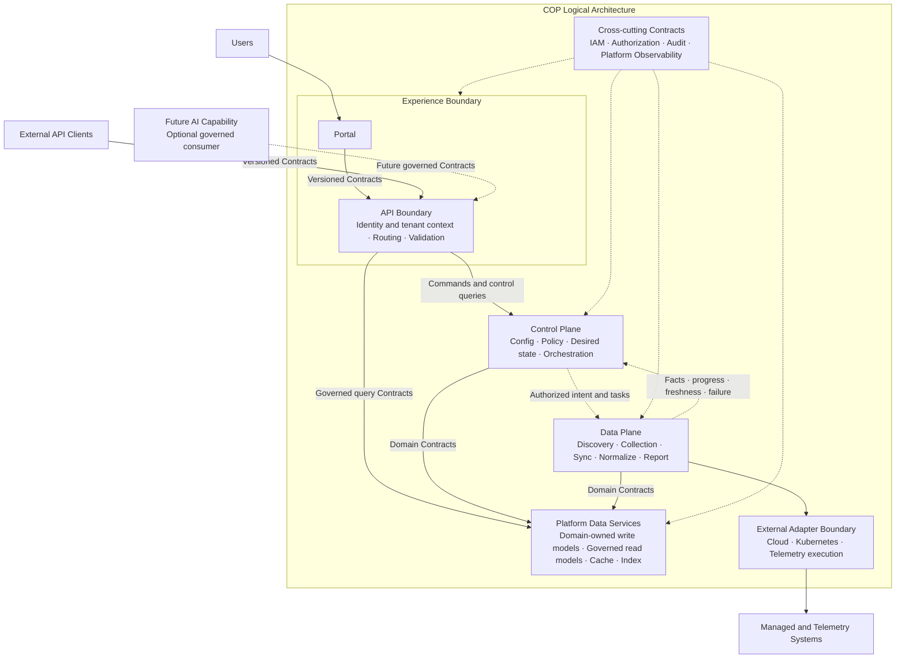

# COP 逻辑架构内容实施计划

> **For agentic workers:** REQUIRED SUB-SKILL: Use superpowers:subagent-driven-development (recommended) or superpowers:executing-plans to implement this plan task-by-task. Steps use checkbox (`- [ ]`) syntax for tracking.

**Goal:** 在保持 `COP-ARCH-002` 稳定 ID 与 `draft` 门禁的前提下，补充责任平面、逻辑依赖、数据所有权、跨切面治理和失败语义。

**Architecture:** 用责任平面替代线性六层表达：Experience Boundary、Control Plane、Data Plane 和 Platform Data Services 通过版本化 Contract 交互；IAM、Audit 和 Platform Observability 横切各平面；Future AI Capability 仅作为受治理的可选消费者。Mermaid 图只表达逻辑责任，不表达微服务、数据库或物理部署。

**Tech Stack:** Markdown、YAML front matter、Mermaid `flowchart`、PowerShell 验证、Git。

---

### Task 1: Write and Verify COP Logical Architecture

**Files:**
- Modify: `docs/architecture/logical-architecture.md`
- Test: PowerShell front matter、章节、Mermaid、链接、UTF-8 和改动范围检查

- [ ] **Step 1: Run the failing structural check (RED)**

From the worktree root, before editing, run:

```powershell
$ErrorActionPreference = 'Stop'
$path = 'docs/architecture/logical-architecture.md'
$content = Get-Content -Raw -Encoding UTF8 $path
$required = @(
  'version: 0.2.0',
  '### Responsibility Model',
  '### Logical Architecture Diagram',
  '### Plane Responsibilities',
  '### Cross-plane Interactions',
  '### Data Ownership and Storage Access',
  '### Cross-cutting Governance',
  '### Failure and Degradation',
  '### Success Criteria'
)
foreach ($value in $required) {
  if (-not $content.Contains($value)) { throw "Missing: $value" }
}
```

Expected result: `Missing: version: 0.2.0`, proving the initialization skeleton does not yet satisfy the approved design.

- [ ] **Step 2: Replace the target document with the approved content**

Replace `docs/architecture/logical-architecture.md` with this complete content. Keep the four existing reference links exactly as shown.

````markdown
---
id: COP-ARCH-002
title: COP Logical Architecture
status: draft
version: 0.2.0
owners:
  - architecture
last_updated: 2026-08-05
related:
  - COP-ARCH-001
  - COP-ARCH-003
  - COP-DOM-001
  - COP-INFRA-001
rfc: []
adr: []
---

# COP 逻辑架构

## Purpose

描述 COP 的逻辑责任平面、跨平面 Contract、数据所有权、跨切面治理以及同步和异步交互的失败边界。

## Scope

- Experience Boundary、Control Plane、Data Plane 和 Platform Data Services
- 逻辑责任、依赖方向和跨平面交互
- 领域写模型、受治理读模型、缓存、索引和外部数据权威
- IAM、Authorization、Audit、Platform Observability 和 Future AI Capability 边界

## Non-goals

- 物理集群参数、部署拓扑和供应商安装步骤
- 微服务数量、进程模型、代码包结构和数据库拆分
- 具体 API shape、event fields、message broker、protocol、port、timeout 或 numerical SLO
- 云资源和业务工作负载的创建、变更、删除或 lifecycle 控制

## Context

本文承接 `COP-ARCH-001` 的系统级边界，并遵循 `COP-PRI-001` 的 Contract-first、领域所有权、默认拒绝、可观测和可恢复原则。COP 的逻辑架构采用责任平面模型，不把 Portal、API、Control Plane、Data Plane、Storage 和 AI 组织成必须逐层穿透的线性调用链。`COP-ARCH-003` 负责 Control Plane、Data Plane 和受管环境组件的详细信任、传输与运行边界；`COP-DOM-001` 负责 bounded contexts 和领域关系；`COP-INFRA-001` 负责物理基础设施边界。

## Architecture or Model

### Responsibility Model

逻辑平面表达职责和依赖，不表达服务数量、进程、代码包、数据库或部署单元。Portal、外部客户端和未来 AI 都通过受治理 Contract 进入 COP；领域写模型由领域 owner 管理；跨切面能力通过稳定 Contract 贯穿各平面。

### Logical Architecture Diagram



图中节点表示逻辑责任，不是服务或进程。实线表示同步 Contract 或逻辑依赖，虚线表示异步意图、事实传播或跨切面约束。External Adapter Boundary 只强调 Data Plane 执行 discovery、collection 和 synchronization 时使用的云、Kubernetes 与 Telemetry 适配边界。External identity provider、notification system 和 object storage 不被强制路由到 Data Plane；它们分别通过 IAM、Alert/Notification 或 Platform Data Services 的 owning Contract 接入，完整外部系统关系由 `COP-ARCH-001` 定义。

### Plane Responsibilities

#### Experience Boundary

- Portal 负责用户交互、视图和导航，不实现领域业务规则。
- API Boundary 面向 Portal 和外部客户端提供同一组版本化 Contract。
- API Boundary 负责 identity context、tenant context、routing、协议适配和输入校验。
- API Boundary 不直接访问领域私有存储；Portal 不绕过 API Boundary 直接调用内部逻辑单元。

#### Control Plane

- 负责云账号、Kubernetes 集群及外部平台的接入配置和 credential reference。
- 负责 policy、desired state、同步任务意图、任务编排和任务 lifecycle 协调。
- 在已验证身份、租户和授权上下文中接受或拒绝命令。
- 向 Data Plane 下发已授权意图，不把 tenant policy 或最终 authorization decision 交给 Data Plane 自主决定。
- 不处理大规模 raw Telemetry，不控制云资源或业务工作负载 lifecycle。

#### Data Plane

- 执行已授权的 discovery、collection、synchronization、normalization 和 status reporting 任务。
- 通过 Adapter 或等价 stable boundary 隔离云、Kubernetes、Telemetry 等执行相关的外部产品语义。
- 处理 backpressure、retry、checkpoint、duplicate protection 和局部 failure isolation。
- 向 Control Plane 上报事实、进度、freshness、错误和恢复状态。
- 不定义 tenant policy、最终 authorization decision 或任务意图，不扩大已授权的采集范围。

#### Platform Data Services

- 承载 domain-owned write models、governed read models、cache、index 和 object reference。
- 每个领域通过自身 Contract 管理写模型和不变量；其他平面不得直接写入其存储。
- 读模型必须声明 owner、source Contract、构建或更新方式、freshness 和 failure semantics。
- Cache、index 和复制数据不能成为未声明的新权威来源。
- Raw Telemetry 和外部 object storage 继续保持外部权威，COP 只维护接入、关联、引用和必要派生上下文。

#### Cross-cutting Contracts

- IAM context、authorization decision、Audit 和 Platform Observability 通过稳定 Contract 贯穿各平面。
- 跨切面能力不得成为各平面直接写入的共享数据库，也不得绕过领域所有权。
- 内部网络位置不构成信任；每个请求、命令、任务和查询都携带明确的组织、租户、主体、资源与授权上下文。
- 关键接入、配置、策略、授权、任务意图、执行结果和通知行为必须可审计。
- 所有可运行单元暴露 health 和 dependency signals；承担处理、同步或复制职责的单元额外暴露 progress、freshness、backlog、error 和 recovery signals。

#### Future AI Capability

- AI 是可选未来能力消费者，不是 MVP 核心层，也不进入关键请求路径。
- AI 通过与 Portal 和外部客户端相同的受治理、版本化 Contract 获取数据。
- AI 交互携带 tenant、authorization、audit、source 和 freshness context。
- AI 不直接访问领域私有存储、credential 或未经治理的 raw data。
- AI 的详细能力、数据处理和运行边界必须经过路线图、RFC/ADR 及相应权威文档评审。

### Cross-plane Interactions

#### Dependency Rules

- 跨平面交互 Contract-first，先定义语义、所有权、兼容性和失败行为，再选择通信技术。
- 依赖保持单向，禁止形成循环同步依赖。
- 禁止跨平面直接写存储；查询也不得绕过 Contract 读取其他领域私有存储。
- Experience Boundary 可以通过受治理 Query Contract 使用读模型，但不能把 Platform Data Services 当作通用共享数据库。
- Control Plane 定义意图；Data Plane 执行意图并上报事实。事实回传不能隐式改变 policy 或 desired state。

#### Command Path

Portal 或外部客户端通过 API Boundary 提交命令。API Boundary 验证 identity、tenant、resource 和 authorization context，再将命令交给拥有相应写模型的 Control Plane 或 domain Contract。短命令可以同步返回 accepted、rejected、timeout、dependency failure 或 partial result；API Boundary 不实现领域规则。

#### Long-running Task Path

Discovery、synchronization 和状态传播采用异步 Contract。Control Plane 持久化已授权意图和任务 lifecycle，再向 Data Plane 下发任务。Data Plane 通过 Adapter 执行，并回传 facts、progress、freshness、failure 和 recovery state。任务可重试处理必须幂等或具有等价 duplicate protection。

#### Query Path

Portal 和外部客户端通过版本化 Query Contract 使用受治理读模型。查询不需要穿过 Data Plane；读模型必须暴露 source、owner、freshness 和 failure semantics。需要外部实时查询时，也必须通过拥有该集成责任的 Contract，不得直接访问 Adapter 或外部 credential。

### Data Ownership and Storage Access

| 数据类别 | 权威责任 | 访问约束 |
| --- | --- | --- |
| Connection config、policy、desired state | 对应 COP domain owner | 只通过 owner Contract 写入；其他平面不能直接写存储 |
| Resource identity、catalog、relationships | Resource/Metadata domain owner | Data Plane 通过 Contract 提交 observations，不直接修改私有表 |
| Task intent、progress、failure、recovery | 拥有任务 lifecycle 的 Control Plane responsibility | Data Plane 上报 facts；不能把执行事实静默覆盖为新的意图 |
| Governed read models | 已声明的 read-model owner | 声明 source Contract、update method、freshness 和 failure semantics |
| Cache、index、replica | 对应 source owner | 只作派生加速，不成为新权威来源 |
| Raw Telemetry、external object data | External system | COP 维护查询上下文、关联或引用，不声明为自身权威数据 |

本文不把 logical ownership 映射到数据库数量、schema、消息系统或部署产品。

### Cross-cutting Governance

- 每个用户请求、命令、任务和查询携带组织、租户、主体、资源与授权上下文；授权默认拒绝并遵循最小权限。
- External identity claim 必须先验证并映射 tenant/role，之后才能作出授权决定。
- Credentials 只以 controlled reference 使用；敏感值不得进入普通领域数据、任务载荷或日志。
- 接入、配置、策略、授权、任务意图、执行结果和通知行为记录主体、目标、时间与结果。
- 所有可运行单元暴露 health 和 dependency signals；承担处理、同步或复制职责的单元额外暴露 progress、freshness、backlog、error 和 recovery signals。
- Cross-cutting Contract 不得成为各平面直接写入的共享数据库，也不得绕过领域所有权。

### Failure and Degradation

- 同步 Contract 明确区分 rejection、timeout、dependency failure、partial result 和 unknown outcome。
- 异步任务暴露 lifecycle、retry、idempotency or duplicate protection、checkpoint、cancellation 和 resynchronization path。
- Duplicate、delay 和 out-of-order delivery 不得破坏领域不变量。
- 单个账号、集群、Adapter 或外部依赖故障不得阻断其他连接，也不得阻断不依赖该故障源的配置和查询能力。
- Backpressure 必须限制在可识别边界内，不能通过无界队列或同步等待扩散到 Experience Boundary。
- Stale、unknown、degraded 和 failed state 必须携带 source 与 freshness，不能呈现为 real-time success。
- 恢复后必须能够重新同步或重新构建受影响读模型，并验证恢复结果。

### Success Criteria

- 读者能够从一张图识别 Experience Boundary、Control Plane、Data Plane、Platform Data Services、跨切面 Contract、External Adapter Boundary 和 Future AI Capability。
- Portal 和外部客户端使用同一版本化 Contract；Portal 不直接调用内部逻辑单元或访问存储。
- Control Plane 定义已授权意图，Data Plane 执行并上报事实；两者没有循环同步依赖。
- Query Contract 可以使用受治理读模型，不需要穿过 Data Plane，也不绕过领域所有权。
- 每个写模型、读模型、cache、index 和外部数据都有明确 owner、source 和 authority semantics。
- IAM、authorization、Audit 和 Platform Observability 贯穿各平面，但不形成共享可写存储。
- 同步和异步交互的 failure、retry、idempotency、isolation、degradation 和 recovery semantics 可判定。
- Future AI Capability 不进入 MVP 关键路径，也不能绕过 Contract、tenant、authorization、audit、source 或 freshness boundary。

## Constraints

- 不得绕过 RFC/ADR 流程引入重大架构决策。
- 不得与相关 `accepted` 权威文档产生冲突。
- 跨平面交互必须 Contract-first、依赖单向，禁止循环同步依赖和跨平面直接写存储。
- 领域写模型由领域 owner 维护，受治理读模型必须声明 owner、source、freshness 和 failure semantics。
- 内部网络位置不构成信任；identity、tenant、credential、authorization 和 audit context 必须显式。
- 外部产品语义通过 Adapter 或 owning Contract 隔离，不能泄漏到核心领域模型。
- Future AI Capability 不属于 MVP 关键路径，详细能力必须先经过路线图、RFC/ADR 和权威文档评审。

## Quality Attributes

- **边界清晰性：** 每个逻辑平面的职责、Contract、依赖和数据权威可判定、可审查。
- **安全性：** identity、tenant、credential、authorization、audit 和 no implicit trust 边界显式。
- **可靠性：** 同步和异步失败可区分，可重试处理具备幂等或重复保护，局部故障受隔离。
- **可运维性：** health、dependency、progress、freshness、backlog、error 和 recovery 信号可追踪。
- **兼容性：** 外部产品通过 Adapter 或 owning Contract 接入，核心模型不绑定单一供应商。
- **可演进性：** 责任平面可独立演进，Future AI 不改变核心资源和领域所有权模型。

## Implementation Guidance

在本文状态变为 `accepted` 前，Codex 只能使用本文理解设计范围，不得据此生成生产实现。

## References

- [COP-ARCH-001](system-context.md)
- [COP-ARCH-003](control-plane-data-plane.md)
- [COP-DOM-001](../domains/domain-landscape.md)
- [COP-INFRA-001](../infrastructure/infrastructure-overview.md)
````

- [ ] **Step 3: Run the structural and semantic checks (GREEN)**

From the worktree root, run:

```powershell
$ErrorActionPreference = 'Stop'
$path = 'docs/architecture/logical-architecture.md'
$bytes = [IO.File]::ReadAllBytes((Resolve-Path $path))
$content = [Text.UTF8Encoding]::new($false, $true).GetString($bytes) -replace "`r`n", "`n"
if ($bytes.Length -ge 3 -and $bytes[0] -eq 0xEF -and $bytes[1] -eq 0xBB -and $bytes[2] -eq 0xBF) { throw 'UTF-8 BOM found' }
if ($content.Contains([char]0) -or $content.Contains([char]0xFFFD)) { throw 'Invalid text character found' }

$expectedFrontMatter = @'
---
id: COP-ARCH-002
title: COP Logical Architecture
status: draft
version: 0.2.0
owners:
  - architecture
last_updated: 2026-08-05
related:
  - COP-ARCH-001
  - COP-ARCH-003
  - COP-DOM-001
  - COP-INFRA-001
rfc: []
adr: []
---
'@
$frontMatter = [regex]::Match($content, '\A---\n.*?\n---\n', [Text.RegularExpressions.RegexOptions]::Singleline)
if (-not $frontMatter.Success -or $frontMatter.Value.TrimEnd() -cne $expectedFrontMatter.TrimEnd()) { throw 'Front matter mismatch' }

$h2Expected = @('Purpose','Scope','Non-goals','Context','Architecture or Model','Constraints','Quality Attributes','Implementation Guidance','References')
$h2Actual = @([regex]::Matches($content, '(?m)^## (.+)$') | ForEach-Object { $_.Groups[1].Value })
if (($h2Actual -join '|') -cne ($h2Expected -join '|')) { throw "H2 order mismatch: $($h2Actual -join ', ')" }
$h3Expected = @('Responsibility Model','Logical Architecture Diagram','Plane Responsibilities','Cross-plane Interactions','Data Ownership and Storage Access','Cross-cutting Governance','Failure and Degradation','Success Criteria')
$h3Actual = @([regex]::Matches($content, '(?m)^### (.+)$') | ForEach-Object { $_.Groups[1].Value })
if (($h3Actual -join '|') -cne ($h3Expected -join '|')) { throw "H3 order mismatch: $($h3Actual -join ', ')" }

$required = @(
  'flowchart TB','Experience Boundary','Control Plane','Data Plane','Platform Data Services','Cross-cutting Contracts','External Adapter Boundary','Future AI Capability',
  'Versioned Contracts','Governed query Contracts','Authorized intent and tasks','Facts · progress · freshness · failure',
  '禁止形成循环同步依赖','禁止跨平面直接写存储','owner、source Contract、freshness 和 failure semantics',
  'default deny','idempotency','backpressure','failure isolation','checkpoint','resynchronization path',
  'External identity provider、notification system 和 object storage 不被强制路由到 Data Plane',
  '不进入 MVP 关键路径','仅通过 owner Contract 写入','COP-ARCH-001','COP-ARCH-003','COP-DOM-001','COP-INFRA-001'
)
foreach ($value in $required) { if (-not $content.Contains($value)) { throw "Missing requirement: $value" } }

$tableRows = $content -split "`n" | Where-Object { $_ -match '^\|' }
foreach ($row in $tableRows) {
  if (([regex]::Matches($row, '\|')).Count -ne 4) { throw "Table column mismatch: $row" }
}

$mermaid = [regex]::Matches($content, '(?ms)^```mermaid\n(.*?)^```$')
if ($mermaid.Count -ne 1) { throw "Expected one Mermaid block, found $($mermaid.Count)" }
$diagram = $mermaid[0].Groups[1].Value
foreach ($value in @('PORTAL -->|"Versioned Contracts"| API','CLIENTS -->|"Versioned Contracts"| API','AI -.->|"Future governed Contracts"| API','CONTROL -.->|"Authorized intent and tasks"| DATA','DATA -.->|"Facts · progress · freshness · failure"| CONTROL')) {
  if (-not $diagram.Contains($value)) { throw "Missing diagram relation: $value" }
}
if ([regex]::Matches($diagram, 'subgraph COP').Count -ne 1) { throw 'COP subgraph count mismatch' }
if ([regex]::Matches($diagram, 'CONTROL -.->\|"Authorized intent and tasks"\| DATA').Count -ne 1) { throw 'Missing intent relation' }
if ([regex]::Matches($diagram, 'DATA -.->\|"Facts · progress · freshness · failure"\| CONTROL').Count -ne 1) { throw 'Missing facts relation' }

$forbidden = @(('TB' + 'D'), ('TO' + 'DO'), ('lorem' + ' ipsum'))
foreach ($value in $forbidden) { if ($content.Contains($value)) { throw "Forbidden filler: $value" } }

$file = Get-Item $path
$links = [regex]::Matches($content, '\[[^\]]+\]\(([^)#]+\.md)(?:#[^)]+)?\)')
if ($links.Count -ne 4) { throw "Expected 4 links, found $($links.Count)" }
foreach ($link in $links) {
  if (-not (Test-Path -LiteralPath (Join-Path $file.DirectoryName $link.Groups[1].Value))) { throw "Broken link: $($link.Groups[1].Value)" }
}

git diff --check
if ($LASTEXITCODE -ne 0) { throw 'git diff --check failed' }
$changed = @(git diff --name-only)
if ($changed.Count -ne 1 -or $changed[0] -ne $path) { throw "Unexpected file scope: $($changed -join ', ')" }
'PASS: logical architecture structure and semantics'
```

Expected output: `PASS: logical architecture structure and semantics`.

- [ ] **Step 4: Verify the diagram and responsibility boundaries manually**

Inspect the rendered or source diagram and require all of the following:

- The COP subgraph contains only logical responsibility nodes, not Portal/API services, databases, process names, or deployment products.
- Users, external API clients, and Future AI Capability all enter through the Experience Boundary Contract.
- Control Plane is the only source of authorized intent and desired state; Data Plane returns facts and progress.
- Query access reaches governed read models through a Contract and never implies a direct private-storage read.
- The External Adapter Boundary is described as execution-related Cloud/Kubernetes/Telemetry integration; identity, notification, and object storage use owning Contracts instead of being forced through Data Plane.
- Cross-cutting IAM, Authorization, Audit, and Platform Observability are constraints/contracts, not a shared writable store.

If any item fails, correct the target document and rerun Step 3 before continuing.

- [ ] **Step 5: Run the repository link and scope checks**

```powershell
$ErrorActionPreference = 'Stop'
$markdown = @(Get-Item README.md,CONTRIBUTING.md,AGENTS.md) + @(Get-ChildItem docs,adr,rfc,templates -Recurse -File -Filter '*.md' | Where-Object { $_.FullName -notmatch '[\\/]docs[\\/]superpowers[\\/]' })
foreach ($file in $markdown) {
  $content = Get-Content -Raw -Encoding UTF8 $file.FullName
  foreach ($link in [regex]::Matches($content, '\[[^\]]+\]\(([^)#]+\.md)(?:#[^)]+)?\)')) {
    if (-not (Test-Path -LiteralPath (Join-Path $file.DirectoryName $link.Groups[1].Value))) { throw "Broken link in $($file.FullName): $($link.Groups[1].Value)" }
  }
}
git diff --check
if ($LASTEXITCODE -ne 0) { throw 'git diff --check failed' }
$changed = @(git diff --name-only)
if ($changed.Count -ne 1 -or $changed[0] -ne 'docs/architecture/logical-architecture.md') { throw "Unexpected file scope: $($changed -join ', ')" }
'PASS: repository links and scope'
```

Expected output: `PASS: repository links and scope`.

- [ ] **Step 6: Commit the logical architecture document**

```powershell
git add docs/architecture/logical-architecture.md
git commit -m "docs: define logical architecture"
```

- [ ] **Step 7: Verify the commit contains only the target document**

```powershell
$files = @(git diff-tree --no-commit-id --name-only -r HEAD)
if ($files.Count -ne 1 -or $files[0] -ne 'docs/architecture/logical-architecture.md') { throw "Unexpected committed files: $($files -join ', ')" }
if (git status --porcelain) { throw 'Worktree is not clean' }
'PASS: logical architecture commit'
```

Expected output: `PASS: logical architecture commit`.
