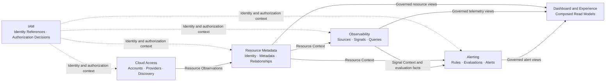

# COP 领域全景内容实施计划

> **For agentic workers:** REQUIRED SUB-SKILL: Use superpowers:subagent-driven-development (recommended) or superpowers:executing-plans to implement this plan task-by-task. Steps use checkbox (`- [ ]`) syntax for tracking.

**Goal:** 在保持 `COP-DOM-001` 稳定 ID 与 `draft` 门禁的前提下，定义 COP 的子域分类、bounded contexts、事实所有权、上下游关系、跨域 Contract、一致性和故障隔离边界。

**Architecture:** 采用按业务能力对齐的五个 bounded contexts：Resource Metadata、Observability 和 Alerting 是核心子域，Cloud Access 是支撑子域，IAM 是通用子域。Dashboard 只组合受治理读模型；领域事实沿单向上下游关系传播，每个 owner 独立维护写模型、不变量和 Contract。

**Tech Stack:** Markdown、YAML front matter、Mermaid `flowchart`、PowerShell 验证、Git。

---

### Task 1: Write and Verify COP Domain Landscape

**Files:**
- Modify: `docs/domains/domain-landscape.md`
- Test: PowerShell front matter、章节、Mermaid、领域分类、所有权、Contract、故障语义、链接、UTF-8 和改动范围检查

- [ ] **Step 1: Run the failing structural check (RED)**

From the worktree root, before editing, run:

```powershell
$ErrorActionPreference = 'Stop'
$path = 'docs/domains/domain-landscape.md'
$content = Get-Content -Raw -Encoding UTF8 $path
$required = @(
  'version: 0.2.0',
  '### Subdomain Classification',
  '### Context Ownership',
  '### Domain Relationship Map',
  '### Upstream and Downstream Relationships',
  '### Collaboration Contracts',
  '### Projection Consistency',
  '### Failure Isolation and Recovery',
  '### Validation Strategy',
  '### Success Criteria'
)
foreach ($value in $required) {
  if (-not $content.Contains($value)) { throw "Missing: $value" }
}
```

Expected result: `Missing: version: 0.2.0`, proving the initialization skeleton does not yet satisfy the approved design.

- [ ] **Step 2: Replace the target document with the approved content**

Replace `docs/domains/domain-landscape.md` with this complete content. Keep the six existing relationship and reference links exactly as shown.

````markdown
---
id: COP-DOM-001
title: COP Domain Landscape
status: draft
version: 0.2.0
owners:
  - architecture
last_updated: 2026-08-06
related:
  - COP-ARCH-002
  - COP-DOM-002
  - COP-DOM-003
  - COP-DOM-004
  - COP-DOM-005
  - COP-DOM-006
rfc: []
adr: []
---

# COP 领域全景

## Purpose

定义 COP 的子域分类、bounded contexts、事实所有权、上下游关系、跨域 Contract、一致性与故障隔离边界，为各领域详细设计提供共同约束。

## Scope

- MVP 核心、支撑和通用子域
- IAM、Resource Metadata、Cloud Access、Observability 和 Alerting bounded contexts
- Dashboard 与 Experience 组合读模型
- 上下游事实流、同步 Contract 和异步 Domain Events
- 投影新鲜度、故障隔离、恢复和验证约束

## Non-goals

- 微服务数量、部署单元、代码包结构或数据库拆分
- 各领域的完整聚合、实体、值对象、API 字段或事件 payload
- Broker、topic、queue、Provider SDK 或 Telemetry Backend 产品选型
- Exactly-once、全局事件排序或跨领域分布式事务
- Workflow、Automation、FinOps、插件市场或 AI/RAG 领域设计

## Context

本文将 `COP-ARCH-002` 的逻辑责任、数据所有权和读模型原则落实到领域边界。`COP-ARCH-003` 的 Control Plane 与 Data Plane 是运行和信任边界，不替代业务 bounded context；`COP-ARCH-004` 定义交互语义，本文定义领域之间的事实方向。后续 `COP-DOM-002` 至 `COP-DOM-006` 分别展开各领域内部模型与不变量。

外部系统继续保留原始事实权威：Cloud Provider 和 Kubernetes 拥有资源实际状态，Telemetry Backend 拥有原始 Metrics 和 Logs，External Identity Provider 拥有外部认证事实。COP 领域只拥有本文明确声明的内部业务事实和受治理投影。

## Ubiquitous Language

- **Bounded Context：** 对领域语言、写模型、不变量和业务 Contract 具有单一所有权的边界。
- **Upstream：** 定义并拥有某类事实语义，通过 Contract 向下游提供已提交事实的领域。
- **Downstream：** 消费上游 Contract，并在自己的边界内维护引用或投影的领域。
- **Resource：** COP 内具有稳定 Resource Identity 的云或 Kubernetes 管理对象。
- **Resource Observation：** Cloud Access 从外部系统取得、尚未完成统一身份解析的资源观察结果。
- **Resource Context：** Resource Metadata 发布的统一身份、规范化属性和关系视图。
- **Telemetry：** 由外部 Telemetry Backend 保存的原始 Metrics 或 Logs。
- **Signal：** Observability 定义的可查询、可关联资源并可供评估的观测语义。
- **Alert：** Alerting 根据规则和评估事实管理的告警实例及其生命周期。
- **Principal：** 在 IAM 中被识别并参与授权判定的用户或工作负载主体。
- **Tenant：** 身份、数据、授权、事件和投影的隔离范围。
- **Projection：** 下游从 owner Contract 构建、带有来源和新鲜度语义的只读模型。

本文术语与 `COP-STD-001` 保持一致；若后续术语标准产生差异，必须通过评审显式收敛，不得形成同名异义。

## Bounded Context

### Subdomain Classification

| Type | Bounded Context or Capability | Classification rationale |
| --- | --- | --- |
| Core | Resource Metadata | 建立 COP 内部统一资源身份、规范化元数据和资源关系，是跨能力关联的基础。 |
| Core | Observability | 建立统一信号语义、资源关联和查询边界，直接支撑云运维洞察。 |
| Core | Alerting | 将信号转换为可治理的规则、评估和告警生命周期，形成核心运维闭环。 |
| Supporting | Cloud Access | 隔离云账号、凭据引用、Provider 发现与同步，为核心子域提供 observations。 |
| Generic | IAM | 提供 Principal、Organization、Tenant、Role、授权意图和授权判定。 |
| Experience | Dashboard | 组合 Resource、Telemetry 和 Alert 读模型，不拥有核心写模型。 |

分类表达产品投资和建模重点，不表示安全等级、部署顺序或运行依赖强弱。IAM 虽为通用子域，仍是独立 bounded context 和授权事实 owner。Dashboard 是 Experience 能力，不建立独立核心领域。

### Context Ownership

**IAM** 拥有 Principal、Organization、Tenant、Role、授权意图和授权判定语义。它向其他领域提供稳定身份引用和授权结果；其他领域不得复制完整用户、角色或权限写模型。External Identity Provider 保留外部认证事实权威。

**Resource Metadata** 拥有 COP 内部统一 Resource Identity、规范化元数据和资源关系。它解析、合并和去重 Resource Observations，并发布资源身份、属性和关系的已提交事实。Cloud Provider 和 Kubernetes 保留资源实际状态权威。

**Cloud Access** 拥有云账号接入、受控 credential reference、Provider、发现和同步生命周期。它将外部资源输入转换为 Resource Observations，不创建统一 Resource Identity，也不直接写 Resource Metadata 私有存储。

**Observability** 拥有 Telemetry Source、Signal Binding、统一查询语义和资源关联。它使用 Resource Context 建立信号关联，不拥有 Resource 主数据或 Alerting 生命周期。Telemetry Backend 保留原始 Metrics 和 Logs 权威。

**Alerting** 拥有告警规则、评估结果、告警实例、状态流转和通知编排。它消费 Resource Context、Signal Context 和 evaluation facts，不反向拥有 Resource 或原始 Telemetry。

**Dashboard and Experience** 组合 Resource、Telemetry 和 Alert 的受治理读模型。它不建立新的核心事实、不接管上游写模型，也不作为跨域直接写入入口。

### Domain Relationship Map



实线表示业务事实或受治理视图从上游流向下游；虚线表示横切的身份和授权上下文。箭头不表示共享存储、跨域直接写入或分布式事务。Dashboard 只有入向读取关系，不成为事实生产方。

### Upstream and Downstream Relationships

| Upstream | Contract fact or view | Downstream | Ownership constraint |
| --- | --- | --- | --- |
| IAM | Identity reference and authorization decision | All protected contexts | 下游只使用引用和判定结果，不复制 IAM 写模型。 |
| Cloud Access | Resource Observation | Resource Metadata | Cloud Access 不创建统一 Resource Identity。 |
| Resource Metadata | Resource Context | Observability | Observability 维护 Signal Binding，不拥有 Resource 主数据。 |
| Resource Metadata | Resource Context | Alerting | Alerting 只引用资源上下文，不修改资源事实。 |
| Observability | Signal Context and evaluation facts | Alerting | Alerting 不拥有原始 Telemetry 或观测查询模型。 |
| Resource Metadata, Observability, Alerting | Governed read views | Dashboard and Experience | Experience 只组合读模型，不创建新的事实 owner。 |

上游拥有事实定义、写模型、不变量和发布 Contract。下游通过 owner Contract 使用事实，只维护自身需要的引用或投影。下游不可因上游故障临时接管或修改上游事实。

### Collaboration Contracts

- 命令提交、授权判定、资源详情和交互式查询使用 owner 提供的同步 Contract。
- 已提交事实的传播使用异步 Domain Events，不承担跨域事务。
- 目标领域 owner 定义请求、响应、权限、冲突、超时和不可用语义。
- 调用方不得绕过 Contract 修改目标领域写模型。
- 禁止共享数据库、跨领域直接写私有存储、last-write-wins 共同所有权和隐式双向更新。
- 依赖实时授权或强一致事实的受保护命令在无法确认时 fail closed。
- Query 不得把 timeout、unknown、partial 或 stale 伪装为完整成功。

### Projection Consistency

- 投影声明 owner、source、`as_of`、freshness 和 failure semantics。
- 事件延迟或上游不可用时，普通查询可以返回最近一次成功投影，但必须标记 stale、partial 或 degraded。
- Dashboard 组合多个领域视图时展示各来源的时间边界，不把不同时间点的数据伪装成一致快照。
- Domain Event 只表达已经提交的领域事实，不把未完成意图描述为结果。
- 事件至少包含 `tenant_id`、`aggregate_id`、`aggregate_type`、`version`、`occurred_at` 和 schema version，并携带适用的 correlation、causation 和 audit context。
- 消费者必须幂等，能够识别 duplicate、out-of-order、replay 和不可恢复的 schema incompatibility。
- 事件传播采用 at-least-once，不依赖 exactly-once 或全局排序。

### Failure Isolation and Recovery

- Cloud Access 发现失败时保留最近一次同步游标和已确认结果，不删除无法重新确认的资源。
- Resource Metadata 无法解析 observation 时隔离输入，不生成不完整的统一身份。
- Telemetry Backend 不可用时，资源和告警写模型继续运行；Telemetry 查询返回 unavailable 或 partial。
- Alerting 无法取得必要信号时记录 evaluation failure，不把无法评估解释为正常。
- IAM 无法完成实时授权判定时，受保护命令和敏感查询 fail closed。
- 事件消费失败使用有限重试、隔离和可观测的人工恢复流程；禁止无限重试持续阻塞同一消费分区。
- 投影支持按保留的领域事件重建，并通过 reconciliation 检测引用缺失、版本间隙和长期陈旧数据。

单一 Provider、Telemetry Backend、IAM dependency、消费者或投影故障不得修改其他领域的写模型所有权。恢复流程保留 tenant、correlation、causation 和 audit 信息。

### Validation Strategy

- **Ownership：** 每类写操作、事实和事件只有一个明确 owner。
- **Contract：** 同步 Contract 覆盖成功、权限拒绝、冲突、不可用和超时语义。
- **Event compatibility：** 验证 schema 兼容、幂等消费、duplicate、out-of-order 和 replay。
- **Tenant isolation：** 验证命令、查询、事件和投影始终处于明确 tenant scope。
- **Freshness：** 验证 `as_of`、stale、partial 和 degraded 状态能够传播到组合读模型。
- **Failure isolation：** 验证 Provider、Telemetry Backend、IAM 或消息系统故障不会导致跨域写模型失控。
- **Traceability：** 验证同步调用和事件传播保留 correlation、causation 和 audit 信息。
- **Reconciliation：** 验证资源观察、身份解析、信号绑定和告警引用能够检测并恢复偏差。

### Success Criteria

- 三个核心子域、一个支撑子域、一个通用子域和一个 Experience 能力可明确识别。
- 每个 bounded context 的写模型、事实和外部权威边界明确且没有共同所有权。
- 关系图和正文一致表达 Cloud Access、Resource Metadata、Observability、Alerting、IAM 与 Dashboard 的单向依赖。
- 同步 Contract、Domain Events 和组合读模型具有明确适用语义。
- 事件消费者处理 duplicate、out-of-order、replay 和 schema incompatibility。
- stale、partial、degraded、unavailable 和 evaluation failure 不会被伪装为成功或正常。
- Provider、Telemetry Backend、IAM 或消息系统故障不改变领域事实所有权。
- tenant、authorization、correlation、causation 和 audit 边界贯穿跨域交互。

## Aggregates and Entities

本文只确定聚合和实体的 owner，不定义其内部结构。IAM、Resource Metadata、Cloud Access、Observability 和 Alerting 的聚合、实体和值对象分别由 `COP-DOM-002` 至 `COP-DOM-006` 定义。跨域模型只保存稳定引用或受治理投影，不复制其他领域的聚合写模型。

## Commands and Queries

- Command 发送到写模型 owner，并由 owner 校验 tenant、authorization 和领域不变量。
- Query 读取 owner 提供的受治理视图或明确声明来源、新鲜度和失败语义的下游投影。
- Dashboard 的组合 Query 不形成跨域写事务，也不把 partial、stale 或 unavailable 隐藏为完整结果。
- 跨域调用失败时，调用方依据 Contract 处理 rejected、conflict、timeout、unavailable、partial 或 unknown，不直接补写 owner 状态。

## Domain Events

Domain Event 由事实 owner 在提交状态变更后发布，并符合 `COP-API-002`。事件至少携带 tenant、聚合标识、聚合类型、聚合版本、发生时间和 schema version；适用时携带 correlation、causation 和 audit context。消费者按 at-least-once 语义实现幂等、乱序检测、重放和 schema compatibility，不依赖全局排序或跨域事务。

## Invariants

- 每类领域事实只有一个写模型 owner。
- Cloud Access 只产生 Resource Observations；Resource Metadata 是 COP 内部统一 Resource Identity 和关系的 owner。
- Observability 不拥有 Resource 主数据；Alerting 不拥有 Resource 或原始 Telemetry。
- Dashboard and Experience 不拥有核心写模型。
- 外部系统保留资源实际状态、原始 Telemetry 和外部认证事实权威。
- 跨域写入必须经过 owner Contract；禁止共享可写存储和隐式双向更新。
- 所有跨域交互处于明确 tenant scope，并执行适用的身份和授权校验。
- 实时授权或强一致事实无法确认时，受保护操作 fail closed。

## Relationships

- [COP-ARCH-002](../architecture/logical-architecture.md)
- [COP-DOM-002](iam-domain.md)
- [COP-DOM-003](resource-metadata-domain.md)
- [COP-DOM-004](cloud-access-domain.md)
- [COP-DOM-005](observability-domain.md)
- [COP-DOM-006](alerting-domain.md)

## Constraints

- 领域间不存在隐式信任；每个入口执行适用的 identity、tenant、authorization 和 scope 校验。
- 跨域 Contract 遵循 default deny 和 least privilege，只暴露完成用例所需的最小事实视图。
- Credential、secret、原始外部错误和未授权租户数据不得进入 Domain Event 或组合读模型。
- 重大边界、所有权或兼容性变更必须经过 RFC/ADR 流程，且不得与相关 `accepted` 权威文档冲突。
- 本文不决定微服务、部署、存储或消息基础设施拓扑，也不替代各领域详细设计。

## Quality Attributes

- **边界清晰性：** 每类事实、写操作、Contract 和投影具有单一 owner。
- **安全性：** Tenant isolation、default deny、least privilege、credential reference 和审计边界明确。
- **可靠性：** At-least-once、幂等、有限重试、隔离、reconciliation 和 fail closed 可验证。
- **可运维性：** Source、`as_of`、freshness、partial、degraded、evaluation failure 和恢复状态可观察。
- **兼容性：** Domain Event schema 和 owner Contract 采用兼容优先演进，并能识别不可兼容消费者。
- **可演进性：** 业务 bounded context 不与技术平面、部署单元或供应商产品一一绑定。

## Implementation Guidance

后续领域文档和实现按本文所有权与上下游方向细化 Contract，不复制其他领域写模型，不将技术平面误作业务领域。在本文状态变为 `accepted` 前，Codex 只能使用本文理解设计范围，不得据此生成生产实现。

## References

- [COP-ARCH-002](../architecture/logical-architecture.md)
- [COP-DOM-002](iam-domain.md)
- [COP-DOM-003](resource-metadata-domain.md)
- [COP-DOM-004](cloud-access-domain.md)
- [COP-DOM-005](observability-domain.md)
- [COP-DOM-006](alerting-domain.md)
````

- [ ] **Step 3: Run the structural and semantic checks (GREEN)**

From the worktree root, run:

```powershell
$ErrorActionPreference = 'Stop'
$path = 'docs/domains/domain-landscape.md'
$bytes = [IO.File]::ReadAllBytes((Resolve-Path $path))
$content = [Text.UTF8Encoding]::new($false, $true).GetString($bytes) -replace "`r`n", "`n"
if ($bytes.Length -ge 3 -and $bytes[0] -eq 0xEF -and $bytes[1] -eq 0xBB -and $bytes[2] -eq 0xBF) { throw 'UTF-8 BOM found' }
if ($content.Contains([char]0) -or $content.Contains([char]0xFFFD)) { throw 'Invalid text character found' }

$expectedFrontMatter = @'
---
id: COP-DOM-001
title: COP Domain Landscape
status: draft
version: 0.2.0
owners:
  - architecture
last_updated: 2026-08-06
related:
  - COP-ARCH-002
  - COP-DOM-002
  - COP-DOM-003
  - COP-DOM-004
  - COP-DOM-005
  - COP-DOM-006
rfc: []
adr: []
---
'@
$frontMatter = [regex]::Match($content, '\A---\n.*?\n---\n', [Text.RegularExpressions.RegexOptions]::Singleline)
if (-not $frontMatter.Success -or $frontMatter.Value.TrimEnd() -cne $expectedFrontMatter.TrimEnd()) { throw 'Front matter mismatch' }

$h2Expected = @('Purpose','Scope','Non-goals','Context','Ubiquitous Language','Bounded Context','Aggregates and Entities','Commands and Queries','Domain Events','Invariants','Relationships','Constraints','Quality Attributes','Implementation Guidance','References')
$h2Actual = @([regex]::Matches($content, '(?m)^## (.+)$') | ForEach-Object { $_.Groups[1].Value })
if (($h2Actual -join '|') -cne ($h2Expected -join '|')) { throw "H2 order mismatch: $($h2Actual -join ', ')" }
$h3Expected = @('Subdomain Classification','Context Ownership','Domain Relationship Map','Upstream and Downstream Relationships','Collaboration Contracts','Projection Consistency','Failure Isolation and Recovery','Validation Strategy','Success Criteria')
$h3Actual = @([regex]::Matches($content, '(?m)^### (.+)$') | ForEach-Object { $_.Groups[1].Value })
if (($h3Actual -join '|') -cne ($h3Expected -join '|')) { throw "H3 order mismatch: $($h3Actual -join ', ')" }

$required = @(
  '| Core | Resource Metadata |','| Core | Observability |','| Core | Alerting |','| Supporting | Cloud Access |','| Generic | IAM |','| Experience | Dashboard |',
  'Resource Observation','Resource Context','Telemetry Backend 保留原始 Metrics 和 Logs 权威','External Identity Provider 保留外部认证事实权威',
  'Dashboard 是 Experience 能力，不建立独立核心领域','不创建统一 Resource Identity','不反向拥有 Resource 或原始 Telemetry',
  '命令提交、授权判定、资源详情和交互式查询使用 owner 提供的同步 Contract','已提交事实的传播使用异步 Domain Events',
  '禁止共享数据库、跨领域直接写私有存储','fail closed','`as_of`、freshness 和 failure semantics',
  '`tenant_id`、`aggregate_id`、`aggregate_type`、`version`、`occurred_at` 和 schema version',
  'duplicate、out-of-order、replay 和不可恢复的 schema incompatibility','at-least-once','不依赖 exactly-once 或全局排序',
  'evaluation failure','有限重试、隔离和可观测的人工恢复流程','reconciliation',
  'Ownership：','Contract：','Event compatibility：','Tenant isolation：','Freshness：','Failure isolation：','Traceability：','Reconciliation：'
)
foreach ($value in $required) { if (-not $content.Contains($value)) { throw "Missing requirement: $value" } }

$mermaid = [regex]::Matches($content, '(?ms)^```mermaid\n(.*?)^```$')
if ($mermaid.Count -ne 1) { throw "Expected one Mermaid block, found $($mermaid.Count)" }
$diagram = $mermaid[0].Groups[1].Value
foreach ($value in @(
  'IAM -.->|"Identity and authorization context"| ACCESS',
  'IAM -.->|"Identity and authorization context"| RESOURCE',
  'IAM -.->|"Identity and authorization context"| OBS',
  'IAM -.->|"Identity and authorization context"| ALERT',
  'ACCESS -->|"Resource Observations"| RESOURCE',
  'RESOURCE -->|"Resource Context"| OBS',
  'RESOURCE -->|"Resource Context"| ALERT',
  'OBS -->|"Signal Context and evaluation facts"| ALERT',
  'RESOURCE -->|"Governed resource views"| EXPERIENCE',
  'OBS -->|"Governed telemetry views"| EXPERIENCE',
  'ALERT -->|"Governed alert views"| EXPERIENCE'
)) {
  if (-not $diagram.Contains($value)) { throw "Missing diagram relation: $value" }
}
if ([regex]::Matches($diagram, 'EXPERIENCE\s*--').Count -ne 0) { throw 'Diagram gives Experience an outgoing fact path' }

$classificationRows = [regex]::Match($content, '(?ms)^\| Type \| Bounded Context or Capability \| Classification rationale \|\n(.*?)\n\n').Groups[1].Value -split "`n"
if ($classificationRows.Count -ne 7) { throw "Expected classification separator and 6 data rows, found $($classificationRows.Count)" }
foreach ($row in $classificationRows) {
  if (([regex]::Matches($row, '\|')).Count -ne 4) { throw "Classification table column mismatch: $row" }
}
$relationshipRows = [regex]::Match($content, '(?ms)^\| Upstream \| Contract fact or view \| Downstream \| Ownership constraint \|\n(.*?)\n\n').Groups[1].Value -split "`n"
if ($relationshipRows.Count -ne 7) { throw "Expected relationship separator and 6 data rows, found $($relationshipRows.Count)" }
foreach ($row in $relationshipRows) {
  if (([regex]::Matches($row, '\|')).Count -ne 5) { throw "Relationship table column mismatch: $row" }
}

$forbidden = @((('T' + 'BD')), (('TO' + 'DO')), ('lorem' + ' ipsum'), '当前尚未形成已接受')
foreach ($value in $forbidden) { if ($content.Contains($value)) { throw "Forbidden filler: $value" } }

$file = Get-Item $path
$links = [regex]::Matches($content, '\[[^\]]+\]\(([^)#]+\.md)(?:#[^)]+)?\)')
if ($links.Count -ne 12) { throw "Expected 12 relationship and reference links, found $($links.Count)" }
foreach ($link in $links) {
  if (-not (Test-Path -LiteralPath (Join-Path $file.DirectoryName $link.Groups[1].Value))) { throw "Broken link: $($link.Groups[1].Value)" }
}

git diff --check
if ($LASTEXITCODE -ne 0) { throw 'git diff --check failed' }
$changed = @(git diff --name-only)
if ($changed.Count -ne 1 -or $changed[0] -ne $path) { throw "Unexpected file scope: $($changed -join ', ')" }
'PASS: domain landscape structure and semantics'
```

Expected output: `PASS: domain landscape structure and semantics`.

- [ ] **Step 4: Verify the relationship map and ownership boundaries manually**

Inspect the rendered or source diagram and require all of the following:

- IAM reaches every protected bounded context through identity and authorization context without becoming their business owner.
- Cloud Access produces Resource Observations only; Resource Metadata is the only COP Resource Identity and relationship owner.
- Resource Metadata feeds Observability and Alerting; Observability feeds Alerting without reverse ownership arrows.
- Resource Metadata, Observability and Alerting provide governed views to Dashboard and Experience.
- Dashboard and Experience have no outgoing fact or write path.
- The diagram does not imply shared storage, last-write-wins, exactly-once, global ordering or a distributed transaction.
- The classification table, relationship table, ownership prose and diagram use the same context names and directions.

If any item fails, correct the target document and rerun Step 3 before continuing.

- [ ] **Step 5: Run the repository link and scope checks**

```powershell
$ErrorActionPreference = 'Stop'
$markdown = @(Get-Item README.md,CONTRIBUTING.md,AGENTS.md) + @(Get-ChildItem docs,adr,rfc,templates -Recurse -File -Filter '*.md' | Where-Object { $_.FullName -notmatch '[\\/]docs[\\/]superpowers[\\/]' })
foreach ($file in $markdown) {
  $content = Get-Content -Raw -Encoding UTF8 $file.FullName
  foreach ($link in [regex]::Matches($content, '\[[^\]]+\]\(([^)#]+\.md)(?:#[^)]+)?\)')) {
    if (-not (Test-Path -LiteralPath (Join-Path $file.DirectoryName $link.Groups[1].Value))) { throw "Broken link in $($file.FullName): $($link.Groups[1].Value)" }
  }
}
git diff --check
if ($LASTEXITCODE -ne 0) { throw 'git diff --check failed' }
$changed = @(git diff --name-only)
if ($changed.Count -ne 1 -or $changed[0] -ne 'docs/domains/domain-landscape.md') { throw "Unexpected file scope: $($changed -join ', ')" }
'PASS: repository links and scope'
```

Expected output: `PASS: repository links and scope`.

- [ ] **Step 6: Commit the domain landscape document**

```powershell
git add docs/domains/domain-landscape.md
git commit -m "docs: define domain landscape"
```

- [ ] **Step 7: Verify the commit contains only the target document**

```powershell
$files = @(git diff-tree --no-commit-id --name-only -r HEAD)
if ($files.Count -ne 1 -or $files[0] -ne 'docs/domains/domain-landscape.md') { throw "Unexpected committed files: $($files -join ', ')" }
if (git status --porcelain) { throw 'Worktree is not clean' }
'PASS: domain landscape commit'
```

Expected output: `PASS: domain landscape commit`.
