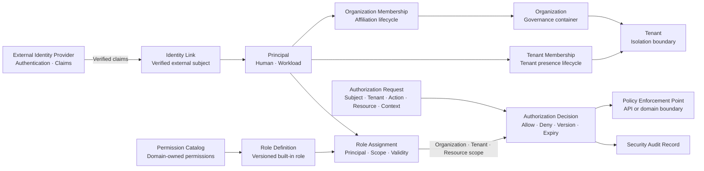

# COP IAM 领域内容实施计划

> **For agentic workers:** REQUIRED SUB-SKILL: Use superpowers:subagent-driven-development (recommended) or superpowers:executing-plans to implement this plan task-by-task. Steps use checkbox (`- [ ]`) syntax for tracking.

**Goal:** 在保持 `COP-DOM-002` 稳定 ID 与 `draft` 门禁的前提下，将 IAM 初始化骨架补充为可评审的领域模型文档。

**Architecture:** 以批准的 IAM 设计为唯一内容来源，明确 External Identity Provider、业务 Permission owner 与 IAM 的权威边界；采用 capability-aligned aggregates，分离 Principal、两级 Membership、Role Assignment 与 Authorization Decision。文档只描述当前领域边界、生命周期、失败语义和验证标准，不定义实现产品或部署拓扑。

**Tech Stack:** Markdown、YAML front matter、Mermaid `flowchart`、PowerShell 文档校验、Git。

---

### Task 1: Write and Verify COP IAM Domain

**Files:**
- Modify: `docs/domains/iam-domain.md`
- Test: PowerShell front matter、章节顺序、Mermaid、聚合表、生命周期、不变量、链接、UTF-8、占位符和单文件范围检查

- [ ] **Step 1: Run the failing structural check (RED)**

From the repository root, run:

```powershell
$ErrorActionPreference = 'Stop'
$path = 'docs/domains/iam-domain.md'
$content = Get-Content -Raw -Encoding UTF8 $path
$required = @(
  'version: 0.2.0',
  '### IAM Responsibility Boundary',
  '### Identity and Tenant Model',
  '### Authorization Model',
  '### IAM Relationship Map',
  '### Failure and Recovery',
  '### Validation Strategy',
  '### Success Criteria',
  'Temporary Platform Elevation',
  'Tenant Membership 必须依赖同一 Organization 内有效的 Organization Membership',
  'Membership 只表示归属，不直接等同于 Role 或授权'
)
foreach ($value in $required) {
  if (-not $content.Contains($value)) { throw "Missing: $value" }
}
```

Expected result: `Missing: version: 0.2.0`, proving the initialization skeleton does not yet satisfy the approved design.

- [ ] **Step 2: Replace the target document with the complete approved content**

Replace only `docs/domains/iam-domain.md` with the following content. Preserve the stable ID, existing three related links, `draft` status, and the exact relative reference targets.

````markdown
---
id: COP-DOM-002
title: COP IAM Domain
status: draft
version: 0.2.0
owners:
  - architecture
last_updated: 2026-08-06
related:
  - COP-DOM-001
  - COP-SEC-001
  - COP-SEC-002
rfc: []
adr: []
---

# COP IAM 领域

## Purpose

定义 COP 的 Principal、Identity Link、Organization、Tenant、Membership、Permission Catalog、Role Definition、Role Assignment、Authorization Decision 和 Temporary Platform Elevation 的所有权、生命周期、不变量、命令、查询、事件、失败与验证边界。本文保持领域模型与安全机制分工，不替代 `COP-SEC-002` 的认证协议和策略评估细节。

## Scope

- 稳定内部 Principal，以及 `Human` 和 `Workload` 两类主体。
- External Identity Provider 的身份关联、Organization、Tenant 和两级 Membership。
- 业务领域 owner 定义的 Permission Catalog、平台内置 Role Definition、Role Assignment 和授权判定。
- IAM 作为 Policy Decision Point（PDP），以及 API 与业务领域作为 Policy Enforcement Point（PEP）。
- 状态变更 Domain Events、Authorization Audit 和 fail closed 的恢复边界。

## Non-goals

- 不选择 IdP、Secret Manager、Policy Engine 或 Audit 产品。
- 不定义登录协议、登录页面、MFA、session、token 或 credential 格式。
- 不支持 Tenant 自定义 Role Definition、内部 Group 或 Group nesting。
- 不引入完整 ABAC 或自定义 policy language。
- 不定义 Permission API 字段、数据库拆分、缓存产品或部署拓扑。
- 不定义审计保留期、合规认证承诺或完整安全控制实现。
- 不修改 `COP-SEC-001`、`COP-SEC-002`、`COP-SEC-003`、`COP-DOM-001` 或目录索引。
- 不把 `COP-DOM-002` 标记为 `accepted`。

## Context

本文是 COP 架构文档体系中的 IAM 领域细节，落实 `COP-DOM-001` 对 IAM 独立通用子域、Principal、Organization、Tenant、Role、授权意图与授权决策的所有权判断。External Identity Provider 保留认证、identity lifecycle 和 claims 权威；IAM 维护稳定内部 Principal、Membership、Role Assignment 与授权决策，并且不保存密码、token、完整 claims 或外部原始 credential。`COP-SEC-001`、`COP-SEC-002` 和 `COP-SEC-003` 分别提供安全控制、认证与策略评估、审计保留的上层约束；本文只定义 IAM 必须提供的领域事实和审计事实。文档保持 `draft`，在明确接受前不构成 `cop-platform` 的强制实现约束。

## Ubiquitous Language

- **Principal：** IAM 内部稳定主体，分为 `Human` 与 `Workload`，参与 Membership、Role Assignment 和授权判定。
- **Identity Link：** Principal 与已验证 external issuer/subject 或受控 workload identity 的关联，不是完整外部身份副本。
- **Organization：** 治理与归属容器，可以包含多个 Tenant。
- **Tenant：** 身份、数据、授权、事件和投影的严格隔离边界；MVP 中每个 Tenant 只属于一个 Organization。
- **Membership：** Principal 在 Organization 或 Tenant 中的归属，不直接授予 Permission。
- **Permission：** 由业务领域 owner 定义的 `action`、`resource` 和业务语义引用。
- **Permission Catalog：** IAM 治理的、版本化的 Permission 引用和兼容状态集合。
- **Role Definition：** 平台内置、版本化且不可由 Tenant 修改的 Permission 组合。
- **Role Assignment：** Principal、Role、scope、有效期和版本的显式绑定。
- **Authorization Decision：** 对 Authorization Request 产生的带 ID、理由、版本和有效期的 allow/deny 结果。
- **Platform Elevation：** 跨 Tenant 恢复或治理所需的短期、明确 scope、强审计授权意图。
- **PDP / PEP：** IAM 是 Policy Decision Point；API 与业务领域边界是 Policy Enforcement Point。

## Bounded Context

### IAM Responsibility Boundary

- IAM 拥有稳定内部 Principal、Identity Link、Organization、Tenant、两级 Membership、Permission Catalog、内置 Role Definition、Role Assignment、Authorization Decision 和 Temporary Platform Elevation 的领域语义。
- External Identity Provider 保留认证、identity lifecycle 和 claims 权威；IAM 只保存已验证身份关联和最小 Profile，不保存密码、token、完整 claims 或原始 Secret。
- 各业务领域 owner 定义本领域 Permission 的 `action`、`resource` 和业务语义；IAM 不重新定义业务 Permission，不复制业务领域写模型。
- Membership 只表达归属，Role Assignment 才能授予 Permission；IAM 计算授权结果，受保护 API 与业务领域执行授权。
- IAM 向下游提供稳定身份引用和授权结果；下游不得复制 IAM 的完整身份、Role 或 Permission 写模型。

### Identity and Tenant Model

- IAM 维护稳定内部 Principal，并明确区分 `Human` 与 `Workload`。Human Principal 通过 Identity Link 关联已验证的 external issuer/subject；Workload Principal 关联短期 workload identity 或受控 credential reference。
- Principal Profile 只保存 display name、受验证的 contact reference、identity source、`last_synced_at` 和必要状态。同步失败时保留来源和 stale 状态；陈旧 claims 不能作为新的授权依据。
- Organization 是治理与归属容器，可以包含多个 Tenant。Tenant 是身份、数据、授权、事件和 Projection 的严格隔离边界。MVP 中每个 Tenant 只属于一个 Organization。
- Organization Role 只授予组织治理能力，不自动授予 Tenant 数据访问。Tenant 数据访问必须有显式 Tenant Role Assignment；Platform Administrator 默认不拥有 Tenant 数据访问。
- Organization Membership 表达 Principal 在 Organization 中的归属；Tenant Membership 表达 Principal 在 Tenant 中的归属。Tenant Membership 必须依赖同一 Organization 内有效的 Organization Membership。
- MVP 不引入内部 Group aggregate；外部 group claim 只可用于受控身份映射，不能直接成为授权事实。JIT 只可在预配置映射下创建或关联 Principal，不自动授予 Membership 或 Role Assignment。

### Authorization Model

- MVP 使用 scoped RBAC，不引入完整 ABAC 或自定义 policy language。
- IAM 维护受治理 Permission Catalog、平台内置 Role Definition、Role Assignment 和授权判定。Role Definition 版本化且不可由 Tenant 修改；未知或不兼容 Permission 默认拒绝。
- Role Assignment 显式绑定 Principal、Role、Organization/Tenant/Resource scope、有效期和 Role/Permission version；Resource scope 不允许扩大到 Tenant 或 Organization。
- Authorization Request 携带 Principal、Organization/Tenant、`action`、`resource` 和 `context`。Authorization Decision 返回 decision ID、allow/deny、reason code、Role/Permission version、expiry 和 audit correlation。
- 允许短期、scope-bound decision/grant 缓存；缓存绑定 Principal、Tenant、`action`、`resource`、Role/Membership version 和 expiry。敏感操作与 Platform Elevation 必须实时判定。
- 过期、版本不匹配、scope 不匹配、未知 Permission、IAM 不可用或无法确认时 fail closed。跨 Tenant Platform Admin 操作必须使用短期 elevation 和强审计。

### IAM Relationship Map



图中 External Identity Provider 只提供已验证认证事实，Identity Link 将 external subject 关联到稳定 Principal。Membership 与 Role Assignment 分离；Permission Catalog 和 Role Definition 向 Role Assignment 提供版本化授权输入。箭头不表示共享存储、跨领域直接写入、scope 继承或隐式内部信任。

### Failure and Recovery

- External Identity Provider 不可用或 claims 无法验证时，不创建 Identity Link、不执行 JIT、不接受新的认证上下文；已有 Principal 不能替代认证证明。
- Permission Catalog 单个 producer 的版本不兼容时，只隔离受影响 Permission，不阻断无关领域判定。
- 事件发布失败不回滚已提交事实；使用持久化 outbox、有限重试、隔离和授权重放恢复。
- 敏感操作或 Platform Elevation 无法实时判定或记录审计时拒绝执行。Credential、Secret、token、完整 claims 和无关个人数据不得进入 Domain Event、普通日志或授权缓存。
- Profile 同步失败时保留最小 Profile、source、`last_synced_at` 和 stale 状态。恢复任何 Principal、Membership、Assignment 或 Elevation 时重新验证当前版本、scope、expiry 和领域不变量。

### Validation Strategy

- **Identity authority：** 验证外部认证事实与 COP Principal 所有权不会混淆。
- **Tenant isolation：** 验证 Organization Role 不继承 Tenant 数据权限，跨 Tenant 请求默认拒绝。
- **Membership invariants：** 验证 Tenant Membership 依赖有效 Organization Membership。
- **Role scope：** 验证 Assignment 不能越过 Organization、Tenant 或 Resource scope。
- **Last administrator：** 验证任何状态变化都不能移除活动 Tenant 的最后一个有效 Tenant Administrator Assignment。
- **Revocation：** 验证 Principal、Membership、Assignment 或版本变化使缓存 decision 失效。
- **Decision determinism：** 验证相同主体、scope、action、resource 和版本产生一致判定与 reason code。
- **Concurrency：** 验证重复命令幂等，并发版本冲突不会丢失更新。
- **Failure isolation：** 验证单个 IdP、Permission producer 或事件消费者故障不会扩大授权。
- **Privacy：** 验证 Profile、Audit 和 Domain Event 不包含 token、Secret、完整 claims 或无关个人数据。
- **Traceability：** 验证 Membership、Assignment、Elevation、状态变化和授权判定可以关联 actor、decision ID 和 audit record。

### Success Criteria

- 读者能识别所有 IAM 核心概念的单一所有权，并区分 Human/Workload、Organization/Tenant、Membership/Role Assignment。
- External Identity Provider、业务 Permission owner 和 IAM 的权威边界明确且没有事实复制。
- scoped RBAC、内置 Role、Permission Catalog、PDP/PEP 和短期 decision/grant 语义完整。
- Tenant isolation、Organization Role 无 Tenant 数据继承、Platform Elevation 和最后管理员不变量明确。
- 生命周期、撤销、版本、幂等、并发冲突和缓存失效可以一致验证。
- Domain Event 与 Authorization Audit 分工明确，并遵循最小数据原则；IdP、Permission producer、审计和事件故障具有 fail closed、隔离和恢复语义。

## Aggregates and Entities

| Aggregate or capability | Ownership | Key references and boundaries |
| --- | --- | --- |
| Principal | 稳定内部主体、类型、状态和最小 Profile | Identity Link、Organization/Tenant Membership 引用；不拥有外部认证事实 |
| Identity Link | Principal 与已验证外部身份或 workload identity 的关联 | issuer、subject、source、sync metadata；不保存 token 或完整 claims |
| Organization | 治理容器和 Tenant 归属 | Tenant references；不形成 Tenant 数据访问继承 |
| Tenant | 严格隔离边界及 Organization 归属 | 每个 Tenant 在 MVP 中只属于一个 Organization |
| Organization Membership | Principal 与 Organization 的归属生命周期 | Principal、Organization、status、version |
| Tenant Membership | Principal 与 Tenant 的归属生命周期 | Principal、Tenant、Organization Membership、status、version |
| Permission Catalog | 领域 owner 发布的 Permission 引用、版本和兼容状态 | 不重新定义业务 action/resource 语义 |
| Role Definition | 平台内置、版本化的 Permission 组合 | MVP 不允许 Tenant 自定义或修改 |
| Role Assignment | Principal、Role、scope、有效期和状态 | Organization、Tenant 或 Resource scope；不能隐式扩大 |
| Authorization Decision | 带 ID、理由、版本和有效期的 allow/deny 结果 | 短期结果和审计关联，不成为长期领域聚合 |
| Temporary Platform Elevation | 跨 Tenant 恢复或治理的短期授权意图 | target Tenant、reason、scope、expiry、强审计 |

- Principal：`Active`、`Suspended`、`Disabled`。
- Organization Membership：`Invited`、`Active`、`Suspended`、`Removed`。
- Tenant Membership：`Invited`、`Active`、`Suspended`、`Removed`。
- Role Assignment：`Active`、`Revoked`、`Expired`。
- Temporary Platform Elevation：`Active`、`Revoked`、`Expired`。

Removed、Revoked 和 Expired 记录保留审计链；重新加入或授予时创建新记录，不复用历史授权记录。活动 Tenant 必须至少保留一个有效的内置 Tenant Administrator Assignment。

## Commands and Queries

### Commands

- `RegisterPrincipal`、`LinkExternalIdentity`、`RegisterWorkloadPrincipal`
- `SuspendPrincipal`、`DisablePrincipal`
- `CreateOrganization`、`CreateTenant`
- `InviteOrganizationMember`、`ActivateOrganizationMembership`、`SuspendOrganizationMembership`、`RemoveOrganizationMembership`
- `InviteTenantMember`、`ActivateTenantMembership`、`SuspendTenantMembership`、`RemoveTenantMembership`
- `AssignRole`、`RevokeRole`
- `GrantTemporaryPlatformElevation`、`RevokeTemporaryPlatformElevation`

命令名称表达领域意图，不预设 REST 路径、服务拆分或数据库结构。每个管理命令校验 actor、Organization/Tenant scope、授权、expected version、idempotency 和相关不变量。并发冲突显式拒绝，不使用 last-write-wins；跨领域不使用分布式事务。

### Queries

- Principal、Identity Link 和最小 Profile 查询。
- Organization / Tenant Membership 查询。
- Permission Catalog、Role Definition 和 Role Assignment 查询。
- `EvaluateAuthorization`：输入 Principal、Tenant、`action`、`resource` 和 `context`，返回 decision ID、allow/deny、reason code、Role/Permission version、expiry 和 audit correlation。

查询必须应用调用者授权和 Tenant isolation，不得把未经授权的数据存在性、Profile、Membership 或 Assignment 泄漏给调用者。

## Domain Events

### Events

- Principal 注册、身份关联与状态变化。
- Organization / Tenant 创建与状态变化。
- Organization / Tenant Membership 生命周期变化。
- Permission Catalog 或 Role Definition 版本变化。
- Role Assignment 创建、撤销与过期。
- Temporary Platform Elevation 创建、撤销与过期。

事件只携带稳定 ID、Organization/Tenant scope、状态、版本、发生时间和必要 Permission/Role reference；不携带 token、完整 claims、contact data、Secret 或完整 Principal Profile。事件采用 at-least-once，消费者根据 event ID、aggregate version 和业务不变量处理 duplicate、out-of-order 与 replay。

### Authorization Audit

每次 Authorization Decision 不发布高频 Domain Event，只生成 Security Audit Record 和可观测指标。审计至少包含 actor/subject、Organization/Tenant、action、resource、decision、reason code、Role/Permission version、decision ID、时间和 correlation context，不记录 token、Secret 或完整 claims。

IAM 管理命令与对应状态变更审计必须原子关联；无法持久化审计时，不提交 Principal、Membership、Role Assignment 或 Elevation 状态变更。

## Invariants

- 每个外部 issuer/subject 关联到至多一个活动 Human Principal，除非经过受审计的迁移流程。
- Human 与 Workload Principal 的认证方式和生命周期不能隐式互换。
- Tenant Membership 只能在有效 Organization Membership 和匹配 Organization 下生效。
- Membership 不授予 Permission；授权必须通过有效 Role Assignment。
- Role Assignment 的 scope 必须处于 Membership 允许的边界内，不能隐式扩大。
- 活动 Tenant 必须至少保留一个有效的内置 Tenant Administrator Assignment。
- 暂停或禁用 Principal、Organization Membership 后，相关下级记录仍保留，但授权判定立即视为无效。
- 恢复时重新校验 Principal、Membership、Role、Permission、scope、version、expiry 和最后管理员不变量。
- Break-glass 走独立、短期、强审计流程，不成为普通长期 Assignment。
- 所有管理命令携带 idempotency key 和 expected version；并发冲突显式拒绝，不使用 last-write-wins。

## Relationships

- [COP-DOM-001](domain-landscape.md)
- [COP-SEC-001](../security/security-architecture.md)
- [COP-SEC-002](../security/iam-and-authorization.md)

IAM 与 External Identity Provider 通过已验证的 Identity Link 协作；IAM 与业务领域通过稳定 Principal 引用、Permission Catalog、Role Assignment 和 Authorization Decision 协作。Organization Role 不继承 Tenant 数据访问；Tenant Membership 必须依赖同一 Organization 内有效的 Organization Membership。

## Constraints

- `COP-DOM-002` 保持 `draft`；只有显式接受后才形成 `cop-platform` 实现约束。
- 不得保存密码、token、完整 claims、原始 Secret 或无关个人数据。
- 未知 Permission、版本不匹配、scope 不匹配、decision 过期、审计不可持久化或 IAM 无法确认时 fail closed。
- 不得共享数据库、跨领域直接写私有存储、绕过 owner Contract 或使用 last-write-wins。
- 不得用 JIT、Membership 或 Organization Role 隐式授予 Tenant 数据权限。
- Domain Events 使用 at-least-once；消费者必须能处理 duplicate、out-of-order 和 replay，不依赖 exactly-once 或全局排序。

## Quality Attributes

- **Tenant isolation：** Tenant 作为严格隔离边界，跨 Tenant 访问默认拒绝。
- **Security：** 敏感操作实时判定、fail closed、短期 scope-bound 缓存和强审计。
- **Consistency：** expected version、idempotency、显式冲突和版本化 Permission/Role。
- **Availability：** 非敏感查询可使用明确标记的 stale 投影；授权不可确认时不降级放行。
- **Traceability：** 管理状态变化和 Authorization Decision 关联 actor、decision ID、版本与审计记录。
- **Privacy：** 最小 Profile、最小事件和审计字段，不传播 credential 或完整 claims。

## Implementation Guidance

命令实现应以稳定 ID、显式 scope、expected version 和 idempotency key 为输入，先验证当前状态与不变量，再提交状态变化并原子关联审计。状态变化使用持久化 outbox 发布最小 Domain Event；消费者按 event ID、aggregate version 和业务不变量幂等处理。授权缓存必须绑定 Principal、Tenant、action、resource、Role/Membership version 与 expiry；敏感操作和 Platform Elevation 不得依赖陈旧缓存。本文不规定 API 字段、数据库拆分、缓存产品、部署拓扑或供应商选择。

## References

- [COP-DOM-001](domain-landscape.md)
- [COP-SEC-001](../security/security-architecture.md)
- [COP-SEC-002](../security/iam-and-authorization.md)
````

- [ ] **Step 3: Run the structural and semantic checks (GREEN)**

From the repository root, run:

```powershell
$ErrorActionPreference = 'Stop'
$path = 'docs/domains/iam-domain.md'
$bytes = [IO.File]::ReadAllBytes((Resolve-Path $path))
$content = [Text.UTF8Encoding]::new($false, $true).GetString($bytes) -replace "`r`n", "`n"
if ($bytes.Length -ge 3 -and $bytes[0] -eq 0xEF -and $bytes[1] -eq 0xBB -and $bytes[2] -eq 0xBF) { throw 'UTF-8 BOM found' }
if ($content.Contains([char]0) -or $content.Contains([char]0xFFFD)) { throw 'Invalid text character found' }

$expectedFrontMatter = @'
---
id: COP-DOM-002
title: COP IAM Domain
status: draft
version: 0.2.0
owners:
  - architecture
last_updated: 2026-08-06
related:
  - COP-DOM-001
  - COP-SEC-001
  - COP-SEC-002
rfc: []
adr: []
---
'@
$frontMatter = [regex]::Match($content, '\A---\n.*?\n---\n', [Text.RegularExpressions.RegexOptions]::Singleline)
if (-not $frontMatter.Success -or $frontMatter.Value.TrimEnd() -cne $expectedFrontMatter.TrimEnd()) { throw 'Front matter mismatch' }

$h2Expected = @('Purpose','Scope','Non-goals','Context','Ubiquitous Language','Bounded Context','Aggregates and Entities','Commands and Queries','Domain Events','Invariants','Relationships','Constraints','Quality Attributes','Implementation Guidance','References')
$h2Actual = @([regex]::Matches($content, '(?m)^## (.+)$') | ForEach-Object { $_.Groups[1].Value })
if (($h2Actual -join '|') -cne ($h2Expected -join '|')) { throw "H2 order mismatch: $($h2Actual -join ', ')" }
$h3Expected = @('IAM Responsibility Boundary','Identity and Tenant Model','Authorization Model','IAM Relationship Map','Failure and Recovery','Validation Strategy','Success Criteria','Commands','Queries','Events','Authorization Audit')
$h3Actual = @([regex]::Matches($content, '(?m)^### (.+)$') | ForEach-Object { $_.Groups[1].Value })
if (($h3Actual -join '|') -cne ($h3Expected -join '|')) { throw "H3 order mismatch: $($h3Actual -join ', ')" }

foreach ($value in @(
  'External Identity Provider 保留认证、identity lifecycle 和 claims 权威',
  'IAM 维护稳定内部 Principal',
  'Human', 'Workload', '不保存密码、token、完整 claims 或原始 Secret',
  'Organization 是治理与归属容器', 'Tenant 是身份、数据、授权、事件和 Projection 的严格隔离边界',
  'Tenant Membership 必须依赖同一 Organization 内有效的 Organization Membership',
  'Membership 只表达归属', 'Membership 不授予 Permission',
  'MVP 使用 scoped RBAC', 'Permission Catalog', 'Role Definition', 'Role Assignment',
  'IAM 是 Policy Decision Point', 'Policy Enforcement Point', 'short-lived', 'scope-bound',
  'Temporary Platform Elevation', 'Tenant Administrator Assignment', 'fail closed',
  'expected version', 'idempotency key', 'at-least-once', 'Authorization Audit',
  'identity authority', 'Tenant isolation', 'Membership invariants', 'Role scope',
  'Last administrator', 'Revocation', 'Decision determinism', 'Concurrency',
  'Failure isolation', 'Privacy', 'Traceability'
)) { if (-not $content.Contains($value)) { throw "Missing requirement: $value" } }

$mermaid = [regex]::Matches($content, '(?ms)^```mermaid\n(.*?)^```$')
if ($mermaid.Count -ne 1) { throw "Expected one Mermaid block, found $($mermaid.Count)" }
$diagram = $mermaid[0].Groups[1].Value
foreach ($value in @('IDP -->','LINK --> PRINCIPAL','ORG --> TENANT','PRINCIPAL --> ORG_MEMBER','ORG_MEMBER --> ORG','PRINCIPAL --> TENANT_MEMBER','TENANT_MEMBER --> TENANT','CATALOG --> ROLE','ROLE --> ASSIGN','ASSIGN -->','REQUEST --> DECISION','DECISION --> PEP','DECISION --> AUDIT')) {
  if (-not $diagram.Contains($value)) { throw "Missing diagram relation: $value" }
}

$aggregateRows = [regex]::Match($content, '(?ms)^\| Aggregate or capability \| Ownership \| Key references and boundaries \|\n(.*?)\n\n').Groups[1].Value -split "`n"
if ($aggregateRows.Count -ne 12) { throw "Expected separator and 11 aggregate rows, found $($aggregateRows.Count)" }
foreach ($row in $aggregateRows) { if (([regex]::Matches($row, '\|')).Count -ne 4) { throw "Aggregate table column mismatch: $row" } }

foreach ($value in @('Principal：`Active`、`Suspended`、`Disabled`','Organization Membership：`Invited`、`Active`、`Suspended`、`Removed`','Tenant Membership：`Invited`、`Active`、`Suspended`、`Removed`','Role Assignment：`Active`、`Revoked`、`Expired`','Temporary Platform Elevation：`Active`、`Revoked`、`Expired`')) {
  if (-not $content.Contains($value)) { throw "Missing lifecycle state: $value" }
}

$forbidden = @((('T' + 'BD')), (('TO' + 'DO')), ('lorem' + ' ipsum'), '当前尚未形成已接受')
foreach ($value in $forbidden) { if ($content.Contains($value)) { throw "Forbidden filler: $value" } }
$file = Get-Item $path
$links = [regex]::Matches($content, '\[[^\]]+\]\(([^)#]+\.md)(?:#[^)]+)?\)')
if ($links.Count -ne 6) { throw "Expected 6 relationship and reference links, found $($links.Count)" }
foreach ($link in $links) { if (-not (Test-Path -LiteralPath (Join-Path $file.DirectoryName $link.Groups[1].Value))) { throw "Broken link: $($link.Groups[1].Value)" } }

git diff --check
if ($LASTEXITCODE -ne 0) { throw 'git diff --check failed' }
$changed = @(git diff --name-only)
if ($changed.Count -ne 1 -or $changed[0] -ne $path) { throw "Unexpected file scope: $($changed -join ', ')" }
'PASS: IAM domain structure and semantics'
```

Expected output: `PASS: IAM domain structure and semantics`.

- [ ] **Step 4: Perform the manual IAM ownership and relationship review**

Read the rendered or source document and confirm all of the following:

- External Identity Provider owns authentication, identity lifecycle and claims; IAM owns stable Principal, Membership, Role Assignment and authorization decisions.
- Human and Workload are distinct Principal types; no password, token, complete claims or raw Secret is stored or propagated.
- Organization is a governance container and Tenant is the strict isolation boundary; Organization Role never inherits Tenant data access.
- Tenant Membership depends on active Organization Membership in the same Organization; Membership does not itself grant Permission.
- Permission semantics remain owned by business domains; IAM owns the Permission Catalog, built-in Role Definitions, Assignments and decisions.
- IAM is PDP and APIs/domain boundaries are PEPs; JIT creates or links Principal only and never grants Membership or Role Assignment.
- The diagram does not imply shared storage, scope inheritance, distributed transactions, global ordering or exactly-once delivery.
- The last valid Tenant Administrator invariant, temporary Platform Elevation, lifecycle retention, version checks, idempotency and fail-closed behavior are explicit.
- Domain Events carry minimal submitted facts, while each Authorization Decision produces an audit record rather than a high-frequency Domain Event.

If any item fails, correct only the target document and rerun Step 3 before continuing.

- [ ] **Step 5: Run the full repository link and scope checks**

```powershell
$ErrorActionPreference = 'Stop'
$markdown = @(Get-Item README.md,CONTRIBUTING.md,AGENTS.md) + @(Get-ChildItem docs,adr,rfc,templates -Recurse -File -Filter '*.md' | Where-Object { $_.FullName -notmatch '[\\/]docs[\\/]superpowers[\\/]' })
foreach ($file in $markdown) {
  $content = Get-Content -Raw -Encoding UTF8 $file.FullName
  foreach ($link in [regex]::Matches($content, '\[[^\]]+\]\(([^)#]+\.md)(?:#[^)]+)?\)')) {
    if (-not (Test-Path -LiteralPath (Join-Path $file.DirectoryName $link.Groups[1].Value))) { throw "Broken link in $($file.FullName): $($link.Groups[1].Value)" }
  }
}
git diff --check
if ($LASTEXITCODE -ne 0) { throw 'git diff --check failed' }
$changed = @(git diff --name-only)
if ($changed.Count -ne 1 -or $changed[0] -ne 'docs/domains/iam-domain.md') { throw "Unexpected file scope: $($changed -join ', ')" }
'PASS: repository links and scope'
```

Expected output: `PASS: repository links and scope`.

- [ ] **Step 6: Commit the IAM domain document**

```powershell
git add docs/domains/iam-domain.md
git commit -m "docs: define IAM domain content"
```

- [ ] **Step 7: Verify the implementation commit contains only the target document**

```powershell
$files = @(git diff-tree --no-commit-id --name-only -r HEAD)
if ($files.Count -ne 1 -or $files[0] -ne 'docs/domains/iam-domain.md') { throw "Unexpected committed files: $($files -join ', ')" }
if (git status --porcelain) { throw 'Worktree is not clean' }
'PASS: IAM domain commit'
```

Expected output: `PASS: IAM domain commit`.

### Plan Self-Review

- [ ] Compare this plan with all 15 acceptance conditions in `docs/superpowers/specs/2026-08-06-iam-domain-content-design.md`; conditions 1-12 are covered by the target content and GREEN/manual checks, condition 13 by the link and placeholder checks, condition 14 by the byte-level UTF-8/Mermaid/table checks, and condition 15 by `git diff --check`, document validation, and single-file commit verification.
- [ ] Confirm the plan contains no implementation code, no product/vendor choice, no index changes, no status promotion, and no unapproved capability.
- [ ] Confirm all target H2/H3 order, lifecycle states, ownership boundaries, approved commands/queries/events, failure semantics, and reference links are represented exactly enough for line-by-line spec review.
- [ ] Confirm there are no literal filler placeholders in the target content and that the implementer must preserve the approved Chinese prose rather than paraphrase it.

### Commit the Plan

- [ ] **Step 8: Commit the implementation plan**

```powershell
git add docs/superpowers/plans/2026-08-06-iam-domain-content.md
git commit -m "docs: plan IAM domain content"
```
