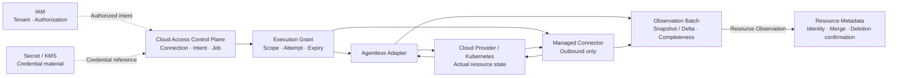

# COP Cloud Access Domain Content Implementation Plan

> **For agentic workers:** REQUIRED SUB-SKILL: Use superpowers:subagent-driven-development (recommended) or superpowers:executing-plans to implement this plan task-by-task. Steps use checkbox (`- [ ]`) syntax for tracking.

**Goal:** 将 `COP-DOM-004` 从初始化骨架更新为可评审的 Cloud Access 领域文档，同时保持稳定文档 ID、`draft` 门禁和既有引用。

**Architecture:** 只修改 `docs/domains/cloud-access-domain.md`，以 capability-aligned aggregates 描述 Cloud Connection、Credential Binding、Discovery Intent、Sync Job、Provider Capability、Execution Grant 和 Observation Batch。通过一个 Mermaid flowchart 固定 IAM、Secret/KMS、Control Plane、Data Plane/Connector、Provider/Kubernetes 与 Resource Metadata 的单向责任边界，并用 PowerShell 对元数据、结构、术语、不变量、链接、编码和提交范围执行确定性验证。

**Tech Stack:** Markdown、YAML front matter、Mermaid、PowerShell、Git

---

## File Structure

- Create: `docs/superpowers/plans/2026-08-07-cloud-access-domain-content.md` — 保存本实施计划、完整目标内容与可重复验证命令。
- Modify: `docs/domains/cloud-access-domain.md` — 定义 Cloud Access 领域当前设计；保持 `COP-DOM-004` 和 `draft` 状态。
- Do not modify: `docs/domains/README.md`、关联领域文档、RFC 或 ADR；本次没有新增、移动、废弃或接受权威文档。

### Task 1: Define the Cloud Access domain document

**Files:**
- Modify: `docs/domains/cloud-access-domain.md`
- Reference: `docs/superpowers/specs/2026-08-07-cloud-access-domain-content-design.md`
- Reference: `docs/domains/domain-landscape.md`
- Reference: `docs/domains/resource-metadata-domain.md`
- Reference: `docs/architecture/control-plane-data-plane.md`
- Reference: `docs/security/security-architecture.md`

- [ ] **Step 1: Run the requirement gate against the skeleton document (RED)**

```powershell
$ErrorActionPreference = 'Stop'
$path = 'docs/domains/cloud-access-domain.md'
$content = Get-Content -Raw -Encoding UTF8 $path
if (-not $content.Contains('version: 0.2.0')) { throw 'RED: expected Cloud Access version 0.2.0' }
if (-not $content.Contains('### Cloud Access Responsibility Boundary')) { throw 'RED: responsibility boundary is missing' }
if (-not $content.Contains('Observation Batch')) { throw 'RED: Observation Batch model is missing' }
throw 'RED gate unexpectedly passed against the skeleton'
```

Expected: command fails first with `RED: expected Cloud Access version 0.2.0`, proving the current `0.1.0` skeleton does not satisfy the approved design.

- [ ] **Step 2: Replace the skeleton with the approved Cloud Access domain content**

Replace `docs/domains/cloud-access-domain.md` with exactly:

````markdown
---
id: COP-DOM-004
title: COP Cloud Access Domain
status: draft
version: 0.2.0
owners:
  - architecture
last_updated: 2026-08-07
related:
  - COP-DOM-001
  - COP-DOM-003
  - COP-ARCH-003
  - COP-SEC-001
rfc: []
adr: []
---

# COP 云接入领域

## Purpose

定义外部云环境与 Kubernetes 的受治理接入、凭据引用绑定、Provider 能力、发现意图、同步执行和 Resource Observation 交付边界，使 COP 能安全、可审计地取得可信资源观察事实。

## Scope

- Cloud Connection 稳定身份、Tenant 归属、生命周期与健康状态
- Credential Reference 与版本化 Credential Binding
- Provider Capability 与统一 Adapter Contract
- Discovery Intent、Sync Job、attempt 与 Execution Grant
- Snapshot/Delta Observation Batch、完整性与 Resource Observation 发布

## Non-goals

- 保存原始、明文或可直接使用的 credential
- 创建、修改、删除云资源或执行 remediation 与业务自动化
- 成本、计费、资产估值或 FinOps 分析
- 创建统一 Resource Identity 或直接确认 Resource 删除
- 选择 Secret/KMS、Connector runtime、Provider SDK、数据库、消息或部署产品

## Context

Cloud Access 是支撑 Resource Metadata 的独立通用子域。它把已授权的发现意图转换为受限执行，并把 Provider/Kubernetes 响应标准化为带 scope、来源和完整性语义的 Resource Observation。`COP-DOM-004` 保持 `draft`；只有状态显式变为 `accepted` 后才形成 `cop-platform` 实现约束。

## Ubiquitous Language

| Term | Meaning |
| --- | --- |
| Cloud Connection | COP 内部稳定连接身份，绑定一个 Tenant、Provider 和外部 account/cluster identity |
| Credential Reference | 指向外部 Secret/KMS credential material 的受控引用，不包含原始 credential |
| Credential Binding | Credential Reference 与 Cloud Connection 的版本化绑定 |
| Provider Capability | Adapter 支持的 Provider、资源类型、发现模式、认证方式和 Contract version |
| Discovery Intent | 版本化的发现期望，声明 scope、资源类型、触发方式和能力要求 |
| Sync Job | 固定某个 Intent、Connection、Binding、scope 和能力版本的一次执行 |
| Execution Grant | Job 派发时签发的短期、不可扩大、绑定 attempt 的执行授权 reference |
| Observation Batch | Job 输出的分页观察集合，携带 Snapshot/Delta、scope、cursor 和完整性 |
| Resource Observation | 对外部资源状态的一次不可变观察事实，不等同于统一 Resource Identity |

## Bounded Context

### Cloud Access Responsibility Boundary

- Cloud Access 拥有 Cloud Connection、Credential Binding、Provider Capability、Discovery Intent、Sync Job、Execution Grant reference 和 Observation Batch 的领域语义。
- IAM 拥有 Tenant、Principal 和授权决策；Cloud Access 只消费已授权的 Tenant、actor 和 scope context。
- Secret/KMS 保留原始 credential 的存储、保护和材料权威；Cloud Access 只保存受控 Credential Reference、binding version 和审计元数据。
- Control Plane 治理 Connection/Intent、创建并调度 Job；它不直接执行 Provider API 调用。
- Data Plane 或 Managed Connector 只执行有效 Execution Grant 允许的工作，不创建 Intent、不扩大 scope、不选择其他 credential。
- Adapter 负责 Provider/Kubernetes 协议适配和标准化；Cloud Access 核心只依赖 Adapter Contract。
- Cloud Provider/Kubernetes 保留实际资源状态权威。
- Cloud Access 只发布 Resource Observation，不创建统一 Resource Identity，也不直接写入 Resource Metadata 私有存储或确认 Resource 删除。
- Resource Metadata 负责 Observation 去重、身份匹配、当前状态合并和资源消失确认。

### Connection and Credential Model

- Cloud Connection 使用不可变内部 `connection_id`，只属于一个 Tenant，并绑定一个 Provider、一个外部 account/cluster identity 和当前 Credential Binding。
- Provider、Tenant 或外部 account/cluster identity 变化时创建新 Connection，不复用已撤销身份。
- Connection 生命周期为 `Pending`、`Validating`、`Active`、`Degraded`、`Suspended`、`Revoked`。
- `Degraded` 表达健康异常，不改变 Connection 身份；`Suspended` 停止新 Job；`Revoked` 是终态，Connection ID 不得复用。
- Credential Binding 记录 Connection、Credential Reference、binding version、状态和审计信息，不包含原始 credential。
- Credential 轮换创建新的 Binding version；旧 Binding version 保留审计但不能用于新 Job，已创建 Job 固定其 Binding version。
- Credential 撤销、Connection 暂停或撤销后，尚未使用的 Execution Grant 失效。
- Connection、Binding、Job、Grant 和 Observation 跨 Tenant 使用默认拒绝；Tenant 或 Binding 状态无法确认时 fail closed。

### Discovery and Execution Model

- Discovery Intent 归属于一个 Cloud Connection，以不可变版本记录发现 scope、资源类型、触发方式和所需 Provider Capability。
- Intent 语义变化生成新版本，历史版本保留审计；已创建 Job 不受后续 Intent 版本影响。
- Sync Job 创建时固定 Connection ID、Intent version、Credential Binding version、目标 scope 和 Provider Capability/Adapter Contract version，执行中不得漂移配置。
- Job 生命周期为 `Queued`、`Dispatched`、`Running`、`Succeeded`、`Failed`、`Cancelled`、`Expired`。
- Job `Succeeded` 只表示预定执行完成；是否形成权威 Snapshot 还取决于 Observation Batch 的完整性和 scope 闭合。
- 每次派发或自动重试签发新的短期、不可扩大 Execution Grant，绑定 Tenant、Connection、Job、scope、操作类型、attempt 和 expiry。
- 自动重试属于同一 Job 并记录独立 attempt；人工重新执行创建新 Job。旧 Grant 在重试、取消、过期、credential 撤销或 Connection 暂停/撤销后失效。
- Data Plane 或 Connector 只能凭有效 Grant 领取和执行 Job；Grant 过期、版本或 scope 不匹配时拒绝执行。

### Adapter Contract and Execution Modes

- Agentless Adapter 与 outbound-only Managed Connector 实现同一份 Adapter Contract；部署位置、网络路径和 Credential Reference 解析位置可以不同，领域语义不能分叉。
- Managed Connector 只主动建立出站通道，不接受平台侧入站连接；平台通过已认证通道派发受 Grant 限制的 Job。
- Provider Capability 声明 Adapter 支持的 Provider、资源类型、发现模式、认证方式和 Contract version。创建 Job 前验证所需能力，运行中不得自动切换版本。
- Adapter 输入包含 Connection、Discovery Intent version、Credential Binding reference、Execution Grant 和 cursor context；输出标准化 Observation Batch、执行进度和错误结果。
- Provider 特有认证交换、Endpoint、分页、限流、错误码、Provider payload 和 retry hint 全部封装在 Adapter 内。
- 标准错误分类为 `AuthenticationFailed`、`AuthorizationDenied`、`RateLimited`、`ProviderUnavailable`、`InvalidScope`、`UnsupportedCapability` 和 `ContractViolation`，并声明是否可重试和建议退避信息。
- Provider 原始响应只作为受控诊断证据，不成为下游 Contract，也不得携带 credential 或 Secret 进入普通事件和日志。

### Observation and Completeness Model

- 每个 Observation Batch 关联 Tenant、Cloud Connection、Sync Job、Intent version 和 Adapter Contract version，并携带发现模式、scope、cursor 或时间窗口、开始/结束时间、完整性状态和 idempotency key。
- `Snapshot` 表示对声明 scope 的一次完整枚举；`Delta` 只表达 Provider 明确返回的新增、变更或删除事实。
- 只有成功完成、覆盖范围明确且标记为 `Authoritative` 的 Snapshot 才能产生 missing/deletion candidate。
- Delta 不根据“本次未出现”推断资源消失。分页中断、限流耗尽、权限收缩、Connector 断连或部分 scope 失败时，Batch 标记为 `Incomplete`，不得产生 missing candidate。
- 同一 Job 可以产生多个分页 Batch，但 Snapshot 只能在整个声明 scope 成功闭合后成为 Authoritative，单个分页 Batch 不能自行声明完整。
- Resource Observation 是不可变事实，包含 Provider 外部键、资源类型、标准化属性、原始版本标识、观测时间、来源证据和 correlation。
- Observation 以幂等方式发布；Cloud Access 不分配统一 Resource Identity，也不直接确认或执行 Resource 删除。

### Cloud Access Relationship Map



箭头不表示共享存储、跨领域直接写入、credential material 复制、分布式事务或部署拓扑。两种执行形态遵守同一 Adapter Contract；Resource Metadata 保留统一 Resource Identity 和删除确认权。

### Failure and Recovery

- 调度队列、并发额度、限流状态、Circuit Breaker 和 retry budget 按 `Connection + Adapter` 隔离；单个账号、集群或 Provider 故障不得阻塞无关 Connection。
- 只有标准化为可重试的错误才执行有界重试，并使用退避与抖动；认证失败、授权拒绝、无效 scope 和 Contract Violation 不自动重试。
- 自动重试从已确认 cursor 恢复；Provider 无法保证 cursor 一致性时，放弃残缺结果并创建新的 Snapshot 执行，不拼接为权威 Snapshot。
- 连续执行故障可以将 Connection 标记为 `Degraded`，但不改变稳定身份；恢复后重新验证 Connection、Binding、Capability 和 scope。
- Connector 断连、分页中断、权限收缩或部分 scope 失败只产生 `Incomplete` Batch，不产生 missing candidate。
- Connection `Suspended`/`Revoked`、Credential Binding 撤销、Job 取消/过期后停止新派发并使未使用 Grant 失效。
- Secret/KMS、IAM 或 Grant 状态无法确认时 fail closed；日志、事件和诊断输出不得包含原始 credential。
- Observation 重放、Job reconciliation 和 Batch 发布必须幂等，并检测 duplicate、out-of-order、cursor gap、版本不匹配和长期 incomplete。

### Validation Strategy

- **Connection identity：** 验证 credential 轮换和健康变化不改变稳定 Connection ID，Revoked ID 不复用。
- **Tenant isolation：** 验证 Connection、Binding、Intent、Job、Grant 和 Observation 跨 Tenant 默认拒绝。
- **Credential authority：** 验证 Cloud Access 不保存原始 credential，旧 Binding version 不能用于新 Job。
- **Intent determinism：** 验证 Job 固定 Intent、Binding、scope 和 Capability version，执行中配置不漂移。
- **Grant confinement：** 验证 Grant 权限扩大、attempt 复用、过期和状态不匹配被拒绝。
- **Contract conformance：** 验证 Agentless 与 Managed Connector 通过同一 Adapter Contract conformance suite。
- **Adapter normalization：** 验证 Provider 认证、分页、限流、错误和 payload 不泄漏为核心分支或下游 Contract。
- **Snapshot completeness：** 验证 Connector 断连、分页中断和部分 scope 失败不产生 missing candidate，完整 Authoritative Snapshot 才能产生候选。
- **Delta semantics：** 验证 Delta 只处理明确变化，不通过缺失推断删除。
- **Idempotency and concurrency：** 验证 Job、Batch 和 Observation 的 duplicate、out-of-order、replay、expected version 与并发冲突。
- **Failure isolation：** 验证单个 Connection/Adapter 的限流、重试或 Circuit Breaker 不影响其他 Connection。
- **Traceability and secrecy：** 验证 Connection、Binding、Intent、Job、Grant、Batch 和 missing candidate 可关联审计，同时事件和日志不包含原始 credential。

### Success Criteria

- 读者能识别 Cloud Access、IAM、Secret/KMS、Control Plane、Data Plane/Connector、Cloud Provider/Kubernetes 和 Resource Metadata 的事实所有权。
- 稳定 Connection ID、单一 Tenant、Credential Reference/binding version 和 Connection lifecycle 语义完整。
- Discovery Intent、Sync Job、attempt 与短期不可扩大 Execution Grant 的边界明确，执行配置可重现和审计。
- Agentless 与 outbound-only Managed Connector 使用同一 Adapter Contract，Provider 特有逻辑不泄漏到核心或下游 Contract。
- Snapshot/Delta、scope、cursor、完整性和 Authoritative Snapshot 的 missing candidate 规则明确。
- 重试、限流、Circuit Breaker 和 failure isolation 以 Connection/Adapter 为边界，失败不会扩大权限或产生错误删除候选。
- Commands、Queries、Domain Events、Audit、idempotency、expected version、fail closed 和 recovery 可验证。
- 文档不引入未批准的产品、部署、API 或数值设计，并保持 `draft` 门禁。

## Aggregates and Entities

| Aggregate or capability | Ownership | Key references and boundaries |
| --- | --- | --- |
| Cloud Connection | 稳定连接身份、Tenant/Provider/外部账号或集群归属、生命周期与健康 | 引用当前 Credential Binding；不保存原始 credential，不拥有外部资源状态 |
| Credential Binding | Credential Reference 与 Connection 的版本化绑定 | Secret/KMS 保留 credential material 权威；旧版本不能用于新 Job |
| Discovery Intent | 版本化发现期望、scope、资源类型、触发方式与能力要求 | 引用 Connection 和 Provider Capability；不执行 Provider 调用 |
| Sync Job | 固定 Intent、Connection、Binding、scope 和能力版本的一次执行 | 管理状态和 attempt；运行中不漂移配置 |
| Provider Capability | Adapter 支持范围和 Contract version | Provider 特有协议留在 Adapter 内；核心不维护 Provider 分支 |
| Execution Grant | Job 派发的短期、不可扩大授权 reference | 绑定 Tenant、Connection、Job、scope、attempt 和 expiry；不作为长期授权聚合 |
| Observation Batch | 分页、完整性和 scope 闭合语义 | 包含不可变 Resource Observation；不创建 Resource Identity 或确认删除 |

Connection 状态为 `Pending`、`Validating`、`Active`、`Degraded`、`Suspended`、`Revoked`；`Revoked` 是终态。Job 状态为 `Queued`、`Dispatched`、`Running`、`Succeeded`、`Failed`、`Cancelled`、`Expired`。历史 Binding、Intent version、Job attempt 和失效 Grant 保留审计，不复用为新的授权或执行身份。

## Commands and Queries

### Commands

- Connection：`RegisterCloudConnection`、`ValidateCloudConnection`、`SuspendCloudConnection`、`ResumeCloudConnection`、`RevokeCloudConnection`
- Credential：`BindCredentialReference`、`RotateCredentialBinding`、`RevokeCredentialBinding`
- Intent：`CreateDiscoveryIntent`、`ReviseDiscoveryIntent`、`ActivateDiscoveryIntent`、`SuspendDiscoveryIntent`
- Job：`CreateSyncJob`、`DispatchSyncJob`、`StartSyncJob`、`CompleteSyncJob`、`FailSyncJob`、`CancelSyncJob`、`ExpireSyncJob`
- Observation：`AppendObservationBatch`、`CloseAuthoritativeSnapshot`、`MarkObservationBatchIncomplete`

所有命令携带 Tenant、actor/source、idempotency key 和 expected version，并校验 Connection、Binding、Intent、Capability、Grant、scope 和状态转换。冲突显式拒绝，不使用 last-write-wins 或跨领域分布式事务。

### Queries

- Cloud Connection identity、lifecycle、health 和当前 Credential Binding reference 查询。
- Credential Binding 版本历史和可用状态查询，不返回原始 credential。
- Discovery Intent 当前版本、历史版本、scope 和能力要求查询。
- Sync Job、attempt、Grant reference、进度、错误分类和关联 Batch 查询。
- Provider Capability、Adapter Contract version 和支持范围查询。
- Observation Batch 完整性、scope closure、cursor 和发布状态查询。

查询应用 IAM 授权和 Tenant isolation，不泄漏其他 Tenant 的 Connection、credential reference、外部账号/集群存在性或 Provider 诊断证据。

## Domain Events

### Events

- Connection 注册、验证、健康和生命周期变化。
- Credential Binding 创建、轮换和撤销。
- Discovery Intent 创建、修订和状态变化。
- Sync Job 与 attempt 状态变化，Execution Grant 签发和失效。
- Observation Batch 追加、闭合、标记不完整和 missing candidate 产生。

事件采用 at-least-once，只携带稳定 ID、Tenant、版本、scope reference、状态、错误分类、发生时间和 correlation；不携带原始 credential、Secret 或完整 Provider payload。消费者根据 event ID、aggregate version 和 Job/Batch idempotency key 处理 duplicate、out-of-order 与 replay。

### Audit

Job、attempt、Grant、Adapter 选择、cursor、Batch 完整性判定和 missing candidate 形成连续审计链。Connection、Credential Binding 和 Intent 管理命令关联 actor、授权决策和审计记录；高频 Observation 可以批量发布，但不能隐藏 Job、scope、source 和完整性。

## Invariants

- Cloud Connection 使用不可变内部 ID，只属于一个 Tenant；Revoked ID 不得复用。
- Connection identity 与 credential identity 分离；credential 轮换不能改变 Connection ID。
- 原始 credential 只存在于外部 Secret/KMS；Cloud Access 只保存受控 reference 和 binding version。
- 新 Job 只能使用当前有效 Credential Binding；已创建 Job 固定 Binding version，执行中不漂移。
- Discovery Intent 使用不可变版本；Job 固定 Intent、Connection、Binding、scope 和 Capability version。
- Execution Grant 必须短期、绑定 Job/attempt、不可扩大 scope；无效、过期或版本不匹配时拒绝执行。
- Agentless Adapter 与 Managed Connector 使用同一 Adapter Contract，不得产生两套 Observation 或错误语义。
- 只有完整、scope 闭合的 Authoritative Snapshot 可以产生 missing/deletion candidate；Delta 和 Incomplete Batch 不得根据缺失推断删除。
- Cloud Access 只发布 Resource Observation，不创建统一 Resource Identity，不直接确认或执行 Resource 删除。
- 跨 Tenant Connection、Binding、Intent、Job、Grant 和 Observation 使用默认拒绝；无法确认授权或状态时 fail closed。
- 所有管理命令携带 idempotency key 和 expected version；并发冲突显式拒绝。

## Relationships

- [COP-DOM-001](domain-landscape.md)
- [COP-DOM-003](resource-metadata-domain.md)
- [COP-ARCH-003](../architecture/control-plane-data-plane.md)
- [COP-SEC-001](../security/security-architecture.md)

IAM 提供 Tenant 与授权上下文，Secret/KMS 保存 credential material，Control Plane 创建和调度受治理 Job，Data Plane/Connector 执行受 Grant 限制的发现，Cloud Provider/Kubernetes 保留实际状态权威，Resource Metadata 消费 Resource Observation 并拥有统一 Resource Identity 和删除确认。

## Constraints

- `COP-DOM-004` 保持 `draft`；只有显式接受后才形成 `cop-platform` 实现约束。
- 不得保存或传播原始 credential、Secret、完整 Provider payload 或未经授权 Tenant 数据。
- 不得共享可写存储、跨领域直接写入、隐式 scope 扩大、last-write-wins 或跨领域分布式事务。
- Delta、Incomplete、Degraded、Failed 和 unavailable 不得伪装为完整成功；授权、Tenant、Binding 或 Grant 状态无法确认时 fail closed。
- 重大边界、所有权或兼容性变更必须经过 RFC/ADR，不以本文决定产品、部署、API 或数值参数。

## Quality Attributes

- **Boundary clarity：** Connection、credential、intent、execution、observation 和 Resource Identity 的 owner 可识别。
- **Tenant isolation：** Connection、Binding、Job、Grant 和 Observation 单一 Tenant 归属，跨 Tenant 默认拒绝。
- **Security：** 外部 credential authority、短期不可扩大 Grant、outbound-only Connector 和 fail closed。
- **Reliability：** 有界重试、cursor 恢复、Incomplete Batch、at-least-once 和幂等 replay。
- **Failure isolation：** 调度、限流、Circuit Breaker 和 retry budget 按 Connection/Adapter 隔离。
- **Traceability：** Connection、Binding、Intent、Job、attempt、Grant、Batch 和 missing candidate 可关联审计。
- **Evolvability：** Provider Capability、Adapter Contract 和 Intent version 支持兼容演进。

## Implementation Guidance

实现应以 Tenant、Connection、Intent version、Binding version、Capability version、scope、expected version 和 idempotency key 为受控输入，先验证当前状态与 Execution Grant，再派发 Job。Adapter 应只输出标准化错误和 Observation Batch；Batch 在 scope 闭合前保持 Incomplete，只有完整 Authoritative Snapshot 可以产生 missing candidate。本文不规定 REST 字段、表结构、数据库、队列、缓存、Provider SDK、Connector runtime 或部署拓扑。

## References

- [COP-DOM-001](domain-landscape.md)
- [COP-DOM-003](resource-metadata-domain.md)
- [COP-ARCH-003](../architecture/control-plane-data-plane.md)
- [COP-SEC-001](../security/security-architecture.md)
````

- [ ] **Step 3: Run the structural and semantic checks (GREEN)**

```powershell
$ErrorActionPreference = 'Stop'
$path = 'docs/domains/cloud-access-domain.md'
$bytes = [IO.File]::ReadAllBytes((Resolve-Path $path))
$content = [Text.UTF8Encoding]::new($false, $true).GetString($bytes) -replace "`r`n", "`n"
if ($bytes.Length -ge 3 -and $bytes[0] -eq 0xEF -and $bytes[1] -eq 0xBB -and $bytes[2] -eq 0xBF) { throw 'UTF-8 BOM found' }
if ($content.Contains([char]0) -or $content.Contains([char]0xFFFD)) { throw 'Invalid text character found' }
$expectedFrontMatter = @'
---
id: COP-DOM-004
title: COP Cloud Access Domain
status: draft
version: 0.2.0
owners:
  - architecture
last_updated: 2026-08-07
related:
  - COP-DOM-001
  - COP-DOM-003
  - COP-ARCH-003
  - COP-SEC-001
rfc: []
adr: []
---
'@
$fm = [regex]::Match($content, '\A---\n.*?\n---\n', [Text.RegularExpressions.RegexOptions]::Singleline)
if (-not $fm.Success -or $fm.Value.TrimEnd() -cne $expectedFrontMatter.TrimEnd()) { throw 'Front matter mismatch' }
$h2Expected = @('Purpose','Scope','Non-goals','Context','Ubiquitous Language','Bounded Context','Aggregates and Entities','Commands and Queries','Domain Events','Invariants','Relationships','Constraints','Quality Attributes','Implementation Guidance','References')
$h2Actual = @([regex]::Matches($content, '(?m)^## (.+)$') | ForEach-Object { $_.Groups[1].Value })
if (($h2Actual -join '|') -cne ($h2Expected -join '|')) { throw 'H2 order mismatch' }
$h3Expected = @('Cloud Access Responsibility Boundary','Connection and Credential Model','Discovery and Execution Model','Adapter Contract and Execution Modes','Observation and Completeness Model','Cloud Access Relationship Map','Failure and Recovery','Validation Strategy','Success Criteria','Commands','Queries','Events','Audit')
$h3Actual = @([regex]::Matches($content, '(?m)^### (.+)$') | ForEach-Object { $_.Groups[1].Value })
if (($h3Actual -join '|') -cne ($h3Expected -join '|')) { throw 'H3 order mismatch' }
foreach ($value in @(
  'Cloud Access 只发布 Resource Observation', 'Cloud Provider/Kubernetes 保留实际资源状态权威', '不可变内部 `connection_id`',
  '只属于一个 Tenant', 'Pending', 'Validating', 'Active', 'Degraded', 'Suspended', 'Revoked', 'Connection ID 不得复用',
  'Credential Reference', 'binding version', '旧 Binding version', '不能用于新 Job', '原始 credential', 'Secret/KMS',
  'Discovery Intent', '不可变版本', 'Sync Job', 'Queued', 'Dispatched', 'Running', 'Succeeded', 'Failed', 'Cancelled', 'Expired',
  '短期、不可扩大 Execution Grant', 'attempt', 'outbound-only Managed Connector', '同一份 Adapter Contract', 'Provider Capability',
  'AuthenticationFailed', 'AuthorizationDenied', 'RateLimited', 'ProviderUnavailable', 'InvalidScope', 'UnsupportedCapability', 'ContractViolation',
  'Snapshot', 'Delta', 'Authoritative', 'Incomplete', 'missing/deletion candidate', 'cursor', 'scope', 'Resource Identity',
  'Connection + Adapter', 'Circuit Breaker', '有界重试', 'at-least-once', 'duplicate', 'out-of-order', 'replay',
  'expected version', 'idempotency key', '跨 Tenant', 'fail closed', 'Cloud Access Responsibility Boundary'
)) { if (-not $content.Contains($value)) { throw "Missing requirement: $value" } }
$mermaid = [regex]::Matches($content, '(?ms)^```mermaid\n(.*?)^```$')
if ($mermaid.Count -ne 1) { throw "Expected one Mermaid block, found $($mermaid.Count)" }
$diagram = $mermaid[0].Groups[1].Value
foreach ($value in @('IAM -.->|"Authorized intent"| CONTROL','SECRET -.->|"Credential reference"| CONTROL','CONTROL --> GRANT','GRANT --> AGENTLESS','GRANT --> CONNECTOR','AGENTLESS --> PROVIDER','CONNECTOR --> PROVIDER','AGENTLESS --> BATCH','CONNECTOR --> BATCH','BATCH -->|"Resource Observation"| METADATA')) { if (-not $diagram.Contains($value)) { throw "Missing diagram relation: $value" } }
$rows = [regex]::Match($content, '(?ms)^\| Aggregate or capability \| Ownership \| Key references and boundaries \|\n(.*?)\n\n').Groups[1].Value -split "`n"
if ($rows.Count -ne 8) { throw "Expected separator and 7 aggregate rows, found $($rows.Count)" }
foreach ($row in $rows) { if (([regex]::Matches($row, '\|')).Count -ne 4) { throw "Aggregate table column mismatch: $row" } }
$forbidden = @((('T' + 'BD')), (('TO' + 'DO')), ('lorem' + ' ipsum'), ('当前尚未形成' + '已接受'))
foreach ($value in $forbidden) { if ($content.Contains($value)) { throw "Forbidden filler: $value" } }
$file = Get-Item $path
$links = [regex]::Matches($content, '\[[^\]]+\]\(([^)#]+\.md)(?:#[^)]+)?\)')
if ($links.Count -ne 8) { throw "Expected 8 relationship and reference links, found $($links.Count)" }
foreach ($link in $links) { if (-not (Test-Path -LiteralPath (Join-Path $file.DirectoryName $link.Groups[1].Value))) { throw "Broken link: $($link.Groups[1].Value)" } }
git diff --check
if ($LASTEXITCODE -ne 0) { throw 'git diff --check failed' }
$changed = @(git diff --name-only)
if ($changed.Count -ne 1 -or $changed[0] -ne $path) { throw "Unexpected file scope: $($changed -join ', ')" }
'PASS: Cloud Access domain structure and semantics'
```

Expected output: `PASS: Cloud Access domain structure and semantics`.

- [ ] **Step 4: Perform the manual ownership, lifecycle and consistency review**

Read the target source or rendered Markdown and confirm:

- Cloud Access owns Connection, Binding, Capability, Intent, Job, Grant reference and Batch semantics; IAM, Secret/KMS, Provider/Kubernetes and Resource Metadata retain their approved authorities.
- Connection identity is stable and Tenant-bound; credential rotation does not change Connection ID, and Revoked IDs are never reused.
- Discovery Intent is versioned; Job fixes Intent, Binding, scope and Capability versions; automatic retry remains an attempt of the same Job.
- Execution Grant is short-lived, attempt-bound and cannot expand scope; suspension, revocation, cancellation and expiry invalidate unused grants.
- Agentless and outbound-only Managed Connector implement one Adapter Contract; Provider-specific authentication, pagination, throttling, error and payload logic remains inside Adapter.
- Snapshot and Delta remain distinct; Incomplete work never produces missing candidate, and only a closed Authoritative Snapshot can produce one.
- Cloud Access publishes immutable Resource Observation but never creates Resource Identity or confirms Resource deletion.
- Retry, limit, Circuit Breaker and failure budget are isolated per Connection/Adapter; non-retryable security and contract errors do not loop.
- Commands, Queries, Events and Audit preserve Tenant, actor/source, version, idempotency and correlation without exposing credential material.
- The document does not imply shared storage, exactly-once, global ordering, distributed transactions, Provider products, deployment topology or accepted authority.

If any item fails, correct only the target document and rerun Step 3.

- [ ] **Step 5: Run full repository link and scope checks**

```powershell
$ErrorActionPreference = 'Stop'
$markdown = @(Get-Item README.md,CONTRIBUTING.md,AGENTS.md) + @(Get-ChildItem docs,adr,rfc,templates -Recurse -File -Filter '*.md' | Where-Object { $_.FullName -notmatch '[\\/]docs[\\/]superpowers[\\/]' })
foreach ($file in $markdown) {
  $content = Get-Content -Raw -Encoding UTF8 $file.FullName
  foreach ($link in [regex]::Matches($content, '\[[^\]]+\]\(([^)#]+\.md)(?:#[^)]+)?\)')) {
    if (-not (Test-Path -LiteralPath (Join-Path $file.DirectoryName $link.Groups[1].Value))) { throw "Broken link in $($file.FullName): $($link.Groups[1].Value)" }
  }
}
git diff --check
if ($LASTEXITCODE -ne 0) { throw 'git diff --check failed' }
$changed = @(git diff --name-only)
if ($changed.Count -ne 1 -or $changed[0] -ne 'docs/domains/cloud-access-domain.md') { throw "Unexpected file scope: $($changed -join ', ')" }
'PASS: repository links and scope'
```

Expected output: `PASS: repository links and scope`.

- [ ] **Step 6: Commit the Cloud Access domain document**

```powershell
git add docs/domains/cloud-access-domain.md
git commit -m "docs: define cloud access domain content"
```

- [ ] **Step 7: Verify the implementation commit contains only the target document**

```powershell
$files = @(git diff-tree --no-commit-id --name-only -r HEAD)
if ($files.Count -ne 1 -or $files[0] -ne 'docs/domains/cloud-access-domain.md') { throw "Unexpected committed files: $($files -join ', ')" }
if (git status --porcelain) { throw 'Worktree is not clean' }
'PASS: Cloud Access domain commit'
```

### Plan Self-Review

- [ ] Compare this plan with all 16 acceptance conditions in `docs/superpowers/specs/2026-08-07-cloud-access-domain-content-design.md`; conditions 1-13 are covered by target content, exact GREEN assertions and manual review, condition 14 by eight link and placeholder checks, condition 15 by byte-level UTF-8/Mermaid/table checks, and condition 16 by diff and single-file commit verification.
- [ ] Confirm the plan preserves `COP-DOM-004` ID, owners, related, rfc and adr; changes version/date only as approved; keeps `draft`; preserves four existing references; and changes no index or related document.
- [ ] Confirm Connection identity/lifecycle, credential authority/versioning, Intent/Job/Grant determinism, Adapter Contract, Provider normalization, Snapshot/Delta completeness, failure isolation, Tenant isolation, audit and secrecy appear in both target content and checks.
- [ ] Confirm there are no literal filler placeholders, invented products, deployment decisions, API/database implementation details or unauthorized RFC/ADR decisions.

### Commit the Plan

- [ ] **Step 8: Commit the implementation plan**

```powershell
git add docs/superpowers/plans/2026-08-07-cloud-access-domain-content.md
git commit -m "docs: plan cloud access domain content"
```
