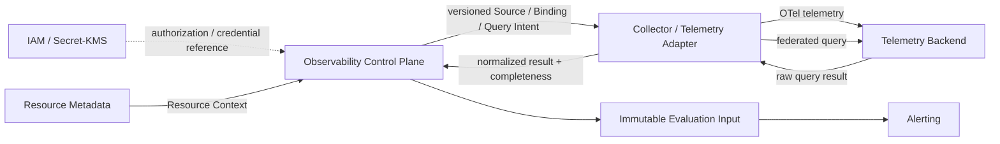

# COP Observability Domain Content Implementation Plan

> **For agentic workers:** REQUIRED SUB-SKILL: Use superpowers:subagent-driven-development (recommended) or superpowers:executing-plans to implement this plan task-by-task. Steps use checkbox (`- [ ]`) syntax for tracking.

**Goal:** 将 `COP-DOM-005` 从初始化骨架更新为可评审的 Observability 领域文档，同时保持稳定文档 ID、`draft` 门禁和既有引用。

**Architecture:** 只修改 `docs/domains/observability-domain.md`，以 capability-aligned aggregates 描述 Telemetry Source、Telemetry Capability、Signal Definition、Signal Binding、Query Intent、Query Job 和 Evaluation Input。通过一个 Mermaid flowchart 固定 IAM/Secret、Resource Metadata、Control Plane、Collector/Telemetry Adapter、Telemetry Backend 与 Alerting 的单向责任边界，并用 PowerShell 对元数据、结构、术语、完整性、链接、编码和提交范围执行确定性验证。

**Tech Stack:** Markdown、YAML front matter、Mermaid、PowerShell、Git

---

## File Structure

- Create: `docs/superpowers/plans/2026-08-07-observability-domain-content.md` - 保存本实施计划、完整目标内容与可重复验证命令。
- Modify: `docs/domains/observability-domain.md` - 定义 Observability 领域当前设计；保持 `COP-DOM-005` 和 `draft` 状态。
- Do not modify: `docs/domains/README.md`、关联领域文档、Infrastructure、API、RFC 或 ADR；本次没有新增、移动、废弃或接受权威文档。

### Task 1: Define the Observability domain document

**Files:**
- Modify: `docs/domains/observability-domain.md`
- Reference: `docs/superpowers/specs/2026-08-07-observability-domain-content-design.md`
- Reference: `docs/domains/domain-landscape.md`
- Reference: `docs/domains/resource-metadata-domain.md`
- Reference: `docs/infrastructure/observability-stack.md`
- Reference: `docs/api/event-contracts.md`

- [ ] **Step 1: Run the requirement gate against the skeleton document (RED)**

```powershell
$ErrorActionPreference = 'Stop'
$path = 'docs/domains/observability-domain.md'
$content = Get-Content -Raw -Encoding UTF8 $path
if (-not $content.Contains('version: 0.2.0')) { throw 'RED: expected Observability version 0.2.0' }
if (-not $content.Contains('### Observability Responsibility Boundary')) { throw 'RED: responsibility boundary is missing' }
if (-not $content.Contains('Evaluation Input')) { throw 'RED: Evaluation Input model is missing' }
throw 'RED gate unexpectedly passed against the skeleton'
```

Expected: command fails first with `RED: expected Observability version 0.2.0`, proving the current `0.1.0` skeleton does not satisfy the approved design.

- [ ] **Step 2: Replace the skeleton with the approved Observability domain content**

Replace `docs/domains/observability-domain.md` with exactly:

````markdown
---
id: COP-DOM-005
title: COP Observability Domain
status: draft
version: 0.2.0
owners:
  - architecture
last_updated: 2026-08-07
related:
  - COP-DOM-001
  - COP-DOM-003
  - COP-INFRA-004
  - COP-API-002
rfc: []
adr: []
---

# COP 可观测领域

## Purpose

定义受管环境 Metrics、Logs、Traces 的接入治理、Signal 语义、Resource 关联、统一查询和不可变 Evaluation Input 边界，使 COP 能在不接管原始遥测权威的前提下提供可授权、可追溯且完整性明确的观测能力。

## Scope

- 稳定、单一 Tenant 的 Telemetry Source 与版本化配置。
- Telemetry Capability 与统一 Telemetry Adapter Contract。
- Metric、Log、Trace 的 Signal Definition 与 Signal Binding。
- Resource Context 关联和 unresolved/quarantined 输入隔离。
- 版本化 Query Intent、有界同步查询和异步 Query Job。
- 联邦查询、结果完整性、受控 Projection 和 Evaluation Input。
- OTel 接入路由与 Backend 查询的领域治理边界。

## Non-goals

- 保存完整原始 Metrics、Logs、Traces 或成为新的 Telemetry Backend。
- 选择 Collector、Backend、数据库、缓存、消息、对象存储、查询引擎或部署产品。
- 创建或修改 Resource Identity、Resource Metadata 私有事实或跨 Tenant Projection。
- 执行 alert rule、产生 evaluation outcome、管理 Alert lifecycle 或 notification orchestration。
- 将 COP 自身 Platform Observability 与受管环境遥测合并为同一写模型。
- 定义 Dashboard 布局、查询 UI、REST 字段、表结构、retention 数值、限流参数或 SLO。

## Context

Observability 是消费 Resource Context 的 Core bounded context，拥有 Telemetry Source、Signal Binding、统一查询语义和资源关联。Telemetry Backend 保留原始 Metrics、Logs、Traces 与查询引擎内部语义权威；Resource Metadata 拥有 Resource Identity；Alerting 独占规则求值、evaluation outcome 和 Alert lifecycle；Platform Observability 仍是基础设施跨切面能力。本文保持 `draft`，仅用于设计讨论，不能作为 `cop-platform` 的强制实现依据。

## Ubiquitous Language

| Term | Meaning |
| --- | --- |
| Telemetry Source | Tenant 内对一个 Telemetry Backend identity 的稳定、受治理接入记录 |
| Telemetry Capability | Adapter 支持的 Signal 类型、OTel 接入、查询、聚合、分页/流式、correlation 与 Contract version |
| Signal Definition | 稳定 Signal ID、Metric/Log/Trace 类型、单位或语义、允许维度和敏感级别 |
| Signal Binding | Source backend selector、Signal Definition 与 Resource Context 的版本化映射 |
| Query Intent | 不可变版本的查询期望，声明 Signal、Resource/Source scope、时间窗、过滤、聚合、完整性和结果限制 |
| Query Job | 固定 Intent、Source、Binding、Signal、Resource Context、Capability 和授权上下文的一次异步执行 |
| Evaluation Input | 已提交、不可变、带 provenance 与完整性的 Signal 输入事实，不包含 Alerting 的规则结果 |

## Bounded Context

### Observability Responsibility Boundary

Observability 拥有 Source、Capability、Signal Definition/Binding、Query Intent/Job、结果完整性和 Evaluation Input 语义。IAM 拥有 Principal、Tenant 和授权决策；Secret/KMS 拥有 credential material；Resource Metadata 拥有 Resource Identity 和 Resource Context；Telemetry Backend 拥有原始遥测；Alerting 拥有规则求值、outcome 与 Alert lifecycle；Infrastructure 拥有 Collector、Backend 和 Platform Observability 的运行实现。

Control Plane 管理 Source、Binding、Query Intent 和 Query Job。Collector/Telemetry Adapter 只执行已授权、固定版本和受 scope 限制的 OTel 路由或 Backend 查询，不创建治理意图、不扩大权限、不选择其他 credential。领域之间不共享可写存储，也不直接写入彼此私有事实。

### Telemetry Source and Capability Model

Telemetry Source 使用不可变内部 `source_id`，每个 Source 只对应一个 Tenant 和一个 Backend identity，并引用当前配置版本、Credential Reference 与 Capability/Adapter Contract version。Tenant 或 Backend identity 变化必须创建新 Source；endpoint、路由或 credential 变化创建新配置版本，历史版本保留审计。

Source 生命周期仅为 `Pending`、`Validating`、`Active`、`Degraded`、`Suspended`、`Revoked`。`Degraded` 表示健康或依赖异常而不改变身份；`Suspended` 停止新路由和 Job 派发；`Revoked` 是终态且 ID 不复用。Observability 不保存 credential material；新执行只使用当前有效配置，已创建 Job 固定原版本。

Telemetry Capability 声明 Adapter 支持的 Signal 类型、OTel 接入、查询操作、时间范围、分页或流式、聚合和 correlation 能力。同步查询和 Query Job 创建前验证能力；执行中不得自动切换 Adapter 或 Capability/Contract version。

### Signal Definition and Binding Model

Signal Definition 使用稳定 `signal_id` 和不可变版本，定义 `Metric`、`Log` 或 `Trace` 类型、单位或语义、允许维度和敏感级别。Backend signal name、attribute、stream、trace selector 与查询语言留在 Adapter 边界，不替代领域 Signal ID。

Signal Binding 将 Source backend selector 映射到 Signal Definition 与 Resource Context reference，并记录 binding version、source schema、provenance 和解析状态。解析成功且处于有效状态的 Binding 才能用于查询。无法解析、存在歧义、跨 Tenant、schema 不兼容或敏感级别冲突时进入 `Unresolved` 或 `Quarantined`，不得创建 Resource Identity。

Binding 可以被激活、暂停、撤销或重新解析；旧版本保持审计，但新 Query Job 不得使用无效版本。三类 Signal 使用同一 Contract，同时保留各自时间语义、结果形态、聚合能力和敏感性约束。OpenTelemetry 是接入 Contract，不是领域实体。

### Query Intent and Execution Model

Query Intent 是不可变版本，声明 Signal、Resource scope、Source scope、时间窗、过滤、聚合、完整性要求、结果限制和允许的执行模式。小范围交互查询可以同步执行；跨 Source、大时间窗、导出和 Evaluation Input 生成使用可取消、可分页、可审计的 Query Job。

同步查询和 Query Job 执行前先验证 Tenant、Principal、Source、Resource Context、Signal、Binding、Capability/Contract 和敏感级别。Query Job 创建时固定上述引用、版本与授权上下文，执行中不得漂移。

Query Job 状态仅为 `Queued`、`Dispatched`、`Running`、`Succeeded`、`Failed`、`Cancelled`、`Expired`。`Succeeded` 只表示执行流程完成，不等于结果完整。Adapter 将统一 Query Intent 转换为 Backend 请求，并返回规范化结果、provenance 和完整性。

### Result Completeness and Evaluation Input Model

结果按 Source、Signal、Resource 和时间窗标记为 `Complete`、`Partial`、`Stale` 或 `Unavailable`。缺失不得转换为零值、最近值、空集合或“无数据”。联邦查询不承诺跨 Backend 全局一致快照；部分结果必须声明失败来源和未覆盖范围。

短期 Query Projection、索引摘要和缓存声明 owner、source、`as_of`、freshness、retention、completeness 和可重建性，不升级为原始遥测权威，也不成为绕过 Tenant 或敏感级别授权的读取路径。

Evaluation Input 是已提交、不可变的 Signal 输入事实，引用 Query Intent version、Query Job、Source/config version、Signal Definition/Binding version、Resource Context、时间窗和 Adapter Contract version，并记录 provenance、完整性、content hash、idempotency key 和 correlation。它不包含 alert rule、阈值判断、evaluation outcome 或 Alert state。Alerting 对不满足完整性策略的输入记录 evaluation failure，不得将缺失视为正常结果。

### Observability Relationship Map



箭头不表示共享存储、credential material 复制、跨领域直接写入、跨 Backend 分布式事务或部署拓扑。原始遥测仍由 Telemetry Backend 保持权威；Alerting 只消费不可变输入事实。

### Failure and Recovery

重试、并发、限流、Circuit Breaker 和 retry budget 按 `Tenant + Source + Adapter` 隔离。仅标准化为可重试的错误执行有界 backoff/jitter；认证失败、授权拒绝、无效 scope、Contract violation 和敏感级别冲突不自动重试。

标准错误分类为 `AuthenticationFailed`、`AuthorizationDenied`、`RateLimited`、`BackendUnavailable`、`InvalidQuery`、`InvalidScope`、`UnsupportedCapability`、`BindingUnresolved` 和 `ContractViolation`。Backend 原始诊断只作为受控证据引用，不成为普通查询、事件或日志 Contract。

恢复前重新验证 Source、配置、Binding、Resource Context、Capability/Contract、授权和敏感级别。Job cancellation 或 expiry 使未开始执行失效；残缺页面、流式中断或部分 Source 失败只能产生 `Partial` 或 `Unavailable`，不能拼接为 `Complete`。任何 Tenant、授权、Binding、敏感级别、Capability 或配置状态无法确认时 fail closed。

### Validation Strategy

- **Source identity:** 验证配置和 credential rotation 不改变 Source ID，Backend identity 变化创建新 Source，Revoked ID 不复用。
- **Tenant isolation:** 验证 Source、Signal、Binding、Query、Projection 和 Evaluation Input 跨 Tenant 默认拒绝且不泄漏对象存在性。
- **Signal semantics:** 验证 Metrics、Logs、Traces 使用同一 Contract，同时保持类型、时间、结果和敏感级别差异。
- **Binding resolution:** 验证 unresolved、歧义、跨 Tenant、schema 不兼容和敏感冲突被隔离且不创建 Resource Identity。
- **Query determinism:** 验证 Query Intent、Source、Binding、Signal、Resource Context 和 Capability/Contract version 在执行中不漂移。
- **Contract conformance:** 验证 OTel 接入和不同 Backend Adapter 通过同一 Telemetry Adapter Contract conformance suite。
- **Federated completeness:** 验证跨 Source、分页、流式和 stale 失败不会伪装为全局一致或 Complete。
- **Evaluation boundary:** 验证 Evaluation Input 不包含 Alert rule、outcome 或 state，不完整输入由 Alerting 记录 evaluation failure。
- **Idempotency and isolation:** 验证 duplicate、out-of-order、replay、expected version、并发冲突和 Source/Adapter 局部故障。
- **Traceability and secrecy:** 验证 Source、Binding、Intent、Job、Adapter、完整性和 Input 可审计，事件与日志不泄漏 credential 或敏感 payload。
- **Ownership separation:** 验证受管环境 Observability 与 Platform Observability 可复用 Contract，但不共享写模型或领域所有权。

### Success Criteria

读者能识别 Observability、Telemetry Backend、Resource Metadata、IAM、Secret/KMS、Alerting、Infrastructure 和 Platform Observability 的事实所有权。Source 身份、Signal/Binding、同步/异步查询、联邦完整性、Evaluation Input、双重授权、故障隔离、幂等和审计语义均可验证；文档不引入未经批准的产品、API、部署、数值或跨领域实现决策。

## Aggregates and Entities

| Aggregate or capability | Ownership | Key references and boundaries |
| --- | --- | --- |
| Telemetry Source | 稳定 Source identity、Tenant、Backend identity、配置版本、生命周期和健康 | 引用 Credential Reference 与 Capability；不保存 credential material 或原始遥测 |
| Telemetry Capability | Adapter 支持范围与 Contract version | Provider/Backend 特有协议留在 Adapter；执行中不自动切换版本 |
| Signal Definition | 稳定 Signal ID、类型、语义、维度和敏感级别 | Backend selector 不替代领域 ID；语义变化创建新版本 |
| Signal Binding | Source selector、Signal Definition 与 Resource Context 的版本化映射 | unresolved/quarantined 不创建 Resource Identity，不用于新查询 |
| Query Intent | 不可变查询期望、scope、时间窗、过滤、聚合与完整性 | 同步查询与 Query Job 共用；不包含 Backend 查询语言 |
| Query Job | 固定版本与授权上下文的一次异步执行 | 管理状态与 progress；Succeeded 不等于 Complete |
| Evaluation Input | 不可变 Signal 输入事实、provenance 和完整性 | Alerting 拥有规则、outcome 和 Alert lifecycle；不保存完整原始遥测 |

Source 生命周期为 `Pending`、`Validating`、`Active`、`Degraded`、`Suspended`、`Revoked`。Query Job 生命周期为 `Queued`、`Dispatched`、`Running`、`Succeeded`、`Failed`、`Cancelled`、`Expired`。Signal Binding 保留解析与有效性状态，`Unresolved`、`Quarantined`、暂停或撤销版本不得用于新执行。

## Commands and Queries

### Commands

命令包括 RegisterTelemetrySource、ValidateTelemetrySource、ReviseTelemetrySourceConfig、SuspendTelemetrySource、ResumeTelemetrySource、RevokeTelemetrySource；DefineSignal、ReviseSignalDefinition；CreateSignalBinding、ResolveSignalBinding、QuarantineSignalBinding、ActivateSignalBinding、SuspendSignalBinding、RevokeSignalBinding；CreateQueryIntent、ReviseQueryIntent；CreateQueryJob、DispatchQueryJob、StartQueryJob、CompleteQueryJob、FailQueryJob、CancelQueryJob、ExpireQueryJob；CommitEvaluationInput、InvalidateEvaluationInput。

所有管理命令携带 Tenant、actor/source、idempotency key 和 expected version，并校验 Source、Binding、Resource Context、Signal、Capability/Contract、授权、敏感级别和状态转换。非法命令与冲突显式拒绝，不使用 last-write-wins 或分布式事务。

### Queries

查询提供 Source identity/lifecycle/health/current config/capability，Signal Definition/version/type/semantics/sensitivity，Binding resolution/Resource Context/source schema/provenance，Query Intent 当前或历史版本与执行计划预览，受控同步查询，Query Job progress/error/result completeness，以及 Evaluation Input provenance/time window/Resource/Signal/completeness/audit metadata。

查询应用 IAM、Tenant isolation、Source 权限、Resource/Signal scope 和敏感级别。普通接口不返回 credential material、可执行 token、原始 Backend diagnostic evidence 或未授权 Logs/Traces payload。

## Domain Events

### Events

事件覆盖 Source 注册、验证、健康和生命周期；Signal Definition 修订；Binding 创建、解析、隔离和状态变化；Query Job 状态；Evaluation Input 提交和失效。事件采用最小 at-least-once Contract，只携带稳定 ID、Tenant、版本、scope reference、status、标准错误分类或受控 reference、time、correlation 和必要完整性，不携带 credential、Secret、原始 Backend diagnostic evidence 或完整遥测 payload。

消费者使用 event ID、aggregate version 和 Job/Input idempotency key 处理 duplicate、out-of-order 和 replay。未来事件必须符合 `COP-API-002`；只有该文档为 `accepted` 时才具有实现约束力。

### Audit

Source、Binding、Query Intent、Query Job、Adapter/Capability、授权决策、结果完整性和 Evaluation Input 形成连续审计链。高频查询和 OTel 流量可以使用受控批次或摘要，但不能隐藏 Source、Resource/Signal scope、版本、完整性和失败，也不得记录 credential 或原始敏感 payload。

## Invariants

- Telemetry Source 使用不可变内部 ID，只属于一个 Tenant；Revoked ID 不得复用。
- Backend identity 或 Tenant 边界变化创建新 Source；配置和 credential rotation 生成新版本，不改变 Source ID。
- Observability 不保存 credential material；执行只使用有效 Credential Reference 和固定配置版本。
- Signal Definition 使用稳定 ID 和不可变版本；Backend 名称、selector 或查询语言不能替代领域 Signal ID。
- Signal Binding 必须绑定同一 Tenant 的 Source、Signal 和 Resource Context；无效 Binding 不得用于新查询。
- Observability 不创建 Resource Identity，不修改 Resource 主数据，不拥有 Alert rule、evaluation outcome 或 Alert lifecycle。
- 同步查询和 Query Job 固定 Source、Binding、Signal、Resource Context 和 Capability/Contract version，执行中不得漂移。
- 查询结果真实声明 Complete、Partial、Stale 或 Unavailable；缺失不得伪装为零值、最近值或成功数据。
- Evaluation Input 不可变、可追溯并保留完整性；不完整输入不能成为正常 Alert evaluation result。
- 管理命令携带 idempotency key 和 expected version；并发冲突显式拒绝。
- Tenant、授权、Binding、敏感级别、Capability 或配置状态无法确认时 fail closed。

## Relationships

- [COP-DOM-001](domain-landscape.md)
- [COP-DOM-003](resource-metadata-domain.md)
- [COP-INFRA-004](../infrastructure/observability-stack.md)
- [COP-API-002](../api/event-contracts.md)

IAM 和 Secret/KMS 提供授权与 credential reference；Resource Metadata 发布 Resource Context；Control Plane 治理 Source、Binding 与 Query；Collector/Adapter 执行 OTel 路由和联邦查询；Telemetry Backend 保留原始遥测权威；Observability 只向 Alerting 发布不可变 Evaluation Input。Platform Observability 仍由 Infrastructure 负责。

## Constraints

- `COP-DOM-005` 保持 `draft`；只有显式接受后才形成 `cop-platform` 实现约束。
- 不得保存或传播 credential、Secret、完整原始遥测、原始 Backend diagnostic evidence 或未授权 Tenant 数据。
- 不得共享可写存储、跨领域直接写入、隐式 scope 扩大、last-write-wins、exactly-once、全局排序、跨 Backend 全局一致快照或分布式事务。
- Partial、Stale、Unavailable、Degraded、Failed 和 unresolved 不得伪装为完整成功；授权、Tenant、Binding、Capability 或敏感级别无法确认时 fail closed。
- 重大所有权、兼容性、产品、API、部署或数值变更必须经过 RFC/ADR，不由本文决定。

## Quality Attributes

- **Boundary clarity:** Source、Signal、Resource Context、原始 Telemetry、Evaluation Input、Alert outcome 和 Platform Observability 的 owner 可识别。
- **Tenant isolation:** Source、Binding、Query、Projection 和 Evaluation Input 单一 Tenant 归属，跨 Tenant 默认拒绝。
- **Security:** credential authority 外置、双重 scope 授权、敏感级别校验和 fail closed。
- **Reliability:** 固定版本、有界重试、明确完整性、at-least-once、幂等 replay 和恢复重验证。
- **Failure isolation:** 并发、限流、Circuit Breaker 和 retry budget 按 Tenant/Source/Adapter 隔离。
- **Traceability:** Source、Binding、Intent、Job、Adapter、完整性和 Evaluation Input 连续可审计。
- **Evolvability:** Signal、Capability 和 Adapter Contract 版本化，Backend 私有语义不泄漏。

## Implementation Guidance

实现候选应先验证 Tenant、Principal、Source/config version、Binding、Signal、Resource Context、Capability/Contract、敏感级别和授权，再执行受控 OTel 路由或查询。小查询可同步执行；跨 Source、大时间窗、导出和 Evaluation Input 使用 Query Job。Adapter 只返回规范化结果、标准错误、provenance 和完整性；Projection 不得升级为原始遥测权威。本文不规定 REST 字段、表结构、查询引擎、缓存、Collector、Backend、retention 数值或部署拓扑。

## References

- [COP-DOM-001](domain-landscape.md)
- [COP-DOM-003](resource-metadata-domain.md)
- [COP-INFRA-004](../infrastructure/observability-stack.md)
- [COP-API-002](../api/event-contracts.md)
````

- [ ] **Step 3: Run the structural and semantic checks (GREEN)**

```powershell
$ErrorActionPreference = 'Stop'
$path = 'docs/domains/observability-domain.md'
$bytes = [IO.File]::ReadAllBytes((Resolve-Path $path))
$content = [Text.UTF8Encoding]::new($false, $true).GetString($bytes).Replace(([string][char]13 + [char]10), [string][char]10)
if ($bytes.Length -ge 3 -and $bytes[0] -eq 0xEF -and $bytes[1] -eq 0xBB -and $bytes[2] -eq 0xBF) { throw 'UTF-8 BOM found' }
if ($content.Contains([char]0) -or $content.Contains([char]0xFFFD)) { throw 'Invalid text character found' }
$expectedFrontMatter = @'
---
id: COP-DOM-005
title: COP Observability Domain
status: draft
version: 0.2.0
owners:
  - architecture
last_updated: 2026-08-07
related:
  - COP-DOM-001
  - COP-DOM-003
  - COP-INFRA-004
  - COP-API-002
rfc: []
adr: []
---
'@
$fm = [regex]::Match($content, '\A---\n.*?\n---\n', [Text.RegularExpressions.RegexOptions]::Singleline)
if (-not $fm.Success -or $fm.Value.TrimEnd() -cne $expectedFrontMatter.TrimEnd()) { throw 'Front matter mismatch' }
$h2Expected = @('Purpose','Scope','Non-goals','Context','Ubiquitous Language','Bounded Context','Aggregates and Entities','Commands and Queries','Domain Events','Invariants','Relationships','Constraints','Quality Attributes','Implementation Guidance','References')
$h2Actual = @([regex]::Matches($content, '(?m)^## (.+)$') | ForEach-Object { $_.Groups[1].Value })
if (($h2Actual -join '|') -cne ($h2Expected -join '|')) { throw 'H2 order mismatch' }
$h3Expected = @('Observability Responsibility Boundary','Telemetry Source and Capability Model','Signal Definition and Binding Model','Query Intent and Execution Model','Result Completeness and Evaluation Input Model','Observability Relationship Map','Failure and Recovery','Validation Strategy','Success Criteria','Commands','Queries','Events','Audit')
$h3Actual = @([regex]::Matches($content, '(?m)^### (.+)$') | ForEach-Object { $_.Groups[1].Value })
if (($h3Actual -join '|') -cne ($h3Expected -join '|')) { throw 'H3 order mismatch' }
foreach ($value in @(
  'Telemetry Backend 保留原始 Metrics、Logs、Traces', 'Observability 不创建 Resource Identity', 'Alerting 独占规则求值',
  '不可变内部 `source_id`', '每个 Source 只对应一个 Tenant', 'Pending', 'Validating', 'Active', 'Degraded', 'Suspended', 'Revoked', 'ID 不复用',
  'Credential Reference', 'Telemetry Capability', 'Adapter Contract version', 'Metric', 'Log', 'Trace', '不可变内部 `signal_id`',
  'Signal Binding', 'Unresolved', 'Quarantined', 'Resource Context', 'OpenTelemetry 是接入 Contract',
  'Query Intent', '同步执行', 'Query Job', 'Queued', 'Dispatched', 'Running', 'Succeeded', 'Failed', 'Cancelled', 'Expired',
  'Complete', 'Partial', 'Stale', 'Unavailable', 'Evaluation Input', 'evaluation failure',
  'Tenant + Source + Adapter', 'Circuit Breaker', 'AuthenticationFailed', 'AuthorizationDenied', 'RateLimited', 'BackendUnavailable',
  'InvalidQuery', 'InvalidScope', 'UnsupportedCapability', 'BindingUnresolved', 'ContractViolation',
  'at-least-once', 'duplicate', 'out-of-order', 'replay', 'expected version', 'idempotency key', 'fail closed',
  'Platform Observability', 'RegisterTelemetrySource', 'CommitEvaluationInput'
)) { if (-not $content.Contains($value)) { throw "Missing requirement: $value" } }
$ticks = ([string][char]96) * 3
$mermaidPattern = '(?ms)^' + [regex]::Escape($ticks) + 'mermaid\n(.*?)^' + [regex]::Escape($ticks) + '$'
$mermaid = [regex]::Matches($content, $mermaidPattern)
if ($mermaid.Count -ne 1) { throw "Expected one Mermaid block, found $($mermaid.Count)" }
$diagram = $mermaid[0].Groups[1].Value
foreach ($value in @(
  'IAM -.->|"authorization / credential reference"| CP', 'RM -->|"Resource Context"| CP',
  'CP -->|"versioned Source / Binding / Query Intent"| DP', 'DP -->|"OTel telemetry"| TB',
  'DP -->|"federated query"| TB', 'TB -->|"raw query result"| DP',
  'DP -->|"normalized result + completeness"| CP', 'CP --> EI', 'EI --> AL'
)) { if (-not $diagram.Contains($value)) { throw "Missing diagram relation: $value" } }
$table = [regex]::Match($content, '(?ms)^\| Aggregate or capability \| Ownership \| Key references and boundaries \|\n(.*?)\n\n')
if (-not $table.Success) { throw 'Aggregate table missing' }
$rows = @($table.Groups[1].Value -split [char]10)
if ($rows.Count -ne 8) { throw "Expected separator and 7 aggregate rows, found $($rows.Count)" }
foreach ($row in $rows) { if (([regex]::Matches($row, '\|')).Count -ne 4) { throw "Aggregate table column mismatch: $row" } }
foreach ($value in @('TBD','TODO','lorem ipsum','当前尚未形成')) { if ($content.Contains($value)) { throw "Forbidden filler: $value" } }
$file = Get-Item $path
$links = [regex]::Matches($content, '\[[^\]]+\]\(([^)#]+\.md)(?:#[^)]+)?\)')
if ($links.Count -ne 8) { throw "Expected 8 relationship and reference links, found $($links.Count)" }
foreach ($link in $links) { if (-not (Test-Path -LiteralPath (Join-Path $file.DirectoryName $link.Groups[1].Value))) { throw "Broken link: $($link.Groups[1].Value)" } }
git diff --check
if ($LASTEXITCODE -ne 0) { throw 'git diff --check failed' }
$changed = @(git diff --name-only)
if ($changed.Count -ne 1 -or $changed[0] -ne $path) { throw "Unexpected file scope: $($changed -join ', ')" }
'PASS: Observability domain structure and semantics'
```

Expected output: `PASS: Observability domain structure and semantics`.

- [ ] **Step 4: Perform the manual ownership, lifecycle and consistency review**

Read the target source or rendered Markdown and confirm:

- Observability owns Source, Capability, Signal, Binding, Query and Evaluation Input semantics; IAM, Secret/KMS, Resource Metadata, Telemetry Backend, Alerting and Infrastructure retain their approved authorities.
- Source identity is stable and Tenant-bound; configuration or credential rotation does not change Source ID, Backend identity change creates a new Source, and Revoked IDs are never reused.
- Metrics, Logs and Traces use one Signal/Binding Contract while preserving type-specific time, result, aggregation and sensitivity semantics.
- unresolved, ambiguous, cross-Tenant, incompatible or sensitive Binding inputs are isolated and never create Resource Identity.
- synchronous queries and Query Jobs fix Intent, Source/config, Signal, Binding, Resource Context, Capability/Contract and authorization versions.
- Complete, Partial, Stale and Unavailable remain distinct; missing data is never replaced by zero, latest value or apparent success.
- Evaluation Input is immutable and contains Signal input facts only; Alerting retains rule evaluation, outcome and Alert lifecycle ownership.
- retry, throttling, Circuit Breaker and retry budget are isolated per Tenant/Source/Adapter; security and Contract errors do not loop.
- Commands, Queries, Events and Audit preserve Tenant, actor/source, version, idempotency, completeness and correlation without exposing credential or raw sensitive payload.
- managed-environment Observability and Platform Observability remain separate; the document does not imply shared storage, exactly-once, global ordering, distributed transactions, product selection, deployment topology or accepted authority.

If any item fails, correct only the target document and rerun Step 3.

- [ ] **Step 5: Run full repository link and scope checks**

```powershell
$ErrorActionPreference = 'Stop'
$markdown = @(Get-Item README.md,CONTRIBUTING.md,AGENTS.md) + @(Get-ChildItem docs,adr,rfc,templates -Recurse -File -Filter '*.md' | Where-Object { $_.FullName -notmatch '[\\/]docs[\\/]superpowers[\\/]' })
foreach ($file in $markdown) {
  $content = Get-Content -Raw -Encoding UTF8 $file.FullName
  foreach ($link in [regex]::Matches($content, '\[[^\]]+\]\(([^)#]+\.md)(?:#[^)]+)?\)')) {
    if (-not (Test-Path -LiteralPath (Join-Path $file.DirectoryName $link.Groups[1].Value))) { throw "Broken link in $($file.FullName): $($link.Groups[1].Value)" }
  }
}
git diff --check
if ($LASTEXITCODE -ne 0) { throw 'git diff --check failed' }
$changed = @(git diff --name-only)
if ($changed.Count -ne 1 -or $changed[0] -ne 'docs/domains/observability-domain.md') { throw "Unexpected file scope: $($changed -join ', ')" }
'PASS: repository links and scope'
```

Expected output: `PASS: repository links and scope`.

- [ ] **Step 6: Commit the Observability domain document**

```powershell
git add docs/domains/observability-domain.md
git commit -m "docs: define observability domain content"
```

- [ ] **Step 7: Verify the implementation commit contains only the target document**

```powershell
$files = @(git diff-tree --no-commit-id --name-only -r HEAD)
if ($files.Count -ne 1 -or $files[0] -ne 'docs/domains/observability-domain.md') { throw "Unexpected committed files: $($files -join ', ')" }
if (git status --porcelain) { throw 'Worktree is not clean' }
'PASS: Observability domain commit'
```

Expected output: `PASS: Observability domain commit`.

### Plan Self-Review

- [ ] Compare this plan with all 18 acceptance conditions in `docs/superpowers/specs/2026-08-07-observability-domain-content-design.md`; conditions 1-15 are covered by target content, exact GREEN assertions and manual review, condition 16 by link and placeholder checks, condition 17 by byte-level UTF-8/Mermaid/table checks, and condition 18 by diff and single-file commit verification.
- [ ] Confirm the plan preserves `COP-DOM-005` ID, owners, related, rfc and adr; changes version/date only as approved; keeps `draft`; preserves four existing references; and changes no index or related document.
- [ ] Confirm Source identity/lifecycle, credential authority, Signal/Binding semantics, Query determinism, Adapter Contract, completeness, Evaluation Input, Alerting boundary, failure isolation, Tenant isolation, audit, secrecy and Platform Observability separation appear in both target content and checks.
- [ ] Confirm there are no literal filler placeholders, invented products, deployment decisions, REST/database implementation details, numerical policies or unauthorized RFC/ADR decisions.

### Commit the Plan

- [ ] **Step 8: Commit the implementation plan**

```powershell
git add docs/superpowers/plans/2026-08-07-observability-domain-content.md
git commit -m "docs: plan observability domain content"
```
