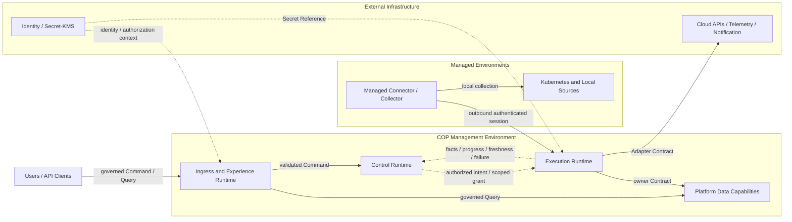

# COP Infrastructure Overview Content Implementation Plan

> **For agentic workers:** REQUIRED SUB-SKILL: Use superpowers:subagent-driven-development (recommended) or superpowers:executing-plans to implement this plan task-by-task. Steps use checkbox (`- [ ]`) syntax for tracking.

**Goal:** 将 `COP-INFRA-001` 从初始化骨架补充为产品中立、可验证的基础设施边界与阶段演进总览。

**Architecture:** 只修改 `docs/infrastructure/infrastructure-overview.md`，采用 `Boundary Contract + Evolution Profiles`。文档固定 COP Management Environment、Managed Environments 和 External Infrastructure 三类逻辑部署区域，以及 Management Environment 内部能力、Command/Execution/Query/Event 路径、安全与恢复不变量；具体 Kubernetes、Network、Storage 和 Observability Stack 细节委托给专项文档。

**Tech Stack:** Markdown、YAML front matter、Mermaid、PowerShell、Git

---

## File Structure

- Modify: `docs/infrastructure/infrastructure-overview.md`
  - 唯一实施目标；拥有跨专项基础设施边界、能力角色、数据流、安全、故障、恢复和 Evolution Profile 语义。
- Reference only: `docs/superpowers/specs/2026-08-10-infrastructure-overview-content-design.md`
  - 已批准设计；实施不得扩大其范围。
- Reference only: `docs/architecture/logical-architecture.md`
  - 提供逻辑责任平面，不允许目标文档把逻辑平面强制映射为固定部署单元。
- Reference only: `docs/architecture/control-plane-data-plane.md`
  - 提供 authorized intent、fact reporting、Managed Connector/Collector 和 outbound-only connection 语义。
- Reference only: `docs/roadmap/mvp-definition.md`
  - 提供 MVP 能力范围，不允许基础设施总览预建非 MVP 能力。
- Reference only: `docs/infrastructure/kubernetes-topology.md`
- Reference only: `docs/infrastructure/network-and-ingress.md`
- Reference only: `docs/infrastructure/data-storage.md`
- Reference only: `docs/infrastructure/observability-stack.md`
  - 四份专项文档分别拥有 Kubernetes、Network、Storage 和 Observability Stack 细节；本任务不修改这些文件。

### Task 1: Define the Infrastructure Overview document

**Files:**
- Modify: `docs/infrastructure/infrastructure-overview.md`
- Test: PowerShell structural, semantic, UTF-8, link and Git scope checks

- [ ] **Step 1: Run the target-document gate against the current stub (RED)**

Run from the isolated implementation worktree created with `superpowers:using-git-worktrees`:

```powershell
$ErrorActionPreference = 'Stop'
$path = 'docs/infrastructure/infrastructure-overview.md'
$bytes = [IO.File]::ReadAllBytes((Resolve-Path $path))
$content = [Text.UTF8Encoding]::new($false, $true).GetString($bytes).Replace(([string][char]13 + [char]10), [string][char]10)
if ($bytes.Length -ge 3 -and $bytes[0] -eq 0xEF -and $bytes[1] -eq 0xBB -and $bytes[2] -eq 0xBF) { throw 'UTF-8 BOM found' }
if ($content.Contains([char]0) -or $content.Contains([char]0xFFFD)) { throw 'Invalid text character found' }
$expectedFrontMatter = @'
---
id: COP-INFRA-001
title: COP Infrastructure Overview
status: draft
version: 0.2.0
owners:
  - architecture
last_updated: 2026-08-10
related:
  - COP-ARCH-002
  - COP-ARCH-003
  - COP-ROAD-002
  - COP-INFRA-002
  - COP-INFRA-003
  - COP-INFRA-004
  - COP-INFRA-005
rfc: []
adr: []
---
'@
$frontMatter = [regex]::Match($content, '\A---\n.*?\n---\n', [Text.RegularExpressions.RegexOptions]::Singleline)
if (-not $frontMatter.Success -or $frontMatter.Value.TrimEnd() -cne $expectedFrontMatter.TrimEnd()) { throw 'Front matter mismatch' }
$h2Expected = @('Purpose','Scope','Non-goals','Context','Architecture or Model','Constraints','Quality Attributes','Implementation Guidance','References')
$h2Actual = @([regex]::Matches($content, '(?m)^## (.+)$') | ForEach-Object { $_.Groups[1].Value })
if (($h2Actual -join '|') -cne ($h2Expected -join '|')) { throw 'H2 order mismatch' }
$h3Expected = @('Infrastructure Responsibility Model','Deployment Zone Model','Management Environment Capabilities','Managed Environment Boundary','External Infrastructure Boundary','Runtime and Data Flows','Security and Trust Boundaries','Failure Isolation and Degradation','Backup, Recovery, and Reconciliation','Evolution Profiles','Infrastructure Relationship Map','Validation Strategy','Success Criteria')
$h3Actual = @([regex]::Matches($content, '(?m)^### (.+)$') | ForEach-Object { $_.Groups[1].Value })
if (($h3Actual -join '|') -cne ($h3Expected -join '|')) { throw 'H3 order mismatch' }
```

Expected: FAIL with `Front matter mismatch` because the current stub is version `0.1.0`, has the old related list, and lacks the approved detailed model.

- [ ] **Step 2: Replace the stub with the approved Infrastructure Overview content**

Use `apply_patch` to replace the complete contents of `docs/infrastructure/infrastructure-overview.md` with:

````markdown
---
id: COP-INFRA-001
title: COP Infrastructure Overview
status: draft
version: 0.2.0
owners:
  - architecture
last_updated: 2026-08-10
related:
  - COP-ARCH-002
  - COP-ARCH-003
  - COP-ROAD-002
  - COP-INFRA-002
  - COP-INFRA-003
  - COP-INFRA-004
  - COP-INFRA-005
rfc: []
adr: []
---

# COP 基础设施总览

## Purpose

定义 COP Management Environment、Managed Environments 和 External Infrastructure 的部署责任、信任边界、基础设施能力、受治理流向、故障隔离、恢复语义和阶段演进，为 Kubernetes、Network、Storage 和 Observability Stack 专项设计提供共同约束。

本文描述逻辑部署区域和基础设施 Contract，不把 Experience、Control、Execution 或 Platform Data responsibility 映射为固定 service、process、cluster、database 或产品。

## Scope

- COP Management Environment、Managed Environments 和 External Infrastructure 三类逻辑部署区域。
- Ingress and Experience Runtime、Control Runtime、Execution Runtime 和 Platform Data Capabilities。
- Transactional State、Ephemeral Acceleration、Event Transport、Durable Object Capability 和 Telemetry Backend 的 authority 与恢复语义。
- Command、Execution、Query 和 Event 四条基础设施路径。
- Workload/subject identity、Tenant、authorization、Secret Reference、audit 和 platform observability。
- Failure isolation、degradation、backup、restore、rebuild、resync 和 reconciliation。
- MVP Self-hosted Baseline、Resilient Self-hosted 和 SaaS-ready Isolation 三个 Evolution Profile。
- 与 Kubernetes Topology、Network and Ingress、Data Storage Architecture 和 Observability Stack 的职责分工。

## Non-goals

- 不选择 Kubernetes distribution、PostgreSQL、Redis、broker、object storage、Telemetry product、Secret/KMS、service mesh、ingress controller 或 cloud managed service。
- 不定义 service、process、package、database、cluster、namespace、node、replica、availability zone、region 或 network segment 数量。
- 不定义 port、protocol、cipher、certificate lifetime、retry count、queue size、capacity、retention、RPO/RTO、failover timing 或数值 SLO。
- 不定义安装手册、Infrastructure as Code module、Helm value、Kubernetes manifest、database schema 或 API payload。
- 不复制逻辑架构、Control Plane/Data Plane 执行语义、领域写模型或四份专项基础设施文档的详细设计。
- 不为 Workflow、Automation、FinOps、AI/RAG、插件市场或 SaaS 商业运营预建基础设施。

## Context

`COP-ARCH-002` 定义逻辑责任平面，`COP-ARCH-003` 定义 Control Plane、Data Plane、Managed Connector/Collector 和 External Adapter Boundary 的执行与信任关系，`COP-ROAD-002` 定义 MVP 范围。本文把这些逻辑责任落实为产品中立的基础设施边界，同时保持 authorized intent、fact reporting、outbound-only managed connection、owner Contract 和 external authority 语义。

`COP-INFRA-002`、`COP-INFRA-003`、`COP-INFRA-004` 和 `COP-INFRA-005` 分别拥有 Kubernetes、Storage、Observability Stack 和 Network 专项设计。本文是跨专项边界枢纽，不通过基础设施部署位置改变领域 ownership 或外部事实权威。所有关联文档当前均为 `draft`；只有 `accepted` 文档和 ADR 才能形成实现约束。

## Architecture or Model

### Infrastructure Responsibility Model

基础设施总览定义三个部署区域、Management Environment 内部能力、跨区域允许的 Contract、安全与恢复不变量，以及 Evolution Profile。逻辑隔离必须可验证，但物理部署可以根据 Profile、风险、合规、负载和故障证据合并或拆分。

基础设施能力只承载和保护领域 owner 提交的事实，不因部署、cache、queue、index、object 或 Telemetry runtime 获得新的业务 authority。跨边界交互不得使用共享可写存储、直接访问私有存储或依赖网络位置产生隐式信任。

| Specialized document | Owns | Must preserve from this overview |
| --- | --- | --- |
| `COP-INFRA-002` Kubernetes Topology | cluster、namespace、workload placement、scheduling 和 runtime isolation | 三类区域、逻辑隔离、workload identity、failure domain 和 Profile 语义 |
| `COP-INFRA-005` Network and Ingress | external entry、service traffic、managed connection 和 network trust | governed ingress、private data capability、outbound-only managed session 和 no implicit trust |
| `COP-INFRA-003` Data Storage Architecture | state category、storage responsibility、backup/restore、retention 和 migration | Preserve/Rebuild/Reconcile、no new authority 和 product-neutral capability role |
| `COP-INFRA-004` Observability Stack | collection、Metrics/Logs/Traces、query path 和 operational telemetry | external raw Telemetry authority、freshness、degradation 和 dependency isolation |

需要改变三类区域、数据权威、安全边界或 Profile 不变量时，先创建或更新 RFC；RFC 接受后关联 ADR，并同步所有受影响的权威文档。

### Deployment Zone Model

**COP Management Environment：** COP runtime、Platform Data capability 和 cross-cutting operational control 所在的 operator-controlled trust boundary。它是逻辑区域，不等于单一 Kubernetes cluster、network segment 或物理位置。由 operator 控制、专用于 COP 且遵循 COP identity、network、backup 和 recovery Contract 的 managed data service，即使物理托管在外部云服务中，也属于该区域的逻辑能力。

**Managed Environments：** COP 所连接的 customer/target trust boundary，包括 Kubernetes cluster、本地 Telemetry source 和其他需要 Managed Connector/Collector 的环境。它们保留本地系统和业务 workload 的执行权威。

**External Infrastructure：** Cloud/Kubernetes API、External Identity Provider、Secret/KMS、Telemetry Backend、Notification System 和其他保留自身事实权威的系统。某个组件可以由 COP operator 部署并与 Management Environment 物理共置，但仍保持独立 authority 和 Contract boundary；物理共置不把 raw Telemetry、identity、Secret 或 Delivery Result 转换为 COP 领域事实。

三个区域可以共享物理基础设施，但 responsibility、workload identity、authorization、data access、failure signal 和 recovery Contract 必须保持可判定。

### Management Environment Capabilities

**Ingress and Experience Runtime：** 承载外部入口、API boundary 和 governed read access。它校验 request identity、Tenant、scope 和 authorization context，然后把 Command 或 Query 路由到 owning Contract；不承载领域规则，不直接访问私有存储。

**Control Runtime：** 承载 policy、authorized intent、task orchestration 和 lifecycle。它持久化经过验证的意图和恢复决策，通过 scoped execution grant 调用 Execution Runtime；不采集 raw Telemetry，也不把最终 authorization 委托给执行方。

**Execution Runtime：** 承载 Adapter、discovery、collection、synchronization 和 fact reporting。它隔离 external dependency，执行有界 backpressure、retry、checkpoint 和 duplicate protection，并通过 owner Contract 提交事实；不扩大 Tenant、account、cluster、resource、operation 或 signal scope。

**Data Infrastructure Capabilities：** 前四项是 Management Environment 的 Platform Data capability；Telemetry Backend 是 COP 使用但保持独立 authority 的 integrated capability。

| Capability role | Authority and use | Failure and recovery semantics |
| --- | --- | --- |
| Transactional State | 保存由领域 owner 提交的 COP authoritative fact、intent 和 lifecycle；基础设施本身不获得领域 ownership | 进入 Preserve；需要受控 backup、restore verification、version 和 audit continuity |
| Ephemeral Acceleration | 提供 cache、coordination、session acceleration 或等价可替换能力 | 不是 authority；失败时允许降级并从 authoritative state Rebuild |
| Event Transport | 传播已提交事实和异步任务信号 | 采用 at-least-once；处理 duplicate、delay、out-of-order 和 replay；不提供分布式事务或全局顺序 |
| Durable Object Capability | 保存受控 object 或 reference，遵循 owner、retention、encryption 和 access Contract | object 与 metadata 可验证关联；普通对象、事件和日志不得包含 credential material |
| Telemetry Backend | 保存 Metrics、Logs、Traces 等 raw Telemetry，并提供外部查询能力 | 保留外部 authority；不可用、partial 或 stale 必须显式，不得伪装为完整成功 |

Transactional State、Ephemeral Acceleration、Event Transport 和 Durable Object Capability 可以使用 operator 选择的自建或 managed implementation，但逻辑责任和恢复 Contract 不随产品变化。Telemetry Backend 可以由 COP 部署或连接，仍不把 raw Telemetry authority 转移给 COP 领域。

### Managed Environment Boundary

Managed Connector/Collector 位于受管环境，只主动建立到 COP 的 outbound authenticated session，通过受控 polling 或 streaming 获取已授权任务并回报 observation、fact、progress、freshness、failure 和 recovery signal。COP 不依赖进入受管环境的 inbound control connection。

Connector/Collector 校验 workload identity、Tenant、task validity、policy/config version、scope 和 execution grant，只执行 scoped collection、discovery 或 synchronization。它使用有界 local buffer 和 duplicate protection，不持有可跨 Tenant、account 或 cluster 复用的长期高权限 credential，也不直接写 Control Runtime 或领域私有存储。

Managed Environment 断连、积压或局部失败只改变自身 freshness、task 或 connection 状态，不改变其他环境、Tenant 或外部实际状态的权威。

### External Infrastructure Boundary

COP 通过 owning Contract 或 Adapter boundary 与 Cloud/Kubernetes API、Identity Provider、Secret/KMS、Telemetry Backend、Notification System 和其他外部系统交互。外部产品字段、credential、供应商错误和内部存储模型不得成为 COP 核心领域不变量。

Cloud/Kubernetes 保留 actual state，External Identity Provider 保留外部认证事实，Secret/KMS 保留 credential material，Telemetry Backend 保留 raw Telemetry，External Notification System 保留最终 Delivery Result。COP 只保存受治理 context、reference、normalized failure classification 和必要 audit evidence。

外部 dependency 故障不允许 COP 接管其 authority、写入其私有存储或把 unknown、partial、stale 和 unavailable 解释为正常成功。

### Runtime and Data Flows

**Command Path：** Ingress and Experience Runtime 校验 identity、Tenant、scope、authorization 和 request Contract，把 Command 交给 owning Control/Domain Contract。Control Runtime 持久化 authorized intent 和 task lifecycle，并区分 accepted、rejected、conflict、timeout、dependency failure 和 unknown outcome；accepted 不等于 completed。

**Execution Path：** Control Runtime 向 Execution Runtime 提供短期、限 Tenant、限资源、限操作的 execution grant 和必要 Secret/KMS Reference。Execution Runtime 调用 External Infrastructure 或处理 Managed Connector/Collector 会话，只回报 observation、fact、progress、freshness、failure 和 recovery signal。Credential material 不进入普通 task、event、log 或领域数据。

**Query Path：** Query 使用 governed read model 或 owner Query Contract，不要求经过 Execution Runtime。Read model 声明 owner、source、`as_of`、freshness 和 failure semantics，并区分 complete、stale、partial、degraded 和 unavailable。调用方不得绕过 owner 读取私有存储。

**Event Path：** Domain Event 只在 authoritative fact 提交后发布。Event Transport 提供 at-least-once 传播；消费者使用稳定 event ID、aggregate version 和业务 idempotency key 处理 duplicate、delay、out-of-order 和 replay，不依赖 exactly-once、全局顺序或跨边界分布式事务。

### Security and Trust Boundaries

- 每次跨部署边界交互显式携带 workload/subject identity、Tenant、scope 和适用 authorization context；网络位置、cluster membership 或共享基础设施不产生隐式信任。
- 自托管可以采用单组织 deployment profile，但 Tenant、identity、authorization、data partition、audit 和 Secret boundary 始终显式，不能推迟到 SaaS 阶段重构。
- Secret 和 credential 只通过受控 Secret/KMS Reference 使用；不得进入 task payload、Domain Event、ordinary log、backup metadata、read model 或普通领域数据。
- 对外入口由 Ingress boundary 统一治理；Platform Data Capabilities 不暴露为未经授权的公共入口。
- Managed Connector/Collector 只主动建立 outbound authenticated session；任务响应在已建立的受控会话内返回。
- 权限遵循 default deny 和 least privilege；无法确认 identity、Tenant、scope、authorization、Secret Reference 或 dependency integrity 时 fail closed。
- 关键配置、授权、task intent、execution result、backup、restore、reconciliation 和 recovery action 保留 actor/source、target、time、result、version 和 correlation audit context。

具体 protocol、certificate lifecycle、port、cipher、network policy 和 encryption implementation 由安全、网络或专项设计决定。

### Failure Isolation and Degradation

- 故障至少按 Tenant、connection、managed environment、Adapter 和 external dependency 隔离；单一失败不得无边界阻塞其他 Tenant、连接或环境。
- Execution Runtime 和 Event Transport 使用有界 queue、backpressure、retry 和 isolation；不得通过无限重试或无界积压维持虚假可用。
- validation、authentication、authorization、scope mismatch 和 incompatible Contract 属于 terminal failure，不自动重试。
- 只有明确 retryable 的 dependency failure 执行有界 backoff；unknown outcome 通过状态查询、idempotent retry 或 reconciliation 确认，不能自动宣称成功或失败。
- External Infrastructure 故障不改变事实权威；COP 明确报告 unavailable、partial、stale、degraded、isolated、recovering 或 failed。
- Management Environment 内部能力可以物理合并，但必须保持可判定的 workload identity、permission、data access、resource quota 和 failure signal，避免单一 runtime 或 dependency 故障静默扩散。

### Backup, Recovery, and Reconciliation

- **Preserve：** committed domain fact、task intent/lifecycle、Tenant、version、audit 和 correlation context。Preserve 数据需要 backup、restore、integrity 和 continuity 验证。
- **Rebuild：** cache、index、governed read model、derived projection 和 ephemeral coordination。它们必须能从 authoritative state 或保留事件重建，不能成为唯一恢复来源。
- **Reconcile：** Cloud/Kubernetes actual state、Telemetry association、external Delivery Result 和 Managed Environment freshness。恢复后通过 resync、query 或 reconciliation 验证外部权威与 COP 引用。
- **Never infer：** 不把 unknown 解释为 success，不把 partial 解释为 complete，不把 queue/cache 解释为 authority，不把网络位置解释为 authorization。

总览要求 backup、restore、rebuild、resync 和 reconciliation 具有可执行路径和验证证据，但不决定 Replica count、RPO/RTO、availability zone、region、failover topology、retention 数值或灾备演练频率。

### Evolution Profiles

| Profile | Baseline capabilities | Entry evidence and boundary |
| --- | --- | --- |
| MVP Self-hosted Baseline | 能力可以物理合并；显式 workload identity、permission、data access、resource boundary、health、dependency、audit；验证 backup/restore、rebuild、reconciliation 和 dependency failure | 以最小可运营闭环为依据；不预设 cluster、node、availability zone 或 region 数量；单组织运行仍保留 Tenant context |
| Resilient Self-hosted | 按风险、合规、负载和 failure domain 拆分 runtime 或 data capability；增强 redundancy、backpressure、restore drill、recovery verification 和 operational evidence | 以已识别风险、负载和故障证据为依据；物理拆分不改变 Contract、authority、Tenant 或依赖方向 |
| SaaS-ready Isolation | 增强 Tenant、workload、network 和 data partition isolation；支持区域化部署和独立故障隔离 | 以多租户风险、合规和运营成熟度为依据；不假设跨 region 全局事务、全局顺序或共享高权限 credential |

Profile 表达 capability maturity，不是产品套餐、开发/测试/生产环境名称或固定拓扑。进入下一 Profile 需要风险、合规、负载、故障和运营成熟度证据；所有持续安全、ownership、Contract 和 recovery 不变量保持有效。

### Infrastructure Relationship Map



区域表示 responsibility、trust 和 failure boundary，不表示固定 cluster、service、process、network segment 或物理位置。实线表示 governed request、owner Contract 或 integration flow；虚线表示 authorized intent、fact signal 或 cross-cutting security context，不表示共享存储或分布式事务。

### Validation Strategy

- **Boundary model：** 验证三个部署区域、Management Environment 能力和 external authority 均可独立识别。
- **Logical/physical separation：** 验证 MVP 可以 co-locate，同时 Control、Execution 和 Data capability 保持可验证逻辑隔离。
- **Flow direction：** 验证 Command、Execution、Query 和 Event 路径不形成共享写存储、循环同步依赖或跨边界私有访问。
- **Managed connection：** 验证 Managed Connector/Collector 只主动建立 outbound authenticated session，且任务和 fact 保持 scoped identity、Tenant 和 authorization context。
- **Data authority：** 验证 Transactional State、Ephemeral Acceleration、Event Transport、Durable Object 和 Telemetry Backend 的 authority 与恢复语义互不混淆。
- **Tenant and secrecy：** 验证自托管 Profile 也保留 Tenant boundary，Secret/credential 不进入普通 task、event、log、backup metadata 或 read model。
- **Failure isolation：** 验证 Tenant、connection、managed environment、Adapter 和 dependency 故障有界隔离，并显式报告 stale、partial、degraded、unavailable 和 unknown。
- **Recovery：** 验证 Preserve、Rebuild、Reconcile 和 Never infer 分类，以及 backup、restore、rebuild、resync 和 reconciliation 的验证要求。
- **Evolution：** 验证三个 Profile 只增强 capability 和 isolation，不改变 ownership、Contract 或持续安全边界。
- **Delegation：** 验证 Kubernetes、Network、Storage 和 Observability Stack 细节分别由四份专项文档拥有。

### Success Criteria

- 三个逻辑部署区域及其 responsibility、trust、failure 和 authority boundary 清晰。
- Management Environment 的 Ingress/Experience、Control、Execution 和 Platform Data capability 可逻辑隔离，并可根据 Profile 物理合并或拆分。
- Command、Execution、Query 和 Event 路径保持 owner Contract、identity、Tenant、authorization、Secret Reference、freshness 和 failure semantics。
- Data Infrastructure Capability 使用产品中立角色；cache、queue、index、object 和 Telemetry deployment 不获得新的领域 authority。
- Managed Connector/Collector 保持 outbound-only connection、scoped execution 和 fact reporting，不要求 COP 入站进入受管环境。
- External Infrastructure 故障不改变 ownership；degraded、partial、stale、unavailable 和 unknown 不会伪装为成功。
- Preserve、Rebuild、Reconcile 和 Never infer 恢复职责可验证，且不提前决定 RPO/RTO、replica 或 region topology。
- 三个 Profile 共用稳定边界与不变量，只增强 isolation 和 operational capability。
- 四份专项文档职责清晰，总览不复制产品、容量、网络、存储或 Telemetry 实现细节。

## Constraints

- 所有跨区域交互必须使用 owning Contract；不得共享可写存储、直接访问私有存储或形成循环同步依赖。
- 逻辑责任、业务 authority 和物理部署相互独立；co-location 不产生共享 ownership 或隐式授权。
- 自托管单组织 Profile 仍显式保留 Tenant、identity、authorization、data partition、audit 和 Secret boundary。
- Managed Connector/Collector 只主动建立 outbound authenticated session；COP 不依赖进入受管环境的 inbound control connection。
- Secret/KMS 只提供受控 Reference；credential material 不得进入普通 task、event、log、backup metadata、read model 或领域数据。
- External Infrastructure 保留原始事实权威；stale、partial、degraded、unavailable 和 unknown 不得伪装为完整成功。
- Retry、queue、backpressure 和 failure isolation 必须有界；不依赖 exactly-once、全局顺序或分布式事务。
- Profile 演进不得改变 ownership、Contract 或持续安全边界；重大边界变化必须进入 RFC/ADR。
- 本文保持 `draft`，不构成 `cop-platform` 的强制实现约束。

## Quality Attributes

- **Boundary clarity：** deployment zone、capability、authority、Contract 和专项文档职责可判定。
- **Security：** identity、Tenant、authorization、Secret Reference、default deny、least privilege 和 no implicit trust 贯穿所有 Profile。
- **Reliability：** bounded backpressure、retry、failure isolation、Preserve、Rebuild 和 Reconcile 支撑可验证恢复。
- **Operability：** health、dependency、freshness、backlog、degraded、isolated、recovering、failed 和 audit signal 可追踪。
- **Scalability：** capability 可以按风险和负载拆分，不要求推翻逻辑边界或领域 ownership。
- **Compatibility：** product-neutral capability 和 owning Contract 支持基础设施替换与阶段演进。
- **SaaS readiness：** 自托管模型预先保留 Tenant 和数据隔离语义，未来增强 isolation 而不是重建核心模型。

## Implementation Guidance

后续 Kubernetes、Network、Storage 和 Observability Stack 设计必须引用并保持本文三类区域、依赖方向、安全、authority、failure 和 recovery 不变量。实施可以选择满足 Contract 的产品和拓扑，但不得把示例、物理共置或 managed service 误读为新的业务 authority。

任何 cluster、storage、network、Telemetry 或 region 决策若改变三类区域、数据权威、Tenant/Secret boundary、outbound-only connection 或 Profile 不变量，必须先进入 RFC/ADR 并更新所有受影响的权威文档。本 draft 不授权生产选型或部署。

## References

- [COP-ARCH-002](../architecture/logical-architecture.md)
- [COP-ARCH-003](../architecture/control-plane-data-plane.md)
- [COP-ROAD-002](../roadmap/mvp-definition.md)
- [COP-INFRA-002](kubernetes-topology.md)
- [COP-INFRA-003](data-storage.md)
- [COP-INFRA-004](observability-stack.md)
- [COP-INFRA-005](network-and-ingress.md)
````

- [ ] **Step 3: Run the structural and semantic checks (GREEN)**

```powershell
$ErrorActionPreference = 'Stop'
$path = 'docs/infrastructure/infrastructure-overview.md'
$bytes = [IO.File]::ReadAllBytes((Resolve-Path $path))
$content = [Text.UTF8Encoding]::new($false, $true).GetString($bytes).Replace(([string][char]13 + [char]10), [string][char]10)
if ($bytes.Length -ge 3 -and $bytes[0] -eq 0xEF -and $bytes[1] -eq 0xBB -and $bytes[2] -eq 0xBF) { throw 'UTF-8 BOM found' }
if ($content.Contains([char]0) -or $content.Contains([char]0xFFFD)) { throw 'Invalid text character found' }
$expectedFrontMatter = @'
---
id: COP-INFRA-001
title: COP Infrastructure Overview
status: draft
version: 0.2.0
owners:
  - architecture
last_updated: 2026-08-10
related:
  - COP-ARCH-002
  - COP-ARCH-003
  - COP-ROAD-002
  - COP-INFRA-002
  - COP-INFRA-003
  - COP-INFRA-004
  - COP-INFRA-005
rfc: []
adr: []
---
'@
$frontMatter = [regex]::Match($content, '\A---\n.*?\n---\n', [Text.RegularExpressions.RegexOptions]::Singleline)
if (-not $frontMatter.Success -or $frontMatter.Value.TrimEnd() -cne $expectedFrontMatter.TrimEnd()) { throw 'Front matter mismatch' }
$h2Expected = @('Purpose','Scope','Non-goals','Context','Architecture or Model','Constraints','Quality Attributes','Implementation Guidance','References')
$h2Actual = @([regex]::Matches($content, '(?m)^## (.+)$') | ForEach-Object { $_.Groups[1].Value })
if (($h2Actual -join '|') -cne ($h2Expected -join '|')) { throw 'H2 order mismatch' }
$h3Expected = @('Infrastructure Responsibility Model','Deployment Zone Model','Management Environment Capabilities','Managed Environment Boundary','External Infrastructure Boundary','Runtime and Data Flows','Security and Trust Boundaries','Failure Isolation and Degradation','Backup, Recovery, and Reconciliation','Evolution Profiles','Infrastructure Relationship Map','Validation Strategy','Success Criteria')
$h3Actual = @([regex]::Matches($content, '(?m)^### (.+)$') | ForEach-Object { $_.Groups[1].Value })
if (($h3Actual -join '|') -cne ($h3Expected -join '|')) { throw 'H3 order mismatch' }
foreach ($value in @(
  'COP Management Environment', 'Managed Environments', 'External Infrastructure',
  'Ingress and Experience Runtime', 'Control Runtime', 'Execution Runtime', 'Platform Data Capabilities',
  'Transactional State', 'Ephemeral Acceleration', 'Event Transport', 'Durable Object Capability', 'Telemetry Backend',
  'outbound authenticated session', 'inbound control connection', 'accepted 不等于 completed',
  'Secret/KMS Reference', 'default deny', 'least privilege', 'fail closed',
  'Preserve', 'Rebuild', 'Reconcile', 'Never infer',
  'MVP Self-hosted Baseline', 'Resilient Self-hosted', 'SaaS-ready Isolation',
  'stale', 'partial', 'degraded', 'unavailable', 'unknown',
  'exactly-once', '全局顺序', '分布式事务', 'RPO/RTO'
)) { if (-not $content.Contains($value)) { throw "Missing requirement: $value" } }
$ticks = ([string][char]96) * 3
$mermaidPattern = '(?ms)^' + [regex]::Escape($ticks) + 'mermaid\n(.*?)^' + [regex]::Escape($ticks) + '$'
$mermaid = [regex]::Matches($content, $mermaidPattern)
if ($mermaid.Count -ne 1) { throw "Expected one Mermaid block, found $($mermaid.Count)" }
$diagram = $mermaid[0].Groups[1].Value
foreach ($value in @(
  'USERS -->|"governed Command / Query"| INGRESS',
  'INGRESS -->|"validated Command"| CONTROL',
  'INGRESS -->|"governed Query"| DATA',
  'CONTROL -.->|"authorized intent / scoped grant"| EXEC',
  'EXEC -.->|"facts / progress / freshness / failure"| CONTROL',
  'EXEC -->|"owner Contract"| DATA',
  'CONNECTOR -->|"outbound authenticated session"| EXEC',
  'CONNECTOR -->|"local collection"| LOCAL',
  'EXEC -->|"Adapter Contract"| EXT',
  'IAM -.->|"identity / authorization context"| INGRESS',
  'IAM -.->|"Secret Reference"| EXEC'
)) { if (-not $diagram.Contains($value)) { throw "Missing diagram relation: $value" } }
$capabilityTable = [regex]::Match($content, '(?ms)^\| Capability role \| Authority and use \| Failure and recovery semantics \|\n(.*?)\n\n')
if (-not $capabilityTable.Success) { throw 'Capability table missing' }
$capabilityRows = @($capabilityTable.Groups[1].Value -split [char]10)
if ($capabilityRows.Count -ne 6) { throw "Expected separator and 5 capability rows, found $($capabilityRows.Count)" }
foreach ($row in $capabilityRows) { if (([regex]::Matches($row, '\|')).Count -ne 4) { throw "Capability table column mismatch: $row" } }
$profileTable = [regex]::Match($content, '(?ms)^\| Profile \| Baseline capabilities \| Entry evidence and boundary \|\n(.*?)\n\n')
if (-not $profileTable.Success) { throw 'Profile table missing' }
$profileRows = @($profileTable.Groups[1].Value -split [char]10)
if ($profileRows.Count -ne 4) { throw "Expected separator and 3 profile rows, found $($profileRows.Count)" }
foreach ($row in $profileRows) { if (([regex]::Matches($row, '\|')).Count -ne 4) { throw "Profile table column mismatch: $row" } }
$specializedTable = [regex]::Match($content, '(?ms)^\| Specialized document \| Owns \| Must preserve from this overview \|\n(.*?)\n\n')
if (-not $specializedTable.Success) { throw 'Specialized document table missing' }
$specializedRows = @($specializedTable.Groups[1].Value -split [char]10)
if ($specializedRows.Count -ne 5) { throw "Expected separator and 4 specialized rows, found $($specializedRows.Count)" }
foreach ($row in $specializedRows) { if (([regex]::Matches($row, '\|')).Count -ne 4) { throw "Specialized document table column mismatch: $row" } }
$forbidden = @(('T' + 'BD'), ('T' + 'ODO'), ('lorem' + ' ipsum'), ('当前尚未' + '形成'))
foreach ($value in $forbidden) { if ($content.Contains($value)) { throw "Forbidden filler: $value" } }
$file = Get-Item $path
$links = [regex]::Matches($content, '\[[^\]]+\]\(([^)#]+\.md)(?:#[^)]+)?\)')
if ($links.Count -ne 7) { throw "Expected 7 reference links, found $($links.Count)" }
foreach ($link in $links) { if (-not (Test-Path -LiteralPath (Join-Path $file.DirectoryName $link.Groups[1].Value))) { throw "Broken link: $($link.Groups[1].Value)" } }
git diff --check
if ($LASTEXITCODE -ne 0) { throw 'git diff --check failed' }
$changed = @(git diff --name-only)
if ($changed.Count -ne 1 -or $changed[0] -ne $path) { throw "Unexpected file scope: $($changed -join ', ')" }
'PASS: Infrastructure Overview structure and semantics'
```

Expected output: `PASS: Infrastructure Overview structure and semantics`.

- [ ] **Step 4: Perform the manual authority, security and recovery review**

Read the target source or rendered Markdown and confirm:

- three deployment zones are responsibility/trust/failure boundaries, not fixed clusters or physical locations;
- Management Environment capabilities are logically isolated but may be physically co-located in the MVP Profile;
- operator-managed infrastructure can be physically external without changing its COP responsibility Contract, while raw Telemetry, identity, Secret and Delivery Result retain independent authority;
- Command, Execution, Query and Event paths preserve owner Contract, accepted/completed distinction, scoped execution and committed-fact ordering;
- Managed Connector/Collector uses outbound-only authenticated sessions and never requires inbound control access into managed environments;
- cache, queue, index, object and Telemetry deployment do not become new domain authority;
- self-hosted single-organization deployment still preserves Tenant, authorization, data partition, audit and Secret boundaries;
- retry and backpressure are bounded, terminal failures are not retried, and unknown/partial/stale/degraded/unavailable are not presented as success;
- Preserve, Rebuild, Reconcile and Never infer assign recovery responsibility without inventing RPO/RTO, replica or region values;
- all three Profiles preserve ownership, Contract and security invariants, and detailed topology remains delegated to the four specialized documents;
- the document remains `draft` and does not create an RFC, ADR, product decision or implementation authority.

If any item fails, correct only the target document and rerun Step 3.

- [ ] **Step 5: Run full repository link, encoding and scope checks**

```powershell
$ErrorActionPreference = 'Stop'
$markdown = @(Get-Item README.md,CONTRIBUTING.md,AGENTS.md) + @(Get-ChildItem docs,adr,rfc,templates -Recurse -File -Filter '*.md' | Where-Object { $_.FullName -notmatch '[\\/]docs[\\/]superpowers[\\/]' })
if ($markdown.Count -ne 50) { throw "Expected 50 non-superpowers Markdown files, found $($markdown.Count)" }
foreach ($file in $markdown) {
  $bytes = [IO.File]::ReadAllBytes($file.FullName)
  if ($bytes.Length -ge 3 -and $bytes[0] -eq 0xEF -and $bytes[1] -eq 0xBB -and $bytes[2] -eq 0xBF) { throw "UTF-8 BOM found: $($file.FullName)" }
  $content = [Text.UTF8Encoding]::new($false, $true).GetString($bytes)
  if ($content.Contains([char]0) -or $content.Contains([char]0xFFFD)) { throw "Invalid text character: $($file.FullName)" }
  foreach ($link in [regex]::Matches($content, '\[[^\]]+\]\(([^)#]+\.md)(?:#[^)]+)?\)')) {
    if (-not (Test-Path -LiteralPath (Join-Path $file.DirectoryName $link.Groups[1].Value))) { throw "Broken link in $($file.FullName): $($link.Groups[1].Value)" }
  }
}
git diff --check
if ($LASTEXITCODE -ne 0) { throw 'git diff --check failed' }
$changed = @(git diff --name-only)
if ($changed.Count -ne 1 -or $changed[0] -ne 'docs/infrastructure/infrastructure-overview.md') { throw "Unexpected file scope: $($changed -join ', ')" }
'PASS: repository encoding, links and scope'
```

Expected output: `PASS: repository encoding, links and scope`.

- [ ] **Step 6: Commit the Infrastructure Overview document**

```powershell
git add docs/infrastructure/infrastructure-overview.md
git diff --cached --check
git commit -m "docs: define infrastructure overview content"
```

Expected: one commit containing only `docs/infrastructure/infrastructure-overview.md`.

- [ ] **Step 7: Verify the implementation commit contains only the target document**

```powershell
$files = @(git diff-tree --no-commit-id --name-only -r HEAD)
if ($files.Count -ne 1 -or $files[0] -ne 'docs/infrastructure/infrastructure-overview.md') { throw "Unexpected committed files: $($files -join ', ')" }
if (git status --porcelain) { throw 'Worktree is not clean' }
'PASS: Infrastructure Overview commit'
```

Expected output: `PASS: Infrastructure Overview commit`.

### Plan Self-Review

- [ ] Confirm every requirement in `docs/superpowers/specs/2026-08-10-infrastructure-overview-content-design.md` maps to Task 1 Step 2, Step 3 or Step 4.
- [ ] Confirm the plan contains no placeholder text, invented product choice, numeric topology, unsupported authority transfer or unapproved status promotion.
- [ ] Confirm front matter, H2/H3 order, Mermaid relations, table headers, required terms and reference count are identical between the target content and GREEN gate.
- [ ] Confirm the implementation modifies only `docs/infrastructure/infrastructure-overview.md` and leaves indexes, RFCs, ADRs and specialized documents unchanged.

### Commit the Plan

```powershell
git add docs/superpowers/plans/2026-08-10-infrastructure-overview-content.md
git diff --cached --check
git commit -m "docs: plan infrastructure overview content"
```
