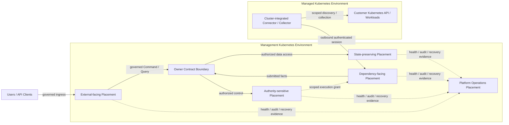

# COP Kubernetes Topology Content Implementation Plan

> **For agentic workers:** REQUIRED SUB-SKILL: Use superpowers:subagent-driven-development (recommended) or superpowers:executing-plans to implement this plan task-by-task. Steps use checkbox (`- [ ]`) syntax for tracking.

**Goal:** 将 `COP-INFRA-002` 从初始化骨架补充为产品中立、可验证的 Kubernetes placement、isolation、failure domain 与 Evolution Profile 架构文档。

**Architecture:** 只修改 `docs/infrastructure/kubernetes-topology.md`，采用 `Boundary Contract + Placement Classes + Evolution Profiles`。文档区分 Management Kubernetes Environment 与 Managed Kubernetes Environment，按风险属性定义 workload placement、namespace、identity、RBAC、resource、scheduling、disruption 和 maintenance Contract，并复用基础设施总览的三个 Profile；Network、Storage、Observability 和 Security 细节继续委托专项文档。

**Tech Stack:** Markdown、YAML front matter、Mermaid、PowerShell、Git

---

## File Structure

- Modify: `docs/infrastructure/kubernetes-topology.md`
  - 唯一实施目标；拥有 Kubernetes 环境边界、Placement Class、namespace、workload identity、RBAC、resource、failure domain、maintenance 和 Profile 语义。
- Reference only: `docs/superpowers/specs/2026-08-11-kubernetes-topology-content-design.md`
  - 已批准设计；实施不得扩大其范围。
- Reference only: `docs/infrastructure/infrastructure-overview.md`
  - 提供三类部署区域、逻辑/物理隔离、恢复分类和三个 Evolution Profile。
- Reference only: `docs/architecture/logical-architecture.md`
  - 提供逻辑责任平面；Placement Class 不得固定映射为 service、namespace、node pool 或 cluster。
- Reference only: `docs/architecture/control-plane-data-plane.md`
  - 提供 scoped execution grant、Managed Connector/Collector、outbound authenticated session 和 fact reporting 语义。
- Reference only: `docs/infrastructure/data-storage.md`
- Reference only: `docs/infrastructure/observability-stack.md`
- Reference only: `docs/infrastructure/network-and-ingress.md`
- Reference only: `docs/security/security-architecture.md`
  - 四类专项文档分别拥有 Storage、Observability、Network 和 Security 细节；本任务不修改这些文件。

### Task 1: Define the Kubernetes Topology document

**Files:**
- Modify: `docs/infrastructure/kubernetes-topology.md`
- Test: PowerShell structural, semantic, UTF-8, Mermaid, link and Git scope checks

- [ ] **Step 1: Run the target-document gate against the current stub (RED)**

Run from the isolated implementation worktree created with `superpowers:using-git-worktrees`:

```powershell
$ErrorActionPreference = 'Stop'
$path = 'docs/infrastructure/kubernetes-topology.md'
$bytes = [IO.File]::ReadAllBytes((Resolve-Path $path))
$content = [Text.UTF8Encoding]::new($false, $true).GetString($bytes).Replace(([string][char]13 + [char]10), [string][char]10)
if ($bytes.Length -ge 3 -and $bytes[0] -eq 0xEF -and $bytes[1] -eq 0xBB -and $bytes[2] -eq 0xBF) { throw 'UTF-8 BOM found' }
if ($content.Contains([char]0) -or $content.Contains([char]0xFFFD)) { throw 'Invalid text character found' }
$expectedFrontMatter = @'
---
id: COP-INFRA-002
title: COP Kubernetes Topology
status: draft
version: 0.2.0
owners:
  - architecture
last_updated: 2026-08-11
related:
  - COP-INFRA-001
  - COP-INFRA-004
  - COP-INFRA-005
rfc: []
adr: []
---
'@
$frontMatter = [regex]::Match($content, '\A---\n.*?\n---\n', [Text.RegularExpressions.RegexOptions]::Singleline)
if (-not $frontMatter.Success -or $frontMatter.Value.TrimEnd() -cne $expectedFrontMatter.TrimEnd()) { throw 'Front matter mismatch' }
foreach ($required in @(
  'Management Kubernetes Environment',
  'Managed Kubernetes Environment',
  'Placement Classes',
  'required isolation',
  'preferred distribution',
  'MVP Self-hosted Baseline',
  'Resilient Self-hosted',
  'SaaS-ready Isolation'
)) {
  if (-not $content.Contains($required)) { throw "Missing requirement: $required" }
}
throw 'RED gate unexpectedly passed'
```

Expected: FAIL with `Front matter mismatch` because the current stub is still version `0.1.0` and lacks the approved model.

- [ ] **Step 2: Replace the stub with the approved target content**

Replace `docs/infrastructure/kubernetes-topology.md` with exactly:

````markdown
---
id: COP-INFRA-002
title: COP Kubernetes Topology
status: draft
version: 0.2.0
owners:
  - architecture
last_updated: 2026-08-11
related:
  - COP-INFRA-001
  - COP-INFRA-004
  - COP-INFRA-005
rfc: []
adr: []
---

# COP Kubernetes 拓扑

## Purpose

定义 COP workload 在 Management Kubernetes Environment 与 Managed Kubernetes Environment 中的 placement、namespace、identity、权限、资源、故障域、维护和阶段演进边界，使逻辑隔离可验证，同时避免把架构责任固定为特定 cluster、node pool 或产品拓扑。

本文保持 `draft`；在状态变为 `accepted` 前，不构成 `cop-platform` 的强制实现约束。

## Scope

- Management Kubernetes Environment 与 Managed Kubernetes Environment 的责任、信任和故障边界。
- COP workload 的 namespace、workload identity、ServiceAccount、RBAC、placement、resource 和 failure-domain Contract。
- external-facing、authority-sensitive、dependency-facing、state-preserving、cluster-integrated 和 platform-operations Placement Class。
- required isolation、preferred distribution、disruption、drain、upgrade、rescheduling 和 recovery verification 原则。
- Managed Connector/Collector 在客户或目标 cluster 中的最小部署边界。
- 三个基础设施 Evolution Profile 的 Kubernetes placement 与 isolation 进入条件。

## Non-goals

- 固定 cluster、namespace、node pool、node、replica、availability zone、region 或 failure domain 数量。
- 选择 Kubernetes distribution、CNI、CSI、Ingress Controller、Gateway、service mesh、autoscaler、operator 或 policy engine。
- 定义 Helm values、manifest、命令、节点规格、容量数字、安装、扩容、升级或故障处理操作手册。
- 管理客户业务 workload 的 topology、scheduling、release、resource 或 lifecycle。
- 定义 data authority、storage product、backup/restore 参数、retention、RPO/RTO 或灾备拓扑。
- 定义 protocol、port、certificate lifecycle、NetworkPolicy 规则或 Secret/KMS 实现。

## Context

`COP-INFRA-001` 定义 COP Management Environment、Managed Environments、External Infrastructure、逻辑/物理隔离和三个 Evolution Profile。本文只细化 Kubernetes placement 与 isolation Contract，不改变三类区域、data authority 或跨区域依赖方向。

`COP-ARCH-002` 定义逻辑责任平面，`COP-ARCH-003` 定义 Control Plane、Data Plane、Managed Connector/Collector 和 External Adapter Boundary 的执行与信任关系。本文不把逻辑平面固定映射为 service、Deployment、namespace、node pool 或 cluster，并保持 scoped execution grant、outbound authenticated session、fact reporting、credential reference 和 no implicit trust 语义。

当前相关文档均为 `draft`，只用于设计一致性检查。只有状态为 `accepted` 的权威文档和 ADR 才能形成实现约束。

## Architecture or Model

### Kubernetes Responsibility Model

Kubernetes Topology 定义运行 placement 和 isolation，不获得领域 ownership 或 external authority。Kubernetes scheduler、namespace、Pod、node、rollout 或 cluster 状态都不能成为 COP 领域事实 authority。

专项文档职责保持分离：

| Document | Owns | Must preserve from Kubernetes Topology |
| --- | --- | --- |
| `COP-INFRA-001` Infrastructure Overview | 三类部署区域、runtime/data path、恢复分类与 Evolution Profiles | Kubernetes 设计不得改变 responsibility、authority、Contract、Tenant、Secret 或 Profile 不变量 |
| `COP-INFRA-005` Network and Ingress | ingress、service traffic、egress、managed connection、network trust 与 NetworkPolicy 细节 | external-facing isolation、outbound-only managed session、no implicit trust 与 private data boundary |
| `COP-INFRA-003` Data Storage Architecture | data category、authority、storage responsibility、backup/restore、retention 与 migration | state-preserving placement、disruption、maintenance 与 no new authority |
| `COP-INFRA-004` Observability Stack | Collector、Telemetry pipeline、Metrics/Logs/Traces、query path 与 platform observability | Platform Operations 不获得业务 authority；health、freshness、degradation 与 recovery evidence 可判定 |
| Security Architecture | authentication、authorization、Secret/KMS、audit、compliance 与 cryptographic implementation | workload identity、ServiceAccount、least privilege、cluster-scoped permission、Secret Reference 与 fail closed |

### Management Kubernetes Environment

Management Kubernetes Environment 承载 COP Ingress、Control、Execution、Platform Data 与 Platform Operations capability。它可以由一个或多个 cluster 承载；cluster 数量、云厂商或物理位置不改变 capability ownership、data authority 或 Contract。

共享 cluster 只表示共享底层调度基础设施，不产生共享 identity、authorization、data access、Tenant、failure 或 maintenance authority。物理共置必须保留可验证的 workload identity、permission、resource、dependency、health、audit 和 recovery signal。

### Managed Kubernetes Environment

Managed Kubernetes Environment 是客户或目标 Kubernetes cluster。COP 只治理部署于其中的 Managed Connector/Collector，包括 workload identity、ServiceAccount、RBAC、resource、placement、health、checkpoint 和 outbound authenticated session。

客户 Kubernetes API、业务 workload、namespace、node、storage 和实际运行状态继续由客户环境拥有。本文不要求统一客户业务 namespace、专用 node pool 或固定调度策略，也不允许 Connector/Collector 获得客户 workload lifecycle authority。

### Placement Classes

Placement Class 是调度和隔离输入，不等于固定 workload kind、namespace、node pool 或 cluster。workload 同时命中多个风险属性时，应用更严格的 isolation、permission、disruption 和 recovery 要求：

| Placement class | Primary risk | Required boundary |
| --- | --- | --- |
| External-facing | 接收外部流量、暴露攻击面或承担入口压力 | 与私有数据和高权限 workload 隔离；入口统一受治理；依赖故障和流量过载可判定 |
| Authority-sensitive | 处理 authorization、authorized intent、task lifecycle、领域状态或 owner Contract | 独立 workload identity、最小权限、受控数据访问、version 与 audit continuity；维护期间不得丢失 authority evidence |
| Dependency-facing | 调用外部 API、执行 Adapter、处理 Connector session 或承受供应商错误与限速 | 按 Tenant、connection、managed environment、Adapter 和 dependency 隔离 resource、backpressure 与 failure signal |
| State-preserving | 承载需要 Preserve 的 committed state 或其 Kubernetes runtime | 明确 failure domain、startup/shutdown、disruption、maintenance 和恢复依赖；Pod 状态不替代数据完整性验证 |
| Cluster-integrated | 需要 cluster-scoped read、host access、privileged capability 或特殊 runtime permission | 与普通 workload 强隔离；使用专用 identity；permission、目标范围、用途、audit 和撤销路径显式 |
| Platform Operations | 提供 health、audit、Metrics、Logs、Traces、dependency 或 recovery evidence | 不获得业务 authority；不绕过 owner Contract 或 Tenant boundary；自身故障不得静默隐藏平台状态 |

普通无状态 workload 可以在满足 identity、RBAC、resource、health 和 failure signal 的条件下共置。Cluster-integrated、authority-sensitive 或 state-preserving workload 在权限、数据或单点故障传播不可接受时使用 required isolation。

### Namespace, Identity, and Permission Boundaries

Namespace 依据 trust、ownership、data access、operational lifecycle 和 failure boundary 划分，不固定名称，也不要求每个 capability 独占 namespace。以下情况不得无条件共用同一 namespace：

- cluster-scoped、privileged 或 host-access workload 与普通 capability。
- external-facing workload 与私有 Platform Data capability。
- 不同 owner 且具有独立数据写权限的 capability。
- maintenance、recovery、resource 或 failure isolation 要求明显不同的 workload。

Namespace 不是 Tenant authority。共享运行单元仍显式携带 Tenant context，并在 Contract、authorization、data partition、audit 和 resource governance 层实施隔离；不得仅凭 namespace、cluster membership 或网络位置推导 Tenant 或 authorization。

每个独立 trust/ownership boundary 使用可验证 workload identity 和专用 ServiceAccount。默认 ServiceAccount 不承载业务权限或 cluster-scoped permission。RBAC 默认限定 namespace、resource、verb 和目标范围，遵循 default deny 与 least privilege。

Cluster-scoped permission 必须有明确用途、独立 identity、可审计 actor/source、目标范围、撤销和轮换路径。Privileged、host access 或等价高风险 capability 与普通 workload 强隔离，其权限不得通过共享 ServiceAccount、sidecar、volume 或 node identity 隐式传递。

Secret 和 credential 只通过受控 Secret/KMS Reference 使用，不进入普通 manifest、ConfigMap、Domain Event、task payload、log、metric label、trace attribute 或 read model。identity、Tenant、scope、authorization 或 dependency integrity 无法确认时 fail closed。

### Resource Governance

- workload 声明可调度的 resource request、运行上限和适用的扩缩容输入，但本文不规定 CPU、memory、storage、replica 或 threshold 数值。
- 使用 quota、limit、priority、preemption protection 或等价机制控制 noisy neighbor 和资源耗尽传播。
- 资源隔离与积压至少可按 capability、Tenant、connection、managed environment、Adapter 和 external dependency 观察。
- 高 priority 只保护恢复、控制和必要平台运行能力，不能掩盖无界 queue、持续过载、失效 backpressure 或不完整 capacity planning。
- autoscaling 可以增强运行能力，但不能绕过 required isolation、Tenant boundary、Secret boundary、disruption control 或 recovery verification。
- 资源不足导致 preferred distribution 无法满足时，显式报告 degraded、capacity constrained 或 unavailable，不得静默声称达到预期冗余。

### Scheduling and Failure Domains

- **Required isolation：** 当 permission、authority、Secret exposure、host access、data corruption 或单点故障传播不可接受时，必须使用不可被 scheduler 自动弱化的隔离边界。
- **Preferred distribution：** 用于提高 availability、降低 noisy neighbor 或分散 dependency risk；资源不足时允许显式降级，但降级必须可观测、可审计并触发容量或恢复判断。

Topology 使用 failure-domain label、anti-affinity、topology spread 或等价能力表达，不规定 node、zone、replica、cluster 或 region 数量。设计必须避免将同一关键 Control、Execution、state-preserving、Platform Operations 或 Connector capability 的全部有效实例静默集中到同一故障域。

failure domain 可以按 node、rack、zone、cluster、region、managed environment 或 external dependency 表达。具体层级由 Profile、风险、合规、负载和已观察故障证据决定。

### Workload Lifecycle and Maintenance

- startup、readiness 和 liveness 分别表达初始化完成、可接收流量与运行健康，不能互相替代，也不能把 dependency unknown 伪装为 healthy。
- graceful termination 提供停止接单、完成或 checkpoint 当前任务、提交必要状态、释放 lease 和关闭受控 session 的机会。
- disruption control 防止 drain、upgrade、rescheduling 或维护同时移除同一关键 capability 的全部可用实例，但本文不规定数值预算。
- drain、upgrade 和 rescheduling 保留 task ownership、idempotency、checkpoint、connection recovery、policy/config version 与状态验证语义。
- capacity headroom 支撑正常 rescheduling、维护和恢复；比例、节点规格和扩容 threshold 由部署设计决定。
- incompatible version、missing identity、scope mismatch、stale authorization 或恢复 evidence 不足时 fail closed。

Pod `Running`、container restart、queue acknowledgement、readiness 恢复或 rollout success 都不能断言业务 `completed`。只有 owning lifecycle Contract 在验证 terminal execution fact、expected version、scope 和 external-authority evidence 后才能推进 terminal lifecycle state。

### Stateful Capability Boundary

本文只定义 state-preserving workload 的 placement、identity、disruption、startup/shutdown、maintenance 与 failure-domain Contract，不决定数据产品、部署形态或存储类别。

- **Preserve：** workload 恢复前验证持久状态、version、integrity 和 owner continuity。
- **Rebuild：** capability 可以重新调度并从 authoritative state 或保留事件重建。
- **Reconcile：** capability 恢复后重新确认 Kubernetes、Cloud、Telemetry 或其他外部 actual state 与 freshness。
- **Never infer：** 不根据 Pod、cache、queue、replica 或 scheduling 状态推断业务成功、数据完整或外部事实完成。

Data authority、backup、restore、retention、migration、RPO/RTO 和灾备验证由 `COP-INFRA-003` 负责。Kubernetes runtime 不因承载 database、cache、Event Transport、object capability 或 Telemetry component 而获得领域 ownership。

### Managed Connector and Collector Placement

- Connector/Collector 位于 Managed Kubernetes Environment，只主动建立到 COP 的 outbound authenticated session；COP 不依赖进入客户 cluster 的 inbound control connection。
- workload 使用独立 identity、ServiceAccount 和最小 RBAC，只访问已授权 cluster、namespace、resource、verb 和 signal scope。
- cluster-scoped discovery 与 write、host access 或 privileged capability 分开判断；发现新资源不自动扩大当前任务授权。
- Connector/Collector 的 resource、queue、checkpoint、health、freshness 和 failure signal 按 managed environment 与 connection 隔离。
- Pod 重启、node drain、cluster upgrade 或 session 中断后，通过 checkpoint、idempotent task handling、resynchronization 和 reconciliation 恢复。
- 客户业务 workload、namespace、node、storage 和 scheduling 继续由客户环境拥有；COP 不要求统一客户 topology，也不接管 workload lifecycle。

### Evolution Profiles

Profile 复用 `COP-INFRA-001` 的名称和持续不变量：

| Evolution profile | Kubernetes capability and isolation | Invariants and entry evidence |
| --- | --- | --- |
| MVP Self-hosted Baseline | capability 可以在共享 cluster 与共享 node infrastructure 上物理共置；使用明确 namespace、identity、RBAC、resource、health、disruption 和 recovery boundary | cluster-integrated 与高权限 workload 保持强隔离；保留 Tenant context；具备 drain、restart、Rebuild、Reconcile 与 dependency failure 验证；不预设 topology 数量 |
| Resilient Self-hosted | 根据风险与证据增强 topology spread、redundancy、disruption control、capacity headroom、maintenance verification，并可拆分 node pool 或 cluster | 拆分不改变 Contract、authority、identity、Tenant 或 data boundary；进入依据来自风险、合规、负载、故障与运营成熟度证据 |
| SaaS-ready Isolation | 增强 Tenant、workload、network、data 与 regional failure isolation，可按 Tenant 风险和负载拆分运行单元 | 不要求每 Tenant 一个 namespace 或 cluster；不依赖跨 region 全局事务、全局顺序或共享高权限 identity；延续自托管安全边界 |

Profile 表达 isolation 与 operational capability maturity，不是产品套餐、环境名称或固定 cluster topology。进入下一 Profile 不依据发布时间或预设规模。

### Kubernetes Relationship Map

下图表达 Kubernetes 责任区域、Placement Class 和受治理流向：



图中 placement 节点表示风险和隔离责任，不表示固定 Deployment、namespace、node pool、cluster 或 region。Owner Contract Boundary 是逻辑治理边界，不是独立 deployment unit；Command、Query、fact submission 和 Platform Data access 都不得绕过它。实线表示受治理访问或运行关系，虚线表示 scoped intent 或向 Platform Operations 汇聚的 operational evidence；箭头不表示共享写存储、隐式 trust、Tenant inheritance 或分布式事务。

### Failure and Degradation Semantics

- scheduling failure、resource pressure、node loss、drain blocked、runtime incompatibility、identity failure、RBAC denial、dependency unavailable 和 recovery evidence missing 必须分类呈现。
- required isolation 无法满足时 workload 不得调度或继续运行；preferred distribution 无法满足时显式报告 degraded 或 capacity constrained。
- validation、identity、authorization、scope mismatch、incompatible version 和 forbidden privilege 属于 terminal configuration failure，不通过无限重试掩盖。
- dependency、session 或 transient scheduling failure 只执行有界 retry 与 backoff，并保留 cancellation、checkpoint 和 reconciliation 路径。
- 单一 Tenant、connection、managed environment、Adapter、node 或 dependency 故障不得无边界阻塞其他隔离单元。
- unknown、partial、stale、degraded、unavailable 和 recovering 不得伪装为 healthy、ready 或 completed。

### Validation Strategy

- **Boundary：** 验证 Management 与 Managed Kubernetes Environment 可独立识别，客户业务 workload 不进入 COP ownership。
- **Logical/physical：** 验证 namespace、Placement Class 与 Profile 可验证，同时不推导固定 Deployment、node pool、cluster 或 region 数量。
- **Placement：** 验证 workload 能依据风险属性得到 required isolation 或 preferred distribution，多属性 workload 应用更严格边界。
- **Security：** 验证 workload identity、ServiceAccount、RBAC、cluster-scoped permission、Secret Reference、Tenant context 与 fail closed。
- **Resource：** 验证 request、limit、quota、priority、backpressure 和 capacity signal 防止 noisy neighbor，同时不引入数值配置。
- **Scheduling：** 验证 node failure、resource shortage、drain、upgrade 和 rescheduling 不弱化 required isolation，preferred distribution 降级可观测。
- **Lifecycle：** 验证 startup、readiness、liveness、termination、checkpoint、idempotency、Rebuild 和 Reconcile 语义互不混淆。
- **Completion：** 验证 Pod、container、queue、rollout 或 readiness 状态不能断言业务 completed。
- **Managed connection：** 验证 Connector/Collector 保持 outbound authenticated session、最小 RBAC、scoped discovery 与客户 workload non-ownership。
- **Profile：** 验证三个 Profile 只增强 isolation 与 operational capability，不改变 ownership、Contract、authority 或持续安全边界。
- **Delegation：** 验证 Network、Storage、Observability 和 Security 细节分别由对应专项文档拥有。

### Success Criteria

- 读者能够区分 Management Kubernetes Environment、Managed Kubernetes Environment 与客户 workload ownership。
- 读者能够依据 Placement Class 选择 namespace、identity、RBAC、resource、placement 和 failure-domain boundary，但不能从本文推导固定物理数量。
- MVP 允许物理共置，同时 cluster-integrated、高权限、私有数据和 external dependency failure 保持可判定隔离。
- Namespace 不被误用为 Tenant authority，网络位置和 cluster membership 不产生隐式 trust。
- Managed Connector/Collector 不要求 inbound control connection，不扩大客户 workload 管理范围。
- drain、upgrade、restart、rescheduling 和 dependency failure 不把 unknown execution outcome 伪装为成功。
- state-preserving runtime 不获得 data authority，Pod 状态不替代数据完整性或业务完成 evidence。
- 三个 Evolution Profile 共用稳定边界与不变量，只增强 isolation 和 operational capability。
- 文档保持 `draft`，不创建 RFC/ADR，不引入产品选型、容量数值、固定 topology 或操作手册。

## Constraints

- 只有 `accepted` 权威文档和 ADR 才能形成实现约束；本文在 `draft` 状态下只用于评审。
- Kubernetes placement 不改变 domain ownership、external authority、owner Contract、Tenant、authorization、Secret 或 recovery semantics。
- logical plane、Placement Class、namespace、node pool 与 cluster 之间不存在强制一一映射。
- required isolation 不能因资源不足自动降级；preferred distribution 降级必须显式。
- workload identity、ServiceAccount、RBAC 和 resource boundary 必须可验证；共享基础设施不产生隐式 trust。
- committed fact、accepted/completed 区分、at-least-once、idempotency、checkpoint 与 reconciliation 语义在 restart、drain 和 upgrade 后继续有效。
- 不得在本文或实施任务中固定产品、topology 数量、capacity、RPO/RTO、region topology、数值 SLO 或运维命令。

## Quality Attributes

- **Security：** workload identity、ServiceAccount、least privilege、cluster-scoped permission、Tenant context、Secret Reference 与 fail closed 明确。
- **Reliability：** required isolation、preferred distribution、bounded retry、disruption control、failure-domain-aware placement 与 dependency isolation 限制故障传播。
- **Recoverability：** graceful termination、checkpoint、idempotency、Preserve、Rebuild、Reconcile 与 Never infer 在维护和重调度后可验证。
- **Operability：** scheduling、capacity、health、dependency、degradation、disruption 和 recovery 状态具有关联 evidence。
- **Scalability：** resource governance、backpressure、autoscaling input 和 Profile 支持按风险与负载演进，不预设容量数字。
- **Portability：** Placement Class 和 Contract 不绑定 Kubernetes distribution、CNI、CSI、Gateway、service mesh、autoscaler 或云厂商。
- **Evolvability：** namespace、node pool、cluster 与 region 可以按 evidence 拆分，不重建核心 identity、Tenant、authority 或 Contract。

## Implementation Guidance

实现仓库只能在本文及其依赖约束变为 `accepted` 后将其作为实现依据。实现时先识别 workload 的 Placement Class、owner、identity、permission、data access、Tenant、resource、failure 与 lifecycle boundary，再选择 namespace、node pool、cluster 或 region placement。

实现不能根据关系图节点生成固定 Deployment，也不能将共享 namespace、node 或 cluster 解释为共享 authorization、共享 data ownership 或共享 Tenant。详细 manifest、Helm values、resource 数值、topology key、priority class、disruption 数值、autoscaling threshold、NetworkPolicy 和 Secret 注入方式由 `cop-platform` 或后续经过治理的专项设计决定。

需要改变 Management/Managed environment boundary、Tenant model、authority、outbound-only connection、recovery class 或 Evolution Profile 不变量时，必须先创建或更新 RFC；RFC 被接受后关联 ADR，并同步所有受影响的权威文档。

## References

- [COP-INFRA-001](infrastructure-overview.md)
- [COP-ARCH-002](../architecture/logical-architecture.md)
- [COP-ARCH-003](../architecture/control-plane-data-plane.md)
- [COP-INFRA-003](data-storage.md)
- [COP-INFRA-004](observability-stack.md)
- [COP-INFRA-005](network-and-ingress.md)
- [COP-SEC-001](../security/security-architecture.md)
````

- [ ] **Step 3: Run the structural and semantic checks (GREEN)**

```powershell
$ErrorActionPreference = 'Stop'
$path = 'docs/infrastructure/kubernetes-topology.md'
$bytes = [IO.File]::ReadAllBytes((Resolve-Path $path))
$content = [Text.UTF8Encoding]::new($false, $true).GetString($bytes).Replace(([string][char]13 + [char]10), [string][char]10)
if ($bytes.Length -ge 3 -and $bytes[0] -eq 0xEF -and $bytes[1] -eq 0xBB -and $bytes[2] -eq 0xBF) { throw 'UTF-8 BOM found' }
if ($content.Contains([char]0) -or $content.Contains([char]0xFFFD)) { throw 'Invalid text character found' }
$expectedFrontMatter = @'
---
id: COP-INFRA-002
title: COP Kubernetes Topology
status: draft
version: 0.2.0
owners:
  - architecture
last_updated: 2026-08-11
related:
  - COP-INFRA-001
  - COP-INFRA-004
  - COP-INFRA-005
rfc: []
adr: []
---
'@
$frontMatter = [regex]::Match($content, '\A---\n.*?\n---\n', [Text.RegularExpressions.RegexOptions]::Singleline)
if (-not $frontMatter.Success -or $frontMatter.Value.TrimEnd() -cne $expectedFrontMatter.TrimEnd()) { throw 'Front matter mismatch' }
$h2Expected = @('Purpose','Scope','Non-goals','Context','Architecture or Model','Constraints','Quality Attributes','Implementation Guidance','References')
$h2Actual = @([regex]::Matches($content, '(?m)^## (.+)$') | ForEach-Object { $_.Groups[1].Value })
if (($h2Actual -join '|') -cne ($h2Expected -join '|')) { throw 'H2 order mismatch' }
$h3Expected = @(
  'Kubernetes Responsibility Model',
  'Management Kubernetes Environment',
  'Managed Kubernetes Environment',
  'Placement Classes',
  'Namespace, Identity, and Permission Boundaries',
  'Resource Governance',
  'Scheduling and Failure Domains',
  'Workload Lifecycle and Maintenance',
  'Stateful Capability Boundary',
  'Managed Connector and Collector Placement',
  'Evolution Profiles',
  'Kubernetes Relationship Map',
  'Failure and Degradation Semantics',
  'Validation Strategy',
  'Success Criteria'
)
$h3Actual = @([regex]::Matches($content, '(?m)^### (.+)$') | ForEach-Object { $_.Groups[1].Value })
if (($h3Actual -join '|') -cne ($h3Expected -join '|')) { throw 'H3 order mismatch' }
foreach ($required in @(
  'Management Kubernetes Environment', 'Managed Kubernetes Environment',
  'External-facing', 'Authority-sensitive', 'Dependency-facing', 'State-preserving', 'Cluster-integrated', 'Platform Operations',
  'Namespace 不是 Tenant authority', 'workload identity', 'ServiceAccount', 'cluster-scoped permission',
  'default deny', 'least privilege', 'Secret/KMS Reference', 'fail closed',
  'required isolation', 'preferred distribution', 'failure-domain label', 'anti-affinity', 'topology spread',
  'startup', 'readiness', 'liveness', 'graceful termination', 'disruption control', 'capacity headroom',
  'Preserve', 'Rebuild', 'Reconcile', 'Never infer',
  'outbound authenticated session', 'inbound control connection',
  'MVP Self-hosted Baseline', 'Resilient Self-hosted', 'SaaS-ready Isolation',
  'unknown', 'partial', 'stale', 'degraded', 'unavailable', 'completed',
  'RPO/RTO', 'NetworkPolicy'
)) {
  if (-not $content.Contains($required)) { throw "Missing requirement: $required" }
}
$ticks = ([string][char]96) * 3
$mermaidPattern = '(?ms)^' + [regex]::Escape($ticks) + 'mermaid\n(.*?)^' + [regex]::Escape($ticks) + '$'
$mermaid = [regex]::Matches($content, $mermaidPattern)
if ($mermaid.Count -ne 1) { throw "Expected one Mermaid block, found $($mermaid.Count)" }
$diagram = $mermaid[0].Groups[1].Value
$subgraphs = @([regex]::Matches($diagram, '(?m)^\s*subgraph\s+\w+\['))
if ($subgraphs.Count -ne 2) { throw "Expected two Kubernetes environments, found $($subgraphs.Count)" }
$relations = @([regex]::Matches($diagram, '(?m)^\s*\w+\s+(?:-->|-\.->).*?\w+\s*$'))
if ($relations.Count -ne 12) { throw "Expected 12 diagram relations, found $($relations.Count)" }
foreach ($relation in @(
  'INGRESS -->|"governed Command / Query"| OWNER',
  'CONTROL -.->|"scoped execution grant"| EXEC',
  'EXEC -->|"submitted facts"| OWNER',
  'OWNER -->|"authorized data access"| DATA',
  'CONNECTOR -->|"outbound authenticated session"| EXEC',
  'CONNECTOR -->|"scoped discovery / collection"| LOCAL'
)) {
  if (-not $diagram.Contains($relation)) { throw "Missing diagram relation: $relation" }
}
if ([regex]::IsMatch($diagram, '(?m)^\s*(INGRESS|EXEC)\s+(?:-->|-\.->).*?\bDATA\s*$')) { throw 'Owner Contract Boundary bypass found' }
$responsibilityTable = [regex]::Match($content, '(?ms)^\| Document \| Owns \| Must preserve from Kubernetes Topology \|\n(.*?)\n\n')
if (-not $responsibilityTable.Success) { throw 'Responsibility table missing' }
$responsibilityRows = @($responsibilityTable.Groups[1].Value -split [char]10)
if ($responsibilityRows.Count -ne 6) { throw "Expected separator and 5 responsibility rows, found $($responsibilityRows.Count)" }
foreach ($row in $responsibilityRows) { if (([regex]::Matches($row, '\|')).Count -ne 4) { throw "Responsibility table column mismatch: $row" } }
$placementTable = [regex]::Match($content, '(?ms)^\| Placement class \| Primary risk \| Required boundary \|\n(.*?)\n\n')
if (-not $placementTable.Success) { throw 'Placement table missing' }
$placementRows = @($placementTable.Groups[1].Value -split [char]10)
if ($placementRows.Count -ne 7) { throw "Expected separator and 6 placement rows, found $($placementRows.Count)" }
foreach ($row in $placementRows) { if (([regex]::Matches($row, '\|')).Count -ne 4) { throw "Placement table column mismatch: $row" } }
$profileTable = [regex]::Match($content, '(?ms)^\| Evolution profile \| Kubernetes capability and isolation \| Invariants and entry evidence \|\n(.*?)\n\n')
if (-not $profileTable.Success) { throw 'Profile table missing' }
$profileRows = @($profileTable.Groups[1].Value -split [char]10)
if ($profileRows.Count -ne 4) { throw "Expected separator and 3 profile rows, found $($profileRows.Count)" }
foreach ($row in $profileRows) { if (([regex]::Matches($row, '\|')).Count -ne 4) { throw "Profile table column mismatch: $row" } }
$forbidden = @(('T' + 'BD'), ('T' + 'ODO'), ('lorem' + ' ipsum'), ('当前尚未' + '形成'))
foreach ($value in $forbidden) { if ($content.Contains($value)) { throw "Forbidden filler: $value" } }
$file = Get-Item $path
$links = [regex]::Matches($content, '\[[^\]]+\]\(([^)#]+\.md)(?:#[^)]+)?\)')
if ($links.Count -ne 7) { throw "Expected 7 reference links, found $($links.Count)" }
foreach ($link in $links) {
  if (-not (Test-Path -LiteralPath (Join-Path $file.DirectoryName $link.Groups[1].Value))) { throw "Broken link: $($link.Groups[1].Value)" }
}
git diff --check
if ($LASTEXITCODE -ne 0) { throw 'git diff --check failed' }
$changed = @(git diff --name-only)
if ($changed.Count -ne 1 -or $changed[0] -ne $path) { throw "Unexpected file scope: $($changed -join ', ')" }
'PASS: Kubernetes Topology structure and semantics'
```

Expected output: `PASS: Kubernetes Topology structure and semantics`.

- [ ] **Step 4: Perform the manual authority, security and lifecycle review**

Read the target source or rendered Markdown and confirm:

- Management Kubernetes Environment and Managed Kubernetes Environment are responsibility/trust/failure boundaries, not fixed cluster counts;
- customer Kubernetes API, workloads, namespaces, nodes and actual state remain outside COP ownership;
- Placement Classes are risk attributes, not fixed Deployment, namespace, node pool or cluster mappings;
- namespace does not become Tenant or authorization authority;
- ServiceAccount, RBAC, cluster-scoped permission, privileged placement and Secret Reference preserve least privilege and fail closed;
- required isolation cannot silently degrade, while preferred distribution degradation is explicit;
- failure-domain-aware placement, disruption, drain, upgrade and capacity headroom do not introduce numerical topology requirements;
- Pod, queue, rollout and readiness state cannot assert business completed;
- Preserve, Rebuild, Reconcile and Never infer do not transfer data authority to Kubernetes runtime;
- Connector/Collector remains outbound-only, scoped and unable to govern customer workload lifecycle;
- all three Profiles preserve ownership, Contract, Tenant and security invariants;
- the document remains `draft` and does not create an RFC, ADR, product decision, capacity value or implementation authority.

If any item fails, correct only the target document and rerun Step 3.

- [ ] **Step 5: Run full repository encoding, link and scope checks**

```powershell
$ErrorActionPreference = 'Stop'
$markdown = @(Get-Item README.md,CONTRIBUTING.md,AGENTS.md) + @(Get-ChildItem docs,adr,rfc,templates -Recurse -File -Filter '*.md' | Where-Object { $_.FullName -notmatch '[\\/]docs[\\/]superpowers[\\/]' })
if ($markdown.Count -ne 50) { throw "Expected 50 non-superpowers Markdown files, found $($markdown.Count)" }
$relativeLinks = 0
foreach ($file in $markdown) {
  $bytes = [IO.File]::ReadAllBytes($file.FullName)
  if ($bytes.Length -ge 3 -and $bytes[0] -eq 0xEF -and $bytes[1] -eq 0xBB -and $bytes[2] -eq 0xBF) { throw "UTF-8 BOM found: $($file.FullName)" }
  $content = [Text.UTF8Encoding]::new($false, $true).GetString($bytes)
  if ($content.Contains([char]0) -or $content.Contains([char]0xFFFD)) { throw "Invalid text character: $($file.FullName)" }
  foreach ($link in [regex]::Matches($content, '(?!!)\[[^\]]+\]\(([^)]+)\)')) {
    $target = $link.Groups[1].Value
    if ($target -match '^(?:https?://|mailto:|#)') { continue }
    $relativeLinks++
    $targetPath = ($target -split '#', 2)[0]
    if (-not (Test-Path -LiteralPath (Join-Path $file.DirectoryName $targetPath))) { throw "Broken relative link in $($file.FullName): $target" }
  }
}
if ($relativeLinks -ne 204) { throw "Expected 204 relative links, found $relativeLinks" }
git diff --check
if ($LASTEXITCODE -ne 0) { throw 'git diff --check failed' }
$changed = @(git diff --name-only)
if ($changed.Count -ne 1 -or $changed[0] -ne 'docs/infrastructure/kubernetes-topology.md') { throw "Unexpected file scope: $($changed -join ', ')" }
'PASS: repository encoding, links and scope'
```

Expected output: `PASS: repository encoding, links and scope`.

- [ ] **Step 6: Commit the Kubernetes Topology document**

```powershell
git add docs/infrastructure/kubernetes-topology.md
git diff --cached --check
git commit -m "docs: define kubernetes topology content"
```

Expected: one commit containing only `docs/infrastructure/kubernetes-topology.md`.

- [ ] **Step 7: Verify the implementation commit**

```powershell
$files = @(git diff-tree --no-commit-id --name-only -r HEAD)
if ($files.Count -ne 1 -or $files[0] -ne 'docs/infrastructure/kubernetes-topology.md') { throw "Unexpected committed files: $($files -join ', ')" }
if (git status --porcelain) { throw 'Worktree is not clean' }
'PASS: Kubernetes Topology commit'
```

Expected output: `PASS: Kubernetes Topology commit`.

### Plan Self-Review

- [ ] Confirm every approved requirement in `docs/superpowers/specs/2026-08-11-kubernetes-topology-content-design.md` maps to Task 1 Step 2, Step 3 or Step 4.
- [ ] Confirm the plan contains no placeholder text, invented product choice, fixed topology count, unsupported authority transfer or unapproved status promotion.
- [ ] Confirm target front matter, H2/H3 order, Mermaid relations, table headers, required terms, reference count and repository link count are identical between Step 2 and the GREEN gates.
