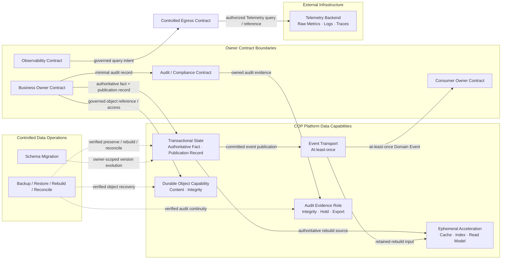

# COP Data Storage Content Implementation Plan

> **For agentic workers:** REQUIRED SUB-SKILL: Use superpowers:subagent-driven-development (recommended) or superpowers:executing-plans to implement this plan task-by-task. Steps use checkbox (`- [ ]`) syntax for tracking.

**Goal:** 将 `COP-INFRA-003` 从初始化骨架补充为产品中立、可验证的 Data Capability、authority、Owner/Tenant isolation、一致性、lifecycle 与 recovery 架构文档。

**Architecture:** 只修改 `docs/infrastructure/data-storage.md`，采用 `Capability Matrix + Authority + Recovery Contract`。文档定义五类基础 Data Capability、Audit Evidence role、Owner-local fact/publication transaction、Preserve/Rebuild/Reconcile、object/reference、retention/deletion/legal hold、encryption/key、backup/restore、migration、Telemetry external authority 和三个既有 Evolution Profile；不固定产品、schema、物理 topology 或数值参数。

**Tech Stack:** Markdown、YAML front matter、Mermaid、PowerShell、Git

---

## File Structure

- Modify: `docs/infrastructure/data-storage.md`
  - 唯一实施目标；拥有 Data Capability、storage authority、Owner/Tenant isolation、consistency、retention、encryption、backup/restore、migration 和 recovery 语义。
- Reference only: `docs/superpowers/specs/2026-08-12-data-storage-content-design.md`
  - 已批准设计；实施不得扩大其范围。
- Reference only: `docs/infrastructure/infrastructure-overview.md`
  - 提供五类基础 capability、Owner Contract Boundary、Preserve/Rebuild/Reconcile/Never infer 和 Evolution Profile 不变量。
- Reference only: `docs/infrastructure/kubernetes-topology.md`
- Reference only: `docs/infrastructure/network-and-ingress.md`
  - 分别提供 Placement Class 与 Private Data/Controlled Egress 边界；本任务不固定 workload placement 或 network topology。
- Reference only: `docs/architecture/control-plane-data-plane.md`
- Reference only: `docs/architecture/integration-architecture.md`
- Reference only: `docs/api/api-design-guidelines.md`
- Reference only: `docs/api/event-contracts.md`
  - 提供 authoritative fact、lifecycle、Command/Event、version、idempotency 和 at-least-once 语义。
- Reference only: `docs/domains/resource-metadata-domain.md`
- Reference only: `docs/domains/observability-domain.md`
  - 提供 Resource Context/Projection 与 Telemetry Source/Query 的领域 authority。
- Reference only: `docs/security/security-architecture.md`
- Reference only: `docs/security/audit-and-compliance.md`
- Reference only: `docs/infrastructure/observability-stack.md`
  - 分别拥有 security control、Audit/Compliance 语义和 Telemetry pipeline/query runtime；本任务不修改任何参考文件。

### Task 1: Define the Data Storage Architecture document

**Files:**
- Modify: `docs/infrastructure/data-storage.md`
- Test: PowerShell structural, semantic, UTF-8, Mermaid, link and Git scope checks

- [ ] **Step 1: Run the target-document gate against the current stub (RED)**

Run from the isolated implementation worktree created with `superpowers:using-git-worktrees`:

```powershell
$ErrorActionPreference = 'Stop'
$path = 'docs/infrastructure/data-storage.md'
$bytes = [IO.File]::ReadAllBytes((Resolve-Path $path))
$content = [Text.UTF8Encoding]::new($false, $true).GetString($bytes).Replace(([string][char]13 + [char]10), [string][char]10)
if ($bytes.Length -ge 3 -and $bytes[0] -eq 0xEF -and $bytes[1] -eq 0xBB -and $bytes[2] -eq 0xBF) { throw 'UTF-8 BOM found' }
if ($content.Contains([char]0) -or $content.Contains([char]0xFFFD)) { throw 'Invalid text character found' }
$expectedFrontMatter = @'
---
id: COP-INFRA-003
title: COP Data Storage Architecture
status: draft
version: 0.2.0
owners:
  - architecture
last_updated: 2026-08-12
related:
  - COP-ARCH-003
  - COP-ARCH-004
  - COP-API-001
  - COP-API-002
  - COP-DOM-003
  - COP-DOM-005
  - COP-INFRA-001
  - COP-INFRA-002
  - COP-INFRA-004
  - COP-INFRA-005
  - COP-SEC-001
  - COP-SEC-003
rfc: []
adr: []
---
'@
$frontMatter = [regex]::Match($content, '\A---\n.*?\n---\n', [Text.RegularExpressions.RegexOptions]::Singleline)
if (-not $frontMatter.Success -or $frontMatter.Value.TrimEnd() -cne $expectedFrontMatter.TrimEnd()) { throw 'Front matter mismatch' }
foreach ($required in @(
  'Capability Matrix + Authority + Recovery Contract',
  'Transactional State',
  'Ephemeral Acceleration',
  'Event Transport',
  'Durable Object Capability',
  'Audit Evidence role',
  'Telemetry Backend',
  'Owner Contract + Tenant'
)) {
  if (-not $content.Contains($required)) { throw "Missing requirement: $required" }
}
throw 'RED gate unexpectedly passed'
```

Expected: FAIL with `Front matter mismatch` because the current stub is version `0.1.0` and lacks the approved model.

- [ ] **Step 2: Replace the stub with the approved target content**

Replace `docs/infrastructure/data-storage.md` with exactly:

````markdown
---
id: COP-INFRA-003
title: COP Data Storage Architecture
status: draft
version: 0.2.0
owners:
  - architecture
last_updated: 2026-08-12
related:
  - COP-ARCH-003
  - COP-ARCH-004
  - COP-API-001
  - COP-API-002
  - COP-DOM-003
  - COP-DOM-005
  - COP-INFRA-001
  - COP-INFRA-002
  - COP-INFRA-004
  - COP-INFRA-005
  - COP-SEC-001
  - COP-SEC-003
rfc: []
adr: []
---

# COP 数据存储架构

## Purpose

定义 COP 的 Data Capability、数据 authority、Owner/Tenant isolation、一致性、事件发布、object 与 audit evidence、retention/deletion、encryption、backup/restore、migration、reconciliation 和阶段演进边界，使物理存储能力不会获得领域 authority 或绕过 Owner Contract。

本文保持 `draft`；在状态变为 `accepted` 前，不构成 `cop-platform` 的强制实现约束。

## Scope

- Transactional State、Ephemeral Acceleration、Event Transport、Durable Object Capability 和 Telemetry Backend 五类基础 capability。
- 由 Platform Data Capability 承载的 Audit Evidence role。
- Owner Contract 私有逻辑存储边界、Tenant isolation 和跨 Owner coordination。
- authoritative fact、durable publication record 与 at-least-once Event Transport。
- cache、index、read model、derived projection 和临时 coordination 的 Rebuild 语义。
- object content 与 metadata/reference 的分离、integrity 和重新授权。
- classification、retention、deletion、legal hold、encryption、Secret/KMS Reference 和 key isolation。
- backup、restore、schema evolution、migration、reconciliation 和 recovery evidence。
- failure/degradation、operational evidence 与三个 Evolution Profile。

## Non-goals

- 固定 PostgreSQL、Redis、VictoriaMetrics、S3、broker、database、cache、object、backup、KMS 或其他产品。
- 定义 table、column、index、partition key、bucket、topic、stream、queue、object key 或 database schema。
- 固定 database、cluster、replica、partition、bucket、broker、region、availability zone 或 failure domain 数量。
- 固定 capacity、retention 数值、RPO/RTO、backup frequency、restore time、replication lag、migration window 或数值 SLO。
- 定义领域 aggregate、API payload、Event schema、Telemetry query language、audit event 字段全集或操作手册。
- 将 raw Telemetry、Cloud/Kubernetes actual state、external identity、Secret/KMS 或 external Delivery Result 转换为 COP-owned authority。
- 使用共享 database、schema、transaction、cache、queue、snapshot 或物理共置绕过 Owner Contract、Tenant 或 authorization。

## Context

`COP-INFRA-001` 定义 Platform Data Infrastructure Capabilities、Owner Contract Boundary、Preserve/Rebuild/Reconcile/Never infer 恢复分类和三个 Evolution Profile。`COP-INFRA-002` 与 `COP-INFRA-005` 分别定义 Placement Class 和 Private Data/Controlled Egress 边界；本文不固定 workload placement 或 network topology。

`COP-ARCH-003`、`COP-ARCH-004`、`COP-API-001` 与 `COP-API-002` 定义 authoritative fact、owning lifecycle Contract、Command/Event、version、idempotency、at-least-once、duplicate、out-of-order 和 replay 语义。`COP-DOM-003` 与 `COP-DOM-005` 分别拥有 Resource Context/Projection 和 Telemetry Source/Query 的领域模型。

`COP-SEC-001` 拥有 identity、authorization、Secret/KMS 和 encryption control；`COP-SEC-003` 拥有 Audit/Compliance 的语义、查询、retention、legal hold 和 export。`COP-INFRA-004` 拥有 Collector、Telemetry pipeline、Metrics/Logs/Traces、query runtime 和 Platform Observability。

当前相关文档均为 `draft`，只用于设计一致性检查。Data Capability 只提供 persistence、transport、isolation、encryption、retention 和 recovery；物理持久化、复制、缓存、索引、队列或备份都不能获得 domain、Tenant、authorization、lifecycle、audit semantics 或 raw Telemetry authority。

## Architecture or Model

### Data Responsibility Model

采用 `Capability Matrix + Authority + Recovery Contract`。每项 COP-owned 数据和 COP-managed reference 必须具有可识别的 Owner Contract、Tenant、classification、version、retention、encryption 和 failure semantics。Owner Contract 定义事实语义、访问、保留和删除；Data Capability 执行持久化、隔离、传输、恢复和 evidence，不获得业务 authority。External Infrastructure 数据保留其原生 authority 与 scope，COP 只保存受治理 reference、association 和 reconciliation state。

- 每个 Owner Contract 拥有私有逻辑存储边界。
- MVP 可以共享物理基础设施，但禁止跨 Owner 直接读写、共享 schema authority 或共享业务事务。
- Owner Contract + Tenant 是逻辑隔离、迁移与恢复边界，不强制映射为独立 database、cluster、bucket、broker 或 key。
- Query 必须经过 owner Query Contract 或 governed read model；Execution 只通过 Owner Contract 提交 fact。
- Backup/Restore、Migration、Platform Operations 和 Storage operator 不得绕过 Owner Contract 获取普通业务读写权限。
- 数据复制、投影、缓存、导出或恢复不会改变原始 authority、classification、Tenant 或 retention Contract。

专项文档职责保持分离：

| Document | Owns | Must preserve from Data Storage Architecture |
| --- | --- | --- |
| `COP-INFRA-001` Infrastructure Overview | deployment zone、Data Capability role、recovery class 与 Evolution Profiles | Preserve/Rebuild/Reconcile/Never infer、no new authority、Owner Contract Boundary 与 product neutrality |
| `COP-INFRA-002` Kubernetes Topology | Placement Class、namespace、workload identity、resource 与 host-level isolation | logical data capability 不强制映射固定 workload、cluster、node pool 或 topology |
| `COP-INFRA-005` Network and Ingress | reachability、ingress、egress、Managed Session 与 network trust | Private Data 无 bypass；network identity/location 不产生 storage authority |
| `COP-ARCH-003` Control Plane and Data Plane | intent、execution grant、fact reporting 与 lifecycle authority | authoritative fact、accepted/completed 区分、unknown outcome 与 Owner submission path |
| `COP-ARCH-004` Integration Architecture | Command/Event/Webhook/Provider Contract 与 delivery semantics | durable publication、at-least-once、idempotency、version、replay 与 failure isolation |
| `COP-DOM-003` Resource Metadata Domain | Resource Identity、Observation、Relationship 与 Resource Context | storage 不拥有领域模型；projection 可 Rebuild，source/version/freshness 保留 |
| `COP-DOM-005` Observability Domain | Telemetry Source、Query Intent、result completeness 与 Evaluation Input | Telemetry Backend 保留 raw authority；storage 不拥有 Observability domain fact |
| `COP-SEC-001` Security Architecture | identity、authorization、Secret/KMS、encryption 与 security control | classification、key boundary、Secret Reference、least privilege 与 fail closed |
| `COP-SEC-003` Audit and Compliance | audit semantics、query、retention、legal hold 与 export | Audit Evidence role 只提供 integrity、isolation、storage 与 recovery，不获得 audit authority 或新增基础 capability |
| `COP-INFRA-004` Observability Stack | Collector、Telemetry pipeline、backend/query runtime 与 Platform Observability | raw Telemetry external authority、freshness、partial/degraded 和 no authority transfer |

### Data Capability Matrix

Transactional State、Ephemeral Acceleration、Event Transport 和 COP-owned Durable Object Capability 属于 COP Management Environment 的 Platform Data Capabilities。Audit Evidence 是由 Transactional State、Durable Object Capability 或等价 Platform Data Capability 承载的受治理 evidence role，不新增独立 data authority。Telemetry Backend 属于 External Infrastructure，即使由 COP operator 部署或物理共置，也保留 raw Telemetry authority。

| Capability | Authority and use | Recovery contract |
| --- | --- | --- |
| Transactional State | 保存 Owner Contract 提交的 authoritative fact、intent、lifecycle、Tenant、version 与 durable publication record；基础设施不拥有事实语义 | `Preserve`：backup/restore 后验证 integrity、schema/Contract version、authority、Tenant 与 publication continuity |
| Ephemeral Acceleration | 提供 cache、index、read model、derived projection 与临时 coordination；不得成为唯一事实来源 | `Rebuild`：从 authoritative state 或保留事件重建，并显式呈现 rebuilding、stale、partial、degraded 或 unavailable |
| Event Transport | 传播已提交 Domain Event 与异步信号；不拥有 event 所描述的事实 | durable publication + at-least-once；处理 duplicate、delay、out-of-order 与 replay，不承诺 exactly-once、全局顺序或分布式事务 |
| Durable Object Capability | 保存受控 object content；Owner 保存 reference、integrity、classification、retention 与 lifecycle | 按 Owner + Tenant 验证 object/reference 关联、integrity、可访问性、retention 与 deletion state；访问时重新授权 |
| Audit Evidence role | 由适用 Platform Data Capability 保存 Audit/Compliance Contract 拥有的结构化 audit evidence；业务 Owner 只提交最小 audit record；不形成第六种基础 capability 或新的 audit authority | `Preserve`：支持防篡改、integrity verification、legal hold、受控 export、restore 和 continuity evidence |
| Telemetry Backend | 保存 raw Metrics、Logs、Traces 并提供 external query capability；保留 External Infrastructure authority | `Reconcile`：COP 恢复 association、reference、freshness 和 query state，不把 backup、cache 或 projection 提升为 raw Telemetry authority |

### Owner and Tenant Isolation

- 所有 COP-owned 持久化数据和 COP-managed reference 从 MVP 起显式关联 Owner 与 Tenant；单组织部署也不省略 Tenant semantics。External Infrastructure 数据保留其 owning Contract 定义的 account/Tenant/source scope。
- 共享 database、object、event、cache 或 backup infrastructure 时，logical partition、identity、authorization、encryption、backup、restore、migration 和 audit 必须可独立验证。
- 跨 Tenant 默认拒绝；无法确认 Tenant、Owner、scope、classification 或 authorization 时 fail closed。
- 一个 Owner 不直接读取或修改另一个 Owner 的私有存储、schema、cache、index、publication record 或 backup。
- 跨 Owner 数据使用 versioned Command、Domain Event、governed Query Contract 或受治理 reference，不使用共享可写表。
- 物理共置、共享 storage endpoint、database role、service account、namespace 或 network location 不产生 permission inheritance。
- Profile 可以按风险增强 database、partition、key、backup 或 failure-domain isolation，但不能重建或延后 Tenant 与 Owner 语义。

### Transaction and Publication Model

单一 Owner Contract 的本地事务覆盖 authoritative fact 与 durable publication record。事务提交成功表示事实与待发布意图均已持久化；它不表示 Event Transport 已接收、consumer 已处理或跨 Owner 流程已完成。

- publication worker 或等价机制从 durable publication record 向 Event Transport 发布。
- Event Transport 使用 at-least-once；producer 和 consumer 使用 stable event ID、aggregate/version、Tenant、Contract version 与 idempotency key。
- duplicate、delay、out-of-order、replay、publication retry 和 consumer retry 不得改变事实 authority。
- 只有已提交 authoritative fact 才能产生 Domain Event。
- queue、cache、projection、transport acknowledgement、consumer acknowledgement 或未验证 external result 不能成为 authoritative fact 或 `completed` evidence。
- event payload 只携带最小事实视图，不携带 credential、Secret、完整 object content、完整 Provider payload、原始错误或未经授权 Tenant 数据。

跨 Owner 流程通过 versioned Command、Domain Event、idempotency、compensation 和 reconciliation 协调。禁止跨 Owner database transaction、共享 schema authority、直接修改对方数据、exactly-once 假设、全局顺序或同步分布式事务。

Unknown outcome 保持 non-completed。Owning lifecycle Contract 通过 status query、idempotent retry 或 reconciliation 验证 external 或 downstream fact 后，才能推进生命周期。

### Ephemeral Acceleration and Governed Read Models

cache、index、read model、derived projection 和临时 coordination 全部属于 `Rebuild`：

- 不得成为唯一事实来源、唯一 recovery source 或独立 business authority。
- 必须能从 authoritative state 或具有适用 retention 的保留事件重建。
- source、Owner、Tenant、schema/Contract version、`as_of`、freshness 和 failure semantics 必须可判定。
- rebuilding、stale、partial、degraded 和 unavailable 必须显式，不得伪装为 complete 或 current。
- rebuild 过程必须幂等，处理 duplicate、out-of-order、replay、version gap 和 source unavailable。
- cache miss、index lag 或 projection failure 不得触发跨 Owner 私有存储旁路读取。
- acceleration capability 的丢失可以导致性能下降或功能降级，但不得静默改变 authoritative fact。

### Durable Object Model

- Object content 与 metadata/reference 分离。Owner Contract 保存受治理 reference、integrity、classification、retention、lifecycle 和必要的 source/version。
- COP-owned Durable Object Capability 保存 content，不获得领域 ownership，也不解释 object 的业务完成状态。External Object Capability 保留 External Infrastructure authority，只能经 owning Contract、Adapter Contract 和 Controlled Egress 访问。
- 每次 object create、read、replace、export 或 delete 都重新验证 identity、Tenant、Owner、scope、classification 和 authorization。
- object/reference 关联必须通过 stable object identity、integrity evidence 和 version 验证；dangling、mismatched 或 unverifiable reference 显式隔离。
- ordinary Domain Event、audit record、log、cache 或 backup metadata 不嵌入完整 object content 或 credential material。
- object unavailable、integrity mismatch、authorization unknown 或 deletion state 不可判定时 fail closed，并返回明确 failure semantics。
- 本文不固定 object API、bucket、object key、multipart、versioning、replication 或 lifecycle product feature。

### Audit Evidence Model

- 业务 Owner 产生最小、结构化 audit record，包含适用的 actor/source、target、Tenant、scope、action、result、time、version 和 correlation context。
- Audit/Compliance Contract 拥有 audit semantics、query、retention、legal hold 和受控 export。
- 承载 Audit Evidence role 的 Platform Data Capability 提供 append/integrity、防篡改、isolation、encryption、backup/restore、export 和 continuity evidence，但不获得业务 authority，也不因此形成独立的基础 capability。
- ordinary operational log、metric 或 trace 不自动成为 Audit；Operational Telemetry 也不替代 Audit。
- audit record 不携带完整 credential、Secret、sensitive payload、完整 object content 或未经授权 Tenant 数据。
- legal hold、retention conflict、export 和 restore action 必须可审计，且无法确认 policy 或 integrity 时 fail closed。

### Classification, Retention, Deletion, and Legal Hold

- Owner Contract 定义 data classification、retention、deletion、access 和 lifecycle semantics；Storage Capability 执行规则并提供可验证 evidence。
- classification 与 retention 传播到 event、object、projection、backup、export 和 audit evidence，不因复制、转换或物理共置降低保护级别。
- deletion 必须区分 logical expiry、access withdrawal、pending physical deletion、deleted、held 和 failed 等可判定状态。
- legal hold、audit retention、external-authority reference 或未完成 reconciliation 可以阻止物理删除，但必须记录 reason、scope、owner、Tenant、state、version 和 release condition。
- 已过期、待删除或 held 数据不得继续表现为 active/current authoritative fact，除非 owning Contract 明确定义其可见性。
- cache、index、read model、event retention、object content、backup 和 export 必须遵循源数据 deletion/hold Contract，并处理延迟清理 evidence。
- 本文不规定具体 retention duration、purge interval、storage tier 或 legal jurisdiction rule。

### Encryption, Key, and Secret Boundary

- 所有 COP-owned 持久化数据和 COP-managed reference 按 classification 加密；transport 与 storage protection 不替代 authorization。External Infrastructure 数据遵循其 owning Contract 的 classification 与 encryption boundary。
- key scope 至少能够按 capability、Owner 和 Tenant 风险边界演进。MVP 可共享底层 KMS capability，但禁止共享高权限 credential 或无法区分使用者的 key access。
- Resilient/SaaS-ready Profile 可按风险拆分 key、rotation、backup 和 failure domain，不改变 Owner/Tenant authority。
- backup、event、object、projection、export 和 audit evidence 延续源数据的 classification 与 encryption boundary。
- credential 和 Secret 只通过受控 Secret/KMS Reference 使用，不进入普通数据、Domain Event、cache、object metadata、backup metadata、log、metric、trace 或 read model。
- key unavailable、revoked、expired、mismatched 或 authorization unverifiable 时 fail closed；dependency failure 与 explicit authorization denial 必须区分。
- key rotation、re-encryption、revocation 和 recovery 保留 owner、scope、version、progress、failure 和 audit evidence。
- 本文不规定 cipher、key size、KMS product、key hierarchy、rotation interval 或 hardware boundary。

### Backup, Restore, and Recovery Model

Owner Contract + Tenant 是最小逻辑恢复单元。共享 infrastructure snapshot 只是 physical recovery input，不能自动视为所有 Owner 的一致业务恢复点，也不能授予跨 Owner 访问。

Backup 必须记录或关联：

- source capability、Owner、Tenant 和 authority class。
- schema/Contract version、classification 和 encryption context。
- time boundary、integrity、retention、legal hold 和 dependency。
- authoritative fact、publication continuity、object/reference 和 audit continuity 所需 evidence。

Backup metadata 不包含 credential、Secret、完整 sensitive payload 或未经授权 Tenant 数据。

Restore 后依次验证：

1. data、object 与 audit evidence integrity；
2. schema/Contract version compatibility；
3. Owner、Tenant、classification、encryption 与 authority boundary；
4. authoritative fact 与 durable publication continuity；
5. cache、index、read model 和 projection rebuild；
6. External Infrastructure reference、actual state、Telemetry association 和 external Delivery Result reconciliation。

Restore success 只证明 storage content 通过恢复验证，不自动证明业务状态 `completed`、external actual state 一致、event consumer 已追平或 query result 完整。

### Schema Evolution and Migration

- 每个 Owner Contract 独立拥有自己的 schema/Contract version；Storage Capability 不拥有跨 Owner global schema。
- 使用 compatibility check 与 expand-migrate-contract 或等价分阶段方法支持 version coexistence。
- migration 必须可暂停、幂等重试、rollback 或 forward recovery，并保留 owner、Tenant、source/target version、progress、failure scope、integrity 和 validation evidence。
- migration 不跨 Owner 建立原子事务；Owner 之间通过 versioned Contract 隔离升级节奏。
- incompatible reader/writer、unknown version、partial migration 或 validation failure 必须显式隔离，不得通过 last-write-wins 或静默转换隐藏。
- migration 完成必须验证 authoritative state、publication record、projection rebuild、object/reference、retention、encryption 和 audit continuity。
- 本文不规定 migration tool、DDL、maintenance window、batch size、parallelism 或 cutover timing。

### Telemetry Backend Boundary

- Telemetry Backend 保存 raw Metrics、Logs、Traces，并提供 External Infrastructure query capability。
- Observability Contract 拥有 Telemetry Source、Query Intent、result completeness 和 Evaluation Input；不拥有 raw Telemetry storage。
- `COP-INFRA-004` 拥有 Collector、pipeline、transform、query runtime、Platform Observability 和 Telemetry product/deployment design。
- COP 只保存受治理 Telemetry reference、association、query state、freshness 和必要结果；cache、export、backup 或 projection 不改变 raw Telemetry authority。
- Observability Contract 对 Telemetry Backend 的调用只通过 Controlled Egress，不因 storage reference 或 network reachability 获得 query authorization。
- Telemetry Backend unavailable、partial、stale 或 degraded 时必须保留相应 result semantics，不用 COP cache 或历史结果伪装 complete/current。
- Telemetry retention、deletion 和 external lifecycle 由其 owning external Contract 决定；COP 只管理自身 reference、association 与 reconciliation state。

### Failure, Degradation, and Recovery Semantics

- Transactional State unavailable 时禁止伪造成功；commit outcome 不可确认时返回 `unknown`，由 Owner reconciliation 确认。
- publication backlog、duplicate、delay、out-of-order、replay 或 consumer failure 不改变已提交事实 authority；queue、retry 和 batch 必须有界。
- cache、index、read model 或 projection failure 可以降级或重建，但显式返回 rebuilding、stale、partial、degraded 或 unavailable。
- object content、reference、integrity、classification、authorization 或 deletion state 任一无法确认时 fail closed。
- Audit Evidence integrity、retention、legal hold 或 export authorization 无法确认时 fail closed，不以 ordinary log 替代。
- backup、restore、migration、deletion、legal hold、key dependency 和 reconciliation failure 按 Owner、Tenant、capability 与 operation 隔离。
- Telemetry Backend failure 不改变 raw Telemetry authority，也不把 partial/stale query result 提升为 complete。
- unknown、partial、stale、degraded、unavailable、rebuilding、recovering、held、isolated 和 failed 不得伪装为 healthy、active、complete 或 success。

### Operational Signals and Audit Boundary

Data Capability 必须提供可关联的运行 evidence：

- capability health、dependency、saturation、capacity constrained 和 failure-domain state。
- Owner/Tenant partition、authorization denial、cross-boundary rejection 和 isolation state。
- transaction outcome、publication pending/lag/retry、queue backlog 和 consumer progress。
- cache/index/read model freshness、rebuild progress、version gap 和 degraded state。
- object/reference integrity、access denial、retention、deletion 和 dangling reference。
- backup coverage、integrity、restore result、restore drill 和 publication continuity。
- migration source/target version、progress、failure scope、rollback/forward recovery 和 validation result。
- legal hold、audit integrity、export、key dependency、rotation 和 reconciliation state。

Operational Telemetry 不替代 Audit，也不得泄漏 credential、Secret、完整 sensitive payload、private schema、object content 或未经授权 Tenant 数据。关键 storage operation 产生结构化 audit record，但业务语义仍由 owning Contract 或 Audit/Compliance Contract 拥有。

### Evolution Profiles

Profile 复用 `COP-INFRA-001` 的名称和持续不变量：

| Evolution profile | Data capability and isolation | Invariants and entry evidence |
| --- | --- | --- |
| MVP Self-hosted Baseline | capability 可共享 physical database、cache、event、object、backup 或 KMS infrastructure；提供基础 backup/restore、rebuild、reconciliation 与 bounded publication | Owner/Tenant partition、authority、classification、encryption、access、audit、failure signal 和 recovery evidence 可验证；不预设 physical topology |
| Resilient Self-hosted | 按 risk、compliance、load、observed failure 和 operational maturity 拆分 capability/failure domain，增强 redundancy、restore drill、migration safety、publication continuity 与 key recovery | physical split 不改变 Owner/Tenant authority、Contract、retention 或跨 capability direction；entry 由 failure、restore、capacity 和 compliance evidence 驱动 |
| SaaS-ready Isolation | 增强 Tenant、Owner、partition、key、backup、restore、event 与 regional isolation，可按风险拆分 storage unit | 不依赖 cross-region global transaction、global order、shared privileged credential、implicit Tenant trust 或 single recovery point；保留自托管安全与恢复不变量 |

Profile 表达 data governance capability maturity，不是产品套餐、environment name 或固定 topology。进入下一 Profile 不依据发布时间、预设 Tenant 数或固定规模。

### Data Relationship Map



箭头表示受治理 Contract、authority-preserving data flow 或受控 operation，不表示共享可写存储、跨 Owner transaction、deployment topology 或直接私有数据访问。Backup/Restore 与 Migration 只能在 Owner/Tenant scope 内操作并产生 verification evidence，不能成为绕过 Owner Contract 的数据入口。Audit Evidence Role 由适用 Platform Data Capability 承载，不表示独立产品或 deployment unit。Telemetry Backend 始终保留 raw Telemetry authority，并只通过 Controlled Egress 接受 COP query。

### Validation Strategy

- **Capability authority：** 验证五类基础 capability 的 owner、authority、allowed access 与 recovery Contract 可独立识别，并验证 Audit Evidence 只是受治理 role。
- **Owner isolation：** 验证每个 Owner 拥有私有逻辑存储边界，没有跨 Owner direct read/write、shared schema authority 或 shared transaction。
- **Tenant isolation：** 验证 MVP 起所有 COP-owned data、event、object、backup、restore、migration、audit evidence 和 external reference 都保留 Tenant scope。
- **Fact publication：** 验证 authoritative fact 与 durable publication record 的本地原子性，以及 at-least-once、duplicate、out-of-order 和 replay handling。
- **Rebuild：** 验证 cache、index、read model 和 projection 可从 authoritative state 或保留事件完全重建，并显式报告 freshness/failure。
- **Object：** 验证 content/reference 分离、integrity、classification、retention、deletion state 和每次 access 重新授权。
- **Audit：** 验证业务 Owner 提交最小 record，Audit/Compliance 拥有语义，Storage 只提供防篡改、integrity、hold、export 和 recovery。
- **Lifecycle：** 验证 classification、retention、deletion、legal hold 和 source-to-copy policy propagation。
- **Encryption：** 验证 capability/Owner/Tenant key boundary 可演进，Secret/KMS Reference 不进入普通 data 和 metadata。
- **Recovery：** 验证 Owner Contract + Tenant recovery unit、backup metadata、restore integrity、publication continuity、rebuild 和 external reconciliation。
- **Migration：** 验证 owner-scoped schema/version、compatibility、pause/retry/rollback/forward recovery 和 version coexistence。
- **Telemetry：** 验证 Telemetry Backend 保持 External Infrastructure raw authority，COP cache/backup/projection 不伪装 complete Telemetry，query 只经 Controlled Egress。
- **Profile：** 验证三个 Profile 只增强 isolation、redundancy、recovery 和 operational capability，不改变 authority、Contract、Tenant、retention 或 security boundary。

### Success Criteria

- 读者可以判断每类 data 由哪个 Contract 拥有、由哪个 capability 保存、如何 access、怎样 failure、如何 recovery、migration、retention 和 deletion。
- Transactional State、Ephemeral Acceleration、Event Transport、Durable Object 与 Telemetry Backend 五类基础 capability 的 authority 和 recovery 语义不会混淆；Audit Evidence role 不被误读为新的基础 capability 或 audit authority。
- Owner/Tenant isolation 从 MVP 起成立，物理共享不会产生跨边界 access、shared schema authority 或 shared transaction。
- authoritative fact 先于 Domain Event；publication、transport 和 consumer acknowledgement 都不被解释为 business completion。
- cache、index、read model 和 projection 不成为唯一事实来源，rebuild/freshness/failure 可验证。
- object/reference、audit evidence、retention/deletion/legal hold、encryption/key、backup/restore 和 migration 具有明确 Contract。
- Telemetry Backend 保留 raw Telemetry authority，`COP-INFRA-004` 继续拥有 pipeline 和 query runtime。
- 三个 Evolution Profile 只增强 isolation 与 operational capability。
- 文档保持 `draft`，不创建 RFC/ADR，不引入固定产品、schema、topology、capacity、retention 数值、RPO/RTO 或操作手册。

## Constraints

- 只有 `accepted` 权威文档和 ADR 才能形成实现约束；本文在 `draft` 状态下只用于评审。
- Data Capability 不产生 domain、Tenant、authorization、lifecycle、external actual state、raw Telemetry 或 audit semantics authority。
- 所有 COP-owned 持久化数据、event、object、backup、restore、migration、export、audit evidence 和 COP-managed external reference 保留适用 Owner、Tenant、classification、version 与 encryption context；External Infrastructure 原始数据保留其 owning Contract 定义的 scope 与 authority。
- 单一 Owner 的本地事务只覆盖 authoritative fact 与 durable publication record；跨 Owner 不使用 shared transaction。
- cache、index、read model、projection、queue、snapshot、backup 或 export 不得成为新的 authority 或 Owner Contract bypass。
- backup/restore、migration、deletion、legal hold、key operation 和 reconciliation 必须有界、可审计、可验证并按 Owner/Tenant/capability 隔离。
- unknown、partial、stale、degraded、unavailable、rebuilding、recovering、held、isolated 和 failed 不得伪装为 complete、active 或 success。
- 不得在本文或实施任务中固定产品、schema、table、index、partition、bucket、topic、replica、region、topology count、capacity、retention、RPO/RTO 或数值 SLO。

## Quality Attributes

- **Boundary clarity：** 每项 data、copy、event、object、audit evidence、backup 和 projection 的 Owner、Tenant 与 authority 可识别。
- **Consistency：** owner-local transaction、durable publication、idempotency、version、duplicate/out-of-order/replay handling 和 no shared transaction。
- **Reliability：** bounded queue/retry、failure isolation、explicit unknown/partial/degraded、reconciliation 和 publication continuity。
- **Recoverability：** Preserve、Rebuild、Reconcile、backup/restore、migration recovery 与 verification evidence 可执行。
- **Security：** classification、least privilege、Tenant partition、encryption、key boundary、Secret Reference、integrity 与 fail closed。
- **Auditability：** storage、backup、restore、migration、retention、deletion、hold、export、key 和 reconciliation operation 可关联。
- **Scalability：** capability、Owner、Tenant、partition 和 failure domain 可按 evidence 演进，不依赖 global transaction 或 order。
- **Portability：** capability 与 Contract 不绑定 database、cache、broker、object、backup、KMS、cloud provider 或 deployment topology。
- **Evolvability：** owner-scoped schema/version、compatibility 与 staged migration 支持独立升级。

## Implementation Guidance

实现仓库只能在本文及其依赖约束变为 `accepted` 后将其作为实现依据。实现时先识别 data owner、Tenant、capability role、authority class、classification、consistency、retention、encryption、failure 和 recovery Contract，再选择 database、cache、event transport、object、backup 或 KMS implementation。

不能根据 capability matrix 或关系图生成固定 service、database、cluster、bucket、topic、region 或 deployment topology。实现不得把 database permission、shared schema、cache hit、queue acknowledgement、snapshot、object existence、backup success、restore readability、Telemetry cache 或 network reachability 解释为 business authorization、authoritative fact 或 `completed`。

具体 schema、partition、capacity、retention、RPO/RTO、replication、backup frequency、migration batch、key hierarchy 和 product mapping 由 `cop-platform` 或后续经过治理的专项设计决定。需要改变 Data Capability 分类、Owner/Tenant authority、fact/publication transaction boundary、recovery class、Telemetry authority 或 Evolution Profile 不变量时，必须先创建或更新 RFC；RFC 被接受后关联 ADR，并同步所有受影响的权威文档。

## References

- [COP-ARCH-003](../architecture/control-plane-data-plane.md)
- [COP-ARCH-004](../architecture/integration-architecture.md)
- [COP-API-001](../api/api-design-guidelines.md)
- [COP-API-002](../api/event-contracts.md)
- [COP-DOM-003](../domains/resource-metadata-domain.md)
- [COP-DOM-005](../domains/observability-domain.md)
- [COP-INFRA-001](infrastructure-overview.md)
- [COP-INFRA-002](kubernetes-topology.md)
- [COP-INFRA-004](observability-stack.md)
- [COP-INFRA-005](network-and-ingress.md)
- [COP-SEC-001](../security/security-architecture.md)
- [COP-SEC-003](../security/audit-and-compliance.md)
````

- [ ] **Step 3: Run the structural and semantic checks (GREEN)**

```powershell
$ErrorActionPreference = 'Stop'
$path = 'docs/infrastructure/data-storage.md'
$bytes = [IO.File]::ReadAllBytes((Resolve-Path $path))
$content = [Text.UTF8Encoding]::new($false, $true).GetString($bytes).Replace(([string][char]13 + [char]10), [string][char]10)
if ($bytes.Length -ge 3 -and $bytes[0] -eq 0xEF -and $bytes[1] -eq 0xBB -and $bytes[2] -eq 0xBF) { throw 'UTF-8 BOM found' }
if ($content.Contains([char]0) -or $content.Contains([char]0xFFFD)) { throw 'Invalid text character found' }
$expectedFrontMatter = @'
---
id: COP-INFRA-003
title: COP Data Storage Architecture
status: draft
version: 0.2.0
owners:
  - architecture
last_updated: 2026-08-12
related:
  - COP-ARCH-003
  - COP-ARCH-004
  - COP-API-001
  - COP-API-002
  - COP-DOM-003
  - COP-DOM-005
  - COP-INFRA-001
  - COP-INFRA-002
  - COP-INFRA-004
  - COP-INFRA-005
  - COP-SEC-001
  - COP-SEC-003
rfc: []
adr: []
---
'@
$frontMatter = [regex]::Match($content, '\A---\n.*?\n---\n', [Text.RegularExpressions.RegexOptions]::Singleline)
if (-not $frontMatter.Success -or $frontMatter.Value.TrimEnd() -cne $expectedFrontMatter.TrimEnd()) { throw 'Front matter mismatch' }
$h2Expected = @('Purpose','Scope','Non-goals','Context','Architecture or Model','Constraints','Quality Attributes','Implementation Guidance','References')
$h2Actual = @([regex]::Matches($content, '(?m)^## (.+)$') | ForEach-Object { $_.Groups[1].Value })
if (($h2Actual -join '|') -cne ($h2Expected -join '|')) { throw 'H2 order mismatch' }
$h3Expected = @(
  'Data Responsibility Model',
  'Data Capability Matrix',
  'Owner and Tenant Isolation',
  'Transaction and Publication Model',
  'Ephemeral Acceleration and Governed Read Models',
  'Durable Object Model',
  'Audit Evidence Model',
  'Classification, Retention, Deletion, and Legal Hold',
  'Encryption, Key, and Secret Boundary',
  'Backup, Restore, and Recovery Model',
  'Schema Evolution and Migration',
  'Telemetry Backend Boundary',
  'Failure, Degradation, and Recovery Semantics',
  'Operational Signals and Audit Boundary',
  'Evolution Profiles',
  'Data Relationship Map',
  'Validation Strategy',
  'Success Criteria'
)
$h3Actual = @([regex]::Matches($content, '(?m)^### (.+)$') | ForEach-Object { $_.Groups[1].Value })
if (($h3Actual -join '|') -cne ($h3Expected -join '|')) { throw 'H3 order mismatch' }
foreach ($required in @(
  'Capability Matrix + Authority + Recovery Contract',
  'Transactional State', 'Ephemeral Acceleration', 'Event Transport', 'Durable Object Capability', 'Telemetry Backend',
  'Audit Evidence role', '不形成第六种基础 capability',
  'Owner Contract + Tenant', '私有逻辑存储边界', '跨 Tenant 默认拒绝',
  'authoritative fact 与 durable publication record', 'at-least-once', 'idempotency key',
  'Preserve', 'Rebuild', 'Reconcile', 'Never infer',
  'Object content 与 metadata/reference 分离', '每次 object create、read、replace、export 或 delete 都重新验证',
  'Audit/Compliance Contract 拥有 audit semantics', 'Operational Telemetry 也不替代 Audit',
  'legal hold', 'pending physical deletion',
  'Secret/KMS Reference', '禁止共享高权限 credential',
  'Restore success 只证明 storage content 通过恢复验证',
  'expand-migrate-contract', '不跨 Owner 建立原子事务',
  'raw Telemetry authority', '只通过 Controlled Egress',
  'unknown', 'partial', 'stale', 'degraded', 'unavailable', 'rebuilding', 'held',
  'MVP Self-hosted Baseline', 'Resilient Self-hosted', 'SaaS-ready Isolation'
)) {
  if (-not $content.Contains($required)) { throw "Missing requirement: $required" }
}
$ticks = ([string][char]96) * 3
$mermaidPattern = '(?ms)^' + [regex]::Escape($ticks) + 'mermaid\n(.*?)^' + [regex]::Escape($ticks) + '$'
$mermaid = [regex]::Matches($content, $mermaidPattern)
if ($mermaid.Count -ne 1) { throw "Expected one Mermaid block, found $($mermaid.Count)" }
$diagram = $mermaid[0].Groups[1].Value
$subgraphs = @([regex]::Matches($diagram, '(?m)^\s*subgraph\s+\w+\['))
if ($subgraphs.Count -ne 4) { throw "Expected 4 subgraphs, found $($subgraphs.Count)" }
$relations = @([regex]::Matches($diagram, '(?m)^\s*\w+\s+(?:-->|-\.->).*?\w+\s*$'))
if ($relations.Count -ne 14) { throw "Expected 14 diagram relations, found $($relations.Count)" }
foreach ($relation in @(
  'OWNER -->|"authoritative fact + publication record"| TX',
  'TX -->|"committed event publication"| EVENT',
  'EVENT -->|"at-least-once Domain Event"| CONSUMER',
  'TX -->|"authoritative rebuild source"| ACCEL',
  'OWNER -->|"governed object reference / access"| OBJECT',
  'OWNER -->|"minimal audit record"| AUDIT',
  'AUDIT -->|"owned audit evidence"| AUDITDATA',
  'OBS -->|"governed query intent"| EGRESS',
  'EGRESS -->|"authorized Telemetry query / reference"| TELEMETRY'
)) {
  if (-not $diagram.Contains($relation)) { throw "Missing diagram relation: $relation" }
}
if ([regex]::IsMatch($diagram, '(?m)^\s*(CONSUMER|OBS|AUDIT|RECOVERY|MIGRATION|TELEMETRY)\s+(?:-->|-\.->).*?\bTX\s*$')) { throw 'Transactional State bypass found' }
$responsibilityTable = [regex]::Match($content, '(?ms)^\| Document \| Owns \| Must preserve from Data Storage Architecture \|\n(.*?)\n\n')
if (-not $responsibilityTable.Success) { throw 'Responsibility table missing' }
$responsibilityRows = @($responsibilityTable.Groups[1].Value -split [char]10)
if ($responsibilityRows.Count -ne 11) { throw "Expected separator and 10 responsibility rows, found $($responsibilityRows.Count)" }
$capabilityTable = [regex]::Match($content, '(?ms)^\| Capability \| Authority and use \| Recovery contract \|\n(.*?)\n\n')
if (-not $capabilityTable.Success) { throw 'Capability table missing' }
$capabilityRows = @($capabilityTable.Groups[1].Value -split [char]10)
if ($capabilityRows.Count -ne 7) { throw "Expected separator and 6 capability/role rows, found $($capabilityRows.Count)" }
$profileTable = [regex]::Match($content, '(?ms)^\| Evolution profile \| Data capability and isolation \| Invariants and entry evidence \|\n(.*?)\n\n')
if (-not $profileTable.Success) { throw 'Profile table missing' }
$profileRows = @($profileTable.Groups[1].Value -split [char]10)
if ($profileRows.Count -ne 4) { throw "Expected separator and 3 profile rows, found $($profileRows.Count)" }
foreach ($rows in @($responsibilityRows,$capabilityRows,$profileRows)) {
  foreach ($row in $rows) { if (([regex]::Matches($row, '\|')).Count -ne 4) { throw "Table column mismatch: $row" } }
}
$forbidden = @(('T' + 'BD'), ('T' + 'ODO'), ('lorem' + ' ipsum'), ('当前尚未' + '形成'))
foreach ($value in $forbidden) { if ($content.Contains($value)) { throw "Forbidden filler: $value" } }
$file = Get-Item $path
$links = [regex]::Matches($content, '\[[^\]]+\]\(([^)#]+\.md)(?:#[^)]+)?\)')
if ($links.Count -ne 12) { throw "Expected 12 reference links, found $($links.Count)" }
foreach ($link in $links) {
  if (-not (Test-Path -LiteralPath (Join-Path $file.DirectoryName $link.Groups[1].Value))) { throw "Broken link: $($link.Groups[1].Value)" }
}
git diff --check
if ($LASTEXITCODE -ne 0) { throw 'git diff --check failed' }
$changed = @(git diff --name-only)
if ($changed.Count -ne 1 -or $changed[0] -ne $path) { throw "Unexpected file scope: $($changed -join ', ')" }
'PASS: Data Storage Architecture structure and semantics'
```

Expected output: `PASS: Data Storage Architecture structure and semantics`.

- [ ] **Step 4: Perform the manual authority, consistency and recovery review**

Read the target source or rendered Markdown and confirm:

- five foundational capabilities remain aligned with `COP-INFRA-001`; Audit Evidence is a role, not a sixth foundational capability or new authority;
- every COP-owned datum and managed reference has explicit Owner/Tenant/classification/version/encryption context, while External Infrastructure keeps its own scope and authority;
- each Owner has a private logical storage boundary even when physical infrastructure is shared;
- no cross-Owner direct read/write, shared schema authority, shared transaction or distributed transaction is introduced;
- authoritative fact and durable publication record share one owner-local transaction; publication and consumer acknowledgement do not mean completed;
- Event Transport remains at-least-once with duplicate, delay, out-of-order and replay handling;
- cache, index, read model and projection are Rebuild-only and cannot become authority or a private-store bypass;
- object content/reference separation, integrity and per-access authorization are explicit for COP-owned and external object capabilities;
- Audit/Compliance owns audit semantics while storage only provides integrity, hold, export and recovery evidence;
- retention, deletion and legal hold states remain explicit and propagate to copies, backups, projections and exports;
- encryption/key/Secret boundaries preserve classification and distinguish dependency failure from authorization denial;
- Owner Contract + Tenant is the recovery unit; restore validates integrity, version, authority, publication continuity, rebuild and external reconciliation;
- migration is owner-scoped, staged and recoverable without cross-Owner atomic migration;
- Telemetry Backend retains external raw authority and COP query uses Controlled Egress;
- failure states do not masquerade as complete, active or success;
- all three Profiles only strengthen isolation, redundancy and operational capability;
- the document remains `draft` and introduces no RFC/ADR, fixed product, schema, topology, capacity, retention value or RPO/RTO.

If any item fails, correct only the target document and rerun Step 3.

- [ ] **Step 5: Run full repository encoding, link and scope checks**

```powershell
$ErrorActionPreference = 'Stop'
$markdown = @(Get-Item README.md,CONTRIBUTING.md,AGENTS.md) + @(Get-ChildItem docs,adr,rfc,templates -Recurse -File -Filter '*.md' | Where-Object { $_.FullName -notmatch '[\\/]docs[\\/]superpowers[\\/]' })
if ($markdown.Count -ne 50) { throw "Expected 50 non-superpowers Markdown files, found $($markdown.Count)" }
$relativeLinks = 0
foreach ($file in $markdown) {
  $bytes = [IO.File]::ReadAllBytes($file.FullName)
  if ($bytes.Length -ge 3 -and $bytes[0] -eq 0xEF -and $bytes[1] -eq 0xBB -and $bytes[2] -eq 0xBF) { throw "UTF-8 BOM found: $($file.FullName)" }
  $content = [Text.UTF8Encoding]::new($false, $true).GetString($bytes)
  if ($content.Contains([char]0) -or $content.Contains([char]0xFFFD)) { throw "Invalid text character: $($file.FullName)" }
  foreach ($link in [regex]::Matches($content, '(?!!)\[[^\]]+\]\(([^)]+)\)')) {
    $target = $link.Groups[1].Value
    if ($target -match '^(?:https?://|mailto:|#)') { continue }
    $relativeLinks++
    $targetPath = ($target -split '#', 2)[0]
    if (-not (Test-Path -LiteralPath (Join-Path $file.DirectoryName $targetPath))) { throw "Broken relative link in $($file.FullName): $target" }
  }
}
if ($relativeLinks -ne 217) { throw "Expected 217 relative links, found $relativeLinks" }
git diff --check
if ($LASTEXITCODE -ne 0) { throw 'git diff --check failed' }
$changed = @(git diff --name-only)
if ($changed.Count -ne 1 -or $changed[0] -ne 'docs/infrastructure/data-storage.md') { throw "Unexpected file scope: $($changed -join ', ')" }
'PASS: repository encoding, links and scope'
```

Expected output: `PASS: repository encoding, links and scope`.

- [ ] **Step 6: Commit the Data Storage Architecture document**

```powershell
git add docs/infrastructure/data-storage.md
git diff --cached --check
git commit -m "docs: define data storage architecture"
```

Expected: one commit containing only `docs/infrastructure/data-storage.md`.

- [ ] **Step 7: Verify the implementation commit**

```powershell
$files = @(git diff-tree --no-commit-id --name-only -r HEAD)
if ($files.Count -ne 1 -or $files[0] -ne 'docs/infrastructure/data-storage.md') { throw "Unexpected committed files: $($files -join ', ')" }
if (git status --porcelain) { throw 'Worktree is not clean' }
'PASS: Data Storage Architecture commit'
```

Expected output: `PASS: Data Storage Architecture commit`.

### Plan Self-Review

- [ ] Confirm every approved requirement in `docs/superpowers/specs/2026-08-12-data-storage-content-design.md` maps to Task 1 Step 2, Step 3 or Step 4.
- [ ] Confirm the plan contains no placeholder text, product choice, fixed schema/topology, numeric threshold, unsupported authority transfer or unapproved status promotion.
- [ ] Confirm target front matter, H2/H3 order, Mermaid relations, table headers, five foundational capabilities, Audit Evidence role, twelve related IDs/references and repository link count are identical between Step 2 and the GREEN gates.
