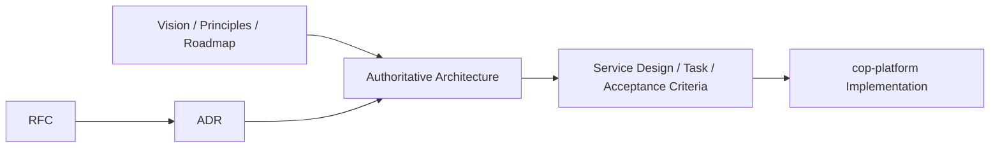

# COP Architecture Documentation System Design

## 1. Context

Cloud Operations Platform（COP，云运营平台）将采用 AI 辅助的长期开发模式。架构资产必须独立于实现代码存在，并同时服务于架构决策者和 AI 编程 Agent。

项目采用双仓库边界：

- `cop-architecture` 是 Vision、架构、领域模型、API 规范、RFC、ADR、路线图和 AI 开发约束的唯一事实来源。
- `cop-platform` 承载 Go、React、Helm、Terraform、Kubernetes 等实现代码。

COP 首要交付形态是开源、自托管优先，同时保持未来 SaaS 多租户能力。第一阶段 MVP 聚焦以下闭环：

> 云账号/集群接入 → 资源采集 → Metadata/CMDB → 指标与日志接入 → Dashboard → Alert → IAM/Audit

Workflow、Automation、FinOps、插件市场和 AI/RAG 在本阶段只保留架构边界，不进入详细设计。

## 2. Goals

本设计建立一套：

1. 可导航的文档分类和阅读路径。
2. 可追踪的 RFC、ADR 与权威文档关系。
3. 可被人和 AI 一致解释的元数据、状态和模板。
4. 可作为 `cop-platform` 实施门禁的架构事实来源。
5. 可逐步完善，而不会用批量生成的泛化内容制造虚假完成度的文档系统。

## 3. Non-goals

本轮不负责：

- 完成 30 篇文档的全部架构内容。
- 决定尚未讨论的技术选型或服务拆分。
- 创建 `cop-platform` 实现代码。
- 将任何骨架文档直接标记为 `accepted`。
- 为 Workflow、Automation、FinOps、插件市场或 AI/RAG 编写详细设计。

## 4. Documentation Architecture

采用稳定知识分类为主、RFC/ADR 为变更机制、Roadmap 为阶段视图的组织方式。

```text
cop-architecture/
├── README.md
├── AGENTS.md
├── CONTRIBUTING.md
├── docs/
│   ├── README.md
│   ├── vision/
│   ├── principles/
│   ├── architecture/
│   ├── domains/
│   ├── infrastructure/
│   ├── api/
│   ├── security/
│   ├── roadmap/
│   └── standards/
├── rfc/
│   └── README.md
├── adr/
│   └── README.md
└── templates/
    ├── architecture-template.md
    ├── domain-template.md
    ├── rfc-template.md
    ├── adr-template.md
    └── service-design-template.md
```

各目录职责如下：

| Directory | Responsibility |
| --- | --- |
| `docs/vision/` | 产品愿景、范围、非目标和能力地图 |
| `docs/principles/` | 长期稳定的架构原则和 AI 开发原则 |
| `docs/architecture/` | COP 当前有效的总体和跨域架构 |
| `docs/domains/` | DDD 领域、边界上下文、语言和交互 |
| `docs/infrastructure/` | Kubernetes、网络、存储和可观测基础设施 |
| `docs/api/` | API、事件、版本和兼容性规范 |
| `docs/security/` | 安全、IAM、授权、审计和合规架构 |
| `docs/roadmap/` | MVP 边界、阶段和能力演进顺序 |
| `docs/standards/` | 术语和文档治理规范 |
| `rfc/` | 重大变更的提案、方案比较和评审过程 |
| `adr/` | 已作出的架构决策、理由和后果 |
| `templates/` | 各类文档的标准结构 |

## 5. Documentation Lifecycle

文档治理链路为：



必须遵守以下规则：

1. `docs/` 下的权威文档描述“当前有效状态”。
2. RFC 描述问题、备选方案、影响和迁移方式，不直接成为永久事实来源。
3. 接受 RFC 时必须创建或关联 ADR。
4. ADR 记录选择、理由和后果，不复制完整架构内容。
5. 决策完成后必须更新相关权威文档。
6. `cop-platform` 只消费状态为 `accepted` 的权威文档和已接受决策。
7. 路线图表达建设顺序，不能替代架构决策。

## 6. Authoritative Document Catalog

第一版包含 30 篇权威文档。RFC、ADR、目录索引、仓库入口和模板不计入该数量。

| ID | Priority | Path | Purpose |
| --- | --- | --- | --- |
| `COP-VIS-001` | P0 | `docs/vision/platform-vision.md` | 定义 COP 的使命、目标用户和长期价值 |
| `COP-VIS-002` | P0 | `docs/vision/scope-and-non-goals.md` | 明确平台边界、非目标和阶段性限制 |
| `COP-VIS-003` | P1 | `docs/vision/product-capabilities.md` | 描述能力地图及阶段归属 |
| `COP-PRI-001` | P0 | `docs/principles/architecture-principles.md` | 规定长期架构原则和强制约束 |
| `COP-PRI-002` | P0 | `docs/principles/ai-development-principles.md` | 规定人、GPT 与 Codex 的协作边界 |
| `COP-ARCH-001` | P0 | `docs/architecture/system-context.md` | 描述 COP、用户和外部系统的关系 |
| `COP-ARCH-002` | P0 | `docs/architecture/logical-architecture.md` | 描述平台逻辑分层和核心组件 |
| `COP-ARCH-003` | P0 | `docs/architecture/control-plane-data-plane.md` | 定义控制面与数据面的职责和边界 |
| `COP-ARCH-004` | P1 | `docs/architecture/integration-architecture.md` | 定义同步、异步和外部集成模式 |
| `COP-DOM-001` | P0 | `docs/domains/domain-landscape.md` | 定义领域全景和边界上下文关系 |
| `COP-DOM-002` | P1 | `docs/domains/iam-domain.md` | 定义身份、主体、组织和访问管理领域 |
| `COP-DOM-003` | P1 | `docs/domains/resource-metadata-domain.md` | 定义资源、元数据、关系和 CMDB 核心模型 |
| `COP-DOM-004` | P1 | `docs/domains/cloud-access-domain.md` | 定义云账号、凭据、Provider 和资源发现 |
| `COP-DOM-005` | P1 | `docs/domains/observability-domain.md` | 定义遥测接入、查询和可观测数据边界 |
| `COP-DOM-006` | P1 | `docs/domains/alerting-domain.md` | 定义告警规则、事件、状态和通知边界 |
| `COP-INFRA-001` | P1 | `docs/infrastructure/infrastructure-overview.md` | 描述基础设施总体拓扑和演进边界 |
| `COP-INFRA-002` | P2 | `docs/infrastructure/kubernetes-topology.md` | 描述集群、命名空间、工作负载和隔离策略 |
| `COP-INFRA-003` | P1 | `docs/infrastructure/data-storage.md` | 定义 PostgreSQL、Redis、对象和遥测存储职责 |
| `COP-INFRA-004` | P1 | `docs/infrastructure/observability-stack.md` | 定义 OTel、VictoriaMetrics、日志和追踪栈 |
| `COP-INFRA-005` | P2 | `docs/infrastructure/network-and-ingress.md` | 定义入口、网关、网络边界和流量路径 |
| `COP-API-001` | P1 | `docs/api/api-design-guidelines.md` | 规定 REST、gRPC 和错误模型 |
| `COP-API-002` | P1 | `docs/api/event-contracts.md` | 规定事件命名、信封、语义和交付保证 |
| `COP-API-003` | P2 | `docs/api/versioning-and-compatibility.md` | 规定版本、兼容性和废弃流程 |
| `COP-SEC-001` | P1 | `docs/security/security-architecture.md` | 定义威胁边界、安全目标和控制面 |
| `COP-SEC-002` | P1 | `docs/security/iam-and-authorization.md` | 定义认证、授权、租户和权限模型 |
| `COP-SEC-003` | P2 | `docs/security/audit-and-compliance.md` | 定义审计事件、保留和合规边界 |
| `COP-ROAD-001` | P0 | `docs/roadmap/platform-roadmap.md` | 定义从 MVP 到 AI Native 的演进路线 |
| `COP-ROAD-002` | P0 | `docs/roadmap/mvp-definition.md` | 固化 MVP 能力、非目标和完成条件 |
| `COP-STD-001` | P0 | `docs/standards/terminology.md` | 建立全仓库统一语言和禁止混用的概念 |
| `COP-STD-002` | P2 | `docs/standards/documentation-standard.md` | 规定文档格式、状态、链接和评审规则 |

优先级分布为 P0 11 篇、P1 14 篇、P2 5 篇。

## 7. Document Contract

### 7.1 Metadata

每篇权威文档必须以 YAML front matter 开始：

```yaml
---
id: COP-ARCH-001
title: COP Logical Architecture
status: draft
version: 0.1.0
owners:
  - architecture
last_updated: 2026-08-03
related:
  - COP-DOM-001
rfc: []
adr: []
---
```

字段语义：

| Field | Requirement |
| --- | --- |
| `id` | 稳定且全仓库唯一，不随文件移动改变 |
| `title` | 英文正式标题；正文使用中文 |
| `status` | 使用对应文档类型允许的状态 |
| `version` | 使用语义化版本；结构或约束变化提升版本 |
| `owners` | 负责维护和批准内容的角色列表 |
| `last_updated` | 最后一次内容变更日期，格式为 `YYYY-MM-DD` |
| `related` | 相关权威文档 ID |
| `rfc` | 影响当前文档的 RFC 编号列表 |
| `adr` | 支撑当前文档的 ADR 编号列表 |

### 7.2 Status Models

- 权威文档：`draft → review → accepted → deprecated`
- RFC：`draft → review → accepted/rejected → superseded`
- ADR：`proposed → accepted → deprecated/superseded`

只有 `accepted` 权威文档可作为实现的强制输入。`accepted` 文档禁止包含 TBD、TODO、未决设计或相互冲突的约束。

### 7.3 Naming

- 普通文档使用 `lowercase-kebab-case.md`。
- RFC 使用 `RFC-0001-topic.md`。
- ADR 使用 `ADR-0001-decision.md`。
- 普通权威文档不在文件名中加入排序编号，避免目录调整导致重命名。
- 内部引用使用相对路径，同时在元数据中使用稳定 ID 建立语义关系。

### 7.4 Required Sections

权威架构文档模板至少包含：

1. Purpose
2. Scope
3. Context
4. Architecture or Model
5. Constraints
6. Quality Attributes
7. Implementation Guidance
8. References

领域模板还必须包含统一语言、边界上下文、聚合与实体、命令与查询、领域事件、不变量和外部关系。

### 7.5 Diagrams and Links

- 架构图优先使用 Markdown 内嵌 Mermaid，以支持版本比较、搜索和 AI 修改。
- 二进制图像只用于无法合理表达为 Mermaid 的外部资料。
- 每个目录提供 `README.md` 索引、文档目的和推荐阅读顺序。
- 所有仓库内部链接使用相对路径。

## 8. Templates

首轮创建五个模板：

| Template | Purpose |
| --- | --- |
| `templates/architecture-template.md` | 总体、基础设施、API 和安全架构文档 |
| `templates/domain-template.md` | DDD 领域和边界上下文文档 |
| `templates/rfc-template.md` | 问题、目标、方案、替代方案、风险、迁移和评审 |
| `templates/adr-template.md` | 背景、决策、后果、替代方案和关联资料 |
| `templates/service-design-template.md` | 未来向 `cop-platform` 提供服务级实现输入 |

## 9. Initial Repository Bootstrap

首轮初始化创建完整目录体系、索引、模板和 30 篇骨架文档。每篇骨架文档包含：

- 完整 YAML 元数据和唯一 ID。
- 中文说明及一句话目的。
- 初始 Scope 和 Non-goals。
- 对应模板规定的章节。
- 已知的上下游文档关联。
- 明确的 `draft` 状态。

首轮不写入未经讨论的技术结论，不生成用于凑篇幅的通用内容，也不创建虚假的 `accepted` 文档。

## 10. Acceptance Criteria

初始化完成必须同时满足：

1. **可导航**：根 README 和 `docs/README.md` 可以导航到全部目录、文档和推荐阅读顺序。
2. **可识别**：30 篇权威文档均具有唯一 ID、状态、版本和所有者。
3. **可追踪**：RFC、ADR 与权威文档之间具有明确的编号、状态和引用规则。
4. **可执行**：`AGENTS.md` 明确 AI Agent 只能依据 `accepted` 设计实施，并禁止自行决定平台架构。
5. **可演进**：文档的新增、评审、接受、废弃和取代流程均有明确规则。
6. **无伪完成**：所有未详细评审的权威文档保持 `draft` 状态。
7. **无结构缺陷**：不存在重复 ID、失效的内部链接或未被索引的权威文档。

## 11. Content Completion Order

初始化后按照以下顺序完善内容：

1. P0 11 篇：统一愿景、语言、总体边界、领域全景和 MVP 定义。
2. P1 14 篇：完成 MVP 领域、集成、基础设施、API 和安全设计。
3. P2 5 篇：补齐部署、网络、兼容性、审计和文档治理细节。

每篇文档独立完成讨论、评审和状态提升。文档不得因同批次其他文档完成而自动变为 `accepted`。

## 12. Risks and Mitigations

| Risk | Mitigation |
| --- | --- |
| 文档数量较多导致泛化或重复 | 首轮只建立骨架；按 P0、P1、P2 逐篇深入 |
| RFC、ADR 与当前架构内容冲突 | 接受决策时强制同步权威文档 |
| AI 将草稿当成实施要求 | 使用状态门禁，并在 `AGENTS.md` 明确限制 |
| 过早固化微服务边界 | 顶层按领域与架构组织，不按服务组织 |
| 同一概念出现多个名称 | P0 阶段优先完成 `terminology.md` |
| 图表难以评审或更新 | 默认使用 Mermaid 和文本化模型 |

## 13. Design Completion

本设计已经确认以下事项，实施阶段不得重新解释：

- 中文正文、英文文件名和技术术语。
- 同时服务于架构决策者和 AI 编程 Agent。
- `cop-architecture` 与 `cop-platform` 双仓库边界。
- COP 是统一项目名称和简称。
- 开源、自托管优先，同时保持 SaaS-ready。
- MVP 聚焦资源接入、Metadata/CMDB、可观测、Dashboard、Alert 和 IAM/Audit 闭环。
- 采用稳定知识分类、RFC/ADR 决策机制和 Roadmap 阶段视图。
- 创建 30 篇权威文档骨架、五个模板和完整索引体系。
