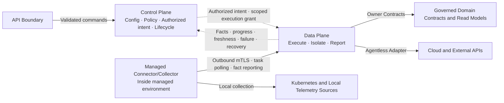

# COP 控制面与数据面内容设计

## 1. 目标

将 `COP-ARCH-003` 从初始化骨架补充为可评审的控制面与数据面架构文档，定义 Control Plane、Data Plane、Managed Connector/Collector 和 External Adapter Boundary 的职责、信任方向、任务与事实流、凭据边界、故障隔离及恢复语义。本文只描述逻辑责任和 Contract，不把责任映射为固定服务、进程、消息产品或部署拓扑。

## 2. 权威边界

- `COP-ARCH-003` 保持 `draft`；只有状态变为 `accepted` 后才形成实现约束。
- `COP-ARCH-002` 定义 COP 整体逻辑责任平面；本文展开 Control Plane、Data Plane 与受管环境组件的详细边界。
- `COP-DOM-004` 继续负责云接入领域的聚合、命令、查询和不变量。
- `COP-DOM-005` 继续负责 Telemetry 接入、信号类型、查询和资源关联领域语义。
- `COP-INFRA-004` 继续负责 OTel Collector、Telemetry 存储和查询组件的技术栈与数据路径。
- 外部云平台、Kubernetes 和 Telemetry 系统继续拥有其原始状态和数据权威；COP 只维护连接上下文、引用和受治理派生事实。

## 3. 方案选择

采用执行边界模型，以“谁决定、谁执行、谁报告”为主线组织文档：

- Control Plane 决定并持久化授权意图、任务生命周期和恢复决策。
- Data Plane 执行已授权任务，通过 Adapter 隔离外部产品语义。
- Managed Connector/Collector 在受管环境内执行本地采集或同步，只主动建立出站连接。
- 执行方只回报 facts、progress、freshness、failure 和 recovery signals，不修改 policy 或 desired state。

未采用组件拓扑模型，因为它会提前固化服务拆分和部署形态。未采用纯事件生命周期模型，因为它不能充分突出控制面与数据面的责任和信任边界。Contract-first 不预设同步 API、事件总线或消息产品；短交互可以同步，长任务和状态传播采用异步语义。

## 4. 责任模型

### 4.1 Control Plane

- 拥有接入配置、credential reference、policy、desired state、authorized intent、任务编排和任务 lifecycle。
- 在已验证的 identity、tenant、resource 和 authorization context 中接受或拒绝命令。
- 持久化任务目标、授权范围、policy version、取消意图和恢复决策。
- 向 Data Plane 提供短期、限租户、限资源、限操作的执行授权。
- 不采集 raw Telemetry，不直接进入受管环境执行，不把最终授权决策委托给 Data Plane。

### 4.2 Data Plane

- 执行已授权的 discovery、collection、synchronization、normalization 和 status reporting。
- 通过 Adapter 或等价 stable boundary 隔离云、Kubernetes 和 Telemetry 产品语义。
- 支持 agentless cloud discovery，并承接 Managed Connector/Collector 主动建立的任务会话。
- 处理有界 backpressure、retry、checkpoint、duplicate protection 和局部 failure isolation。
- 只提交 observations 和执行事实，不扩大 tenant、account、cluster、resource、operation 或 signal scope。

### 4.3 Managed Connector/Collector

- 位于 Kubernetes 集群或其他需要本地采集能力的受管环境。
- 只主动向 COP 建立出站 mTLS 会话；COP 不需要也不得依赖进入受管环境的入站控制连接。
- 通过 polling 或受控 streaming 在既有出站会话内获取已授权任务。
- 校验任务身份、有效期、policy version 和 scope 后执行本地采集或同步。
- 回报 facts、progress、freshness、failure 和 recovery signals，不直接写 Control Plane 私有存储。
- 不持有可跨租户、跨账号或跨集群复用的长期高权限凭据。

### 4.4 External Adapter Boundary

- 云平台优先使用集中式 agentless Adapter 进行 discovery 和 status synchronization。
- Kubernetes 与 Telemetry 可以使用受管 Connector/Collector，也可以在适用时由 Data Plane 通过外部 API 接入。
- Adapter 负责协议和供应商语义转换，不得把产品字段、错误码或认证机制泄漏为核心领域不变量。
- External identity provider、notification system 和 object storage 继续使用其 owning Contract，不被强制路由到 Data Plane。

## 5. 逻辑关系图设计

目标文档使用一个 Mermaid `flowchart` 表达逻辑责任、任务方向和出站信任方向：

图中 Control Plane 到 Data Plane 的虚线表示授权意图，不表示共享存储写入。Data Plane 到 Control Plane 的虚线表示事实和生命周期信号，不允许事实静默覆盖 policy 或 desired state。Connector 到 Data Plane 的单向箭头表示网络会话只能由受管环境主动建立；任务响应在该连接内返回，不产生 COP 到受管环境的入站连接要求。

## 6. 任务与数据流

### 6.1 接入配置

API Boundary 将经过 identity、tenant 和 authorization 校验的接入配置交给 Control Plane。Control Plane 保存连接配置和 credential reference，不保存或传播原始凭据。配置变更产生新的版本；运行中任务使用其已绑定的 policy/config version，不能被未审计的隐式变更覆盖。

### 6.2 任务创建与授权

Control Plane 先持久化 authorized intent、目标范围、policy/config version 和任务 lifecycle，再生成短期执行授权。执行授权至少约束 org、tenant、account/cluster、resource scope、operation、expiry 和 authorization context。过期、撤销、scope 不匹配或策略版本失效时默认拒绝。

### 6.3 任务获取与执行

- Agentless cloud 任务由 Data Plane 通过对应 Adapter 执行。
- 本地 Kubernetes 或 Telemetry 任务由 Connector/Collector 通过出站 mTLS 会话 polling 或受控 streaming 获取。
- Data Plane 和 Connector/Collector 都只能在授权范围内执行；发现新资源不能自动扩大当前任务 scope。
- 任务可在 checkpoint 边界取消、暂停、继续或重新同步。

### 6.4 事实回报与写入

执行方回报 observations、facts、progress、freshness、failure 和 recovery signals。Control Plane 维护任务 lifecycle 和恢复决策；领域 owner 通过 owner Contract 接收 observations 并维护写模型及不变量。Data Plane、Connector/Collector 和 Adapter 都不得直接写入 Control Plane 或其他领域的私有存储。

### 6.5 查询

用户查询优先使用受治理 read model，不穿过任务执行链。读模型必须声明 owner、source Contract、update method、freshness 和 failure semantics。需要外部实时查询时仍通过 owning integration Contract，调用方不得直接访问 Adapter、Connector 或 external credential。

## 7. 身份、授权与凭据

- Control Plane、Data Plane 和 Connector/Collector 使用可验证 workload identity；网络位置不构成信任。
- Connector/Collector 只通过双向验证的出站 mTLS 会话接入；建立连接不等于获得任务权限。
- 每个任务携带明确的 org、tenant、主体或 workload、account/cluster、resource scope、operation、policy version、expiry 和 authorization context。
- 执行授权必须短期有效、最小权限且不可扩大范围；验证失败时 default deny。
- Credential 只通过 controlled reference 解析；原始值不得进入普通任务载荷、领域数据、事件、日志或审计正文。
- `task ID`、`attempt`、`idempotency key` 和 `checkpoint` 用于防止重复执行和错误重放。
- 接入、授权、下发、执行、拒绝、取消、失败、恢复和 credential reference 使用都记录主体、目标、范围、时间和结果。

本文定义上述语义，不规定具体身份产品、证书签发产品、Secret/KMS 产品、token 格式或加密套件。

## 8. 失败、隔离与恢复

- 故障至少按 account、cluster、Connector/Collector、Adapter 和外部依赖隔离。
- 单一执行边界失败不得阻断无关连接、配置或不依赖该故障源的查询。
- 队列、并发和重试必须有界；backpressure 不能通过无界积压或同步等待扩散到 Experience Boundary。
- 可重试操作必须幂等或具有等价 duplicate protection，并携带明确的 attempt 和 checkpoint。
- Duplicate、out-of-order、delay 和 replay 不得破坏领域不变量。
- 同步交互区分 rejected、timeout、dependency failure、partial result 和 unknown outcome。
- 异步任务区分 pending、running、degraded、failed、cancelled、recovering 和 completed。
- Connector 离线、外部依赖不可用或数据过期时保留最后确认的 source 和 freshness，并明确显示 stale 或 unknown，不能伪装为实时成功。
- 恢复路径包括继续执行、重新调度、resynchronization、重建派生读模型和人工介入；恢复完成必须产生可验证结果。

## 9. 可观测性

- 所有运行单元暴露 health 和 dependency signals。
- 承担执行、同步或复制职责的单元额外暴露 progress、freshness、backlog、error 和 recovery signals。
- Control Plane 能区分未调度、等待 Connector、执行中、外部依赖失败、回报失败和恢复中状态。
- Data Plane 能按 tenant、account/cluster、Connector/Collector、Adapter 和 dependency 识别积压与故障，但日志和指标不得泄漏 credential 或跨租户敏感信息。
- 审计用于回答谁在什么范围内创建、授权、执行、拒绝、取消或恢复了任务；运营 Telemetry 不替代审计记录。

## 10. 目标文档结构

修改 `docs/architecture/control-plane-data-plane.md`，保持稳定 ID `COP-ARCH-003` 和 `draft` 状态。版本更新为 `0.2.0`，`last_updated` 更新为 `2026-08-05`；owners、related、rfc 和 adr 字段保持不变。

保留 H1 和一级模板章节，在 `Architecture or Model` 下按以下顺序组织内容：

- `Execution Boundary Model`
- `Control and Data Plane Diagram`
- `Responsibilities`
- `Task and Data Flows`
- `Identity, Authorization and Credentials`
- `Failure Isolation and Recovery`
- `Operational Signals`
- `Success Criteria`

四条既有 References 保持不变并可解析：

- `COP-ARCH-002`
- `COP-DOM-004`
- `COP-DOM-005`
- `COP-INFRA-004`

## 11. 明确不做

- 不定义微服务数量、进程模型、代码包、数据库、消息系统或部署拓扑。
- 不选择云 SDK、Kubernetes client、Collector、queue、Secret/KMS、PKI 或 service mesh 产品。
- 不规定 API shape、event fields、protocol、port、poll interval、timeout、retry count、queue size 或 numerical SLO。
- 不允许 COP 创建、修改、删除云资源或业务工作负载，也不定义 remediation 或 automation。
- 不把 Connector/Collector 设计为接受 COP 入站连接的远程执行代理。
- 不让 Data Plane 决定 tenant policy、最终 authorization、task intent 或 scope expansion。
- 不让任何执行方直接写入其他领域私有存储或持有跨边界长期高权限凭据。
- 不修改 `COP-ARCH-002`、`COP-DOM-004`、`COP-DOM-005`、`COP-INFRA-004` 或目录索引。
- 不把 `COP-ARCH-003` 标记为 `accepted`。

## 12. 成功标准

- 读者能明确区分 Control Plane 决策、Data Plane 执行、Connector/Collector 本地执行和外部系统权威。
- 图和正文明确 Control Plane 下发授权意图、执行方回报事实，且不存在循环同步依赖或跨平面直接写存储。
- 云平台 agentless discovery 与 Kubernetes/Telemetry 受管 Connector/Collector 可以并存。
- Connector/Collector 只建立出站 mTLS 会话，COP 不依赖进入受管环境的入站连接。
- 每个任务具有短期、限租户、限资源、限操作的授权上下文，原始 credential 不进入任务载荷。
- Control Plane 拥有 intent、task lifecycle 和 recovery decision；执行方只回报 facts、progress、freshness、failure 和 recovery signals。
- 故障按连接和执行边界隔离，并具有有界 backpressure、幂等重试、checkpoint、取消和 resynchronization 路径。
- Offline、stale、unknown、degraded 和 failed 与成功明确区分，并保留 source 和 freshness。
- Contract 可以版本化演进，重大不兼容变更进入 RFC/ADR，并具有迁移、回退或明确的 forward-recovery 方案。

## 13. 验收条件

1. `COP-ARCH-003` 的 ID、status、owners、related、rfc 和 adr 保持不变，version 为 `0.2.0`，last_updated 为 `2026-08-05`。
2. 文档包含一个可解析的 Mermaid `flowchart`，并只表达逻辑责任、任务方向和出站信任方向。
3. `Architecture or Model` 包含八个批准后的子节，顺序准确。
4. 图和正文覆盖 Control Plane、Data Plane、Managed Connector/Collector、External Adapter Boundary、cloud agentless execution 和 local collection。
5. 文档明确受管组件只建立出站 mTLS 会话，通过 polling 或受控 streaming 获取任务。
6. 文档明确短期 scoped execution grant、workload identity、default deny、credential reference 和 no implicit trust。
7. 文档明确 Control Plane 拥有 intent/lifecycle，执行方只回报 facts/progress/freshness/failure/recovery。
8. 文档明确 account、cluster、Connector/Collector、Adapter 和 dependency 隔离，以及 retry、idempotency、backpressure、checkpoint、cancellation 和 resynchronization。
9. 文档明确同步和异步状态、stale/unknown 语义以及可验证恢复结果。
10. 四条既有 References 均可解析，未出现占位或填充文本。
11. 文件为 UTF-8、无 BOM、无替换字符，Mermaid block 唯一且 Markdown 表列数一致。
12. `git diff --check` 和文档验证通过，实施提交只包含 `docs/architecture/control-plane-data-plane.md`。
