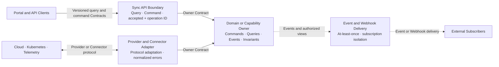

# COP 集成架构内容设计

## 1. 目标

将 `COP-ARCH-004` 从初始化骨架补充为可评审的集成架构文档，按交互语义定义同步 Query、同步 Command、异步 Task/Event、Webhook 和 Provider/Connector Adapter 的适用场景、Contract 所有权、成功与失败语义、交付保证、幂等、隔离、错误归一化和兼容演进。本文不预设统一协议、中央集成服务或具体基础设施产品。

## 2. 权威边界

- `COP-ARCH-004` 保持 `draft`；只有状态变为 `accepted` 后才形成实现约束。
- `COP-ARCH-002` 定义整体逻辑责任、同步/异步交互和数据所有权；本文展开集成模式与错误边界。
- `COP-API-001` 负责 REST、gRPC、错误模型、分页、过滤、幂等和鉴权上下文的详细规范。
- `COP-API-002` 负责领域事件与集成事件的信封、命名、版本、交付、排序、重试和隔离细则。
- `COP-API-003` 负责 API、事件和其他 Contract 的版本、兼容、废弃及迁移流程。
- `COP-DOM-004` 负责云账号、credential reference、Provider、discovery 和 sync job 的领域语义与不变量。
- 领域或能力 owner 定义业务 Contract；集成边界只负责路由、协议适配、安全、投递和错误归一化。

## 3. 方案选择

采用交互语义矩阵，而不是按 REST、gRPC、消息总线等通信产品组织设计。每种交互先定义业务语义、所有权、成功和失败行为，再选择传输技术：

- 短查询和短命令使用同步 Contract。
- 长任务和状态传播使用异步 Contract。
- 对外订阅通知使用 Webhook delivery Contract。
- 云、Kubernetes、Telemetry 等外部连接使用 Provider/Connector Adapter Contract。

未采用统一同步 API，因为它会把长任务生命周期绑定到连接或轮询。未采用纯事件驱动，因为查询和即时拒绝需要明确同步语义。未采用中央集成枢纽，因为它会复制领域规则、形成共享业务中枢和单点瓶颈。

## 4. 集成职责与 Contract 所有权

### 4.1 Domain or Capability Owner

- 定义命令、查询、事件、Webhook 事件视图、业务语义、不变量和适用失败语义。
- 拥有写模型以及对外暴露的 owner Contract。
- 决定哪些事实可以形成事件，以及外部订阅方可见的最小授权视图。
- 不把领域规则委托给 API、Event Delivery、Webhook Delivery 或 Adapter 边界。

### 4.2 API Boundary

- 负责 identity、tenant 和 authorization context、输入校验、版本路由和协议适配。
- 将命令和查询路由到 owning Contract，不拥有领域写模型或业务不变量。
- 对长任务只返回 accepted/rejected、operation/task ID 和查询位置，不把 accepted 表示为 completed。

### 4.3 Event Delivery Boundary

- 负责订阅、投递、确认、有界重试、隔离、重放授权和可观测性。
- 保持事件业务语义和 event ID，不修改领域事实或隐式创建新事件版本。
- 不要求特定 broker、topic 结构或 dead-letter 产品。

### 4.4 Webhook Delivery Boundary

- 按 tenant/subscription 独立管理 endpoint、controlled credential reference、签名或身份校验、重放窗口、速率和重试。
- 只发送 owner 定义的最小授权事件视图，不发送 credential、secret 或其他租户数据。
- Delivery failure 只改变投递状态，不回滚已经提交的领域事实。

### 4.5 Provider/Connector Adapter

- 隔离外部协议、认证、产品模型、错误码和限速语义。
- 将外部输入转换为 owner Contract，将输出转换为外部系统可理解的调用或回调。
- 保留脱敏的 provider code、source context、correlation ID 和 retryability，不能让外部模型成为 COP 核心模型。

### 4.6 No Central Business Hub

集成能力不拥有领域写模型，不复制领域规则，不编排未经 owner 授权的业务流程，也不形成各领域直接写入的共享数据库。路由和投递拓扑不改变 Contract 所有权。

## 5. 集成关系图设计

目标文档使用一个 Mermaid `flowchart` 展示调用方、三个集成边界和领域/能力 owner 的关系：

图中 owner 节点拥有业务语义和不变量。Sync API、Event/Webhook Delivery 和 Adapter 是集成边界，不是中央业务服务。虚线表示至少一次的异步投递，不表示共享存储或分布式事务。Webhook failure 不形成从 Subscriber 回滚 Domain Owner 的反向业务关系。

## 6. 交互语义矩阵

| 交互类型 | 适用场景 | 成功语义 | 失败与恢复 |
| --- | --- | --- | --- |
| Sync Query | 读取受治理 read model 或短时外部查询 | 返回数据及 source、freshness、partial/complete 状态 | 区分 validation、authorization、timeout、dependency failure、partial 和 unknown |
| Sync Command | 可快速完成、接受或拒绝的领域命令 | 返回 completed，或 accepted + operation/task ID + 查询位置 | accepted 不等于 completed；最终结果通过任务状态、事件或 Webhook 获取 |
| Async Task/Event | 长任务、状态传播和跨领域通知 | At-least-once；消费者确认处理结果 | 允许 duplicate、delay、out-of-order；使用 ID、幂等键、不变量、有界重试和隔离恢复 |
| Webhook | 向外部订阅方推送最小授权事件视图 | 记录 subscription、delivery、attempt 和确认结果 | 每个订阅独立重试、限速、暂停和恢复，不阻塞领域事务 |
| Provider/Connector | 云、Kubernetes、Telemetry 等外部集成 | Adapter 转换为 owner Contract | 统一错误分类并保留脱敏 source context，不直接透传供应商模型 |

任何交互都必须显式携带适用的 tenant、identity/subject、authorization、correlation/causation、Contract version 和 audit context，但不要求所有交互机械使用同一种信封或协议。

## 7. 同步交互

### 7.1 Sync Query

- 查询优先读取受治理 read model，并返回 source、freshness 和 complete/partial 状态。
- 需要实时外部数据时通过 owning integration Contract，不允许调用方直接访问 Adapter、Connector 或 external credential。
- 查询不得产生未声明的写入副作用；确有状态变更时必须使用 Command Contract。
- Timeout 或 unknown outcome 不能用空结果或旧值伪装为完整成功。

### 7.2 Sync Command

- API Boundary 校验 identity、tenant、resource、authorization、Contract version 和 idempotency context。
- 可在同步窗口内完成的命令返回 completed 或明确失败。
- 长任务返回 accepted/rejected、稳定 operation/task ID 和查询位置；accepted 只表示意图已被授权并持久化，不表示执行完成。
- 最终结果通过任务状态 Query、事件或 Webhook 传播，并使用同一 correlation context 关联。

## 8. 异步事件与任务

- Async Task/Event 采用 at-least-once，不承诺 exactly-once。
- 生产方提供稳定 event/message ID、Contract version、occurred-at、tenant、source、correlation 和 causation context。
- 消费方使用业务不变量和 idempotency key 去重；duplicate、out-of-order、delay 和 replay 不能产生重复业务效果。
- 排序只在明确声明的 partition/aggregate scope 内有效，不提供全局排序保证。
- 重试必须有界并区分 retryable 与 terminal failure；失败可以进入逻辑隔离区，但本文不指定 broker 或 dead-letter 产品。
- 授权重放保留原始 event ID，并产生新的 delivery/processing attempt 和完整审计链。

## 9. Webhook Delivery

- 每个 tenant/subscription 使用独立 endpoint、controlled credential reference、签名或身份校验、重放窗口、速率和重试状态。
- Payload 是领域 owner 定义的最小授权事件视图，不包含 credential、secret、内部原始事件或未授权租户数据。
- 每次 delivery 记录 subscription ID、event ID、Contract version、attempt、timestamp、correlation ID 和结果。
- Webhook 采用 at-least-once，外部消费者必须按 event ID 和业务不变量实现幂等。
- 订阅可以独立暂停、恢复、重放或终止；单一订阅失败不能阻断其他订阅或领域事务。
- 领域事实提交后，Webhook delivery failure 只能改变投递状态，不能回滚领域事实。
- 重放必须经过授权并保留原始 event ID 与新的 delivery attempt。

## 10. Provider/Connector Adapter

- Adapter 只把外部产品语义转换为 owner Contract，不拥有核心领域模型。
- 外部输入先验证 workload/connection identity、tenant、scope 和 credential reference，再映射为领域 command、observation 或 query。
- 外部输出遵循 owning Contract 的最小权限和数据视图，不直接暴露内部写模型。
- 外部错误统一映射为 validation、authentication、authorization、rate limit、timeout、dependency unavailable、conflict、partial 和 unknown。
- 错误上下文只保留已脱敏 provider code、source、correlation ID、retryability 和发生阶段；外部错误消息、credential 或敏感 payload 不向领域或用户边界透传。

## 11. 错误、隔离与恢复

- 同步调用、事件处理、Webhook delivery 和 Adapter operation 都携带 correlation/causation context、Contract version、attempt、结果和适用的 latency signal。
- 自动重试只用于明确 retryable 的失败，并具有有界次数或时长及 backoff；validation、authentication、authorization 等 terminal failure 不自动重试。
- 隔离至少按 tenant、subscription、consumer、Provider/Connector 和外部 dependency；单一订阅或 Provider 故障不能阻断其他集成。
- Unknown outcome 不能自动宣称失败或成功，必须通过状态查询、对账或幂等重试确认。
- 恢复路径包括重新投递、授权重放、重新同步、订阅恢复和人工介入；恢复必须保留审计链并验证最终结果。
- Backlog、retrying、isolated、paused、degraded、failed 和 recovered 状态必须可观测，并与领域业务状态区分。

## 12. 版本与兼容

- Contract 默认采用向后兼容的增量演进；新增可选字段或能力不得改变既有字段和行为语义。
- 破坏性变更发布显式新版本，并提供双版本迁移窗口、废弃通知、消费者兼容验证和迁移证据。
- 同步 API、事件、Webhook 和 Adapter Contract 都声明 owner、version、适用交付/失败语义和废弃状态，但不强制使用同一种协议或信封。
- 在移除旧版本前验证活跃消费者已经迁移，且没有未解决的隔离投递或重放依赖。
- 重大不兼容变更必须进入 RFC/ADR，并提供可回退路径；确实不可回退时明确 forward-recovery、验证证据和额外批准条件。

## 13. 目标文档结构

修改 `docs/architecture/integration-architecture.md`，保持稳定 ID `COP-ARCH-004` 和 `draft` 状态。版本更新为 `0.2.0`，`last_updated` 更新为 `2026-08-05`；owners、related、rfc 和 adr 字段保持不变。

保留 H1 和一级模板章节，在 `Architecture or Model` 下按以下顺序组织内容：

- `Integration Responsibility Model`
- `Integration Paths Diagram`
- `Interaction Semantics Matrix`
- `Synchronous Contracts`
- `Asynchronous Tasks and Events`
- `Webhook Delivery`
- `Provider and Connector Adapters`
- `Error Isolation and Recovery`
- `Versioning and Compatibility`
- `Success Criteria`

四条既有 References 保持不变并可解析：

- `COP-ARCH-002`
- `COP-API-001`
- `COP-API-002`
- `COP-DOM-004`

`COP-API-003` 通过 `COP-API-001` 和 `COP-API-002` 的关系承接详细版本规范；目标文档正文可以引用其 ID 说明责任，但不新增第五条 Reference，保持既有 References 稳定。

## 14. 明确不做

- 不指定 REST 或 gRPC 的适用接口全集，不指定 broker、topic、queue、dead-letter、Webhook 签名算法或 SDK。
- 不规定 port、timeout、retry count、backoff 数值、payload size、rate limit 或 numerical SLO。
- 不定义具体业务接口字段、事件信封字段或 Provider SDK 实现。
- 不建立拥有业务语义、写模型或共享数据库的中央 Integration Service。
- 不承诺 exactly-once、全局排序、跨系统分布式事务或 Webhook 回滚领域事实。
- 不直接透传外部供应商模型、错误消息、credential 或敏感 payload。
- 不修改 `COP-ARCH-002`、`COP-API-001`、`COP-API-002`、`COP-API-003`、`COP-DOM-004` 或目录索引。
- 不把 `COP-ARCH-004` 标记为 `accepted`。

## 15. 成功标准

- 读者能按交互语义选择同步 Query、同步 Command、异步 Task/Event、Webhook 或 Provider/Connector Adapter。
- 每个 Contract 具有明确领域/能力 owner，集成边界不拥有领域写模型或复制业务规则。
- 长任务遵循同步接受、异步完成，并通过 operation/task ID 与最终状态关联。
- Async Event 和 Webhook 明确采用 at-least-once，消费者处理 duplicate、out-of-order、delay 和 replay。
- Webhook 按 tenant/subscription 独立建立身份、重放、限速、重试和故障隔离边界。
- Provider/Connector 错误映射为统一分类，同时保留脱敏 source context、correlation ID 和 retryability。
- Unknown outcome、partial、terminal failure 和 retryable failure 可以区分并具有恢复路径。
- Contract 兼容优先演进；破坏性变更具有显式版本、迁移窗口、消费者验证及回退或 forward-recovery。

## 16. 验收条件

1. `COP-ARCH-004` 的 ID、status、owners、related、rfc 和 adr 保持不变，version 为 `0.2.0`，last_updated 为 `2026-08-05`。
2. 文档包含一个可解析的 Mermaid `flowchart`，展示 Sync API、Event/Webhook Delivery、Provider/Connector Adapter 与 Domain/Capability Owner。
3. `Architecture or Model` 包含十个批准后的子节，顺序准确。
4. 文档包含五行交互语义矩阵，并明确 accepted 不等于 completed。
5. 文档明确 at-least-once、consumer idempotency、duplicate、out-of-order、delay、replay 和局部 ordering scope。
6. 文档明确每个 tenant/subscription 的 Webhook endpoint、credential reference、身份/签名、重放、速率、重试和隔离语义。
7. 文档明确 Provider/Connector 错误分类、脱敏 source context、correlation ID、retryability 和禁止外部模型泄漏。
8. 文档明确 tenant、subscription、consumer、Provider/Connector、dependency 隔离，以及有界重试、对账和恢复路径。
9. 文档明确兼容优先、显式破坏版本、双版本迁移窗口、废弃通知、消费者验证及回退/forward-recovery。
10. 四条既有 References 均可解析，未出现占位或填充文本。
11. 文件为 UTF-8、无 BOM、无替换字符，Mermaid block 唯一且 Markdown 表列数一致。
12. `git diff --check` 和文档验证通过，实施提交只包含 `docs/architecture/integration-architecture.md`。
