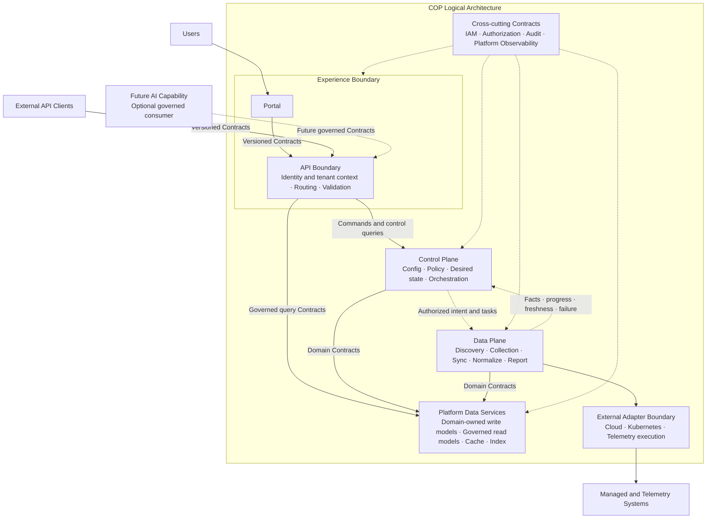

# COP 逻辑架构内容设计

## 1. 目标

将 `COP-ARCH-002` 从初始化骨架补充为可评审的逻辑架构文档，定义 Experience Boundary、Control Plane、Data Plane、Platform Data Services、跨切面 Contract、外部 Adapter 边界和 Future AI Capability 的职责、依赖方向、交互方式、数据所有权及失败语义。本文只描述逻辑责任，不把逻辑平面映射为微服务、进程、数据库、物理集群或供应商产品。

## 2. 权威边界

- `COP-ARCH-002` 保持 `draft`；只有状态变为 `accepted` 后才形成实现约束。
- `COP-ARCH-001` 定义用户、COP 与外部系统的系统级边界；本文只展开 COP 内部的逻辑责任。
- `COP-ARCH-003` 继续负责 Control Plane、Data Plane 和受管环境组件的详细信任、传输与运行边界。
- `COP-DOM-001` 继续负责 bounded contexts、领域所有权和领域上下游关系；逻辑平面不替代领域边界。
- `COP-INFRA-001` 继续负责物理部署与基础设施边界；本文不规定 Kubernetes、PostgreSQL、Redis 或 Telemetry 产品拓扑。

## 3. 责任模型

逻辑架构采用责任平面模型，而不是 Portal、API、Control Plane、Data Plane、Storage、AI 逐层穿透的线性六层模型。责任平面表达职责和依赖，不规定服务数量、代码包、数据库或部署单元。

### 3.1 Experience Boundary

- Portal 负责用户交互、视图和导航，不实现领域业务规则。
- API Boundary 面向 Portal 和外部客户端提供同一组版本化 Contract。
- API Boundary 负责 identity context、tenant context、routing、协议适配和输入校验。
- API Boundary 不直接访问领域私有存储，也不把领域规则复制到边界层。
- Portal 不绕过 API Boundary 直接调用内部逻辑单元。

### 3.2 Control Plane

- 负责云账号、Kubernetes 集群及外部平台的接入配置和 credential reference。
- 负责 policy、desired state、同步任务意图、任务编排和任务 lifecycle 协调。
- 在已验证身份、租户和授权上下文中接受或拒绝命令。
- 向 Data Plane 下发已授权意图，不把租户策略或最终授权交给 Data Plane 自主决定。
- 不处理大规模 raw Telemetry，不控制云资源或业务工作负载 lifecycle。

### 3.3 Data Plane

- 执行已授权的 discovery、collection、synchronization、normalization 和 status reporting 任务。
- 通过 Adapter 或等价 stable boundary 隔离云、Kubernetes、Telemetry 等执行相关的外部产品语义。
- 处理 backpressure、retry、checkpoint、duplicate protection 和局部 failure isolation。
- 向 Control Plane 上报事实、进度、freshness、错误和恢复状态。
- 不定义 tenant policy、最终 authorization decision 或任务意图，不扩大已授权的采集范围。

### 3.4 Platform Data Services

- 承载 domain-owned write models、governed read models、cache、index 和 object reference。
- 每个领域通过自身 Contract 管理写模型和不变量；其他平面不得直接写入其存储。
- 读模型必须声明 owner、source Contract、构建或更新方式、freshness 和 failure semantics。
- Cache、index 和复制数据不能成为未声明的新权威来源。
- Raw Telemetry 和外部 object storage 继续保持外部权威，COP 只维护接入、关联、引用和必要派生上下文。

### 3.5 Cross-cutting Contracts

- IAM context、authorization decision、Audit 和 Platform Observability 通过稳定 Contract 贯穿各平面。
- 跨切面能力不得成为各平面直接写入的共享数据库，也不得绕过领域所有权。
- 内部网络位置不构成信任；每个请求、命令、任务和查询都携带明确的组织、租户、主体、资源与授权上下文。
- 关键接入、配置、策略、授权、任务意图、执行结果和通知行为必须可审计。
- 所有可运行单元暴露 health 和 dependency signals；承担处理、同步或复制职责的单元额外暴露 progress、freshness、backlog、error 和 recovery signals。

### 3.6 Future AI Capability

- AI 是可选未来能力消费者，不是 MVP 核心层，也不进入关键请求路径。
- AI 通过与 Portal 和外部客户端相同的受治理、版本化 Contract 获取数据。
- AI 交互携带 tenant、authorization、audit、source 和 freshness context。
- AI 不直接访问领域私有存储、credential 或未经治理的 raw data。
- AI 的详细能力、数据处理和运行边界必须经过路线图、RFC/ADR 及相应权威文档评审。

## 4. 逻辑架构图设计

目标文档使用一个 Mermaid `flowchart` 展示整体责任关系：

图中节点表示逻辑责任，不是服务或进程。实线表示同步 Contract 或逻辑依赖，虚线表示异步意图、事实传播或跨切面约束；目标正文必须直接解释线型含义，不能依赖读者猜测。

图中的 External Adapter Boundary 只强调 Data Plane 执行 discovery、collection 和 synchronization 时使用的云、Kubernetes 与 Telemetry 适配边界。External identity provider、notification system 和 object storage 不被强制路由到 Data Plane；它们分别通过 IAM、Alert/Notification 或 Platform Data Services 的 owning Contract 接入。完整外部系统关系继续由 `COP-ARCH-001` 定义。

## 5. 依赖与交互模型

### 5.1 依赖规则

- 跨平面交互 Contract-first，先定义语义、所有权、兼容性和失败行为，再选择通信技术。
- 依赖保持单向，禁止形成循环同步依赖。
- 禁止跨平面直接写存储；查询也不得绕过 Contract 读取其他领域私有存储。
- Experience Boundary 可以通过受治理 Query Contract 使用读模型，但不能把 Platform Data Services 当作通用共享数据库。
- Control Plane 定义意图；Data Plane 执行意图并上报事实。事实回传不能隐式改变 policy 或 desired state。

### 5.2 Command Path

Portal 或外部客户端通过 API Boundary 提交命令。API Boundary 验证 identity、tenant、resource 和 authorization context，再将命令交给拥有相应写模型的 Control Plane 或 domain Contract。短命令可以同步返回 accepted、rejected、timeout、dependency failure 或 partial result；API Boundary 不实现领域规则。

### 5.3 Long-running Task Path

Discovery、synchronization 和状态传播采用异步 Contract。Control Plane 持久化已授权意图和任务 lifecycle，再向 Data Plane 下发任务。Data Plane 通过 Adapter 执行，并回传 facts、progress、freshness、failure 和 recovery state。任务可重试处理必须幂等或具有等价 duplicate protection。

### 5.4 Query Path

Portal 和外部客户端通过版本化 Query Contract 使用受治理读模型。查询不需要穿过 Data Plane；读模型必须暴露 source、owner、freshness 和 failure semantics。需要外部实时查询时，也必须通过拥有该集成责任的 Contract，不得直接访问 Adapter 或外部 credential。

## 6. 数据所有权与存储访问

| 数据类别 | 权威责任 | 访问约束 |
| --- | --- | --- |
| Connection config、policy、desired state | 对应 COP domain owner | 只通过 owner Contract 写入；其他平面不能直接写存储 |
| Resource identity、catalog、relationships | Resource/Metadata domain owner | Data Plane 通过 Contract 提交 observations，不直接修改私有表 |
| Task intent、progress、failure、recovery | 拥有任务 lifecycle 的 Control Plane responsibility | Data Plane 上报 facts；不能把执行事实静默覆盖为新的意图 |
| Governed read models | 已声明的 read-model owner | 声明 source Contract、update method、freshness 和 failure semantics |
| Cache、index、replica | 对应 source owner | 只作派生加速，不成为新权威来源 |
| Raw Telemetry、external object data | External system | COP 维护查询上下文、关联或引用，不声明为自身权威数据 |

本文不把上述 logical ownership 映射到数据库数量、schema、消息系统或部署产品。

## 7. 失败、降级与恢复

- 同步 Contract 明确区分 rejection、timeout、dependency failure、partial result 和 unknown outcome。
- 异步任务暴露 lifecycle、retry、idempotency or duplicate protection、checkpoint、cancellation 和 resynchronization path。
- Duplicate、delay 和 out-of-order delivery 不得破坏领域不变量。
- 单个账号、集群、Adapter 或外部依赖故障不得阻断其他连接，也不得阻断不依赖该故障源的配置和查询能力。
- Backpressure 必须限制在可识别边界内，不能通过无界队列或同步等待扩散到 Experience Boundary。
- Stale、unknown、degraded 和 failed state 必须携带 source 与 freshness，不能呈现为 real-time success。
- 恢复后必须能够重新同步或重新构建受影响读模型，并验证恢复结果。

## 8. 目标文档结构

修改 `docs/architecture/logical-architecture.md`，保持稳定 ID `COP-ARCH-002` 和 `draft` 状态。版本更新为 `0.2.0`，`last_updated` 更新为 `2026-08-05`；owners、related、rfc 和 adr 字段保持不变。

保留 H1 和一级模板章节，在 `Architecture or Model` 下按以下顺序组织内容：

- `Responsibility Model`
- `Logical Architecture Diagram`
- `Plane Responsibilities`
- `Cross-plane Interactions`
- `Data Ownership and Storage Access`
- `Cross-cutting Governance`
- `Failure and Degradation`
- `Success Criteria`

`Purpose`、`Scope` 和 `Non-goals` 调整为批准后的逻辑架构范围。`Constraints` 汇总 Contract-first、单向依赖、领域写模型所有权、无内部隐式信任、外部权威和 AI 非 MVP 关键路径等不可违反项。`Quality Attributes` 明确边界清晰性、安全性、可靠性、可运维性、兼容性与可演进性，不引入实现参数。

四条既有 References 保持不变并可解析：

- `COP-ARCH-001`
- `COP-ARCH-003`
- `COP-DOM-001`
- `COP-INFRA-001`

## 9. 明确不做

- 不把逻辑平面映射成微服务、进程、代码包、数据库或物理部署单元。
- 不定义具体 API shape、event fields、message broker、protocol、port、timeout、retry count 或 numerical SLO。
- 不选择 Kubernetes、database、cache、Telemetry、queue、Secret/KMS 或 AI 产品。
- 不替代 `COP-ARCH-003` 的 Control Plane/Data Plane 详细设计。
- 不替代 `COP-DOM-001` 的 bounded-context 和 domain relationship 设计。
- 不引入资源 mutation、automated remediation、Workflow、Automation 或 AI MVP 能力。
- 不修改 `COP-ARCH-001`、`COP-ARCH-003`、`COP-DOM-001`、`COP-INFRA-001` 或目录索引。
- 不把 `COP-ARCH-002` 标记为 `accepted`。

## 10. 成功标准

- 读者能够从一张图识别 Experience Boundary、Control Plane、Data Plane、Platform Data Services、跨切面 Contract、外部 Adapter 边界和 Future AI Capability。
- Portal 和外部客户端使用同一版本化 Contract；Portal 不直接调用内部逻辑单元或访问存储。
- Control Plane 定义已授权意图，Data Plane 执行并上报事实；两者没有循环同步依赖。
- Query Contract 可以使用受治理读模型，不需要穿过 Data Plane，也不绕过领域所有权。
- 每个写模型、读模型、cache、index 和外部数据都有明确 owner、source 和 authority semantics。
- IAM、authorization、Audit 和 Platform Observability 贯穿各平面，但不形成共享可写存储。
- 同步和异步交互的 failure、retry、idempotency、isolation、degradation 和 recovery semantics 可判定。
- Future AI Capability 不进入 MVP 关键路径，也不能绕过 Contract、tenant、authorization、audit、source 或 freshness boundary。

## 11. 验收条件

1. `COP-ARCH-002` 的 ID、status、owners、related、rfc 和 adr 保持不变，version 为 `0.2.0`，last_updated 为 `2026-08-05`。
2. 文档包含一个可解析的 Mermaid `flowchart`，并只表达逻辑职责和依赖。
3. 文档包含八个批准后的 `Architecture or Model` 子节，顺序准确。
4. 图和正文覆盖 Experience Boundary、Control Plane、Data Plane、Platform Data Services、Cross-cutting Contracts、External Adapter Boundary 和 Future AI Capability。
5. 文档明确 Portal/API 共用版本化 Contract、Control 下发意图、Data 上报事实以及查询使用受治理读模型。
6. 文档明确领域写模型所有权、禁止跨平面直接写存储，以及读模型 owner、source、freshness 和 failure semantics。
7. 文档明确 IAM、authorization、Audit、Platform Observability、tenant context、credential reference 和 no implicit trust。
8. 文档明确同步与异步 failure、idempotency、retry、backpressure、isolation、degradation、checkpoint 和 recovery 要求。
9. 文档明确 AI 是可选未来能力，不进入 MVP 关键路径，不直接访问私有存储或 credential。
10. 四条既有 References 均可解析，未出现占位或填充文本。
11. 文件为 UTF-8、无 BOM、无替换字符，Markdown 表列数一致。
12. `git diff --check` 和文档验证通过，实施提交只包含 `docs/architecture/logical-architecture.md`。
