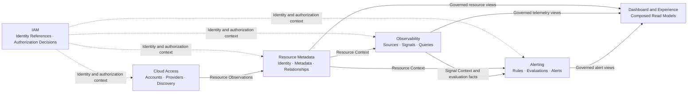

# COP 领域全景内容设计

## 1. 目标

将 `COP-DOM-001` 从初始化骨架补充为可评审的领域全景文档，明确 COP 的子域分类、bounded contexts、事实所有权、上下游关系、跨域 Contract、一致性、故障隔离和验证约束。本文为后续 `COP-DOM-002` 至 `COP-DOM-006` 提供共同边界，但不替代各领域的聚合、命令、查询、事件和不变量设计。

## 2. 权威边界

- `COP-DOM-001` 保持 `draft`；只有状态变为 `accepted` 后才形成实现约束。
- `COP-ARCH-002` 定义整体逻辑责任、同步与异步协作、数据所有权和读模型原则；本文将其落实到领域边界。
- `COP-ARCH-003` 定义 Control Plane 与 Data Plane 的信任、任务和状态边界；技术平面不替代业务 bounded context。
- `COP-ARCH-004` 定义同步 Query、同步 Command、异步 Task/Event 和 Adapter 的集成语义；本文只确定领域之间何时形成上下游关系。
- `COP-DOM-002` 至 `COP-DOM-006` 分别负责 IAM、Resource Metadata、Cloud Access、Observability 和 Alerting 的内部模型与不变量。
- 外部系统保留原始事实权威；COP 领域只拥有明确声明的内部业务事实和受治理投影。

## 3. 方案选择

采用按业务能力对齐的 bounded contexts：IAM、Resource Metadata、Cloud Access、Observability 和 Alerting 各自拥有写模型、不变量和业务 Contract；Dashboard 是组合读模型与 Experience 能力，不建立独立核心领域。

未采用资源生命周期流水线划分，因为接入、发现、归一化、观测和告警阶段不能稳定表达 IAM 等横切事实的所有权。未采用按 Control Plane、Data Plane 和 Experience Plane 划域，因为技术平面会压过业务语义，并可能让同一业务事实出现多个 owner。

## 4. 子域分类

| 类型 | Bounded Context | 分类理由 |
| --- | --- | --- |
| 核心子域 | Resource Metadata | 建立 COP 内部统一资源身份、规范化元数据和资源关系，是跨能力关联的基础。 |
| 核心子域 | Observability | 建立统一信号语义、资源关联和查询边界，直接支撑云运维洞察。 |
| 核心子域 | Alerting | 将信号转换为可治理的规则、评估和告警生命周期，形成核心运维闭环。 |
| 支撑子域 | Cloud Access | 隔离云账号、凭据引用、Provider 发现与同步，为核心子域提供 observations。 |
| 通用子域 | IAM | 提供 Principal、Organization、Tenant、Role、授权意图和授权判定。 |
| Experience 能力 | Dashboard | 组合 Resource、Telemetry 和 Alert 读模型，不拥有核心写模型。 |

分类表达产品投资和建模重点，不表示安全级别、部署顺序或运行依赖强弱。IAM 虽为通用子域，仍是独立 bounded context 和授权事实 owner。

## 5. Bounded Context 所有权

### 5.1 IAM

- 拥有 Principal、Organization、Tenant、Role、授权意图和授权判定语义。
- 向其他领域提供稳定身份引用和授权结果。
- 不允许业务领域复制完整用户、角色或权限写模型。
- 外部 Identity Provider 保留外部认证事实权威；IAM 管理 COP 内部租户和授权语义。

### 5.2 Resource Metadata

- 拥有 COP 内部统一 Resource Identity、规范化元数据和资源关系。
- 解析、合并和去重来自 Cloud Access 的 Resource Observations。
- 发布资源身份、属性和关系的已提交事实。
- Cloud Provider 和 Kubernetes 保留资源实际状态的最终权威。

### 5.3 Cloud Access

- 拥有云账号接入、受控 credential reference、Provider、发现和同步生命周期。
- 将外部资源输入转换为 Resource Observations。
- 不创建或维护统一 Resource Identity，不直接写 Resource Metadata 的私有存储。
- 发现失败时保留同步游标、失败范围和最近一次已确认结果。

### 5.4 Observability

- 拥有 Telemetry Source、Signal Binding、统一查询语义和资源关联。
- 使用 Resource Metadata 提供的资源身份建立信号关联。
- 不拥有 Resource 主数据，也不复制 Alerting 的规则或告警生命周期。
- 外部 Telemetry Backend 保留原始 Metrics 和 Logs 的数据权威。

### 5.5 Alerting

- 拥有告警规则、评估结果、告警实例、状态流转和通知编排。
- 消费 Resource Context、Signal Context 和 evaluation facts。
- 不反向拥有 Resource 或原始 Telemetry。
- 无法取得必要信号时记录 evaluation failure，不把无法评估解释为正常。

### 5.6 Dashboard and Experience

- 组合 Resource、Telemetry 和 Alert 的受治理读模型。
- 不建立新的核心事实、不接管上游写模型，也不作为跨域直接写入入口。
- 展示数据来源、时间边界、freshness、partial 和 degraded 状态。

## 6. 领域关系图设计

目标文档使用一个 Mermaid `flowchart` 展示单向事实流：

实线表示业务事实或受治理视图的上游到下游方向；虚线表示横切的身份和授权上下文。箭头不表示共享存储、跨域直接写入或分布式事务。Dashboard 只有入向读取关系，不成为事实生产方。

## 7. 上下游与协作规则

- 上游领域拥有事实定义、写模型、不变量和发布 Contract。
- 下游通过 owner Contract 使用事实，并只维护自身需要的投影或引用。
- 命令和即时查询使用 owner 提供的同步 Contract。
- 已提交事实的传播使用异步 Domain Events，不承担跨域事务。
- 禁止共享数据库、跨领域直接写私有存储、last-write-wins 共同所有权和隐式双向更新。
- 下游不可因上游故障临时接管或修改上游事实。

主要关系为：Cloud Access 向 Resource Metadata 提供 Resource Observations；Resource Metadata 向 Observability、Alerting 和 Experience 提供 Resource Context 或受治理视图；Observability 向 Alerting 提供 Signal Context 和 evaluation facts；三个核心子域向 Experience 提供组合读模型来源；IAM 向所有受保护能力提供身份和授权上下文。

## 8. 同步 Contract

- 同步 Contract 用于命令提交、授权判定、资源详情和交互式查询。
- 目标领域 owner 定义请求、响应、权限、冲突、超时和不可用语义。
- 调用方不得绕过 Contract 修改目标领域写模型。
- 依赖实时授权或强一致事实的受保护命令在无法确认时 fail closed。
- 查询不得把 timeout、unknown、partial 或 stale 伪装为完整成功。

## 9. Domain Events 与投影一致性

- Domain Event 只表达已经提交的领域事实，不把未完成意图描述为结果。
- 事件至少包含 `tenant_id`、`aggregate_id`、`aggregate_type`、`version`、`occurred_at` 和 schema version，并携带适用的 correlation、causation 和 audit context。
- 消费者必须幂等，能够识别 duplicate、out-of-order、replay 和不可恢复的 schema incompatibility。
- 消费者维护自己的投影，不把投影作为上游写模型。
- 事件传播采用 at-least-once 语义，不依赖 exactly-once 或全局排序。

读模型必须声明 owner、source、`as_of`、freshness 和 failure semantics。事件延迟或上游不可用时，普通查询可以返回最近一次成功投影，但必须标记 stale、partial 或 degraded。Dashboard 组合多个领域视图时必须展示各来源的时间边界，不能把不同时间点的数据伪装成一致快照。

## 10. 故障隔离与恢复

- Cloud Access 发现失败时保留最近一次同步游标和已确认结果，不删除无法重新确认的资源。
- Resource Metadata 无法解析 observation 时隔离输入，不生成不完整的统一身份。
- Observability Backend 不可用时，资源和告警写模型继续运行；Telemetry 查询返回 unavailable 或 partial。
- Alerting 无法取得必要信号时记录 evaluation failure，不把未知状态转换为正常状态。
- IAM 无法完成实时授权判定时，受保护命令和敏感查询 fail closed。
- 事件消费失败使用有限重试、隔离和可观测的人工恢复流程；禁止无限重试持续阻塞同一消费分区。
- 投影支持按授权事件重建，并通过 reconciliation 检测引用缺失、版本间隙和长期陈旧数据。

单一 Provider、Telemetry Backend、IAM dependency、消费者或投影故障不得修改其他领域的写模型所有权。恢复流程必须保留 tenant、correlation、causation 和 audit 信息。

## 11. 安全与租户边界

- 所有命令、查询、事件和投影携带并校验 tenant scope。
- 领域间不存在隐式信任；每个入口执行适用的身份、授权和 scope 校验。
- 跨域 Contract 遵循 default deny 和 least privilege，只暴露完成用例所需的最小事实视图。
- credential、secret、原始外部错误和未授权租户数据不得进入 Domain Event 或组合读模型。
- 跨域调用和事件传播保留 correlation、causation 和 audit 信息，且不得记录 secret。

## 12. 验证策略

- **Ownership**：每类写操作、事实和事件只有一个明确 owner。
- **Contract**：同步 Contract 覆盖成功、权限拒绝、冲突、不可用和超时语义。
- **Event compatibility**：验证 schema 兼容、幂等消费、duplicate、out-of-order 和 replay。
- **Tenant isolation**：验证命令、查询、事件和投影始终处于明确 tenant scope。
- **Freshness**：验证 `as_of`、stale、partial 和 degraded 状态能够传播到组合读模型。
- **Failure isolation**：验证 Provider、Telemetry Backend、IAM 或消息系统故障不会导致跨域写模型失控。
- **Traceability**：验证同步调用和事件传播保留 correlation、causation 和 audit 信息。
- **Reconciliation**：验证资源观察、身份解析、信号绑定和告警引用能够检测并恢复偏差。

## 13. 目标文档结构

修改 `docs/domains/domain-landscape.md`，保持稳定 ID `COP-DOM-001` 和 `draft` 状态。版本更新为 `0.2.0`，`last_updated` 更新为 `2026-08-06`；owners、related、rfc 和 adr 字段保持不变。

保留 H1 和一级模板章节，在 `Bounded Context` 下按以下顺序组织内容：

- `Subdomain Classification`
- `Context Ownership`
- `Domain Relationship Map`
- `Upstream and Downstream Relationships`
- `Collaboration Contracts`
- `Projection Consistency`
- `Failure Isolation and Recovery`
- `Validation Strategy`
- `Success Criteria`

`Ubiquitous Language` 定义 Resource、Resource Observation、Resource Context、Telemetry、Signal、Alert、Principal、Tenant、Bounded Context、Upstream、Downstream 和 Projection。`Aggregates and Entities`、`Commands and Queries`、`Domain Events`、`Invariants`、`Constraints`、`Quality Attributes` 和 `Implementation Guidance` 使用领域全景层级的边界说明，不提前复制 `COP-DOM-002` 至 `COP-DOM-006` 的详细模型。

六条既有 References 保持不变并可解析：

- `COP-ARCH-002`
- `COP-DOM-002`
- `COP-DOM-003`
- `COP-DOM-004`
- `COP-DOM-005`
- `COP-DOM-006`

## 14. 明确不做

- 不决定微服务数量、部署单元、代码包结构、数据库拆分、topic 或 queue 拓扑。
- 不定义各领域的完整聚合、实体、值对象、命令、查询、事件 payload 或 API 字段。
- 不建立 Dashboard bounded context 或拥有核心写模型的中央 Experience Service。
- 不让 Resource Metadata 成为外部资源实际状态或原始 Telemetry 的权威。
- 不允许 Cloud Access、Observability 或 Alerting 共同写入统一 Resource Identity。
- 不承诺 exactly-once、全局事件排序、跨领域分布式事务或无新鲜度标记的强一致组合视图。
- 不引入非 MVP 的 Workflow、Automation、FinOps、插件市场或 AI/RAG 领域设计。
- 不修改 `COP-DOM-002` 至 `COP-DOM-006` 或目录索引。
- 不把 `COP-DOM-001` 标记为 `accepted`。

## 15. 成功标准

- 读者能识别三个核心子域、一个支撑子域、一个通用子域和一个 Experience 能力。
- 每个 bounded context 的写模型、事实和外部权威边界明确且没有共同所有权。
- 关系图和正文一致表达 Cloud Access、Resource Metadata、Observability、Alerting、IAM 与 Dashboard 的单向依赖。
- 同步 Contract、Domain Events 和组合读模型具有明确适用语义。
- 事件消费者能够处理 duplicate、out-of-order、replay 和 schema incompatibility。
- stale、partial、degraded、unavailable 和 evaluation failure 不会被伪装为成功或正常。
- Provider、Telemetry Backend、IAM 或消息系统故障不改变领域事实所有权。
- tenant、authorization、correlation、causation 和 audit 边界贯穿所有跨域交互。

## 16. 验收条件

1. `COP-DOM-001` 的 ID、status、owners、related、rfc 和 adr 保持不变，version 为 `0.2.0`，last_updated 为 `2026-08-06`。
2. 文档明确 Resource Metadata、Observability 和 Alerting 为核心子域，Cloud Access 为支撑子域，IAM 为通用子域。
3. Dashboard 被定义为组合读模型与 Experience 能力，不建立独立核心写模型。
4. 文档包含一个可解析的 Mermaid `flowchart`，关系方向与批准设计一致。
5. 每个 bounded context 的事实所有权、外部权威和禁止写入边界明确。
6. 文档明确同步 owner Contract、异步 Domain Events、禁止共享数据库和禁止跨域直接写入。
7. Domain Event 明确包含 tenant、聚合标识、版本、时间和 schema version，消费者处理 duplicate、out-of-order、replay 和 schema incompatibility。
8. 读模型明确 source、`as_of`、freshness、stale、partial 和 degraded 语义；实时授权或强一致命令无法确认时 fail closed。
9. 文档覆盖 Cloud Access、Resource Metadata、Observability、Alerting、IAM 和事件消费的故障隔离与恢复语义。
10. 文档覆盖 ownership、Contract、event compatibility、tenant isolation、freshness、failure isolation、traceability 和 reconciliation 验证。
11. 六条既有 References 均可解析，未出现占位、填充文本或未批准的新领域。
12. 文件为 UTF-8、无 BOM、无替换字符，Mermaid block 唯一且 Markdown 表列数一致。
13. `git diff --check` 和文档验证通过，实施提交只包含 `docs/domains/domain-landscape.md`。
