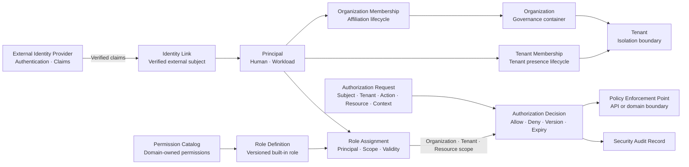

# COP IAM 领域内容设计

## 1. 目标

将 `COP-DOM-002` 从初始化骨架补充为可评审的 IAM 领域文档，定义 Principal、Identity Link、Organization、Tenant、Membership、Permission Catalog、Role Definition、Role Assignment、Authorization Decision 和 Platform Elevation 的所有权、生命周期、不变量、命令、查询、事件、失败与验证边界。本文保持领域模型与安全机制分工，不替代 `COP-SEC-002` 的认证协议和策略评估细节。

## 2. 权威边界

- `COP-DOM-002` 保持 `draft`；只有状态变为 `accepted` 后才形成实现约束。
- `COP-DOM-001` 定义 IAM 是独立通用子域，拥有 Principal、Organization、Tenant、Role、授权意图与授权决策。
- `COP-SEC-001` 定义整体信任、凭据、加密和安全控制边界。
- `COP-SEC-002` 负责认证集成、Tenant isolation、RBAC 和策略评估的安全机制细节。
- `COP-SEC-003` 负责审计记录、保留和合规边界；本文只定义 IAM 需要产生的审计事实。
- External Identity Provider 保留认证、identity lifecycle 和 claims 权威；IAM 不保存密码、token、完整 claims 或外部原始 credential。
- 各业务领域 owner 定义本领域 Permission 的 `action/resource` 语义；IAM 只治理 Permission Catalog、Role 组合、Assignment 和授权判定。

## 3. 方案选择

采用 capability-aligned aggregates：Principal、Organization/Tenant、两级 Membership、Permission Catalog/Role Definition、Role Assignment 和 Authorization Decision 按独立生命周期建模，通过稳定 ID 和显式版本协作。

未采用 Principal-centric mega aggregate，因为所有 Membership 和 Assignment 集中在 Principal 会形成写入热点、不断增长的聚合和高并发版本冲突。未采用 Tenant-centric identity copies，因为同一 Principal 会在多个 Tenant 重复建模，Organization 治理、跨 Tenant 撤销和外部身份关联难以保持一致。

## 4. 身份与租户模型

### 4.1 Principal and Identity Link

- IAM 维护稳定内部 Principal，并明确区分 `Human` 与 `Workload` 类型。
- Human Principal 通过 Identity Link 关联已验证的外部 issuer/subject。
- Workload Principal 关联短期 workload identity 或受控 credential reference；IAM 不保存原始 Secret。
- Principal Profile 只保存 display name、受验证的 contact reference、identity source、`last_synced_at` 和必要状态。
- Profile 不保存 token、密码、完整 claims 或不必要的个人数据；同步失败时保留来源和 stale 状态。

### 4.2 Organization and Tenant

- Organization 是治理与归属容器，可以包含多个 Tenant。
- Tenant 是身份、数据、授权、事件和 Projection 的严格隔离边界。
- MVP 中每个 Tenant 只属于一个 Organization。
- Organization Role 只授予组织治理能力，不自动授予 Tenant 数据访问。
- Tenant 数据访问必须有显式 Tenant Role Assignment。
- Platform Administrator 默认不拥有 Tenant 数据访问；跨 Tenant 操作使用短期、明确 scope、强审计的 elevation。

### 4.3 Membership

- Organization Membership 表达 Principal 在 Organization 中的归属。
- Tenant Membership 表达 Principal 在 Tenant 中的归属。
- Tenant Membership 必须依赖同一 Organization 内有效的 Organization Membership。
- Membership 只表示归属，不直接等同于 Role 或授权。
- MVP 不引入内部 Group aggregate；Role Assignment 直接授予 Principal。
- 外部 group claim 只可用于受控身份映射，不能直接成为授权事实。

## 5. 聚合与实体

| Aggregate or capability | Ownership | Key references and boundaries |
| --- | --- | --- |
| Principal | 稳定内部主体、类型、状态和最小 Profile | Identity Link、Organization/Tenant Membership 引用；不拥有外部认证事实 |
| Identity Link | Principal 与已验证外部身份或 workload identity 的关联 | issuer、subject、source、sync metadata；不保存 token 或完整 claims |
| Organization | 治理容器和 Tenant 归属 | Tenant references；不形成 Tenant 数据访问继承 |
| Tenant | 严格隔离边界及 Organization 归属 | 每个 Tenant 在 MVP 中只属于一个 Organization |
| Organization Membership | Principal 与 Organization 的归属生命周期 | Principal、Organization、status、version |
| Tenant Membership | Principal 与 Tenant 的归属生命周期 | Principal、Tenant、Organization Membership、status、version |
| Permission Catalog | 领域 owner 发布的 Permission 引用、版本和兼容状态 | 不重新定义业务 action/resource 语义 |
| Role Definition | 平台内置、版本化的 Permission 组合 | MVP 不允许 Tenant 自定义或修改 |
| Role Assignment | Principal、Role、scope、有效期和状态 | Organization、Tenant 或 Resource scope；不能隐式扩大 |
| Authorization Decision | 带 ID、理由、版本和有效期的 allow/deny 结果 | 短期结果和审计关联，不成为长期领域聚合 |
| Temporary Platform Elevation | 跨 Tenant 恢复或治理的短期授权意图 | target Tenant、reason、scope、expiry、强审计 |

## 6. 关系图设计

目标文档使用一个 Mermaid `flowchart` 展示身份、归属、角色和授权判定关系：

图中外部 IdP 只提供已验证认证事实，Identity Link 将外部 subject 关联到稳定 Principal。Membership 与 Role Assignment 分离；Permission Catalog 和 Role Definition 向 Role Assignment 提供版本化授权输入。IAM 是 Policy Decision Point，API 与各业务领域是 Policy Enforcement Points。箭头不表示共享存储、跨领域直接写入、scope 继承或隐式内部信任。

## 7. 授权模型

- MVP 使用 scoped RBAC，不引入完整 ABAC 或自定义 policy language。
- 各业务领域 owner 定义 Permission 的 action、resource 和业务语义，并发布版本化 Permission reference。
- IAM 维护受治理 Permission Catalog；未知或不兼容 Permission 默认拒绝。
- Role Definition 是平台内置、版本化且不可由 Tenant 修改的 Permission 组合。
- Role Assignment 显式绑定 Principal、Role、Organization/Tenant/Resource scope、有效期和 Role/Permission version。
- Organization Role 不继承 Tenant 数据权限；Resource scope 不允许扩大到 Tenant 或 Organization。
- IAM 是 Policy Decision Point；API 与业务领域是 Policy Enforcement Points，不能复制 IAM 策略计算或默认信任上游判定。
- Authorization Request 携带 Principal、Organization/Tenant、action、resource 和 context。
- Authorization Decision 返回 decision ID、allow/deny、reason code、Role/Permission version、expiry 和 audit correlation。
- 允许短期、scope-bound decision/grant 缓存；缓存绑定 Principal、Tenant、action、resource、Role/Membership version 和 expiry。
- 敏感操作与 Platform Elevation 必须实时判定；过期、版本不匹配、scope 不匹配或无法确认时 fail closed。

## 8. 生命周期与不变量

### 8.1 States

- Principal：`Active`、`Suspended`、`Disabled`。
- Organization Membership：`Invited`、`Active`、`Suspended`、`Removed`。
- Tenant Membership：`Invited`、`Active`、`Suspended`、`Removed`。
- Role Assignment：`Active`、`Revoked`、`Expired`。
- Temporary Platform Elevation：`Active`、`Revoked`、`Expired`。

Removed、Revoked 和 Expired 记录保留审计链；重新加入或授予时创建新记录，不复用历史授权记录。

### 8.2 Invariants

- 每个外部 issuer/subject 关联到至多一个活动 Human Principal，除非经过受审计的迁移流程。
- Human 与 Workload Principal 的认证方式和生命周期不能隐式互换。
- Tenant Membership 只能在有效 Organization Membership 和匹配 Organization 下生效。
- Membership 不授予 Permission；授权必须通过有效 Role Assignment。
- Role Assignment 的 scope 必须处于 Membership 允许的边界内，不能隐式扩大。
- 活动 Tenant 必须至少保留一个有效的内置 Tenant Administrator Assignment。
- 暂停或禁用 Principal、Organization Membership 后，相关下级记录仍保留，但授权判定立即视为无效。
- 恢复时重新校验 Principal、Membership、Role、Permission、scope、version、expiry 和最后管理员不变量。
- Break-glass 走独立、短期、强审计流程，不成为普通长期 Assignment。
- 所有管理命令携带 idempotency key 和 expected version；并发冲突显式拒绝，不使用 last-write-wins。

## 9. Commands and Queries

### 9.1 Commands

- `RegisterPrincipal`、`LinkExternalIdentity`、`RegisterWorkloadPrincipal`
- `SuspendPrincipal`、`DisablePrincipal`
- `CreateOrganization`、`CreateTenant`
- `InviteOrganizationMember`、`ActivateOrganizationMembership`、`SuspendOrganizationMembership`、`RemoveOrganizationMembership`
- `InviteTenantMember`、`ActivateTenantMembership`、`SuspendTenantMembership`、`RemoveTenantMembership`
- `AssignRole`、`RevokeRole`
- `GrantTemporaryPlatformElevation`、`RevokeTemporaryPlatformElevation`

命令名称表达领域意图，不预设 REST 路径、服务拆分或数据库结构。每个命令校验 actor、Organization/Tenant scope、授权、expected version、idempotency 和相关不变量。跨领域不使用分布式事务。

### 9.2 Queries

- Principal、Identity Link 和最小 Profile 查询
- Organization / Tenant Membership 查询
- Permission Catalog、Role Definition 和 Role Assignment 查询
- `EvaluateAuthorization`：输入 Principal、Tenant、action、resource 和 context，返回 decision ID、allow/deny、reason code、Role/Permission version、expiry 和 audit correlation

查询必须应用调用者授权和 Tenant isolation，不得把未经授权的数据存在性、Profile、Membership 或 Assignment 泄漏给调用者。

## 10. Domain Events and Audit

### 10.1 Domain Events

- Principal 注册、身份关联与状态变化
- Organization / Tenant 创建与状态变化
- Organization / Tenant Membership 生命周期变化
- Permission Catalog 或 Role Definition 版本变化
- Role Assignment 创建、撤销与过期
- Temporary Platform Elevation 创建、撤销与过期

事件只携带稳定 ID、Organization/Tenant scope、状态、版本、发生时间和必要 Permission/Role reference；不携带 token、完整 claims、contact data、Secret 或完整 Principal Profile。事件采用 at-least-once，消费者根据 event ID、aggregate version 和业务不变量处理 duplicate、out-of-order 与 replay。

### 10.2 Authorization Audit

每次 Authorization Decision 不发布高频 Domain Event，只生成 Security Audit Record 和可观测指标。审计至少包含 actor/subject、Organization/Tenant、action、resource、decision、reason code、Role/Permission version、decision ID、时间和 correlation context，不记录 token、Secret 或完整 claims。

IAM 管理命令与对应状态变更审计必须原子关联；无法持久化审计时，不提交 Principal、Membership、Role Assignment 或 Elevation 状态变更。

## 11. 失败、恢复与安全

- 外部 IdP 不可用或 claims 无法验证时，不创建 Identity Link、不执行 JIT、不接受新的认证上下文；已有 Principal 不能替代认证证明。
- JIT 只在预配置映射下创建或关联 Principal，不自动授予 Membership 或 Role Assignment。
- Permission Catalog 单个 producer 的版本不兼容时，只隔离受影响 Permission，不阻断无关领域判定。
- Permission 未知、Role/Membership version 不匹配、scope 不匹配、decision 过期或 IAM 无法确认时 fail closed。
- 事件发布失败不回滚已提交事实；使用持久化 outbox、有限重试、隔离和授权重放恢复。
- 敏感操作或 Platform Elevation 无法实时判定或记录审计时拒绝执行。
- Profile 同步失败时保留最小 Profile、source、`last_synced_at` 和 stale 状态；陈旧 claims 不能作为新的授权依据。
- 恢复任何 Principal、Membership、Assignment 或 Elevation 时重新验证当前版本、scope、expiry 和领域不变量。
- Credential、Secret、token、完整 claims 和无关个人数据不得进入 Domain Event、普通日志或授权缓存。

## 12. 验证策略

- **Identity authority：** 验证外部认证事实与 COP Principal 所有权不会混淆。
- **Tenant isolation：** 验证 Organization Role 不继承 Tenant 数据权限，跨 Tenant 请求默认拒绝。
- **Membership invariants：** 验证 Tenant Membership 依赖有效 Organization Membership。
- **Role scope：** 验证 Assignment 不能越过 Organization、Tenant 或 Resource scope。
- **Last administrator：** 验证任何状态变化都不能移除活动 Tenant 的最后一个有效管理员。
- **Revocation：** 验证 Principal、Membership、Assignment 或版本变化使缓存 decision 失效。
- **Decision determinism：** 验证相同主体、scope、action、resource 和版本产生一致判定与 reason code。
- **Concurrency：** 验证重复命令幂等，并发版本冲突不会丢失更新。
- **Failure isolation：** 验证单个 IdP、Permission producer 或事件消费者故障不会扩大授权。
- **Privacy：** 验证 Profile、Audit 和 Domain Event 不包含 token、Secret、完整 claims 或无关个人数据。
- **Traceability：** 验证 Membership、Assignment、Elevation、状态变化和授权判定可以关联 actor、decision ID 和 audit record。

## 13. 目标文档结构

修改 `docs/domains/iam-domain.md`，保持稳定 ID `COP-DOM-002` 和 `draft` 状态。版本更新为 `0.2.0`，`last_updated` 更新为 `2026-08-06`；owners、related、rfc 和 adr 保持不变。

保留 H1 和一级模板章节，在 `Bounded Context` 下按以下顺序组织内容：

- `IAM Responsibility Boundary`
- `Identity and Tenant Model`
- `Authorization Model`
- `IAM Relationship Map`
- `Failure and Recovery`
- `Validation Strategy`
- `Success Criteria`

`Aggregates and Entities` 包含聚合所有权表和生命周期；`Commands and Queries`、`Domain Events`、`Invariants`、`Relationships`、`Constraints`、`Quality Attributes` 与 `Implementation Guidance` 使用本文批准内容展开。

三条既有 References 保持不变并可解析：

- `COP-DOM-001`
- `COP-SEC-001`
- `COP-SEC-002`

## 14. 明确不做

- 不选择 IdP、Secret Manager、Policy Engine 或 Audit 产品。
- 不定义登录协议、登录页面、MFA、session、token 或 credential 格式。
- 不支持 Tenant 自定义 Role Definition。
- 不引入内部 Group、Group nesting 或把外部 IdP Group 直接作为授权事实。
- 不引入完整 ABAC 或 policy language。
- 不定义 Permission API 字段、数据库拆分、缓存产品或部署拓扑。
- 不定义审计保留期、合规认证承诺或完整安全控制实现。
- 不修改 `COP-SEC-001`、`COP-SEC-002`、`COP-SEC-003`、`COP-DOM-001` 或目录索引。
- 不把 `COP-DOM-002` 标记为 `accepted`。

## 15. 成功标准

- 读者能识别 Principal、Identity Link、Organization、Tenant、两级 Membership、Permission Catalog、Role Definition、Role Assignment 和 Authorization Decision 的单一所有权。
- External Identity Provider、业务 Permission owner 和 IAM 的权威边界明确且没有事实复制。
- Human/Workload Principal、Organization/Tenant 和 Membership/Role Assignment 不会被混为同一概念。
- scoped RBAC、内置 Role、Permission Catalog、PDP/PEP 和短期 decision/grant 语义完整。
- Tenant isolation、Organization Role 无 Tenant 数据继承、Platform Elevation 和最后管理员不变量明确。
- 生命周期、撤销、版本、幂等、并发冲突和缓存失效可以一致验证。
- Domain Event 与 Authorization Audit 分工明确，并遵循最小数据原则。
- IdP、Permission producer、审计和事件故障具有 fail closed、隔离和恢复语义。

## 16. 验收条件

1. `COP-DOM-002` 的 ID、status、owners、related、rfc 和 adr 保持不变，version 为 `0.2.0`，last_updated 为 `2026-08-06`。
2. 文档明确外部 IdP 保留认证、identity lifecycle 和 claims 权威，IAM 拥有稳定 Principal、Membership、Role Assignment 和授权决策。
3. 文档区分 Human/Workload Principal，并禁止保存密码、token、完整 claims 或原始 Secret。
4. 文档明确 Organization 是治理容器、Tenant 是严格隔离边界，且 Organization Role 不继承 Tenant 数据访问。
5. 文档明确两级 Membership、Tenant Membership 对 Organization Membership 的依赖，以及 Membership 不等于 Role。
6. 文档明确 Permission 由业务领域 owner 定义，IAM 管理 Catalog、内置 Role、Assignment 和授权判定。
7. 文档包含一个可解析的 Mermaid `flowchart`，身份、归属、Role 和 Authorization Decision 关系与批准设计一致。
8. 文档覆盖 Principal、Membership、Role Assignment 和 Elevation 状态及最后管理员、scope、版本和 fail closed 不变量。
9. 文档列出批准的 Commands、Queries、Domain Events 和 Authorization Audit 边界。
10. 文档明确 JIT 不自动授权、短期缓存约束、敏感操作实时判定、expected version 和 idempotency。
11. 文档覆盖 IdP、Permission producer、审计、事件和 Profile 同步的失败与恢复语义。
12. 文档覆盖 identity authority、Tenant isolation、Membership、Role scope、last administrator、revocation、determinism、concurrency、failure isolation、privacy 和 traceability 验证。
13. 三条既有 References 均可解析，未出现占位、填充文本或未批准的新能力。
14. 文件为 UTF-8、无 BOM、无替换字符，Mermaid block 唯一且 Markdown 表列数一致。
15. `git diff --check` 和文档验证通过，实施提交只包含 `docs/domains/iam-domain.md`。
