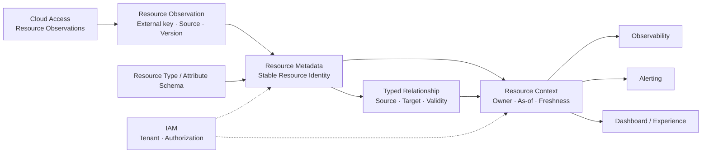

# COP Resource Metadata 领域内容设计

## 1. 目标

将 `COP-DOM-003` 从初始化骨架补充为可评审的 Resource Metadata 领域文档，定义 Resource、Resource Type、Attribute、Relationship、Resource Observation、Resource Context 和生命周期状态的所有权、身份、来源、命令、查询、事件、不变量、失败恢复与验证边界。本文保持领域模型与技术平面、Provider/Kubernetes 实际状态和 IAM 安全机制的分工。

## 2. 权威边界

- `COP-DOM-003` 保持 `draft`；只有状态变为 `accepted` 后才形成实现约束。
- `COP-DOM-001` 定义 Resource Metadata 是 Core bounded context，拥有 COP Resource Identity、规范化元数据和关系。
- `COP-DOM-002` 拥有 Principal、Organization、Tenant、Membership 和授权决策；Resource Metadata 只消费 IAM identity reference/decision。
- `COP-DOM-004` 拥有云账号接入、credential reference、Provider、发现和同步生命周期；它只产生 Resource Observation，不创建统一 Resource Identity。
- `COP-DOM-005` 和 `COP-DOM-006` 分别拥有 Telemetry/Signal 与 Alert 生命周期；Resource Metadata 只发布 Resource Context。
- Cloud Provider/Kubernetes 保留实际资源状态权威；Resource Metadata 不复制为新的外部事实权威。
- Resource Metadata 不拥有原始 Metrics、Logs、告警状态、云凭据、External Identity 或部署拓扑。

## 3. 方案选择

采用 capability-aligned aggregates：Resource、Resource Observation、Resource Type/Attribute Schema、Relationship 和 Resource Context Projection 按独立生命周期建模，通过稳定 Resource ID、外部定位键、source、版本和 freshness 协作。

未采用 Resource-centric mega aggregate，因为观察频率、关系规模和多来源合并会制造写入热点与版本冲突。未采用 Provider-centric resource copies，因为同一资源会跨 Provider/account/cluster 重复建模，内部 Resource Identity、Tenant 归属和关系一致性难以保持。

## 4. 责任边界

- Resource Metadata 拥有 COP 内部稳定 Resource Identity、规范化元数据、Resource Type/Attribute schema、Relationship 和生命周期状态。
- Cloud Provider/Kubernetes 仍拥有实际资源状态；Cloud Access 只发布 Resource Observation，不创建统一 Resource Identity，也不写入 Resource Metadata 私有存储。
- Resource Metadata 负责 Observation 的解析、幂等合并、冲突隔离、关系维护和受治理 Resource Context 发布。
- Provider/Kubernetes 来源字段属于外部事实投影；COP 自有标签、归属、环境和治理状态由 Resource Metadata 独占，发现同步不得覆盖。
- 本领域不把 Resource Metadata 变成 CMDB 产品选型，也不决定数据库、缓存、消息、部署或 Provider SDK。

## 5. 身份、Tenant、Type 与 Attribute

- Resource 持有不可变内部 `resource_id`；外部定位键由 `provider`、`account/cluster`、`resource_type` 和 `external_id` 构成，用于去重与重发现。外部键变更不复用旧内部 ID。
- MVP 中每个 Resource 只属于一个 Tenant；跨 Tenant 访问默认拒绝，共享资源通过受治理引用或 Projection 表达。
- Resource Type 使用稳定规范化类型标识，并带 schema version；Provider/Kubernetes 类型映射不改变 Resource Identity。
- Attribute 使用 namespace/key、值类型、来源、schema version 和敏感级别；未知或不兼容属性隔离保留，不阻塞其他字段合并。
- 外部事实字段与 COP 管理字段分离：外部字段只读投影；COP 标签、归属、环境和治理状态由 Resource Metadata 独占。
- 每个字段保留 source、observed-at/version 和 freshness；确定性优先级解决多来源冲突，禁止 last-write-wins。

## 6. Observation、生命周期与删除

- Resource Observation 必须携带 provider/account/cluster、外部资源键、resource type、观测版本或时间、来源和 correlation；接收采用幂等 upsert。
- 重复、乱序和 replay 通过 observation key、source version/observed-at 与 aggregate version 识别；无法解析的 Observation 进入隔离区，不创建不完整 Resource Identity。
- Resource 生命周期显式区分 `Discovered`、`Active`、`Stale`、`Deleted`；同步失败只能产生 `Stale` 或 degraded 事实，不能直接推断 `Deleted`。
- 外部确认删除后保留 Resource tombstone、最后来源和删除时间；只有 `Stale` 可在新观察确认后回到 `Active`，已确认 `Deleted` 的资源重发现必须创建新 Resource ID，可通过 predecessor reference 保留历史关联，不复用已失效身份。
- 父级 Tenant 暂停或授权撤销不会删除 Resource 记录，但下游查询和 Projection 必须立即应用 Tenant isolation 与授权约束。
- Observation 传播使用 at-least-once Domain Events；Resource Metadata 发布已提交 Resource Context，不承诺 exactly-once 或全局排序。

## 7. Relationship 与 Resource Context

- Relationship 是类型化、有向、带有效期和版本的边，包含 source/target Resource ID、relationship type、source、observed-at/valid-from、valid-to、schema version 与 correlation。
- 发现关系与治理关系分开建模：Provider/Kubernetes 产生外部观察事实；COP 手工或规则产生治理事实；合并读视图保留各自来源和失效语义。
- 关系更新采用显式替换、失效或撤销，不通过隐式双向写入；目标 Resource 不存在或 Tenant 不匹配时，关系进入待解析/隔离状态。
- Resource Context 是对 Observability、Alerting 和 Dashboard 提供的受治理读模型，声明 owner、source、`as_of`、freshness 和 failure semantics。
- 普通查询可返回明确标记的 `stale`、`partial` 或 `degraded`；不得把不同时间边界的来源伪装成一致快照。
- Resource Metadata 不拥有原始 Metrics/Logs，也不产生 Alert lifecycle；下游只消费稳定引用或 Projection。

关系图设计使用一个 Mermaid `flowchart` 表达外部观察、统一 Resource Identity、类型/属性、关系和下游 Resource Context 的单向事实流，并用虚线表达 IAM 上下文：

箭头不表示共享存储、跨领域直接写入、Tenant 继承、分布式事务或部署拓扑；Cloud Access 仍不拥有统一 Resource Identity，下游只消费受治理 Resource Context。

## 8. Commands and Queries

### 8.1 Commands

- Observation：`IngestResourceObservation`、`ReconcileObservation`、`QuarantineObservation`
- 治理元数据：`SetManagedAttribute`、`RemoveManagedAttribute`、`ChangeResourceLifecycle`
- 关系：`UpsertDiscoveredRelationship`、`CreateGovernedRelationship`、`ExpireRelationship`

所有命令必须携带 Tenant、actor/source、idempotency key 和 expected version；冲突显式拒绝，不使用 last-write-wins 或分布式事务。

### 8.2 Queries

- Resource identity/detail、Resource Type 与 Attribute schema 查询。
- 按 Tenant、type、attribute 和生命周期状态查询 Resource。
- Relationship 邻接、类型、有效期和受治理路径查询。
- 带 owner、source、`as_of`、freshness 和 failure semantics 的 Resource Context 查询。

查询必须应用 IAM 授权、Tenant isolation 和字段敏感级别，不能泄漏未经授权的资源存在性。

## 9. Domain Events and Audit

- 事件覆盖 Resource 注册、外部键关联、生命周期变化、规范化属性变化、关系创建/失效、type/schema version 变化和 Observation 隔离。
- 事件只携带稳定 ID、Tenant、版本、来源与必要变更引用，不携带完整 Provider payload、credential、Secret 或原始错误。
- 事件采用 at-least-once；消费者必须能识别 duplicate、out-of-order、replay 和 schema incompatibility。
- 高风险治理命令和 Tenant 作用域变化产生可审计记录；高频 Observation 不发布无限制高频事件，可形成受控批次/摘要事实，但不能隐藏资源身份与版本变化。

## 10. 不变量

- 一个 Resource 只有一个不可变内部 Resource Identity；外部定位键用于去重，不替代内部 ID。
- MVP 中每个 Resource 只属于一个 Tenant；跨 Tenant 资源读取、关系和 Projection 默认拒绝。
- Cloud Access 只产生 Resource Observation；Resource Metadata 是 Resource Identity、规范化元数据和关系的唯一 COP owner。
- Provider/Kubernetes 外部事实字段不可被 COP 管理字段覆盖；发现同步不可覆盖 COP 标签、归属、环境和治理状态。
- Attribute schema version、值类型和敏感级别必须可验证；未知或不兼容字段隔离，不污染已提交核心事实。
- Relationship 必须有明确类型、方向、Tenant、来源、有效期和版本；不能隐式扩大 scope 或产生双向写入。
- `Deleted` 资源保留 tombstone；重发现不复用已失效 Resource ID。
- 所有管理命令携带 idempotency key 和 expected version；并发冲突显式拒绝。
- 无法确认 IAM、Tenant、source version 或敏感字段授权时 fail closed。

## 11. 失败、恢复与验证

- Provider/Kubernetes 不可用、权限变化或观察超时时，保留最后成功事实并标记 `Stale`/`degraded`，不自动删除 Resource。
- 单个 Observation 无法解析、schema 不兼容或关系目标缺失时隔离该输入，不阻塞无关资源和字段。
- 同步重放、reconciliation 和关系重建必须幂等，可检测 duplicate、out-of-order、replay、版本缺口和长期 stale。
- IAM 不可用、Tenant 不匹配或敏感字段授权无法确认时 fail closed。
- Projection 可从保留事件重建；reconciliation 不能改变 Cloud Provider/Kubernetes 的事实权威。
- 验证必须覆盖 Resource Identity 去重、外部键变更、tombstone、Tenant 隔离、source/freshness/version 合并、Attribute schema 兼容性、关系方向/类型/有效期、Observation 幂等与并发冲突。
- stale、partial、degraded、unavailable 不得伪装为成功；事件与 Projection 必须可追溯。

## 12. 明确不做

- 不选择 Provider、CMDB、数据库、缓存、消息、部署或 Provider SDK 产品。
- 不拥有原始 Metrics、Logs、告警状态、云凭据、External Identity 或外部资源实际状态。
- 不允许 Resource 同时属于多个 Tenant，不引入共享可写存储或隐式跨 Tenant 授权。
- 不把 Resource Observation 直接视为统一 Resource Identity，不使用 last-write-wins 或 exactly-once 作为前提。
- 不在本文定义 REST 路径、API 字段全集、表结构、物理拓扑或数值 SLO。
- 不修改 `COP-DOM-001`、`COP-DOM-002`、`COP-DOM-004`、`COP-DOM-005` 或目录索引。
- 不把 `COP-DOM-003` 标记为 `accepted`。

## 13. 目标文档结构

修改 `docs/domains/resource-metadata-domain.md`，保持稳定 ID `COP-DOM-003`、`draft` 状态、owners、related、rfc 和 adr；版本更新为 `0.2.0`，`last_updated` 更新为 `2026-08-06`。

保留既有一级模板章节；在 `Bounded Context` 下按以下顺序组织：

- `Resource Metadata Responsibility Boundary`
- `Identity, Tenant, Type and Attribute Model`
- `Observation and Lifecycle Model`
- `Relationship and Resource Context Model`
- `Failure and Recovery`
- `Validation Strategy`
- `Success Criteria`

`Aggregates and Entities` 包含 capability ownership 表、生命周期和 tombstone；`Commands and Queries`、`Domain Events`、`Invariants`、`Relationships`、`Constraints`、`Quality Attributes` 和 `Implementation Guidance` 展开本文批准内容。

## 14. 成功标准

- 读者能识别 Resource Metadata、Cloud Access、Cloud Provider/Kubernetes、IAM、Observability、Alerting 和 Dashboard/Experience 的事实所有权。
- Resource ID、外部定位键、Tenant 单一归属、tombstone、source/freshness/version、Attribute schema、关系和 Observation 幂等语义完整。
- Provider/Kubernetes 外部事实与 COP 管理字段、发现关系与治理关系没有事实覆盖或隐式合并。
- Resource Context 的 owner、source、`as_of`、freshness、failure semantics 和 Tenant/授权边界清晰。
- Commands、Queries、Domain Events、Audit、fail closed、reconciliation 和 Projection recovery 可验证。
- 文档不引入未批准的产品、部署或 API 设计，并保持 `draft` 门禁。

## 15. 验收条件

1. `COP-DOM-003` 的 ID、status、owners、related、rfc 和 adr 保持不变，version 为 `0.2.0`，last_updated 为 `2026-08-06`。
2. 文档明确 Cloud Access 只发布 Resource Observation，Resource Metadata 拥有唯一 COP Resource Identity、规范化元数据和关系。
3. 文档明确 Cloud Provider/Kubernetes 保留实际资源状态权威，COP 不复制为新的外部事实权威。
4. 文档包含不可变内部 Resource ID、外部定位键和去重/重发现规则，且 Deleted tombstone 不复用旧 ID。
5. 文档明确 MVP Resource 单一 Tenant 归属、跨 Tenant 默认拒绝和共享资源只通过受治理引用/Projection 表达。
6. 文档明确字段级 source、observed-at/version、freshness、确定性合并和 COP 管理字段不被发现覆盖。
7. 文档明确类型化 Attribute、namespace/key、值类型、schema version、敏感级别及未知/不兼容字段隔离。
8. 文档明确类型化有向 Relationship、有效期、版本，以及发现关系与治理关系的来源分离。
9. 文档明确 Observation 幂等 upsert、duplicate/out-of-order/replay、隔离和 reconciliation 语义。
10. 文档列出批准的 Commands、Queries、Domain Events、Audit 和 Resource Context 语义。
11. 文档覆盖 Discovered、Active、Stale、Deleted 生命周期，以及 Provider、schema、关系、IAM 和 Projection 失败恢复。
12. 文档明确 at-least-once、expected version、idempotency、fail closed，不依赖 last-write-wins 或 exactly-once。
13. 既有四条 References 均可解析，未出现占位、填充文本或未批准能力。
14. 文件为 UTF-8、无 BOM、无替换字符，Mermaid block 唯一且 Markdown 表列数一致。
15. `git diff --check` 和文档验证通过，实施提交只包含 `docs/domains/resource-metadata-domain.md`。
