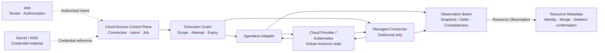

# COP Cloud Access 领域内容设计

## 1. 目标

将 `COP-DOM-004` 从初始化骨架补充为可评审的 Cloud Access 领域文档，定义 Cloud Connection、Credential Binding、Provider Capability、Discovery Intent、Sync Job、Execution Grant 和 Observation Batch 的所有权、生命周期、Contract、不变量、命令、查询、事件、失败恢复与验证边界。本文保持领域治理、执行平面、外部凭据权威、Provider/Kubernetes 实际状态和 Resource Metadata 身份模型之间的分工。

## 2. 权威边界

- `COP-DOM-004` 保持 `draft`；只有状态变为 `accepted` 后才形成实现约束。
- `COP-DOM-001` 定义 Cloud Access 是支撑 Resource Metadata 的独立通用子域，负责外部云环境接入、发现和同步。
- `COP-DOM-003` 拥有统一 COP Resource Identity、规范化元数据和关系；Cloud Access 只发布 Resource Observation。
- `COP-ARCH-003` 定义 Control Plane 与 Data Plane 的职责和信任边界；Cloud Access 不以共享存储或隐式内部信任跨越该边界。
- `COP-SEC-001` 定义整体信任、凭据和安全控制边界；本文只定义 Credential Reference、Credential Binding 和 Execution Grant 的领域语义。
- IAM 拥有 Tenant、Principal 和授权决策；Cloud Access 只消费已授权的 Tenant、actor 和 scope context。
- 外部 Secret/KMS 保留原始 credential 的存储、保护和材料权威；Cloud Access 不保存原始 Secret。
- Cloud Provider/Kubernetes 保留实际资源状态权威；Cloud Access 只形成带来源和完整性语义的 Observation。

## 3. 方案选择

采用 capability-aligned aggregates：`Cloud Connection`、`Credential Binding`、`Discovery Intent`、`Sync Job`、`Provider Capability` 和 `Observation Batch` 按独立生命周期建模，通过稳定 ID、不可变版本和显式引用协作。

Cloud Connection 使用 COP 内部稳定身份，与 Provider account/cluster identifier 和 credential identity 分离。这样可以在 credential 轮换、连接健康变化和执行方式切换时保持审计连续性。未采用外部账号标识直接作为内部 Connection ID，因为 Provider 标识格式、账号迁移和集群重建会污染内部生命周期；未采用 credential-centric connection，因为 credential 轮换会错误地产生新的连接身份。

Discovery Intent 与 Sync Job 分离：Intent 是版本化期望，Job 是固定某个 Intent 版本的一次执行。未采用单一同步任务模型，因为配置变更会使历史执行无法重现；未采用由 Connector 自主发现的模型，因为执行范围会脱离 Control Plane 授权和审计。

Agentless Adapter 与 outbound-only Managed Connector 实现同一份 Adapter Contract。Provider 特有认证、分页、限流、错误和 payload 规范化留在 Adapter 内，Cloud Access 核心不维护 Provider 分支流程。

## 4. 责任边界

- Cloud Access 拥有 Cloud Connection、Credential Binding、Provider Capability、Discovery Intent、Sync Job、Execution Grant reference 和 Observation Batch 的领域语义。
- Control Plane 接收已授权意图、治理 Connection/Intent，并创建和调度 Job；它不直接执行 Provider API 调用。
- Data Plane 或 Managed Connector 只执行受有效 Execution Grant 限制的工作，不创建 Intent、不扩大扫描范围、不选择其他 Credential。
- Secret/KMS 保存原始 credential；Cloud Access 只保存受控 Credential Reference、Binding version 和审计元数据。
- Adapter 负责 Provider/Kubernetes 协议适配和标准化；Cloud Access 核心只依赖 Adapter Contract。
- Cloud Access 发布 Resource Observation，不创建统一 Resource Identity，也不直接写入 Resource Metadata 私有存储。
- Resource Metadata 负责 Observation 去重、身份匹配、当前状态合并和资源消失确认。
- 本领域不拥有资源变更、remediation、业务自动化、成本分析、产品选择或部署拓扑。

## 5. Cloud Connection 与 Credential Binding

- Cloud Connection 使用不可变内部 `connection_id`，归属于一个 Tenant，并绑定一个 Provider、一个外部 account/cluster key 和当前 Credential Binding。
- Provider、Tenant 和外部 account/cluster identity 构成连接身份边界；身份边界变化时创建新 Connection，不复用已撤销身份。
- Connection 生命周期为 `Pending`、`Validating`、`Active`、`Degraded`、`Suspended`、`Revoked`。
- `Degraded` 表达健康状态异常，不改变 Connection 身份；`Suspended` 停止新 Job；`Revoked` 是终态，Connection ID 不得复用。
- Credential Binding 关联 Connection、Credential Reference、binding version、有效状态和审计信息，不包含原始 credential。
- Credential 轮换创建新的 Binding version。旧版本保留审计，但不能用于新 Job；已创建 Job 固定其 Binding version，不在执行中漂移到新版本。
- Credential 撤销、Connection 暂停或撤销后，尚未使用的 Execution Grant 失效。
- Credential、Job、Grant 和 Observation 跨 Tenant 使用默认拒绝；无法确认 Tenant 或 Binding 状态时 fail closed。

## 6. Discovery Intent、Sync Job 与 Execution Grant

- Discovery Intent 表达“希望发现什么”，归属于一个 Cloud Connection，并以不可变版本记录发现范围、资源类型、触发方式和所需 Provider Capability。
- Intent 的任何语义变化都生成新版本，历史版本保留审计；Job 创建后不受后续 Intent 版本影响。
- Sync Job 表达某个 Intent 版本的一次具体执行。创建时固定 Connection ID、Intent version、Credential Binding version、目标 scope 和 Provider Capability/Adapter Contract version。
- Job 生命周期为 `Queued`、`Dispatched`、`Running`、`Succeeded`、`Failed`、`Cancelled`、`Expired`。
- Job 成功只表示预定执行完成；是否形成权威 Snapshot 还必须由 Observation Batch 的完整性和 scope 闭合状态判定。
- 每次派发或自动重试签发新的短期 Execution Grant。Grant 绑定 Job、Connection、Tenant、允许的 scope、操作类型、有效期和 attempt，且只能收窄已授权范围，不能扩大权限。
- 自动重试保留在同一个 Job 下并记录独立 attempt；人工重新执行创建新 Job。旧 Grant 在重试、取消、过期、credential 撤销或 Connection 暂停/撤销后失效。
- Data Plane 或 Connector 只能凭有效 Grant 领取和执行 Job；Grant 无效、过期、版本或 scope 不匹配时拒绝执行。

## 7. 执行形态与 Adapter Contract

- Agentless Adapter 与 outbound-only Managed Connector 实现同一份 Adapter Contract；部署位置、网络路径和 Credential Reference 的解析位置可以不同，领域语义不能分叉。
- Managed Connector 只主动建立出站通道，不接受平台侧入站连接；平台通过已认证通道派发受 Grant 限制的 Job。
- Provider Capability 声明 Adapter 支持的 Provider、资源类型、发现模式、认证方式和 Contract version。创建 Job 前必须验证所需能力，Job 在运行中不得自动切换能力版本。
- Adapter 输入包含 Connection、Discovery Intent version、Credential Binding reference、Execution Grant 和 cursor context；输出包含标准化 Observation Batch、执行进度和错误结果。
- Provider 特有认证交换、Endpoint、分页、限流、错误码、Provider payload 和 retry hint 全部封装在 Adapter 内。
- 标准错误分类至少包括 `AuthenticationFailed`、`AuthorizationDenied`、`RateLimited`、`ProviderUnavailable`、`InvalidScope`、`UnsupportedCapability` 和 `ContractViolation`，并声明是否可重试和建议退避信息。
- Provider 原始响应只作为受控诊断证据，不成为下游 Contract，也不得携带 credential 或 Secret 进入普通事件和日志。

## 8. Observation Batch 与 Resource Observation

- 每个 Observation Batch 关联 Tenant、Cloud Connection、Sync Job、Intent version 和 Adapter Contract version，并携带发现模式、scope、cursor 或时间窗口、开始/结束时间、完整性状态和 idempotency key。
- 发现模式分为 `Snapshot` 与 `Delta`。Snapshot 表示对声明 scope 的一次完整枚举；Delta 只表达 Provider 明确返回的新增、变更或删除事实。
- 只有成功完成、覆盖范围明确且标记为 `Authoritative` 的 Snapshot 才能产生 missing/deletion candidate。
- Delta 不根据“本次未出现”推断资源消失。分页中断、限流耗尽、权限收缩、Connector 断连或部分 scope 失败时，Batch 标记为 `Incomplete`，且不得产生 missing candidate。
- 同一 Job 可以产生多个分页 Batch，但 Snapshot 的权威完整性只能在整个声明 scope 成功闭合后确认，不能由单个分页 Batch 自行声明。
- Batch 内的 Resource Observation 是不可变事实，包含 Provider 外部键、资源类型、标准化属性、原始版本标识、观测时间、来源证据和 correlation。
- Cloud Access 以幂等方式发布 Observation，不分配统一 Resource Identity，也不直接确认 Resource 删除。Resource Metadata 消费 Observation 和 missing/deletion candidate 后执行身份匹配、合并和删除确认。

## 9. 聚合与实体

| Aggregate or capability | Ownership | Key references and boundaries |
| --- | --- | --- |
| Cloud Connection | 稳定内部连接身份、Tenant/Provider/外部账号或集群归属、生命周期与健康 | 引用当前 Credential Binding；不保存原始 credential，不拥有外部资源状态 |
| Credential Binding | Credential Reference 与 Connection 的版本化绑定 | Secret/KMS 保留 credential material 权威；旧版本不能用于新 Job |
| Discovery Intent | 版本化发现期望、scope、资源类型、触发方式与能力要求 | 引用 Connection 和 Provider Capability；不执行 Provider 调用 |
| Sync Job | 固定 Intent、Connection、Binding、scope 和能力版本的一次执行 | 管理状态和 attempt；不在运行中漂移配置 |
| Provider Capability | Adapter 支持范围和 Contract version | Provider 特有协议留在 Adapter 内；核心不维护 Provider 分支 |
| Execution Grant | Job 派发的短期、不可扩大授权 reference | 绑定 Tenant、Connection、Job、scope、attempt 和 expiry；不作为长期授权聚合 |
| Observation Batch | 一次执行产生的分页、完整性和 scope 闭合语义 | 包含不可变 Resource Observation；不创建 Resource Identity 或确认删除 |

## 10. 关系图设计

目标文档使用一个 Mermaid `flowchart` 表达授权意图、连接治理、两类执行形态、Adapter 标准化和 Resource Metadata 消费边界：

箭头不表示共享存储、跨领域直接写入、credential material 复制、分布式事务或部署拓扑。两种执行形态遵守同一 Adapter Contract；Cloud Access 只发布 Observation，Resource Metadata 保留统一 Resource Identity 和删除确认权。

## 11. Commands and Queries

### 11.1 Commands

- Connection：`RegisterCloudConnection`、`ValidateCloudConnection`、`SuspendCloudConnection`、`ResumeCloudConnection`、`RevokeCloudConnection`
- Credential：`BindCredentialReference`、`RotateCredentialBinding`、`RevokeCredentialBinding`
- Intent：`CreateDiscoveryIntent`、`ReviseDiscoveryIntent`、`ActivateDiscoveryIntent`、`SuspendDiscoveryIntent`
- Job：`CreateSyncJob`、`DispatchSyncJob`、`StartSyncJob`、`CompleteSyncJob`、`FailSyncJob`、`CancelSyncJob`、`ExpireSyncJob`
- Observation：`AppendObservationBatch`、`CloseAuthoritativeSnapshot`、`MarkObservationBatchIncomplete`

所有命令必须携带 Tenant、actor/source、idempotency key 和 expected version。命令校验 Connection、Binding、Intent、Capability、Grant、scope 和状态转换；冲突显式拒绝，不使用 last-write-wins 或跨领域分布式事务。

### 11.2 Queries

- Cloud Connection identity、lifecycle、health 和当前 Credential Binding reference 查询。
- Credential Binding 版本历史和可用状态查询，不返回原始 credential。
- Discovery Intent 当前版本、历史版本、scope 和能力要求查询。
- Sync Job、attempt、Grant reference、进度、错误分类和关联 Batch 查询。
- Provider Capability、Adapter Contract version 和支持范围查询。
- Observation Batch 完整性、scope closure、cursor 和发布状态查询。

查询必须应用 IAM 授权和 Tenant isolation，不能泄漏其他 Tenant 的 Connection、credential reference、外部账号/集群存在性或 Provider 诊断证据。

## 12. Domain Events and Audit

- 事件覆盖 Connection 注册、验证、健康与生命周期变化，Credential Binding 创建/轮换/撤销，Intent 创建/修订/状态变化，Job 状态变化，Grant 签发/失效，Batch 追加/闭合/标记不完整，以及 missing candidate 产生。
- 事件只携带稳定 ID、Tenant、版本、scope reference、状态、错误分类、发生时间和 correlation；不携带原始 credential、Secret 或完整 Provider payload。
- 事件采用 at-least-once；消费者根据 event ID、aggregate version、Job/Batch idempotency key 处理 duplicate、out-of-order 和 replay。
- Job、attempt、Grant、Adapter 选择、cursor、Batch 完整性判定和 missing candidate 必须形成连续审计链。
- Connection、Credential Binding 和 Intent 管理命令必须关联 actor、授权决策和审计记录；高频 Observation 可以批量发布，但不能隐藏 Job、scope、source 和完整性。

## 13. 不变量

- Cloud Connection 使用不可变内部 ID，并且只属于一个 Tenant；Revoked ID 不得复用。
- Connection 身份与 credential identity 分离；credential 轮换不能改变 Connection ID。
- 原始 credential 只存在于外部 Secret/KMS；Cloud Access 只保存受控 reference 和 binding version。
- 新 Job 只能使用当前有效 Credential Binding；已创建 Job 固定版本，执行中不漂移。
- Discovery Intent 以不可变版本表达期望；Job 必须固定 Intent、Connection、Binding、scope 和 Capability version。
- Execution Grant 必须短期、绑定 Job/attempt、不可扩大 scope；无效、过期或版本不匹配时拒绝执行。
- Agentless Adapter 与 Managed Connector 必须通过同一 Adapter Contract，不得产生两套 Observation 或错误语义。
- 只有完整、scope 闭合的 Authoritative Snapshot 可以产生 missing/deletion candidate；Delta 和 Incomplete Batch 不得根据缺失推断删除。
- Cloud Access 只发布 Resource Observation，不创建统一 Resource Identity，不直接确认或执行 Resource 删除。
- 跨 Tenant Connection、credential、Job、Grant 和 Observation 使用默认拒绝；无法确认授权或状态时 fail closed。
- 所有管理命令携带 idempotency key 和 expected version；并发冲突显式拒绝。

## 14. 失败、恢复与安全

- 调度队列、并发额度、限流状态、Circuit Breaker 和 retry budget 按 `Connection + Adapter` 隔离；单个外部账号、集群或 Provider 故障不得阻塞无关 Connection。
- 只有标准化为可重试的错误才执行有界重试，并使用退避与抖动。认证失败、授权拒绝、无效 scope 和 Contract Violation 不自动重试。
- 自动重试从已确认 cursor 恢复；如果 Provider 无法保证 cursor 一致性，则放弃残缺结果并创建新的 Snapshot 执行，不能拼接为权威 Snapshot。
- 连续执行故障可以将 Connection 标记为 `Degraded`，但不改变稳定身份。健康恢复后必须重新验证 Connection、Binding、Capability 和 scope。
- Connector 断连、分页中断、权限收缩或部分 scope 失败只产生 `Incomplete` Batch，不产生 missing candidate。
- Connection `Suspended`/`Revoked`、Credential Binding 撤销、Job 取消/过期后停止新派发并使未使用 Grant 失效。
- Secret/KMS、IAM 或 Grant 状态无法确认时 fail closed；普通日志、事件和诊断输出不得包含原始 credential。
- Observation 重放、Job reconciliation 和 Batch 发布必须幂等，可检测 duplicate、out-of-order、cursor gap、版本不匹配和长期 incomplete。

## 15. 验证策略

- **Connection identity：** 验证 credential 轮换和健康变化不改变稳定 Connection ID，Revoked ID 不复用。
- **Tenant isolation：** 验证 Connection、Binding、Intent、Job、Grant 和 Observation 跨 Tenant 默认拒绝。
- **Credential authority：** 验证 Cloud Access 不保存原始 credential，旧 Binding 不能用于新 Job。
- **Intent determinism：** 验证 Job 固定 Intent、Binding、scope 和 Capability version，执行中配置不漂移。
- **Grant confinement：** 验证 Grant 权限扩大、attempt 复用、过期和状态不匹配被拒绝。
- **Contract conformance：** 验证 Agentless 与 Managed Connector 通过同一 Adapter Contract conformance suite。
- **Adapter normalization：** 验证认证、分页、限流、Provider error 和 payload 不泄漏为核心分支或下游 Contract。
- **Snapshot completeness：** 验证 Connector 断连、分页中断和部分 scope 失败不产生 missing candidate，完整权威 Snapshot 才能产生候选。
- **Delta semantics：** 验证 Delta 只处理明确变化，不通过缺失推断删除。
- **Idempotency and concurrency：** 验证 Job、Batch 和 Observation duplicate、out-of-order、replay、expected version 与并发冲突。
- **Failure isolation：** 验证单个 Connection/Adapter 的限流、重试或 Circuit Breaker 不影响其他 Connection。
- **Traceability and secrecy：** 验证 Connection、Binding、Intent、Job、Grant、Batch 和 missing candidate 可关联审计，同时事件和日志不包含原始 credential。

## 16. 明确不做

- 不保存原始、明文或可直接使用的 credential，不选择 Secret/KMS 产品。
- 不执行资源创建、修改、删除、remediation 或业务自动化。
- 不定义成本、计费、资产估值或 FinOps 分析。
- 不创建统一 Resource Identity，不直接写入 Resource Metadata 私有存储或确认资源删除。
- 不选择云 Provider、Connector runtime、消息、数据库、队列、缓存、SDK 或部署产品。
- 不定义 Provider API 字段全集、REST 路径、表结构、物理拓扑、数值限流参数或 SLO。
- 不允许 Connector 自主扩大 scope、创建 Intent、选择其他 credential 或绕过 Execution Grant。
- 不依赖 exactly-once、全局排序、共享可写存储或跨领域分布式事务。
- 不修改 `COP-DOM-001`、`COP-DOM-003`、`COP-ARCH-003`、`COP-SEC-001` 或目录索引。
- 不把 `COP-DOM-004` 标记为 `accepted`。

## 17. 目标文档结构

修改 `docs/domains/cloud-access-domain.md`，保持稳定 ID `COP-DOM-004` 和 `draft` 状态。版本更新为 `0.2.0`，`last_updated` 更新为 `2026-08-07`；owners、related、rfc 和 adr 保持不变。

保留 H1 和一级模板章节，在 `Bounded Context` 下按以下顺序组织内容：

- `Cloud Access Responsibility Boundary`
- `Connection and Credential Model`
- `Discovery and Execution Model`
- `Adapter Contract and Execution Modes`
- `Observation and Completeness Model`
- `Cloud Access Relationship Map`
- `Failure and Recovery`
- `Validation Strategy`
- `Success Criteria`

`Aggregates and Entities` 包含 capability ownership 表与生命周期；`Commands and Queries`、`Domain Events`、`Invariants`、`Relationships`、`Constraints`、`Quality Attributes` 和 `Implementation Guidance` 使用本文批准内容展开。

四条既有 References 保持不变并可解析：

- `COP-DOM-001`
- `COP-DOM-003`
- `COP-ARCH-003`
- `COP-SEC-001`

## 18. 成功标准

- 读者能识别 Cloud Access、IAM、Secret/KMS、Control Plane、Data Plane/Connector、Cloud Provider/Kubernetes 和 Resource Metadata 的事实所有权。
- 稳定 Connection ID、单一 Tenant、credential reference/binding version 和 Connection lifecycle 语义完整。
- Discovery Intent、Sync Job、attempt 与短期不可扩大 Execution Grant 的边界明确，执行配置可以重现和审计。
- Agentless 与 outbound-only Managed Connector 使用同一 Adapter Contract，Provider 特有逻辑不会泄漏到核心或下游 Contract。
- Snapshot/Delta、scope、cursor、完整性和 Authoritative Snapshot 的 missing candidate 规则明确。
- 重试、限流、Circuit Breaker 和 failure isolation 以 Connection/Adapter 为边界，失败不会扩大权限或产生错误删除候选。
- Commands、Queries、Domain Events、Audit、idempotency、expected version、fail closed 和 recovery 可以验证。
- 文档不引入未批准的产品、部署、API 或数值设计，并保持 `draft` 门禁。

## 19. 验收条件

1. `COP-DOM-004` 的 ID、status、owners、related、rfc 和 adr 保持不变，version 为 `0.2.0`，last_updated 为 `2026-08-07`。
2. 文档明确 Cloud Access 拥有 Connection、Credential Binding、Provider Capability、Discovery Intent、Sync Job、Execution Grant reference 和 Observation Batch 语义。
3. 文档明确外部 Secret/KMS 保留原始 credential 权威，Cloud Access 只保存 Credential Reference 和 binding version。
4. 文档包含稳定 Connection ID、单一 Tenant 和 `Pending`、`Validating`、`Active`、`Degraded`、`Suspended`、`Revoked` 生命周期，且 Revoked ID 不复用。
5. 文档明确 credential 轮换创建新 Binding version，旧版本不能用于新 Job，已创建 Job 的版本不漂移。
6. 文档明确不可变 Discovery Intent version、Job 状态、attempt 和短期不可扩大 Execution Grant。
7. 文档明确 Agentless Adapter 与 outbound-only Managed Connector 使用同一 Adapter Contract，并固定 Provider Capability/Contract version。
8. 文档明确 Provider 特有认证、分页、限流、错误和 payload 在 Adapter 内标准化，并列出批准的标准错误分类。
9. 文档明确 Snapshot/Delta、scope、cursor、Batch 完整性，以及只有完整 Authoritative Snapshot 可以产生 missing/deletion candidate。
10. 文档明确 Cloud Access 只发布 Resource Observation，不创建 Resource Identity、不直接确认或执行 Resource 删除。
11. 文档列出批准的 Commands、Queries、Domain Events、Audit 和聚合所有权。
12. 文档覆盖 Connection/Adapter failure isolation、有界重试、cursor 恢复、Connector 断连、权限收缩和 fail closed。
13. 文档覆盖 Tenant isolation、credential authority、intent determinism、grant confinement、contract conformance、snapshot completeness、idempotency、failure isolation 和 secrecy 验证。
14. 四条既有 References 均可解析，未出现占位、填充文本或未批准能力。
15. 文件为 UTF-8、无 BOM、无替换字符，Mermaid block 唯一且 Markdown 表列数一致。
16. `git diff --check` 和文档验证通过，实施提交只包含 `docs/domains/cloud-access-domain.md`。
