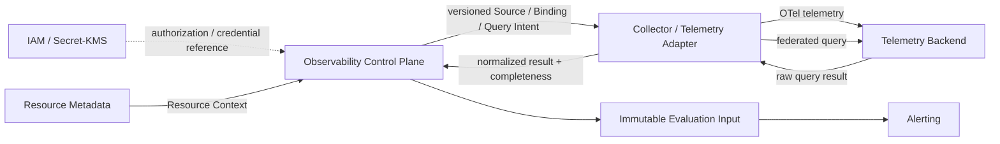

# COP Observability 领域内容设计

## 1. 目标

将 `COP-DOM-005` 从初始化骨架补充为可评审的 Observability 领域文档，定义 Telemetry Source、Telemetry Capability、Signal Definition、Signal Binding、Query Intent、Query Job 和 Evaluation Input 的所有权、身份、生命周期、Contract、不变量、命令、查询、事件、失败恢复与验证边界。本文统一 Metrics、Logs、Traces 的治理和查询语义，同时保持外部 Telemetry Backend、Resource Metadata、IAM、Secret/KMS、Alerting 与 Platform Observability 的事实权威。

## 2. 权威边界

- `COP-DOM-005` 保持 `draft`；只有状态变为 `accepted` 后才形成实现约束。
- `COP-DOM-001` 定义 Observability 是 Core bounded context，拥有 Telemetry Source、Signal Binding、统一查询语义和资源关联。
- `COP-DOM-003` 拥有稳定 Resource Identity 和 Resource Context；Observability 只消费稳定引用或 Projection，不创建 Resource Identity。
- 外部 Telemetry Backend 保留原始 Metrics、Logs、Traces 和查询引擎内部语义的权威。
- IAM 拥有 Principal、Tenant 和授权决策；Observability 只消费已授权的 actor、Tenant、Source、Resource 与 Signal scope。
- Secret/KMS 保留 credential material；Observability 只保存受控 Credential Reference 和版本化配置关联。
- Alerting 独占 alert rule、规则求值、evaluation outcome、Alert lifecycle 和 notification orchestration；Observability 只发布不可变 Signal 输入事实。
- `COP-INFRA-004` 负责 Collector、Telemetry Backend、存储与 Platform Observability 的运行实现；领域文档不选择产品或部署拓扑。
- `COP-API-002` 仍为 `draft`；未来事件应与其兼容，但只有其变为 `accepted` 后才形成实现约束。

## 3. 方案选择

采用 capability-aligned aggregates：`Telemetry Source`、`Signal Definition`、`Signal Binding`、`Query Intent`、`Query Job`、`Evaluation Input` 与 `Telemetry Capability` 按独立职责建模，通过稳定 ID、不可变版本、Resource Context reference 和显式完整性协作。

未采用数据流阶段模型，因为 Source 注册、OTel 路由、Signal 关联、查询与 Alerting 交付会被单一流程耦合，难以独立演进。未采用最小 Contract 模型，因为只定义 Source、查询和 Evaluation Input 无法约束 Binding 解析、版本固定、部分失败和 Adapter Capability。

Observability 同时覆盖接入治理与统一查询，但不保存原始遥测。Control Plane 管理 Source、Binding、Query Intent 与 Query Job；Collector/Telemetry Adapter 执行 OTel 路由和 Backend 查询。原始遥测直接进入或保留在 Telemetry Backend，COP 只保存治理元数据、受控 Projection、索引摘要和不可变 Evaluation Input。

## 4. 责任边界

- Observability 拥有 Telemetry Source、Telemetry Capability、Signal Definition、Signal Binding、Query Intent、Query Job、结果完整性和 Evaluation Input 的领域语义。
- Resource Metadata 提供带 owner、source、`as_of`、freshness 和 failure semantics 的 Resource Context；Observability 不反向修改 Resource 主数据。
- Collector/Telemetry Adapter 只执行已授权、固定版本和受 scope 限制的接入或查询工作，不创建 Source、Binding 或 Query Intent。
- Adapter 隔离 Backend 查询语言、OTel 协议适配、分页、流式、聚合、限流、错误和 payload 规范化；领域核心只依赖版本化 Telemetry Adapter Contract。
- Telemetry Backend 保存原始数据并执行底层查询；Observability 不把查询 Projection 或 Evaluation Input 升级为新的原始遥测权威。
- Alerting 只消费已提交的 Evaluation Input；Observability 不执行 alert rule，不产生 evaluation outcome，不改变 Alert 状态。
- Platform Observability 监控 COP 自身 health、dependency、progress、freshness、backlog、error 和 recovery，仍是跨切面运行能力，不与受管环境遥测共享领域所有权。
- 本领域不拥有 Dashboard 布局、Backend/存储产品、Alert 状态机、跨 Tenant 联合查询、完整遥测镜像、具体 API、数据库或部署拓扑。

## 5. Telemetry Source 与 Capability

- Telemetry Source 使用不可变内部 `source_id`，只归属于一个 Tenant，并绑定一个 Backend identity、当前配置版本、Credential Reference 和 Telemetry Capability/Adapter Contract version。
- Backend identity 或 Tenant 边界变化时创建新 Source；endpoint、路由、credential 或其他配置变化生成新版本，历史版本保留审计。
- Source 生命周期为 `Pending`、`Validating`、`Active`、`Degraded`、`Suspended`、`Revoked`。
- `Degraded` 表示健康或依赖异常，不改变 Source 身份；`Suspended` 停止新的接入路由和 Query Job 派发；`Revoked` 是终态，Source ID 不得复用。
- Observability 不保存 credential material。Credential rotation 创建新的受控配置关联；新执行只使用当前有效版本，已创建 Query Job 固定原版本。
- Telemetry Capability 声明 Adapter 支持的 Signal 类型、OTel 接入、查询操作、时间范围、分页或流式、聚合与 correlation 能力，并带 Contract version。
- 同步查询和 Query Job 创建前验证所需 Capability；执行中不得自动切换 Adapter 或 Capability/Contract version。

## 6. Signal Definition 与 Signal Binding

- Signal Definition 使用稳定 `signal_id`，定义 `Metric`、`Log` 或 `Trace` 类型、单位或语义、允许维度和敏感级别，不包含 Backend 查询语言或产品特有 payload。
- Signal Definition 的语义变化生成新版本；历史 Query Intent、Query Job 和 Evaluation Input 固定其使用版本。
- Signal Binding 将某个 Telemetry Source 的 backend selector 映射到 Signal Definition 与 Resource Context reference，并保留 binding version、source schema、provenance 和解析状态。
- Binding 解析成功后才能用于查询或 Evaluation Input。无法解析、存在歧义、跨 Tenant、schema 不兼容或敏感级别冲突时进入 `Unresolved` 或 `Quarantined`，不得自动创建 Resource Identity。
- Binding 可以被激活、暂停、撤销或重新解析；旧版本保留审计，但新的 Query Job 不得使用已暂停、撤销或隔离版本。
- Metrics、Logs、Traces 使用同一 Signal 与 Binding Contract，但保留各自时间语义、结果形态、聚合能力和敏感性约束。
- OpenTelemetry 是接入 Contract，不是领域实体；原生 signal name、attribute、stream、trace selector 和查询语法留在 Adapter 边界。

## 7. Query Intent、同步查询与 Query Job

- Query Intent 是不可变版本，声明 Signal、Resource scope、Source scope、时间窗、过滤、聚合、完整性要求、结果限制和允许的执行模式。
- 小范围交互查询可以同步执行；跨 Source、大时间窗、导出和 Evaluation Input 生成必须使用异步 Query Job。两者共享 Query Intent 和统一结果 Contract。
- 同步查询和 Query Job 在执行前校验 Tenant、Principal、Source、Resource Context、Signal、Binding、Capability/Contract 和敏感级别。
- Query Job 创建时固定 Query Intent version、Source/config version、Signal Definition version、Binding version、Resource Context reference、Capability/Contract version 和授权上下文。
- Query Job 生命周期为 `Queued`、`Dispatched`、`Running`、`Succeeded`、`Failed`、`Cancelled`、`Expired`。
- `Succeeded` 只表示执行流程完成，不等于结果完整。结果完整性必须按 Source、Signal、Resource 和时间窗单独判定。
- Adapter 将统一 Query Intent 转换为 Backend 请求，隔离 Backend 查询语言、分页、流式、聚合与错误语义，并返回规范化结果、provenance 和完整性。
- 联邦查询不承诺跨 Backend 的全局一致快照、exactly-once、全局顺序或分布式事务。

## 8. 结果完整性与受控派生数据

- 查询结果按 Source、Signal、Resource 和时间窗声明 `Complete`、`Partial`、`Stale` 或 `Unavailable`。
- 缺失不得转换为零值、最近值、空集合或“无数据”。普通查询可以返回明确标记的部分结果，但不能隐藏失败来源和未覆盖范围。
- 短期 Query Projection、索引摘要和缓存必须声明 owner、source、`as_of`、freshness、retention、completeness 和可重建性。
- Projection 和缓存失效不得覆盖 Backend 原始事实，也不得成为跨 Tenant 或绕过敏感级别授权的读取路径。
- 原始 Metrics、Logs、Traces payload 不进入 Observability 领域事件、普通审计或无限期领域存储。
- retention、缓存时长、查询限制和数值 SLO 留待经治理的 RFC/ADR，不在本文决定。

## 9. Evaluation Input 与 Alerting 边界

- Evaluation Input 是已提交、不可变的 Signal 输入事实，引用 Query Intent version、Query Job、Source/config version、Signal Definition/Binding version、Resource Context、时间窗和 Adapter Contract version。
- Evaluation Input 记录 provenance、完整性、content hash、idempotency key、correlation 和受控结果引用，不包含 alert rule、阈值判断、evaluation outcome 或 Alert state。
- 完整与不完整 Evaluation Input 都必须保留真实状态。Alerting 对不满足其完整性策略的输入记录 evaluation failure，不得将缺失当作正常规则结果。
- Evaluation Input 采用 at-least-once 发布；消费者根据 event ID、aggregate version 和 Job/Input idempotency key 处理 duplicate、out-of-order 和 replay。
- Alerting 不写入 Observability 私有存储；规则、求值结果和 Alert lifecycle 不反向成为 Signal 事实。
- Evaluation Input 的保留和重放必须支持审计与故障恢复，但不复制为完整原始遥测集。

## 10. 关系图设计

目标文档使用一个 Mermaid `flowchart` 表达 IAM/Secret、Resource Metadata、Observability Control Plane、Collector/Adapter、Telemetry Backend 与 Alerting 的单向事实边界：

箭头不表示共享存储、credential material 复制、跨领域直接写入、跨 Backend 分布式事务或部署拓扑。原始遥测仍由 Telemetry Backend 保持权威；Alerting 只消费不可变输入事实。

## 11. Commands and Queries

### 11.1 Commands

- Source：`RegisterTelemetrySource`、`ValidateTelemetrySource`、`ReviseTelemetrySourceConfig`、`SuspendTelemetrySource`、`ResumeTelemetrySource`、`RevokeTelemetrySource`
- Signal：`DefineSignal`、`ReviseSignalDefinition`
- Binding：`CreateSignalBinding`、`ResolveSignalBinding`、`QuarantineSignalBinding`、`ActivateSignalBinding`、`SuspendSignalBinding`、`RevokeSignalBinding`
- Query Intent：`CreateQueryIntent`、`ReviseQueryIntent`
- Query Job：`CreateQueryJob`、`DispatchQueryJob`、`StartQueryJob`、`CompleteQueryJob`、`FailQueryJob`、`CancelQueryJob`、`ExpireQueryJob`
- Evaluation Input：`CommitEvaluationInput`、`InvalidateEvaluationInput`

所有管理命令必须携带 Tenant、actor/source、idempotency key 和 expected version。命令校验 Source、Binding、Resource Context、Signal、Capability/Contract、授权、敏感级别和状态转换；冲突显式拒绝，不使用 last-write-wins 或跨领域分布式事务。

### 11.2 Queries

- Telemetry Source identity、lifecycle、health、当前配置和 Capability support 查询。
- Signal Definition、版本、类型、语义、允许维度和敏感级别查询。
- Signal Binding、解析状态、Resource Context reference、source schema 和 provenance 查询。
- Query Intent 当前/历史版本、执行计划预览和受控同步查询。
- Query Job status、progress、标准错误分类、结果引用与完整性查询。
- Evaluation Input provenance、时间窗、Resource/Signal reference、完整性和审计元数据查询。

查询必须应用 IAM、Tenant isolation、Source 权限、Resource/Signal scope 和敏感级别。普通接口不得返回 credential material、可执行 token、原始 Backend diagnostic evidence 或未授权 Logs/Traces payload。

## 12. Domain Events and Audit

- 事件覆盖 Source 注册、验证、健康与生命周期，Signal Definition 修订，Binding 创建、解析、隔离与状态变化，Query Job 状态，以及 Evaluation Input 提交与失效。
- 事件只携带稳定 ID、Tenant、版本、scope reference、status、标准错误分类或受控 reference、time、correlation 和必要完整性，不携带 credential、Secret、原始 Backend diagnostic evidence 或完整遥测 payload。
- 事件采用 at-least-once；消费者使用 event ID、aggregate version 和 Job/Input idempotency key 处理 duplicate、out-of-order 和 replay。
- Source、Binding、Query Intent、Query Job、Adapter/Capability、授权决策、完整性判定和 Evaluation Input 形成连续审计链。
- 高频查询和 OTel 流量不得生成无限制逐条领域事件；可以使用受控批次或摘要，但不能隐藏 Source、Resource/Signal scope、版本、完整性和失败。

## 13. 不变量

- Telemetry Source 使用不可变内部 ID，只属于一个 Tenant；`Revoked` ID 不得复用。
- Backend identity 或 Tenant 边界变化创建新 Source；配置和 credential rotation 生成新版本，不改变 Source ID。
- Observability 不保存 credential material；执行只使用当前有效 Credential Reference 和固定配置版本。
- Signal Definition 使用稳定 ID 和不可变版本；Backend 名称、selector 或查询语言不能替代领域 Signal ID。
- Signal Binding 必须绑定同一 Tenant 的 Source、Signal 和 Resource Context；未解析、歧义、隔离或撤销 Binding 不得用于新查询。
- Observability 不创建 Resource Identity，不修改 Resource 主数据，不拥有 Alert rule、evaluation outcome 或 Alert lifecycle。
- 同步查询和 Query Job 必须固定 Source、Binding、Signal、Resource Context 和 Capability/Contract version，执行中不得漂移。
- 查询结果必须真实声明 `Complete`、`Partial`、`Stale` 或 `Unavailable`；缺失不得伪装为零值、最近值或成功数据。
- Evaluation Input 必须不可变、可追溯并保留完整性；不完整输入不能成为正常 Alert evaluation result。
- 所有管理命令携带 idempotency key 和 expected version；并发冲突显式拒绝。
- Tenant、授权、Binding、敏感级别、Capability 或配置状态无法确认时 fail closed。

## 14. 失败、恢复与安全

- 重试、并发、限流、Circuit Breaker 和 retry budget 按 `Tenant + Source + Adapter` 隔离；单个 Backend 或 Source 故障不得阻塞无关 Source。
- 仅标准化为可重试的错误执行有界 backoff/jitter。认证失败、授权拒绝、无效 scope、Contract violation 和敏感级别冲突不自动重试。
- 标准错误分类包括 `AuthenticationFailed`、`AuthorizationDenied`、`RateLimited`、`BackendUnavailable`、`InvalidQuery`、`InvalidScope`、`UnsupportedCapability`、`BindingUnresolved` 和 `ContractViolation`。
- Backend 原始诊断只作为受控证据引用，不成为普通查询、事件或日志 Contract。
- 恢复前必须重新验证 Source、配置、Binding、Resource Context、Capability/Contract、授权和敏感级别；失效上下文不得重新派发。
- Query Job cancellation 或 expiry 使未开始执行失效；残缺页面、流式中断或部分 Source 失败只能产生 `Partial`/`Unavailable`，不能拼接成 `Complete`。
- 访问必须先验证 Tenant、Principal、Source 和 Query Intent，再验证 Resource Context、Signal scope 与敏感级别。任何一层无法确认时 fail closed。
- credential material、原始 Logs/Traces payload、可执行 token 和敏感标签不得进入普通事件、日志或审计。

## 15. 验证策略

- **Source identity：** 验证配置和 credential rotation 不改变稳定 Source ID，Backend identity 变化创建新 Source，Revoked ID 不复用。
- **Tenant isolation：** 验证 Source、Signal、Binding、Query、Projection 和 Evaluation Input 跨 Tenant 默认拒绝且不泄漏对象存在性。
- **Credential authority：** 验证 Observability 不保存 credential material，执行固定受控 Credential Reference/config version。
- **Signal semantics：** 验证 Metrics、Logs、Traces 使用同一 Contract，同时保持单位、时间、结果形态、维度和敏感级别差异。
- **Binding resolution：** 验证无法解析、歧义、跨 Tenant、schema 不兼容和敏感级别冲突进入隔离，不创建 Resource Identity。
- **Query determinism：** 验证 Query Intent、Source、Binding、Signal、Resource Context 和 Capability/Contract version 在执行中不漂移。
- **Contract conformance：** 验证 OTel 接入和不同 Backend Adapter 通过同一 Telemetry Adapter Contract conformance suite。
- **Federated completeness：** 验证跨 Source 失败、分页中断、流式中断和 stale 数据不会伪装为全局一致或 Complete。
- **Evaluation boundary：** 验证 Evaluation Input 不包含 alert rule、outcome 或 state，不完整输入由 Alerting 记录 evaluation failure。
- **Idempotency and concurrency：** 验证 Query Job、Evaluation Input 和事件的 duplicate、out-of-order、replay、expected version 与并发冲突。
- **Failure isolation：** 验证单个 Source/Adapter 的重试、限流或 Circuit Breaker 不影响其他 Source。
- **Traceability and secrecy：** 验证 Source、Binding、Intent、Job、Adapter、完整性和 Evaluation Input 可关联审计，同时事件与日志不泄漏 credential 或原始敏感 payload。
- **Ownership separation：** 验证受管环境 Observability 与 Platform Observability 可以复用 Contract，但不共享写模型或领域所有权。

## 16. 明确不做

- 不选择 Telemetry Backend、Collector、数据库、缓存、消息、对象存储、查询引擎或部署产品。
- 不把完整 Metrics、Logs、Traces 复制进 Observability 领域存储，不成为新的原始遥测权威。
- 不创建或修改 Resource Identity、Resource Metadata 私有事实或跨 Tenant Resource Projection。
- 不执行 alert rule，不产生 evaluation outcome，不拥有 Alert lifecycle 或 notification orchestration。
- 不把 COP 自身 Platform Observability 的运行信号并入受管环境遥测写模型。
- 不定义 Dashboard 布局、查询 UI、REST 路径、API 字段全集、表结构、物理拓扑、retention 数值、限流参数或 SLO。
- 不允许 Adapter 扩大 Query scope、选择其他 credential、绕过 Binding/Capability version 或返回未授权 payload。
- 不依赖 exactly-once、全局排序、共享可写存储、跨 Backend 全局一致快照或分布式事务。
- 不修改 `COP-DOM-001`、`COP-DOM-003`、`COP-INFRA-004`、`COP-API-002` 或目录索引。
- 不把 `COP-DOM-005` 标记为 `accepted`。

## 17. 目标文档结构

修改 `docs/domains/observability-domain.md`，保持稳定 ID `COP-DOM-005`、`draft` 状态、owners、related、rfc 和 adr；版本更新为 `0.2.0`，`last_updated` 更新为 `2026-08-07`。

保留既有一级模板章节；在 `Bounded Context` 下按以下顺序组织：

- `Observability Responsibility Boundary`
- `Telemetry Source and Capability Model`
- `Signal Definition and Binding Model`
- `Query Intent and Execution Model`
- `Result Completeness and Evaluation Input Model`
- `Observability Relationship Map`
- `Failure and Recovery`
- `Validation Strategy`
- `Success Criteria`

`Aggregates and Entities` 包含 capability ownership 表与 Source/Job 生命周期；`Commands and Queries`、`Domain Events`、`Invariants`、`Relationships`、`Constraints`、`Quality Attributes` 和 `Implementation Guidance` 展开本文批准内容。

四条既有 References 保持不变并可解析：

- `COP-DOM-001`
- `COP-DOM-003`
- `COP-INFRA-004`
- `COP-API-002`

## 18. 成功标准

- 读者能识别 Observability、Telemetry Backend、Resource Metadata、IAM、Secret/KMS、Alerting、Infrastructure 和 Platform Observability 的事实所有权。
- 稳定 Source ID、单一 Tenant、配置/Credential Reference version、Source lifecycle 和 Capability/Contract version 语义完整。
- Metrics、Logs、Traces 使用统一 Signal Definition/Binding Contract，并保留各自语义和敏感边界。
- Binding 解析、Resource Context reference、隔离和不创建 Resource Identity 的规则明确。
- 同步查询、异步 Query Job、联邦查询、固定版本和 `Complete`/`Partial`/`Stale`/`Unavailable` 语义可验证。
- Evaluation Input 不可变、可追溯且不越过 Alerting 的规则求值和 Alert lifecycle 权威。
- 双重授权、fail closed、有界重试、Source/Adapter failure isolation、幂等、并发和审计语义完整。
- 文档不引入未批准的产品、部署、API、数值或跨领域实现决策，并保持 `draft` 门禁。

## 19. 验收条件

1. `COP-DOM-005` 的 ID、status、owners、related、rfc 和 adr 保持不变，version 为 `0.2.0`，last_updated 为 `2026-08-07`。
2. 文档明确 Observability 拥有 Source、Capability、Signal Definition/Binding、Query Intent/Job、完整性和 Evaluation Input 语义。
3. 文档明确 Telemetry Backend 保留原始 Metrics、Logs、Traces 与查询引擎权威，Observability 不保存完整镜像。
4. 文档包含稳定 Source ID、单一 Tenant、版本化配置和 `Pending`、`Validating`、`Active`、`Degraded`、`Suspended`、`Revoked` 生命周期，且 Revoked ID 不复用。
5. 文档明确 credential material 保留在 Secret/KMS，Source 只使用 Credential Reference/config version，已创建 Job 的版本不漂移。
6. 文档明确 Metric、Log、Trace 三类 Signal 的统一 Definition/Binding Contract、稳定 Signal ID、版本和敏感级别。
7. 文档明确 Binding 对 Source、Signal 与 Resource Context 的同 Tenant 映射，以及 unresolved/quarantined 输入不创建 Resource Identity。
8. 文档明确同步查询与异步 Query Job 的适用范围、Query Intent 不可变版本和 Job 状态。
9. 文档明确联邦查询不承诺跨 Backend 全局一致性，并区分 `Complete`、`Partial`、`Stale`、`Unavailable`。
10. 文档明确受控 Projection/索引摘要/Evaluation Input 的来源、`as_of`、freshness、retention、完整性和可重建性，不升级为原始遥测权威。
11. 文档明确 Alerting 独占规则求值、evaluation outcome 和 Alert lifecycle，Observability 只发布不可变 Evaluation Input。
12. 文档列出批准的 Commands、Queries、Domain Events、Audit、标准错误分类和聚合所有权。
13. 文档覆盖 `Tenant + Source + Adapter` failure isolation、有界重试、恢复重验证、双重 scope 授权和 fail closed。
14. 文档覆盖 Source identity、Tenant isolation、Signal semantics、Binding resolution、Query determinism、Contract conformance、完整性、Evaluation boundary、幂等、隔离、审计和 secrecy 验证。
15. 文档明确受管环境 Observability 与 Platform Observability 分离，并且不引入 Backend、Collector、存储、API、部署或数值产品决策。
16. 四条既有 References 均可解析，未出现占位、填充文本或未批准能力。
17. 文件为 UTF-8、无 BOM、无替换字符，Mermaid block 唯一且 Markdown 表列数一致。
18. `git diff --check` 和文档验证通过，实施提交只包含 `docs/domains/observability-domain.md`。
