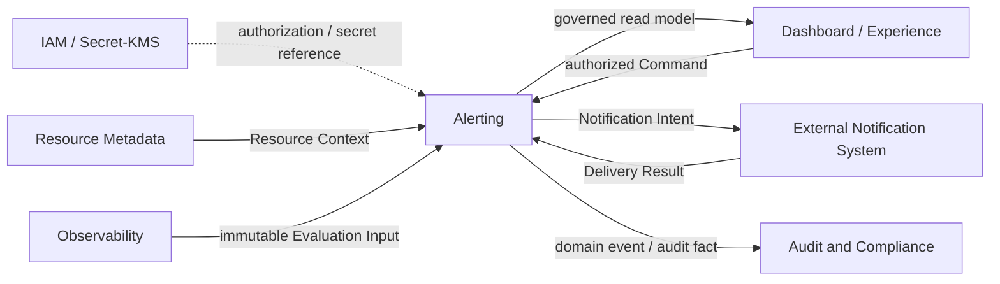

# COP Alerting 领域内容设计

## 1. 目标

将 `COP-DOM-006` 从初始化骨架补充为可评审的 Alerting 领域文档，定义 Rule、Evaluation、Alert Instance、Acknowledgement、Suppression Policy、Notification Intent 和 Delivery Result Reference 的所有权、身份、版本、生命周期、命令、事件、失败、安全与验证边界。

本文只设计架构文档内容。`COP-DOM-006` 保持 `draft`；本文和目标文档在状态变为 `accepted` 前都不构成 `cop-platform` 的强制实现约束。

## 2. 权威边界

- `COP-DOM-001` 定义 Alerting 拥有 alert rules、evaluation results、alert instances、state transitions 和 notification orchestration。
- `COP-DOM-005` 拥有 Signal、Binding、Query、结果完整性和已提交的不可变 Evaluation Input；Alerting 不反向修改 Observability 私有事实。
- 外部 Telemetry Backend 保留原始 Metrics、Logs、Traces 及底层查询事实的权威；Alerting 不保存完整原始 Telemetry 镜像。
- `COP-DOM-003` 拥有 Resource Identity 和 Resource Context；Alerting 只固定受治理引用或必要历史显示快照，不创建或修改 Resource 主数据。
- IAM 拥有 Principal、Tenant 和授权决策；Secret/KMS 保留 credential material，Alerting 只保存受控 Secret/KMS Reference。
- 外部通知系统拥有渠道 Adapter、供应商协议、实际投递和最终 Delivery Result；Alerting 拥有 Notification Intent、抑制判定和投递结果引用。
- `COP-SEC-003` 定义审计、保留与合规约束；Alerting 提供可关联的领域事实，不自行决定具体保留时长。
- `COP-API-002` 仍为 `draft`；Alerting 领域事件应与其兼容，但只有其变为 `accepted` 后才形成实现约束。

## 3. 方案选择

采用 Contract-centered Alerting Domain。Rule、Evaluation、Alert Instance、Disposition/Suppression 和 Notification Intent 按独立职责建模，通过稳定 ID、不可变版本、明确状态转换、expected version、idempotency key 和 correlation 协作。

未采用只描述状态机的精简方案，因为它无法落实规则版本、输入完整性、通知一致性、Tenant 隔离和审计边界。未采用统一执行引擎方案，因为将原始 Signal 查询或渠道投递并入 Alerting 会突破 Observability、Telemetry Backend 和外部通知系统的事实权威。

## 4. 责任边界

Alerting 拥有：

- Rule 稳定身份、不可变版本、管理权类别、激活状态和作用域语义。
- Evaluation 请求、结果、失败、幂等和顺序判定。
- Alert Instance 身份、活跃去重、生命周期和状态转换原因。
- Acknowledgement 等人工处置事实。
- Suppression Policy 及其通知编排判定。
- Notification Intent 和外部 Delivery Result 的受控引用。
- 从 Rule version 到 Delivery Result 的连续审计关联。

Alerting 不拥有 Dashboard 布局、原始 Telemetry、Resource 主数据、通知供应商实现、自动修复 Workflow 或完整事件响应流程。Dashboard/Experience 只能组合受治理读模型并发出授权 Command，不能直接改写领域事实。

## 5. Rule 模型与管理权

- Rule 使用稳定 `rule_id`，只属于一个 Tenant，并通过不可变 Rule version 演进。
- Rule version 固定条件、持续窗口、严重级别、Resource selector、Signal/Evaluation Input Contract、通知策略引用和管理权类别。
- 条件、持续窗口、严重级别、作用域或关联 Contract 的语义变化创建新版本，不原地覆盖历史版本。
- 每次 Evaluation 固定 Rule version；历史 Evaluation、Alert Instance 和 Notification Intent 保持对原版本的引用。
- Rule 分为 `Tenant-managed` 与 `Platform-managed`。两者共享 Evaluation 与 Alert lifecycle Contract，但创建、修改、激活、禁用和通知策略权限分离。
- Tenant 不得修改 Platform-managed Rule，平台也不得静默改写 Tenant-managed Rule。
- 新版本激活后，旧版本不再接受新的 Evaluation。旧版本活跃实例以 `rule_version_superseded` 作为受治理终止原因。
- Rule 禁用或 Resource scope 撤销使用显式终止动作，并记录 actor、原因、expected version、time 和 correlation。

## 6. Evaluation 与输入 Contract

- Evaluation 使用稳定 `evaluation_id` 和 idempotency key，并固定 Tenant、Rule version、计划求值时间、Evaluation Input、Resource Context version 和授权上下文。
- Alerting 只消费 Observability 已提交、不可变的 Evaluation Input，不读取或改写 Observability 私有存储。
- 执行前重新校验 Tenant、Rule version、Resource Context、输入完整性、授权、敏感级别和引用状态；任一项无法确认时 fail closed。
- 成功 Evaluation 的 outcome 只能是 `Matched` 或 `NotMatched`；失败 Evaluation 使用 `Failed` 并携带标准失败分类。
- `Partial`、`Unavailable`、超时、Contract violation 或敏感级别冲突不能转换为 `Matched`、`NotMatched`、零值、最近值或“无数据”。
- Evaluation failure 不推进 Alert Instance 状态，也不得推断告警已恢复。
- 同一告警身份按 Rule version 和计划求值时间推进。重复、迟到、乱序或 replay 结果可以保留审计事实，但不得覆盖较新的 Alert 状态。
- Alerting 不依赖 exactly-once、跨 Tenant 全局顺序或跨领域分布式事务。

## 7. Alert Instance 身份与生命周期

- Alert Instance 表示一次连续告警发生，使用稳定 `alert_instance_id`。
- 活跃去重键由 `Tenant + Rule version + Resource Identity + normalized dimensions` 构成；同一去重键同时只能存在一个活跃实例。
- 首次完整 `Matched` 创建 `Pending`。持续窗口满足后进入 `Firing`；持续窗口为立即触发语义时，可以在同一次受控转换中进入 `Firing`，但必须保留创建与触发原因。
- `Pending` 或 `Firing` 收到完整 `NotMatched` 后进入 `Resolved`。
- Rule version superseded、Rule disabled 或 Resource scope revoked 可以通过受治理终止动作进入 `Resolved`，并使用区别于 condition cleared 的明确原因。
- `Resolved` 是终态，不得重新打开。相同去重条件再次命中时创建新的 Alert Instance，并通过 predecessor reference 关联前一实例。
- 核心生命周期只包含 `Pending`、`Firing`、`Resolved`。Acknowledgement、Suppression 和 Delivery status 不进入该状态枚举。

## 8. Acknowledgement 与 Suppression

- Acknowledgement 是独立、可审计的处置事实，记录 Alert Instance、actor、time、reason、expected version 和 correlation。
- Acknowledgement 可以影响后续通知策略，但不能直接把 Alert Instance 转为 `Resolved`，也不能改写 Evaluation outcome。
- Suppression Policy 使用稳定身份和不可变版本，固定 Tenant、作用域、有效期、管理权和通知编排语义。
- Suppression 只影响 Notification Orchestration；Evaluation 与 Alert Instance lifecycle 继续正常推进。
- 命中 Suppression 时记录包含 policy version、作用域、原因和时间的编排决策，但不向外部通知系统请求投递。
- Suppression 到期、撤销或版本变化不反向修改历史编排决定。

## 9. Notification Orchestration

- Alert 状态转换提交后，Alerting 根据固定通知策略版本和当前 Suppression 判定生成编排决定。
- 未被抑制时生成不可变 Notification Intent。Intent 固定 Tenant、Alert Instance、触发转换、Rule version、通知策略版本、目标 Reference、idempotency key、time 和 correlation。
- Alerting 只保存通知目标和 Secret/KMS Reference，不保存 credential material 或供应商可执行 token。
- 外部通知系统负责渠道适配、供应商协议、重试执行与最终投递，并返回稳定 Delivery Result。
- Alerting 记录 Delivery Result Reference、结果分类、time 和 correlation；Delivery failure 不回滚 Alert state，也不改变 Evaluation outcome。
- Notification Intent 和 Delivery Result 可以重复或乱序到达，处理必须幂等，不依赖 exactly-once 或跨系统同步事务。

## 10. Resource Context 与历史引用

- Rule 通过 Resource Identity 或受治理 Resource selector 定义作用域，不创建 Resource Identity。
- 每次 Evaluation 固定 Resource Context version 或等价受治理快照引用，避免历史求值随最新 Resource 数据漂移。
- Alert Instance 保存 Resource 权威引用和最小必要历史显示快照；该快照不成为 Resource Metadata 的新权威。
- Resource 移除或作用域撤销时，通过显式终止动作处理活跃 Alert Instance，并保留历史引用、终止原因和审计链。
- Resource Context 无法确认、跨 Tenant、过期且不满足 Rule Contract 或敏感级别冲突时，Evaluation fail closed。

## 11. 关系图设计

目标文档使用一个 Mermaid `flowchart` 表达权威输入、Alerting 核心事实和外部投递边界：

箭头不表示共享可写存储、credential material 复制、跨领域同步事务或部署拓扑。Observability 保留 Signal 输入权威，Resource Metadata 保留 Resource 权威，外部通知系统保留最终投递权威，Dashboard/Experience 不产生核心告警事实。

## 12. Commands and Queries

### 12.1 Commands

- Rule：`CreateRule`、`CreateRuleVersion`、`ActivateRuleVersion`、`DisableRule`、`SupersedeRuleVersion`
- Evaluation：`RequestEvaluation`、`RecordEvaluationResult`、`RecordEvaluationFailure`
- Alert Instance：`ApplyEvaluationResult`、`TerminateAlertInstance`
- Acknowledgement：`AcknowledgeAlert`
- Suppression：`CreateSuppressionPolicy`、`CreateSuppressionPolicyVersion`、`ActivateSuppressionPolicyVersion`、`ExpireSuppressionPolicy`、`RevokeSuppressionPolicy`
- Notification：`RecordNotificationDecision`、`RecordDeliveryResult`

所有管理 Command 必须携带 Tenant、actor/source、idempotency key、expected version、reason 和 correlation 中适用的字段。Command 校验 Rule/Policy version、Resource Context、Evaluation Input、授权、敏感级别和状态转换；并发冲突显式拒绝，不使用 last-write-wins。

### 12.2 Queries

- Rule identity、当前/历史版本、管理权类别、作用域、激活与禁用状态查询。
- Evaluation outcome、失败分类、输入完整性、固定版本、计划时间和审计关联查询。
- Alert Instance 当前状态、历史转换、去重身份、predecessor 和 Resource reference 查询。
- Acknowledgement、Suppression decision、Notification Intent 和 Delivery Result Reference 查询。
- Tenant-managed 与 Platform-managed Rule 的受控视图，以及按更新时间和完整性标记的 Dashboard 读模型。

查询必须应用 Tenant isolation、Resource scope、Rule ownership、敏感级别和字段级授权。普通接口不得返回 Secret、credential material、原始 Telemetry、完整敏感 Evaluation Input 或供应商诊断载荷。

## 13. Domain Events and Audit

- Rule 事件覆盖版本创建、激活、superseded 和禁用。
- Evaluation 事件覆盖请求、成功结果和失败结果。
- Alert Instance 事件覆盖创建、进入 Pending、进入 Firing、进入 Resolved 和受治理终止原因。
- 处置与抑制事件覆盖 Acknowledgement、Suppression Policy 生命周期和 suppressed decision。
- Notification 事件覆盖 Intent 创建、Delivery Result 记录和标准投递失败分类。
- 事件符合 `COP-API-002` 的 envelope 方向，携带稳定 event ID、Tenant、aggregate ID/version、Rule/Policy version、状态或结果分类、time、correlation 和必要 reference。
- 事件不携带 Secret、credential material、原始 Telemetry、完整敏感输入或供应商可执行 token。
- 消费者按 event ID、aggregate version 和业务 idempotency key 处理 duplicate、out-of-order 和 replay，不依赖全局顺序。
- Rule version、Evaluation Input、Evaluation、Alert transition、Acknowledgement/Suppression decision、Notification Intent 和 Delivery Result 形成连续审计链。

## 14. 不变量

- 每个 Rule、Evaluation、Alert Instance、Suppression Policy 和 Notification Intent 只属于一个 Tenant。
- Rule 和 Suppression Policy 使用稳定 ID 与不可变版本；历史引用不得漂移到最新版本。
- 只有已激活 Rule version 可以接受新的 Evaluation。
- 只有完整成功的 `Matched` 或 `NotMatched` 可以推进 Alert lifecycle。
- 同一活跃去重键同时只能存在一个 Alert Instance；`Resolved` 实例不得重新打开。
- Acknowledgement 不等于 Resolved；Suppression 不暂停 Evaluation 或 Alert state transition。
- Notification Intent 只在核心事实提交后形成；Delivery failure 不回滚 Alert state。
- 所有状态变更使用 idempotency key 和 expected version；冲突显式拒绝。
- 迟到、重复、乱序和 replay 结果不得覆盖更新状态。
- Tenant、授权、Resource scope、敏感级别或引用状态无法确认时 fail closed。
- Alerting 不拥有原始 Telemetry、Resource 主数据、渠道 Adapter、credential material 或自动修复 Workflow。

## 15. 失败、安全与一致性

- 仅标准化为 transient/retryable 的依赖故障执行有界 backoff；无效 Rule、授权拒绝、Tenant/作用域不匹配、Contract violation 和敏感级别冲突不自动重试。
- 重试耗尽记录明确 Evaluation failure 或 Delivery failure，不推断 condition cleared，也不改变无关 Alert Instance。
- 重试、并发、限流和故障隔离至少按 Tenant 与 Rule/Notification target scope 隔离；单一规则或渠道故障不得阻塞无关 Tenant 或规则。
- 核心事实先持久化，领域事件和 Notification Intent 使用稳定 ID 支持幂等重放；不要求 Observability、Alerting 和外部通知系统之间的分布式事务。
- 读模型允许最终一致，但必须声明 `as_of`、更新时间、完整性或 stale 状态，不能把缺失或陈旧数据呈现为当前完整事实。
- Rule 管理与 Evaluation/Notification 执行均进行 Tenant 和授权校验；任何一层无法确认时 fail closed。
- 平台规则与 Tenant 规则共享 Contract 但不共享无边界写权限。
- 日志、事件、审计和普通查询只保存最小必要字段及受控证据引用，不泄漏 Secret、原始 Telemetry 或敏感通知内容。

## 16. 验证策略

- **Rule contract：** 验证稳定 Rule ID、不可变版本、激活校验、旧版本终止和 Tenant-managed/Platform-managed 权限分离。
- **Evaluation contract：** 验证稳定 ID、幂等键、固定引用及 `Matched`、`NotMatched`、`Failed` 互斥语义。
- **Input completeness：** 验证 `Partial`、`Unavailable`、timeout 和 Contract violation 均不触发正常 Alert state transition。
- **Alert lifecycle：** 验证 `Pending -> Firing -> Resolved` 合法路径、终态不可重开、终态后再次命中新建实例。
- **Deduplication and concurrency：** 验证同一去重键只有一个活跃实例，以及 duplicate、late、out-of-order、replay、expected version 和并发冲突。
- **Disposition and suppression：** 验证 Acknowledgement 不等于 Resolved，Suppression 只影响 Notification Orchestration。
- **Notification boundary：** 验证 Intent 在状态提交后形成、Delivery failure 不回滚状态、外部系统保留最终投递权威。
- **Tenant isolation and secrecy：** 验证所有跨 Tenant 操作默认拒绝，Secret、credential 和敏感完整载荷不进入普通事件、日志或审计。
- **Traceability：** 验证 Rule version 到 Delivery Result 的连续关联链，以及 Command/Event 与 `COP-API-002` 的兼容方向。
- **Ownership separation：** 验证 Alerting 不创建 Resource Identity，不保存原始 Telemetry，不实现渠道 Adapter 或自动修复 Workflow。

## 17. 明确不做

- 不选择 Rule Engine、scheduler、消息系统、数据库、缓存、通知供应商或部署产品。
- 不定义 REST 路径、API 字段全集、表结构、物理拓扑、重试次数、持续窗口默认值、retention 数值或 SLO。
- 不把完整 Metrics、Logs、Traces 或 Evaluation Input payload 复制进 Alerting 领域存储。
- 不创建或修改 Resource Identity、Resource Metadata 私有事实或 Observability 私有事实。
- 不实现通知渠道 Adapter，不保存供应商 credential，不把 Delivery failure 变成 Alert state。
- 不把 Acknowledgement、Suppression 或 Delivery status 混入核心 Alert lifecycle。
- 不承担自动修复 Workflow、完整事件响应流程或 Dashboard 布局。
- 不依赖 exactly-once、全局顺序、共享可写存储或跨领域分布式事务。
- 不修改 `COP-DOM-001`、`COP-DOM-005`、`COP-API-002`、`COP-SEC-003` 或目录索引。
- 不创建 RFC/ADR，不把 `COP-DOM-006` 标记为 `accepted`。

## 18. 目标文档结构

修改 `docs/domains/alerting-domain.md`，保持稳定 ID `COP-DOM-006`、`draft` 状态、owners、related、rfc 和 adr；版本更新为 `0.2.0`，`last_updated` 更新为 `2026-08-10`。

保留既有一级模板章节；在 `Bounded Context` 下按以下顺序组织：

- `Alerting Responsibility Boundary`
- `Rule and Management Authority Model`
- `Evaluation and Input Contract`
- `Alert Instance Lifecycle`
- `Acknowledgement and Suppression Model`
- `Notification Orchestration Model`
- `Alerting Relationship Map`
- `Failure, Security, and Consistency`
- `Validation Strategy`
- `Success Criteria`

`Aggregates and Entities` 包含核心对象所有权表、Alert lifecycle 和关键引用；`Commands and Queries`、`Domain Events`、`Invariants`、`Relationships`、`Constraints`、`Quality Attributes` 和 `Implementation Guidance` 展开本文批准内容。

四条既有 References 保持不变并可解析：

- `COP-DOM-001`
- `COP-DOM-005`
- `COP-API-002`
- `COP-SEC-003`

## 19. 成功标准

- 读者能够区分 Alerting、Observability、Telemetry Backend、Resource Metadata、IAM、Secret/KMS、外部通知系统、Audit 和 Dashboard/Experience 的事实权威。
- Rule 稳定身份、不可变版本、管理权类别、激活与 superseded 语义完整。
- Evaluation 固定 Rule/Input/Resource/授权上下文，并对完整成功结果与失败结果做不可混淆的区分。
- Alert Instance 去重身份、`Pending`、`Firing`、`Resolved`、终态和 predecessor 语义可验证。
- Acknowledgement、Suppression 和 Delivery status 与 Alert lifecycle 分离。
- Notification Intent 与外部 Delivery Result 的一致性边界清晰，失败不回滚告警状态。
- Tenant isolation、双阶段授权、fail closed、Secret Reference、幂等、并发和乱序语义完整。
- Rule version 到 Delivery Result 的审计链可关联，且不泄漏原始 Telemetry 或敏感载荷。
- 文档不引入未经批准的产品、部署、API、数据表、数值参数或跨领域实现决策，并保持 `draft` 门禁。

## 20. 验收条件

1. `COP-DOM-006` 的 ID、status、owners、related、rfc 和 adr 保持不变；version 为 `0.2.0`，last_updated 为 `2026-08-10`。
2. 文档明确 Alerting 拥有 Rule、Evaluation、Alert Instance、state transition、Acknowledgement/Suppression 和 Notification Orchestration 事实。
3. 文档明确 Observability 只提供已提交、不可变 Evaluation Input，Alerting 不拥有原始 Telemetry、Signal 或 Resource Identity。
4. 文档定义稳定 Rule ID、不可变 Rule version、Tenant-managed/Platform-managed 权限分离和版本 superseded 终止语义。
5. 文档定义 Evaluation stable ID、idempotency key、固定 Rule/Input/Resource/authorization reference 和 `Matched`/`NotMatched`/`Failed` 语义。
6. 文档明确 `Partial`、`Unavailable`、timeout、Contract violation 和敏感级别冲突不得成为正常规则结果或状态转换。
7. 文档定义 `Tenant + Rule version + Resource Identity + normalized dimensions` 活跃去重键和单活跃实例不变量。
8. 文档定义 `Pending -> Firing -> Resolved`、终态不可重开、终态后再次命中新建实例和 predecessor reference。
9. 文档明确 Acknowledgement 不等于 Resolved，Suppression 只影响 Notification Orchestration。
10. 文档定义不可变 Notification Intent、固定策略版本、外部 Delivery Result Reference 和投递失败不回滚 Alert state。
11. 文档定义 expected version、idempotency、duplicate、late、out-of-order 和 replay 处理，且不承诺 exactly-once 或全局顺序。
12. 文档定义 Tenant 双阶段授权、跨 Tenant 默认拒绝、Secret/KMS Reference 和最小事件/审计载荷。
13. 文档列出批准的 Commands、Queries、Domain Events、失败分类、审计链和领域不变量。
14. 文档包含 Alerting 与 IAM/Secret、Resource Metadata、Observability、外部通知系统、Audit、Dashboard/Experience 的 Mermaid 关系图。
15. 文档覆盖 Rule Contract、Evaluation、完整性、lifecycle、去重并发、处置抑制、通知边界、Tenant isolation、secrecy、traceability 和 ownership separation 验证。
16. 四条既有 References 均可解析，未修改目录索引，未创建 RFC/ADR。
17. 文件为 UTF-8、无 BOM、无替换字符，不包含占位标记、填充文本或未经批准的产品与数值决定。
18. `git diff --check`、相对链接检查和文档结构检查通过；实施提交只修改 `docs/domains/alerting-domain.md`。
