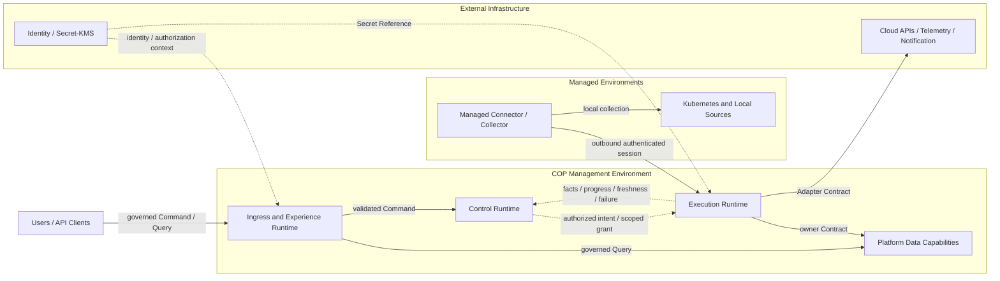

# COP Infrastructure Overview 内容设计

## 1. 目标

将 `COP-INFRA-001` 从初始化骨架补充为可评审的基础设施总览，定义 COP Management Environment、Managed Environments 和 External Infrastructure 的部署责任、信任边界、能力角色、受治理流向、故障隔离、恢复语义和阶段演进。

本文只设计架构文档内容。`COP-INFRA-001` 保持 `draft`；本文和目标文档在状态变为 `accepted` 前都不构成 `cop-platform` 的强制实现约束。

## 2. 权威边界

- `COP-ARCH-002` 定义 Experience Boundary、Control Plane、Data Plane 和 Platform Data Services 的逻辑责任；`COP-INFRA-001` 只说明这些责任所需的物理基础设施能力与部署边界，不把逻辑平面映射为固定 service、process、cluster 或 database。
- `COP-ARCH-003` 定义 Control Plane、Data Plane、Managed Connector/Collector 和 External Adapter Boundary 的执行与信任关系；基础设施总览保持 authorized intent、fact reporting、outbound-only managed connection 和 credential reference 语义。
- `COP-ROAD-002` 定义 MVP 能力范围；基础设施总览只提供支撑这些能力的部署 Profile，不扩大 Workflow、Automation、FinOps、AI/RAG 或 SaaS 商业运营范围。
- `COP-INFRA-002` 负责 Kubernetes cluster、namespace、scheduling 和 workload isolation 细节。
- `COP-INFRA-005` 负责 ingress、service traffic、managed connection 和 network trust 细节。
- `COP-INFRA-003` 负责 transactional state、ephemeral acceleration、event data、object data 和 Telemetry data 的存储职责与恢复细节。
- `COP-INFRA-004` 负责 Collector、Metrics、Logs、Traces 和 query component 的技术路径与职责。
- 领域文档继续拥有业务事实和不变量；基础设施能力不会因为物理部署位置而成为新的领域 authority。
- Cloud/Kubernetes actual state、external identity、raw Telemetry 和 external Delivery Result 继续由相应外部系统拥有。

上述关联文档当前均为 `draft`，只用于设计一致性检查；只有状态为 `accepted` 的文档和 ADR 才能形成实现约束。

## 3. 方案选择

采用 `Boundary Contract + Evolution Profiles` 方案。先固定三类逻辑部署区域、Management Environment 内部能力角色、跨区域允许的 Contract 和持续有效的不变量，再用三个 Profile 描述隔离与运行能力如何增强。

未采用 `Reference Topology First`，因为具体拓扑容易被误读为固定 cluster 数量、产品组合或同步调用链。未采用逐阶段完整 Blueprint，因为重复描述会使跨阶段 ownership、security 和 recovery 不变量漂移，并侵入四份专项基础设施文档的职责。

## 4. 基础设施责任模型

基础设施总览拥有以下跨专项文档约束：

- 三类逻辑部署区域及其责任、信任和故障边界。
- Management Environment 内部能力角色及逻辑隔离要求。
- Management Environment、Managed Environments 和 External Infrastructure 之间允许的依赖方向。
- Command、Execution、Query 和 Event 四类基础设施路径。
- identity、Tenant、authorization、Secret Reference、audit 和 platform observability 的持续约束。
- Preserve、Rebuild、Reconcile 和 Never infer 的恢复责任分类。
- MVP Self-hosted、Resilient Self-hosted 和 SaaS-ready 三个演进 Profile 的进入依据。

基础设施总览不拥有领域写模型、外部原始事实、产品选型、容量模型、数值 SLO 或专项拓扑。逻辑隔离必须可验证，但不要求每个逻辑平面在所有阶段都使用独立物理运行单元。

## 5. Deployment Zone Model

### 5.1 COP Management Environment

COP Management Environment 是 COP runtime、platform data capability 和 cross-cutting operational control 所在的 operator-controlled trust boundary。它是逻辑部署区域，不等于单一 Kubernetes cluster、network segment 或物理位置。

由 COP operator 控制、专用于 COP 且遵循 COP backup、identity、network 和 recovery Contract 的 managed data service，即使物理托管在外部云服务中，也属于 Management Environment 的逻辑能力。归属依据是责任与信任 Contract，而不是机房或网络位置。

### 5.2 Managed Environments

Managed Environments 是 COP 所连接的 customer/target trust boundary，包括 Kubernetes cluster、本地 Telemetry source 和其他需要 Managed Connector/Collector 的环境。

Managed Connector/Collector 只主动建立到 COP 的 outbound authenticated session，通过受控 polling 或 streaming 获取已授权任务并回报 observation、fact、progress、freshness、failure 和 recovery signal。COP 不依赖进入受管环境的 inbound control connection。

Managed Environment 保留本地系统和业务 workload 的执行权威。Connector/Collector 只执行 scoped collection、discovery 或 synchronization，不拥有 Control Plane policy、最终 authorization 或跨 Tenant credential。

### 5.3 External Infrastructure

External Infrastructure 包括 Cloud/Kubernetes API、External Identity Provider、Secret/KMS、Telemetry Backend、Notification System 和其他保留自身事实权威的系统。某个外部基础设施组件可以由 COP operator 部署并与 Management Environment 物理共置，但它仍保持独立 authority 和 Contract boundary；物理共置不把 raw Telemetry、identity、Secret 或 Delivery Result 转换为 COP 领域事实。

COP 通过 owning Contract 或 Adapter boundary 与这些系统交互。外部产品字段、credential、供应商错误和内部存储模型不得成为 COP 领域不变量，也不能通过共享存储获得 COP 写权限。

## 6. Management Environment Capabilities

### 6.1 Ingress and Experience Runtime

承载外部入口、API boundary 和 governed read access。它校验 request identity、Tenant、scope 和适用 authorization context，然后把 Command 或 Query 路由到 owning Contract；不承载领域规则，不直接访问私有存储。

### 6.2 Control Runtime

承载 policy、authorized intent、task orchestration 和 lifecycle。Control Runtime 持久化经过验证的意图和恢复决策，通过 scoped execution grant 调用 Execution Runtime；不采集 raw Telemetry，也不把最终 authorization 委托给执行方。

### 6.3 Execution Runtime

承载 Adapter、discovery、collection、synchronization 和 fact reporting。它隔离外部 dependency，执行有界 backpressure、retry、checkpoint 和 duplicate protection，并通过 owner Contract 提交事实；不扩大 Tenant、account、cluster、resource、operation 或 signal scope。

### 6.4 Platform Data Capabilities

Data Infrastructure Capabilities 按角色定义，不在总览中固定产品。表中前四项是 Management Environment 的 Platform Data capability；Telemetry Backend 是 COP 使用但保持独立 authority 的 integrated capability：

| Capability role | Authority and use | Failure and recovery semantics |
| --- | --- | --- |
| Transactional State | 保存由领域 owner 提交的 COP authoritative fact、intent 和 lifecycle；基础设施本身不获得领域 ownership | 进入 Preserve；需要受控 backup、restore verification、version 和 audit continuity |
| Ephemeral Acceleration | 提供 cache、coordination、session acceleration 或等价可替换能力 | 不是 authority；失败时允许降级并从 authoritative state Rebuild |
| Event Transport | 传播已提交事实和异步任务信号 | 采用 at-least-once；处理 duplicate、delay、out-of-order 和 replay；不提供分布式事务或全局顺序 |
| Durable Object Capability | 保存受控 object 或 reference，遵循 owner、retention、encryption 和 access Contract | object 与 metadata 可验证关联；普通对象、事件和日志不得包含 credential material |
| Telemetry Backend | 保存 Metrics、Logs、Traces 等 raw Telemetry，并提供外部查询能力 | 保留外部 authority；不可用、partial 或 stale 必须显式，不得伪装为完整成功 |

Transactional State、Ephemeral Acceleration、Event Transport 和 Durable Object Capability 可以由 operator 选择自建或 managed implementation，但其逻辑责任和恢复 Contract 不随产品变化。Telemetry Backend 可以由 COP 部署或连接，仍不因此把 raw Telemetry authority 转移给 COP 领域。

## 7. Runtime and Data Flows

### 7.1 Command Path

Ingress and Experience Runtime 校验 identity、Tenant、scope、authorization 和 request Contract，把 Command 交给 owning Control/Domain Contract。Control Runtime 持久化 authorized intent 和 task lifecycle，并明确返回 accepted、rejected、conflict、timeout、dependency failure 或 unknown outcome；accepted 不等于 completed。

### 7.2 Execution Path

Control Runtime 向 Execution Runtime 提供短期、限 Tenant、限资源、限操作的 execution grant 和必要 Secret/KMS Reference。Execution Runtime 调用 External Infrastructure 或处理 Managed Connector/Collector 会话，只回报 observation、fact、progress、freshness、failure 和 recovery signal。Credential material 不进入普通 task、event、log 或领域数据。

### 7.3 Query Path

Query 使用 governed read model 或 owner Query Contract，不要求经过 Execution Runtime。Read model 声明 owner、source、`as_of`、freshness 和 failure semantics，并区分 complete、stale、partial、degraded 和 unavailable。调用方不得绕过 owner 读取私有存储。

### 7.4 Event Path

Domain Event 只在 authoritative fact 提交后发布。Event Transport 提供 at-least-once 传播；消费者使用稳定 event ID、aggregate version 和业务 idempotency key 处理 duplicate、out-of-order 和 replay，不依赖 exactly-once、全局顺序或跨边界分布式事务。

## 8. Security and Trust Boundaries

- 每次跨部署边界交互显式携带 workload/subject identity、Tenant、scope 和适用 authorization context；网络位置、cluster membership 或共享基础设施不产生隐式信任。
- 自托管可以采用单组织 deployment profile，但 Tenant、identity、authorization、data partition、audit 和 Secret boundary 始终显式，不能推迟到 SaaS 阶段重构。
- Secret 和 credential 只通过受控 Secret/KMS Reference 使用；不得进入 task payload、Domain Event、ordinary log、backup metadata、read model 或普通领域数据。
- 对外入口由 Ingress boundary 统一治理；Platform Data Capabilities 不暴露为未经授权的公共入口。
- Managed Connector/Collector 只主动建立 outbound authenticated session；任务响应在已建立的受控会话内返回。
- 权限遵循 default deny 和 least privilege；无法确认 identity、Tenant、scope、authorization、Secret Reference 或 dependency integrity 时 fail closed。
- 关键配置、授权、task intent、execution result、backup、restore、reconciliation 和 recovery action 保留 actor/source、target、time、result、version 和 correlation audit context。

具体 protocol、certificate lifecycle、port、cipher、network policy 和 encryption implementation 由安全、网络或专项设计决定。

## 9. Failure Isolation and Degradation

- 故障至少按 Tenant、connection、managed environment、Adapter 和 external dependency 隔离；单一失败不得无边界阻塞其他 Tenant、连接或环境。
- Execution Runtime 和 Event Transport 使用有界 queue、backpressure、retry 和 isolation；不得通过无限重试或无界积压维持虚假可用。
- validation、authentication、authorization、scope mismatch 和 incompatible Contract 属于 terminal failure，不自动重试。
- 只有明确 retryable 的 dependency failure 执行有界 backoff；unknown outcome 通过状态查询、idempotent retry 或 reconciliation 确认，不能自动宣称成功或失败。
- External Infrastructure 故障不改变事实权威；COP 明确报告 unavailable、partial、stale、degraded、isolated、recovering 或 failed。
- Management Environment 内部能力可以物理合并，但必须保持可判定的 workload identity、permission、data access、resource quota 和 failure signal，避免单一进程或 dependency 故障静默扩散。

## 10. Backup, Recovery, and Reconciliation

恢复责任分为四类：

- **Preserve：** committed domain fact、task intent/lifecycle、Tenant、version、audit 和 correlation context。Preserve 数据需要 backup、restore、integrity 和 continuity 验证。
- **Rebuild：** cache、index、governed read model、derived projection 和 ephemeral coordination。它们必须能从 authoritative state 或保留事件重建，不能成为唯一恢复来源。
- **Reconcile：** Cloud/Kubernetes actual state、Telemetry association、external Delivery Result 和 Managed Environment freshness。恢复后通过 resync、query 或 reconciliation 验证外部权威与 COP 引用。
- **Never infer：** 不把 unknown 解释为 success，不把 partial 解释为 complete，不把 queue/cache 解释为 authority，不把网络位置解释为 authorization。

总览只要求 backup、restore、rebuild、resync 和 reconciliation 具有可执行路径和验证证据。Replica count、RPO/RTO、availability zone、region、failover topology、retention 数值和灾备演练频率由专项文档或 RFC/ADR 决定。

## 11. Evolution Profiles

### 11.1 MVP Self-hosted Baseline

- COP capability 可以在共享 Kubernetes 或等价运行基础设施上物理合并。
- workload identity、permission、data access、resource boundary、health、dependency 和 audit signal 必须显式。
- 单组织运行仍保留 Tenant context 和数据分区语义。
- 具备 authoritative state backup/restore、derived state rebuild、external fact reconciliation 和 dependency failure 验证。
- 不要求预设 cluster 数量、node 数量、availability zone 或 region。

### 11.2 Resilient Self-hosted

- 根据风险、合规、负载和已观察故障证据拆分 runtime 或 data capability。
- 增强 failure domain、redundancy、backpressure、restore drill、recovery verification 和 operational evidence。
- 物理拆分不改变 Contract、data authority、Tenant context 或跨区域依赖方向。
- 进入条件来自明确风险和验证证据，而不是固定发布时间或预设规模。

### 11.3 SaaS-ready Isolation

- 在同一基础设施责任模型上增强 Tenant、workload、network 和 data partition isolation。
- 支持按风险和负载进行区域化部署、运行单元拆分和独立故障隔离。
- 不假设跨 region 全局事务、全局顺序或单一共享高权限 credential。
- 自托管 Profile 中已显式的 Tenant、identity、authorization、audit 和 Secret boundary 继续有效，不重建核心模型。

Profile 表达 capability maturity，不是产品套餐、环境名称或固定拓扑。进入下一 Profile 需要风险、合规、负载、故障和运营成熟度证据。

## 12. 关系图设计

目标文档使用一个 Mermaid `flowchart` 表达三类部署区域、Management Environment 能力和允许的受治理流向：

图中区域表示 responsibility、trust 和 failure boundary，不表示固定 cluster、service、process、network segment 或物理位置。虚线表示 authorized intent、fact signal 或 cross-cutting security context，不表示共享存储或分布式事务。

## 13. 专项文档分工

`COP-INFRA-001` 是基础设施边界枢纽，只定义跨专项文档不变量：

| Document | Owns | Must preserve from overview |
| --- | --- | --- |
| `COP-INFRA-002` Kubernetes Topology | cluster、namespace、workload placement、scheduling、runtime isolation | 三类区域、逻辑隔离、workload identity、failure domain 和 Profile 语义 |
| `COP-INFRA-005` Network and Ingress | external entry、service traffic、managed connection、network trust | governed ingress、private data capability、outbound-only managed session 和 no implicit trust |
| `COP-INFRA-003` Data Storage Architecture | state category、storage responsibility、backup/restore、retention 和 migration | Preserve/Rebuild/Reconcile、no new authority 和 product-neutral capability roles |
| `COP-INFRA-004` Observability Stack | collection、Metrics/Logs/Traces、query path 和 operational telemetry | external raw Telemetry authority、freshness、degradation 和 dependency isolation |

专项文档不得改变领域 ownership、将 logical plane 强制映射为固定 deployment unit，或通过实现产品绕过 Tenant、authorization、Secret 和 recovery Contract。需要改变三类区域、数据权威、安全边界或 Profile 不变量时，先创建或更新 RFC，接受后关联 ADR 并同步所有受影响权威文档。

## 14. Validation Strategy

- **Boundary model：** 验证三个部署区域、Management Environment 能力和外部 authority 均可独立识别。
- **Logical/physical separation：** 验证文档允许 MVP co-location，同时不把 Control、Execution、Data capability 映射为固定 service、cluster 或 database。
- **Flow direction：** 验证 Command、Execution、Query 和 Event 路径不形成共享写存储、循环同步依赖或跨边界直接私有访问。
- **Managed connection：** 验证 Managed Connector/Collector 只主动建立 outbound authenticated session，且任务和 fact 保持 scoped identity、Tenant 和 authorization context。
- **Data authority：** 验证 Transactional State、Ephemeral Acceleration、Event Transport、Durable Object 和 Telemetry Backend 的 authority 与恢复语义互不混淆。
- **Tenant and secrecy：** 验证自托管 Profile 也保留 Tenant boundary，Secret/credential 不进入普通 task、event、log、backup metadata 或 read model。
- **Failure isolation：** 验证 Tenant、connection、managed environment、Adapter 和 dependency 故障有界隔离，并显式报告 stale、partial、degraded、unavailable 和 unknown。
- **Recovery：** 验证 Preserve、Rebuild、Reconcile 和 Never infer 分类，以及 backup、restore、rebuild、resync 和 reconciliation 的验证要求。
- **Evolution：** 验证三个 Profile 只增强 capability 和 isolation，不改变 ownership、Contract 或持续不变量。
- **Delegation：** 验证 Kubernetes、Network、Storage 和 Observability 细节分别由四份专项文档拥有，总览不复制专项实现。

## 15. 明确不做

- 不选择 Kubernetes distribution、PostgreSQL、Redis、broker、object storage、Telemetry product、Secret/KMS、service mesh、ingress controller 或 cloud managed service。
- 不定义 service、process、package、database、cluster、namespace、node、replica、availability zone、region 或 network segment 数量。
- 不定义 port、protocol、cipher、certificate lifetime、retry count、queue size、capacity、retention、RPO/RTO、failover timing 或数值 SLO。
- 不定义安装手册、Infrastructure as Code module、Helm value、Kubernetes manifest、database schema 或 API payload。
- 不复制 `COP-ARCH-002` 的逻辑责任、`COP-ARCH-003` 的执行语义或四份专项基础设施文档的详细设计。
- 不创建新的领域 authority，不复制 Cloud/Kubernetes actual state、external identity、raw Telemetry 或 external Delivery Result。
- 不为 Workflow、Automation、FinOps、AI/RAG、插件市场或 SaaS 商业运营预建基础设施。
- 不依赖 exactly-once、全局顺序、共享可写存储、跨区域同步事务或网络位置隐式信任。
- 不修改目录索引、其他架构文档或专项基础设施文档。
- 不创建 RFC/ADR，不把 `COP-INFRA-001` 标记为 `accepted`。

## 16. 目标文档结构

修改 `docs/infrastructure/infrastructure-overview.md`，保持稳定 ID `COP-INFRA-001`、`draft` 状态、owner、rfc 和 adr；version 更新为 `0.2.0`，`last_updated` 更新为 `2026-08-10`。`related` 和 References 补充 `COP-ARCH-003`、`COP-INFRA-002` 与 `COP-INFRA-005`，形成对逻辑架构、执行边界、MVP 和四份专项基础设施文档的可解析引用。

保留既有一级模板章节；在 `Architecture or Model` 下按以下顺序组织：

- `Infrastructure Responsibility Model`
- `Deployment Zone Model`
- `Management Environment Capabilities`
- `Managed Environment Boundary`
- `External Infrastructure Boundary`
- `Runtime and Data Flows`
- `Security and Trust Boundaries`
- `Failure Isolation and Degradation`
- `Backup, Recovery, and Reconciliation`
- `Evolution Profiles`
- `Infrastructure Relationship Map`
- `Validation Strategy`
- `Success Criteria`

`Architecture or Model` 包含一个 Mermaid flowchart、一个 Data Infrastructure Capability 表、一个 Evolution Profile 表和一个专项文档分工表。`Constraints`、`Quality Attributes`、`Implementation Guidance` 和 `References` 展开本文批准内容，不复制讨论过程。

目标 References 为：

- `COP-ARCH-002`
- `COP-ARCH-003`
- `COP-ROAD-002`
- `COP-INFRA-002`
- `COP-INFRA-003`
- `COP-INFRA-004`
- `COP-INFRA-005`

## 17. 成功标准

- 读者可以区分 COP Management Environment、Managed Environments 和 External Infrastructure 的 responsibility、trust 和 failure boundary。
- Management Environment 的 Ingress/Experience、Control、Execution 和 Platform Data capability 可逻辑隔离，也可按 Profile 与风险物理合并或拆分。
- Command、Execution、Query 和 Event 路径保持 owner Contract、identity、Tenant、authorization、Secret Reference、freshness 和 failure semantics。
- Data Infrastructure Capability 使用产品中立角色；Telemetry Backend 与 Management Environment 内部 Platform Data capability 的 authority 明确分离，cache、queue、index、object 和 Telemetry deployment 不获得新的领域 authority。
- Managed Connector/Collector 保持 outbound-only connection、scoped execution 和 fact reporting，不要求 COP 入站进入受管环境。
- External Infrastructure 故障不会改变 ownership；degraded、partial、stale、unavailable 和 unknown 不会伪装为成功。
- Preserve、Rebuild、Reconcile 和 Never infer 恢复职责可验证，且不提前决定 RPO/RTO、replica 或 region topology。
- MVP Self-hosted、Resilient Self-hosted 和 SaaS-ready 共用稳定边界与不变量，只增强 isolation 和 operational capability。
- 四份专项文档职责清晰，总览不复制产品、容量、网络、存储或 Telemetry 实现细节。
- 文档保持 `draft`，不引入未经批准的重大架构决策或实现约束。

## 18. 验收条件

1. `COP-INFRA-001` 保持稳定 ID、`draft` status、owner、rfc 和 adr；version 为 `0.2.0`，last_updated 为 `2026-08-10`。
2. 文档明确三个逻辑部署区域，并说明区域不等于固定 cluster、service、process、network segment 或物理位置。
3. 文档定义 Ingress/Experience、Control、Execution 和 Platform Data 四类 Management Environment capability，允许物理合并但要求逻辑隔离可验证。
4. 文档定义 Managed Connector/Collector 的 outbound authenticated session、scoped task 和 fact reporting 边界。
5. 文档定义 External Infrastructure authority，并禁止产品字段、credential、外部私有模型和共享存储进入 COP 核心不变量。
6. 文档定义 Transactional State、Ephemeral Acceleration、Event Transport、Durable Object 和 Telemetry Backend 的 authority 与恢复语义。
7. 文档定义 Command、Execution、Query 和 Event 四条受治理路径，不依赖 exactly-once、全局顺序或分布式事务。
8. 文档定义 workload/subject identity、Tenant、authorization、Secret Reference、default deny、least privilege 和 audit 约束。
9. 文档定义 Tenant、connection、managed environment、Adapter 和 dependency 的故障隔离，以及有界 backpressure 和 retry。
10. 文档区分 stale、partial、degraded、unavailable、unknown、terminal failure 和 retryable failure，不把它们伪装为成功。
11. 文档定义 Preserve、Rebuild、Reconcile 和 Never infer 分类，以及 backup、restore、rebuild、resync 和 reconciliation 验证。
12. 文档定义 MVP Self-hosted、Resilient Self-hosted 和 SaaS-ready 三个 Profile，且 Profile 不改变 ownership、Contract 或持续安全边界。
13. 文档明确自托管单组织 Profile 仍保留 Tenant、identity、authorization、data partition、audit 和 Secret boundary。
14. 文档包含一个三区域 Mermaid 图，并明确箭头不表示共享存储、固定拓扑或跨边界事务。
15. 文档明确 `COP-INFRA-002`、`COP-INFRA-003`、`COP-INFRA-004` 和 `COP-INFRA-005` 的专项职责及必须保持的不变量。
16. 七条 References 均可解析，未修改目录索引、其他架构文档或专项基础设施文档，未创建 RFC/ADR。
17. 文档不选择产品，不定义 cluster/node/replica/region 数量、capacity、port、RPO/RTO、retention 或数值 SLO。
18. 文件为严格 UTF-8、无 BOM、NUL 或 replacement character，不包含占位标记、填充文本或未经批准的要求。
19. 结构检查验证一级与二级章节顺序、一个 Mermaid block、能力表、Profile 表、专项分工表和七条链接。
20. `git diff --check`、全仓库相对链接检查和单文件范围检查通过；实施提交只修改 `docs/infrastructure/infrastructure-overview.md`。
