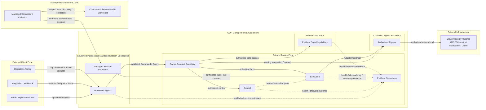

# COP Network and Ingress 内容设计

## 1. 目标

将 `COP-INFRA-005` 从初始化骨架补充为可评审的网络与入口架构，定义 COP 外部入口、内部 service traffic、controlled egress、Managed Session、TLS/identity propagation、DNS/service discovery、流量治理、故障隔离和阶段演进边界。

本文只设计架构文档内容。`COP-INFRA-005` 保持 `draft`；本文和目标文档在状态变为 `accepted` 前都不构成 `cop-platform` 的强制实现约束。

## 2. 权威边界

当前仓库没有 `accepted` 架构文档、RFC 或 ADR，因此不存在可直接形成实现约束的上游决策。以下 `draft` 文档只用于设计一致性检查：

- `COP-INFRA-001` 定义 COP Management Environment、Managed Environments、External Infrastructure、governed ingress、private data capability、outbound-only managed session、no implicit trust 和三个 Evolution Profile。
- `COP-INFRA-002` 定义 Management/Managed Kubernetes Environment、Placement Class、workload identity、host-level isolation 和 Kubernetes failure boundary；本文只定义网络可达性与流量 Contract，不改变 workload placement authority。
- `COP-ARCH-003` 定义 Control Plane、Data Plane、Managed Connector/Collector、outbound mTLS、scoped execution grant、fact reporting 和 no inbound control connection。
- `COP-ARCH-004` 定义 API、Event、Webhook、Provider/Connector 等 integration pattern 的 owner Contract、Tenant、identity、version、replay 和 failure isolation 语义。
- `COP-API-001` 与 `COP-API-002` 分别定义 API boundary 和 Event Contract；本文不固定 protocol 或 payload shape。
- `COP-SEC-001` 负责 identity、Secret/KMS、encryption、audit 和 security control；本文只定义 TLS/trust material 与网络身份传播所需的 Contract。
- `COP-INFRA-003` 和 `COP-INFRA-004` 分别负责 data authority/storage 与 Telemetry pipeline；网络可达性不会授予数据或观测 authority。

网络位置、IP、DNS、mTLS、session establishment、Gateway route 或 cluster membership 都不能成为 Tenant、authorization、data ownership 或 business completion authority。

## 3. 方案选择

采用 `Traffic Contracts + Trust Zones + Evolution Profiles`：

1. 先定义 External Client、Governed Ingress、Private Service、Private Data、Controlled Egress、Managed Session 和 Managed Environment 等逻辑 Trust Zone。
2. 再按入口类别和 Traffic Class 定义 initiator、direction、identity、authorization、admission、backpressure、freshness 与 failure semantics。
3. 最后复用 `MVP Self-hosted Baseline`、`Resilient Self-hosted` 和 `SaaS-ready Isolation`，表达网络隔离、冗余与运营能力如何增强。

未采用 `Reference Network Topology First`，因为固定 DNS/CDN/Load Balancer/Gateway/proxy 链路容易被误读为强制产品和 hop 数量。未采用 `Network Policy Matrix Only`，因为单一 allow/deny 矩阵难以完整表达 TLS identity propagation、Managed Session、流量类型、overload 和 Profile 演进。

## 4. 范围与非目标

本文负责：

- Public Experience/API、Integration/Webhook、Operator/Admin、Managed Session 四类入口。
- Management Environment 内部 service traffic 与 Placement Class 之间的允许流向。
- 默认拒绝的 egress、External Adapter destination governance 与 dependency isolation。
- Managed Connector/Collector 的 outbound-only authenticated session。
- TLS termination、hop identity、header provenance、DNS/service discovery 和 trust material lifecycle Contract。
- Command/Query、Event、Telemetry/Bulk、Managed Session、External Adapter 五类流量。
- admission、rate/quota、request boundary、timeout、backpressure、load shedding 和网络故障语义。
- 三个 Evolution Profile 的网络隔离、failure domain 与 operational evidence。

本文不负责：

- 固定 DNS、CDN、Load Balancer、Gateway、proxy、service mesh、CNI、firewall、WAF、PKI 或 certificate 产品。
- 固定 domain、IP、port、protocol、cipher、certificate lifetime、subnet、VPC、network segment、Gateway 或 proxy 数量。
- NetworkPolicy、route、firewall rule、certificate issuance、DNS record、load balancer 或 Gateway 配置操作手册。
- 用 mTLS、网络位置、DNS 名称、IP、namespace 或 cluster membership 替代 owner Contract、Tenant 或 authorization。
- 管理客户业务网络、业务 workload topology 或 External Infrastructure 内部路由。
- 定义 API payload、Event schema、Telemetry product、data authority、RPO/RTO、capacity 或数值 SLO。

## 5. Trust Zone Model

Trust Zone 是 responsibility、identity、allowed direction 和 failure boundary，不等于固定 subnet、VPC、cluster、Gateway 或 network segment。

### 5.1 External Client Zone

包含 Portal user、CLI、API client、Webhook producer、integration client 和 operator/admin client。所有输入均视为不可信，不能直接携带可信 Tenant、role、scope、forwarding 或 internal service identity。

### 5.2 Governed Ingress Boundary

负责受控 TLS policy、connection admission、request/connection boundary、identity bootstrap、Tenant/context validation、rate control 和 route selection。Ingress 只把经过验证的 Command/Query 或 integration input 交给 owning Contract，不承载领域规则，也不直接访问 Private Data。

### 5.3 Private Service Zone

承载 Owner Contract、Control、Execution 和 Platform Operations 等 capability。内部 service traffic 没有隐式信任，每个 hop 使用可验证 workload identity 和适用的 Tenant、scope、authorization、Contract version 与 correlation context。

### 5.4 Private Data Zone

承载 Platform Data capability。它不提供未经 owner Contract 授权的 public、Ingress、Execution、Connector、Adapter 或 Platform Operations 旁路入口。

### 5.5 Controlled Egress Boundary

治理 Management Environment 到 Cloud/Kubernetes API、External Identity、Secret/KMS、Telemetry Backend、Notification System、Object Capability 和其他 External Infrastructure 的调用。Egress route 只限制可达性，不授予 destination 或 operation 权限。

### 5.6 Managed Session Boundary

只接受 Managed Connector/Collector 从 Managed Environment 主动建立的 authenticated session。Connection identity 与 task authorization 分离；COP 不要求进入受管环境的 inbound control connection。

### 5.7 Managed Environment Zone

客户或目标环境保留业务网络、Kubernetes API、workload、node、storage 和 actual state authority。COP 只治理 Connector/Collector 的 session endpoint、identity、scope、freshness、failure 和 recovery signal。

## 6. Ingress Classes

四类入口共享 governed ingress 原则，但策略和故障边界必须独立判定：

| Ingress class | Primary consumers | Required boundary |
| --- | --- | --- |
| Public Experience/API | Portal、CLI、API client | 强 identity validation、Tenant/scope、bounded admission、明确 timeout、idempotency context 与 error semantics |
| Integration/Webhook | 外部系统、subscription 和 callback producer | 独立 endpoint identity、签名或等价验证、replay protection、subscription isolation、bounded retry 与最小 event view |
| Operator/Admin | platform operator 与高风险管理操作 | 更严格 identity、authorization、audit、exposure、session 和 fail-closed policy；不得继承普通 Public API policy |
| Managed Session | Connector/Collector | 仅受管环境主动建立 authenticated session；connection identity 不等于 task authorization；支持 expiry、revocation、backpressure 与 freshness |

这些入口可以共用或拆分物理 Gateway、Load Balancer 或 network unit。共用基础设施不得导致 identity、rate、route、authorization、failure 或 audit policy 相互继承。

## 7. Internal Service Traffic

- 每个内部 hop 显式验证 workload identity，并携带适用的 Tenant、scope、authorization context、Contract version 和 correlation/causation context。
- mTLS、NetworkPolicy、namespace、IP、DNS、sidecar、node 或 cluster membership 只限制 channel 与 reachability，不能替代 owner Contract 或 authorization decision。
- External-facing capability 只把已验证 Command/Query 或 integration input 路由到 Owner Contract。
- Authority-sensitive capability 接收受治理命令，并向 Execution 发出 scoped intent 或 execution grant。
- Dependency-facing capability 只通过 Owner Contract 提交 fact，并通过 Controlled Egress 调用允许的 external dependency。
- State-preserving capability 只接受 Owner Contract 授权的数据访问。
- Cluster-integrated Connector/Collector 只经 Managed Session Boundary 连接 Execution。
- Platform Operations 只接收 health、audit、freshness、failure 和 recovery evidence，不获得业务写权限或 lifecycle authority。

默认拒绝未声明流向，尤其禁止：

- External Client、Ingress 或 Managed Session 直接访问 Private Data。
- Execution、Connector 或 Adapter 绕过 Owner Contract 写入 Platform Data。
- Platform Operations 通过 observability channel 获取 Command、task、data 或 lifecycle authority。
- 共享 namespace、sidecar、node、service identity 或 network location 形成隐式 permission inheritance。

## 8. TLS, Identity Context and Trust Material

### 8.1 TLS Termination and Hop Protection

TLS 可以在 CDN、Load Balancer、Gateway 或等价受控边界终止，但 termination point 必须属于明确 Trust Zone。后续 hop 仍使用受保护 channel 和可验证 workload identity；edge termination 不会把内部网络变为可信区域。

### 8.2 Identity Context Propagation

- 外部传入的 user、Tenant、role、scope、client certificate 和 forwarding header 默认不可信。
- owning authentication boundary 验证原始 credential/claim 后，重新建立受保护的 identity 与 authorization context。
- proxy 追加的 source、scheme、client identity 或 route metadata 必须具有可验证 provenance，并覆盖或拒绝未受信输入。
- downstream workload 只接受来自允许 upstream identity 的 context，不接受任意 client 伪造。
- TLS peer identity 只证明 connection peer，不自动授予 Command、Query、task、data 或 admin permission。

### 8.3 Trust Material Lifecycle

- workload/client identity 具有明确 owner、scope、audience 和 expiry。
- rotation 支持受控 overlap，避免 trust change 造成全局中断。
- revocation、expiry 和 trust bundle change 可传播、可审计并具有 rollback 或 forward-recovery evidence。
- identity 或 trust 无法确认时 fail closed。
- issuer、revocation service、authorization dependency 或 trust distribution 暂时不可用时按 dependency failure 处理，不伪装为明确 identity denial 或 success。

CA hierarchy、certificate lifetime、issuance、key storage、rotation tooling 和 trust distribution implementation 由 Security 专项设计拥有。

## 9. DNS and Service Discovery

DNS 与 service discovery 只提供 endpoint/location resolution，不产生 identity、Tenant、authorization 或 data ownership。

- public/private naming boundary、record owner、lifecycle、version、staleness 和 resolution failure 必须可判定。
- DNS response、IP allowlist、service name、cluster-local name 或 discovery registration 不能单独证明 destination identity。
- unknown host、stale record、split-horizon mismatch、unexpected redirect 或 destination identity change 不得隐式扩大授权。
- route 和 service discovery change 需要 owner、version、audit、rollback 或 forward-recovery evidence。
- 本文不规定 domain hierarchy、record type、TTL、service name 或 discovery product。

## 10. Controlled Egress

Management Environment egress 默认拒绝。每条允许规则绑定：

- owning Contract 与 caller workload identity。
- destination class 与可验证 endpoint identity。
- Tenant、account/cluster、resource scope 和 operation。
- credential/Secret Reference。
- timeout、retry、backpressure、audit 和 failure isolation。

Destination class 至少包括 Cloud/Kubernetes API、External Identity、Secret/KMS、Telemetry Backend、Notification System 和 Object Capability。DNS allowlist、IP allowlist、proxy route 或 network reachability 只能限制目的地，不能单独证明目标身份或调用授权。

实现可以使用 direct egress、proxy、gateway 或等价机制，但必须满足：

- 不同 Adapter、Tenant、connection 和 dependency 的 failure 与 resource impact 可隔离。
- redirect、DNS change、certificate mismatch 和 destination identity change 不隐式扩大 authorization。
- rejected、timeout、partial、dependency failure 和 unknown outcome 明确区分。
- ordinary event、task、log、metric 和 trace 不携带 credential material。
- egress policy unavailable 或 identity unverifiable 时 fail closed；transient network/dependency failure 只执行 bounded retry/backoff。

## 11. Managed Session

- Connector/Collector 只从 Managed Environment 主动建立双向验证的 outbound authenticated session。
- connection identity 与 task authorization 分离；session established 不产生 cluster、resource 或 operation permission。
- task 另行验证 Tenant、cluster、resource、operation、policy/config version、expiry 和 scoped execution grant。
- 支持 polling 或 controlled streaming，不固定 protocol。
- session 具有 expiry、revocation、bounded queue、backpressure、heartbeat/freshness、disconnect/reconnect、checkpoint 和 reconciliation。
- COP 不要求进入 Managed Environment 的 inbound control connection，也不要求客户开放业务 workload inbound path。
- session failure、TLS success、transport acknowledgement 或 reconnect success 都不改变客户环境 authority，也不能断言 task completed。

## 12. Traffic Classes

| Traffic class | Direction and purpose | Required semantics |
| --- | --- | --- |
| Command/Query | Client → Governed Ingress → Owner Contract | identity/Tenant/scope validation、bounded timeout、idempotency context；Query 不穿过 Execution，也不直读 Private Data |
| Event | Owner → Event Transport → Consumer | committed fact first、at-least-once、stable event ID、duplicate/out-of-order/replay handling；不假设 exactly-once 或全局顺序 |
| Telemetry/Bulk | Collector/Adapter → owning ingestion/query boundary | bounded batch/stream、backpressure、freshness、partial/stale/degraded 状态；不得阻塞 Command control path |
| Managed Session | Connector/Collector → Managed Session Boundary → Execution | outbound-only、mutual identity、独立 task authorization、expiry/revocation、checkpoint/reconnect |
| External Adapter | Execution/Owner → Controlled Egress → External Infrastructure | destination identity、credential reference、rate/backoff、unknown outcome 与 dependency isolation |

Traffic Class 不固定 HTTP、gRPC、WebSocket、broker、OTLP 或其他 protocol。Protocol choice 必须保持对应 direction、identity、authorization、version、backpressure 和 failure Contract。

## 13. Ingress Admission and Routing

每类入口独立定义：

- 允许的 connection/request shape 与 protocol capability。
- client/workload identity 与 Tenant/scope。
- request、body、batch 或 frame boundary。
- concurrency、rate、quota、timeout 和 connection lifetime。
- replay、nonce、signature 或 idempotency requirement。
- authorization、audit 和 error response。
- overload 与 dependency failure 时的 load-shedding priority。

本文不规定具体数值。数值由 deployment Profile、capacity evidence、risk 和经过治理的 SLO 决定。

Routing 只选择目标 Contract，不授予目标 permission：

- unknown host、path、service、Tenant 或 Contract version 默认拒绝。
- route change 需要 owner、version、audit、rollback 或 forward-recovery evidence。
- Operator/Admin、Integration/Webhook 和 Managed Session 不因共用 Gateway 而继承 Public API policy。
- health endpoint 不暴露 Secret、Tenant data、internal topology 或 dependency credential。
- Private Data 和 internal-only endpoint 不提供 public route。

## 14. Failure, Overload and Recovery Semantics

- validation、明确 authentication failure、authorization denial、scope mismatch、forbidden destination 和 incompatible Contract 属于 terminal rejection。
- DNS、issuer、revocation service、Gateway、proxy、external API、Kubernetes API 或 network path 暂时不可用属于 dependency failure，只执行 bounded retry/backoff。
- timeout 后结果未知时保持 `unknown`，通过 status query、idempotent retry 或 reconciliation 确认。
- admission queue、retry queue、connection pool、buffer 和 batch 必须有界。
- overload 时使用 load shedding、backpressure 和明确 degraded/unavailable，不通过 unbounded backlog 维持虚假可用。
- 单一 Tenant、client、subscription、Connector、Adapter、route 或 dependency failure 不得无边界阻塞其他隔离单元。
- unknown、partial、stale、degraded、unavailable、recovering 和 rejected 不得伪装为 healthy、success 或 completed。
- network success、TLS success、route match、transport acknowledgement、session established 或 reconnect success 都不能断言业务 `completed`。

## 15. Operational Signals and Audit Boundary

网络与入口必须提供：

- admission accepted、rejected 与 shed。
- active connection、queue/backlog、saturation 与 capacity constrained。
- authentication/authorization result 分类，不记录完整 credential。
- upstream/downstream dependency health。
- DNS、TLS、route、proxy、egress 和 Managed Session failure。
- retry、timeout、unknown outcome、freshness、disconnect/reconnect 和 recovery。
- 按 ingress class、Tenant、client/subscription、Connector、Adapter、route 和 dependency 的 isolation view。

Operational Telemetry 不替代 Audit，也不得泄漏 credential、完整 token、未经授权 Tenant、sensitive request body 或 private endpoint inventory。Audit 记录适用的 actor/source、target、Tenant、scope、action、result、time、version 和 correlation context。

## 16. Evolution Profiles

Profile 复用 `COP-INFRA-001` 的名称和持续不变量：

| Evolution profile | Network capability and isolation | Invariants and entry evidence |
| --- | --- | --- |
| MVP Self-hosted Baseline | ingress class 与 internal capability 可以共享 network infrastructure；identity、policy、default-deny egress、Managed Session、bounded admission 和 failure signal 必须逻辑可分 | evidence 证明共享 Gateway/path 不导致 policy inheritance、Private Data bypass、implicit trust 或 unbounded failure propagation；不预设 physical topology |
| Resilient Self-hosted | 增强 ingress/egress redundancy、failure-domain separation、route/DNS/TLS recovery，并可按风险拆分 Gateway、proxy 或 network unit | risk、compliance、load、observed failure 和 operational maturity evidence 表明 baseline isolation、capacity 或 recovery capability 需要增强 |
| SaaS-ready Isolation | 增强 Tenant、client、subscription、workload、network 与 regional isolation，可按风险拆分 ingress 和 egress unit | 不依赖跨 region global connection state、single Gateway、shared privileged identity 或 implicit Tenant trust；evidence 证明需要增强 Tenant 或 regional failure isolation |

Profile 表达 network governance capability maturity，不是产品套餐、环境名称或固定拓扑。进入下一 Profile 不依据发布时间或预设规模。

## 17. 关系图设计

目标文档使用一张 Mermaid `flowchart` 表达 Trust Zone 与允许流向：

图中 Trust Zone 是 responsibility、identity、allowed direction 和 failure boundary，不表示固定 VPC、subnet、Gateway、proxy、cluster 或 network segment。Owner Contract Boundary 是逻辑治理边界，不是单独 deployment unit；Ingress、Execution、Connector、Platform Operations 和 External Infrastructure 都不得绕过它访问 Private Data。Managed Session 箭头只从 Connector 指向 COP，不产生反向 inbound control requirement。箭头不表示 permission inheritance、共享写存储或分布式事务。

## 18. 专项文档分工

| Document | Owns | Must preserve from Network and Ingress |
| --- | --- | --- |
| `COP-INFRA-001` Infrastructure Overview | deployment zone、runtime/data flow、recovery class 与 Evolution Profiles | governed ingress、Private Data、outbound-only Managed Session、no implicit trust 与 authority boundary |
| `COP-INFRA-002` Kubernetes Topology | namespace、Placement Class、workload identity、resource、scheduling 与 host-level isolation | network policy 不替代 identity/RBAC/owner Contract，不强制固定 namespace、node pool 或 cluster |
| `COP-ARCH-004` Integration Architecture | API/Event/Webhook/Provider Contract、version、replay 与 delivery semantics | route 和 transport 不获得 owner authority；Webhook 与 integration isolation 可验证 |
| `COP-SEC-001` Security Architecture | authentication、authorization、Secret/KMS、PKI、encryption、audit 与 security control | TLS termination、identity provenance、trust lifecycle、least privilege 与 fail closed |
| `COP-INFRA-003` Data Storage Architecture | data authority、storage responsibility、backup/restore 与 retention | Private Data 不暴露 bypass；network reachability 不产生 data authority |
| `COP-INFRA-004` Observability Stack | Telemetry pipeline、Collector、Metrics/Logs/Traces、query 与 platform observability | Telemetry/Bulk backpressure、freshness、failure isolation 与 no authority transfer |

改变 Trust Zone、ingress class、outbound-only connection、Private Data boundary、identity propagation、default-deny egress 或 Evolution Profile 不变量时，先创建或更新 RFC；RFC 被接受后关联 ADR，并同步所有受影响的权威文档。

## 19. Validation Strategy

- **Trust Zone：** External Client、Governed Ingress、Private Service、Private Data、Controlled Egress、Managed Session 和 Managed Environment 可独立识别。
- **Ingress：** 四类入口具有独立 identity、authorization、admission、rate、failure 与 audit policy；共享 Gateway 时不发生 policy inheritance。
- **Internal traffic：** 每个 hop 显式验证 workload identity 与适用 context；NetworkPolicy、mTLS、DNS、namespace 和 cluster membership 不替代 owner Contract。
- **Data boundary：** External Client、Ingress、Execution、Connector、Platform Operations 和 External Infrastructure 都不能绕过 Owner Contract 访问 Private Data。
- **Egress：** destination identity、owning Contract、scope、credential reference 和 dependency isolation 明确；默认拒绝未授权目的地。
- **Managed Session：** 仅 outbound initiated，connection identity 与 task authorization 分离，支持 expiry、revocation、backpressure、reconnect 和 reconciliation。
- **TLS/Identity：** termination、header provenance、hop protection、rotation、revocation 和 issuer/trust dependency failure 可验证。
- **Traffic Class：** 五类流量的 direction、timeout、backpressure、freshness、retry 和 unknown outcome 不互相混淆。
- **Failure isolation：** Tenant、client、subscription、Connector、Adapter、route 和 dependency failure 有界；overload 不通过 unbounded queue 传播。
- **Profile：** 三个 Profile 只增强 isolation、redundancy 和 operational capability，不改变 authority、Contract、Tenant 或 security boundary。
- **Delegation：** Kubernetes、Integration、Security、Storage 和 Observability 细节保持由专项文档拥有。

## 20. Success Criteria

- 读者可以判断每条 traffic 的 initiator、source/destination zone、identity、authorization、data direction 和 failure semantics。
- 不能从文档推导固定 DNS、CDN、Load Balancer、Gateway、proxy、VPC、subnet、port、protocol 或 certificate lifetime。
- Public、Integration/Webhook、Operator/Admin 和 Managed Session 不因共享 infrastructure 而继承 policy。
- Private Data 与 External Infrastructure 不存在未经 Owner Contract 或 Controlled Egress 治理的 bypass。
- Managed Connector/Collector 保持 outbound-only connection，session established 不等于 task authorization。
- TLS、DNS、IP、network location、route match 和 session establishment 都不被解释为 business authorization 或 `completed`。
- overload、dependency failure、unknown、partial、stale、degraded 和 unavailable 具有明确、有界、可恢复语义。
- 三个 Evolution Profile 共用稳定边界和不变量，只增强 network isolation 与 operational capability。
- 文档保持 `draft`，不创建 RFC/ADR，不引入产品、数值阈值、固定 topology 或操作手册。

## 21. Constraints

- 只有 `accepted` 权威文档和 ADR 才能形成实现约束；本文和目标文档在 `draft` 状态下只用于评审。
- network reachability、mTLS、DNS、IP、route、Gateway 和 session establishment 不产生 identity、Tenant、authorization、data authority 或 lifecycle authority。
- ingress、internal traffic、egress 和 Managed Session 都必须携带或重建适用 identity、Tenant、scope、authorization、version 和 correlation context。
- Egress 默认拒绝，允许规则绑定 owning Contract、caller identity、destination identity、scope、credential reference 和 failure policy。
- Managed Connector/Collector 只建立 outbound authenticated session；COP 不依赖进入 Managed Environment 的 inbound control connection。
- queue、retry、connection、buffer、batch 和 admission 必须有界；unknown、partial、stale、degraded 和 unavailable 不得伪装为 success。
- Network、Security、Kubernetes、Storage 和 Observability 细节不得通过本文形成产品或物理拓扑绑定。
- 不得在本文或实施任务中固定产品、domain、IP、port、protocol、cipher、certificate lifetime、topology count、capacity 或数值 SLO。

## 22. Quality Attributes

- **Security：** explicit identity、Tenant、authorization、header provenance、trust lifecycle、default-deny egress、least privilege 与 fail closed。
- **Reliability：** bounded admission、backpressure、retry、load shedding、failure isolation、DNS/TLS/route recovery 与 reconciliation。
- **Operability：** ingress、connection、route、DNS、TLS、egress、Managed Session、dependency、freshness 和 recovery signal 可关联。
- **Scalability：** traffic class、Tenant/client/subscription isolation、bounded queue 和 Profile 支持按风险与负载演进。
- **Portability：** Traffic Contract 与 Trust Zone 不绑定 DNS、CDN、Load Balancer、Gateway、proxy、service mesh、CNI、firewall 或 cloud provider。
- **Evolvability：** ingress、egress 和 network unit 可按 evidence 拆分，不重建核心 identity、Tenant、authority 或 Contract。
- **Auditability：** high-risk route、admin access、identity/trust change、egress authorization 和 Managed Session lifecycle 具有可验证 audit context。

## 23. Implementation Guidance

目标文档保持 product-neutral，使用 Chinese prose、English filename 和 established English technical terms。实现仓库只能在本文及其依赖约束变为 `accepted` 后将其作为实现依据。

实现时先识别 ingress class、Traffic Class、initiator、source/destination Trust Zone、owner、identity、Tenant、authorization、data direction、backpressure 和 failure semantics，再选择 DNS、CDN、Load Balancer、Gateway、proxy、NetworkPolicy、service mesh 或 direct path。不能根据关系图生成固定 network topology，也不能把 allow rule、route、mTLS 或 session established 解释为业务授权。

具体 domain、IP、port、protocol、cipher、certificate lifetime、request size、rate、quota、timeout、queue、retry、connection pool、Gateway count、proxy placement 和 NetworkPolicy 由 `cop-platform` 或后续经过治理的专项设计决定。

## 24. References

- [COP Infrastructure Overview](../../infrastructure/infrastructure-overview.md)
- [COP Kubernetes Topology](../../infrastructure/kubernetes-topology.md)
- [COP Control Plane and Data Plane](../../architecture/control-plane-data-plane.md)
- [COP Integration Architecture](../../architecture/integration-architecture.md)
- [COP API Design Guidelines](../../api/api-design-guidelines.md)
- [COP Event Contracts](../../api/event-contracts.md)
- [COP Security Architecture](../../security/security-architecture.md)
- [COP Data Storage Architecture](../../infrastructure/data-storage.md)
- [COP Observability Stack](../../infrastructure/observability-stack.md)
