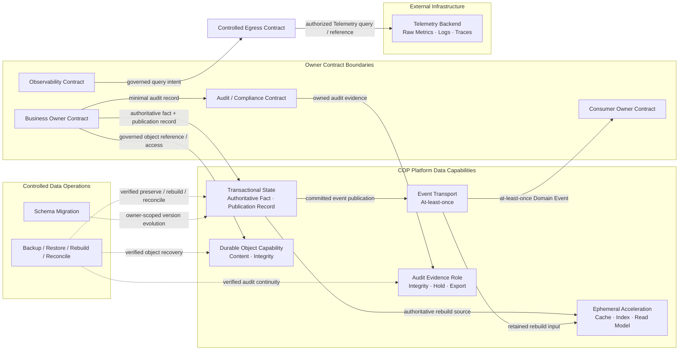

# COP Data Storage Architecture 内容设计

## 1. 目标

将 `COP-INFRA-003` 从初始化骨架补充为可评审的数据存储架构，定义 COP 的 Data Capability、数据 authority、Owner/Tenant 隔离、一致性、事件发布、对象与审计证据、retention/deletion、encryption、backup/restore、migration、reconciliation 和阶段演进边界。

本文只设计架构文档内容。`COP-INFRA-003` 保持 `draft`；本文和目标文档在状态变为 `accepted` 前都不构成 `cop-platform` 的强制实现约束。

## 2. 权威边界

当前相关文档均为 `draft`，只用于设计一致性检查：

- `COP-INFRA-001` 定义 Platform Data Infrastructure Capabilities、Owner Contract Boundary、Preserve/Rebuild/Reconcile/Never infer 恢复分类和三个 Evolution Profile。
- `COP-INFRA-002` 定义 Placement Class、workload identity、Kubernetes failure boundary 和物理共置/拆分约束；本文不固定 database、cache、object、event 或 backup workload 的 placement。
- `COP-INFRA-005` 定义 Private Data Zone、default-deny egress、显式 workload identity 和 no implicit trust；storage reachability 不产生数据 authority。
- `COP-ARCH-003` 定义 Control Plane、Data Plane、authoritative fact、scoped execution grant、fact reporting 和 owning lifecycle Contract。
- `COP-ARCH-004`、`COP-API-001` 与 `COP-API-002` 定义跨边界 Command、Domain Event、version、idempotency、at-least-once、duplicate、out-of-order 和 replay 语义。
- `COP-DOM-003` 定义 Resource Identity、Resource Observation、Resource Context、source/version/freshness 和 Projection recovery；本文不复制其领域模型。
- `COP-DOM-005` 定义 Telemetry Source、Query Intent、result completeness 和 Evaluation Input；raw Telemetry 仍由 Telemetry Backend 拥有。
- `COP-SEC-001` 与 `COP-SEC-003` 分别拥有 security control，以及 Audit/Compliance 的语义、查询、retention、legal hold 和导出边界。
- `COP-INFRA-004` 拥有 Collector、Telemetry pipeline、Metrics/Logs/Traces、query runtime 和 Platform Observability；本文只定义 Telemetry Backend 在统一 Data Capability 对比中的 authority 与 recovery Contract。

Data Capability 只提供 persistence、transport、isolation、encryption、retention 和 recovery。物理持久化、复制、缓存、索引、队列或备份都不能获得领域、Tenant、authorization、lifecycle 或 raw Telemetry authority。

## 3. 方案选择

采用 `Capability Matrix + Authority + Recovery Contract`：

1. 以 Transactional State、Ephemeral Acceleration、Event Transport、Durable Object Capability 和 Telemetry Backend 五类基础 capability 为核心，并把 Audit Evidence 定义为由 Platform Data Capability 承载的受治理 evidence role。
2. 对每类 capability 定义 authority、Owner、Tenant、consistency、classification、retention、encryption、failure 和 recovery Contract。
3. 使用 Owner Contract + Tenant 作为访问、迁移和恢复边界，并复用 Preserve、Rebuild、Reconcile 与 Never infer 分类。
4. 使用 MVP Self-hosted Baseline、Resilient Self-hosted 和 SaaS-ready Isolation 表达物理隔离、冗余和运营能力演进。

未采用 `Data Lifecycle First`，因为按 write、publish、cache、query、backup、restore 和 delete 展开会使同一 capability 的 authority 与 recovery 责任散落在多个章节。未采用 `Owner Storage Cell First`，因为它容易被误读为每个 Owner 或 Tenant 必须拥有独立 database、bucket、broker 或 deployment unit。

## 4. 范围与非目标

本文负责：

- 五类基础 Data Capability 及 Audit Evidence role 的逻辑职责、authority 和 recovery Contract。
- Owner Contract 的私有逻辑存储边界与 Tenant isolation。
- authoritative fact、durable publication record 和 Event Transport 的一致性边界。
- cache、index、read model、derived projection 和临时 coordination 的 Rebuild 语义。
- object content 与 metadata/reference 的分离、完整性和重新授权。
- Audit Evidence 的存储能力、防篡改、integrity、legal hold、导出和恢复边界。
- classification、retention、deletion、encryption、Secret/KMS Reference 和 key isolation。
- backup、restore、schema evolution、migration、reconciliation 和 recovery evidence。
- failure isolation、operational evidence 和三个 Evolution Profile。

本文不负责：

- 固定 PostgreSQL、Redis、VictoriaMetrics、S3、broker、database、cache、object、backup、KMS 或其他产品。
- 定义 table、column、index、partition key、bucket、topic、stream、queue、object key 或 database schema。
- 固定 database、cluster、replica、partition、bucket、broker、region、availability zone 或 failure domain 数量。
- 固定 capacity、retention 数值、RPO/RTO、backup frequency、restore time、replication lag、migration window 或数值 SLO。
- 定义领域 aggregate、API payload、Event schema、Telemetry query language、audit event 字段全集或操作手册。
- 将 raw Telemetry、Cloud/Kubernetes actual state、external identity、Secret/KMS 或 external Delivery Result 转换为 COP-owned authority。
- 用共享数据库、共享 schema、共享事务、cache、queue、snapshot 或物理共置绕过 Owner Contract、Tenant 或 authorization。

## 5. Data Responsibility Model

每项 COP-owned 数据和 COP-managed reference 必须具有可识别的 Owner Contract、Tenant、classification、version、retention、encryption 和 failure semantics。Owner Contract 定义事实语义、访问、保留和删除；Data Capability 执行持久化、隔离、传输、恢复和 evidence，不获得业务 authority。External Infrastructure 数据保留其原生 authority 与 scope，COP 只保存受治理 reference、association 和 reconciliation state。

- 每个 Owner Contract 拥有私有逻辑存储边界。
- MVP 可以共享物理基础设施，但禁止跨 Owner 直接读写、共享 schema authority 或共享业务事务。
- Owner 和 Tenant 是逻辑隔离、迁移与恢复边界，不强制映射为独立 database、cluster、bucket、broker 或 key。
- Query 必须经过 owner Query Contract 或 governed read model；Execution 只通过 Owner Contract 提交 fact。
- Backup/Restore、Migration、Platform Operations 和 Storage operator 不得绕过 Owner Contract 获取普通业务读写权限。
- 数据复制、投影、缓存、导出或恢复不会改变原始 authority、classification、Tenant 或 retention Contract。

## 6. Data Capability Matrix

Transactional State、Ephemeral Acceleration、Event Transport 和 COP-owned Durable Object Capability 属于 COP Management Environment 的 Platform Data Capabilities。Audit Evidence 是由 Transactional State、Durable Object Capability 或等价 Platform Data Capability 承载的受治理 evidence role，不新增独立 data authority。Telemetry Backend 属于 External Infrastructure，即使由 COP operator 部署或物理共置，也保留 raw Telemetry authority。

| Capability | Authority and use | Recovery contract |
| --- | --- | --- |
| Transactional State | 保存 Owner Contract 提交的 authoritative fact、intent、lifecycle、Tenant、version 与 durable publication record；基础设施不拥有事实语义 | `Preserve`：backup/restore 后验证 integrity、schema/Contract version、authority、Tenant 与 publication continuity |
| Ephemeral Acceleration | 提供 cache、index、read model、derived projection 与临时 coordination；不得成为唯一事实来源 | `Rebuild`：从 authoritative state 或保留事件重建，并显式呈现 rebuilding、stale、partial、degraded 或 unavailable |
| Event Transport | 传播已提交 Domain Event 与异步信号；不拥有 event 所描述的事实 | durable publication + at-least-once；处理 duplicate、delay、out-of-order 与 replay，不承诺 exactly-once、全局顺序或分布式事务 |
| Durable Object Capability | 保存受控 object content；Owner 保存 reference、integrity、classification、retention 与 lifecycle | 按 Owner + Tenant 验证 object/reference 关联、integrity、可访问性、retention 与 deletion state；访问时重新授权 |
| Audit Evidence role | 由适用 Platform Data Capability 保存 Audit/Compliance Contract 拥有的结构化 audit evidence；业务 Owner 只提交最小 audit record；不形成第六种基础 capability 或新的 audit authority | `Preserve`：支持防篡改、integrity verification、legal hold、受控导出、restore 和 continuity evidence |
| Telemetry Backend | 保存 raw Metrics、Logs、Traces 并提供外部 query capability；保留 External Infrastructure authority | `Reconcile`：COP 恢复 association、reference、freshness 和 query state，不把 backup、cache 或 projection 提升为 raw Telemetry authority |

## 7. Owner and Tenant Isolation

- 所有 COP-owned 持久化数据和 COP-managed reference 从 MVP 起显式关联 Owner 与 Tenant；单组织部署也不省略 Tenant semantics。External Infrastructure 数据保留其 owning Contract 定义的 account/Tenant/source scope。
- 共享 database、object、event、cache 或 backup infrastructure 时，logical partition、identity、authorization、encryption、backup、restore、migration 和 audit 必须可独立验证。
- 跨 Tenant 默认拒绝；无法确认 Tenant、Owner、scope、classification 或 authorization 时 fail closed。
- 一个 Owner 不直接读取或修改另一个 Owner 的私有存储、schema、cache、index、publication record 或 backup。
- 跨 Owner 数据使用 versioned Command、Domain Event、governed Query Contract 或受治理 reference，不使用共享可写表。
- 物理共置、共享 storage endpoint、database role、service account、namespace 或 network location 不产生 permission inheritance。
- Profile 可以按风险增强 database、partition、key、backup 或 failure-domain 隔离，但不能重建或延后 Tenant 与 Owner 语义。

## 8. Transaction and Publication Model

### 8.1 Local Transaction Boundary

单一 Owner Contract 的本地事务覆盖 authoritative fact 与 durable publication record。事务提交成功表示事实与待发布意图均已持久化；它不表示 Event Transport 已接收、消费者已处理或跨 Owner 流程已完成。

### 8.2 Event Publication

- publication worker 或等价机制从 durable publication record 向 Event Transport 发布。
- Event Transport 使用 at-least-once；生产者和消费者使用 stable event ID、aggregate/version、Tenant、Contract version 与 idempotency key。
- duplicate、delay、out-of-order、replay、publication retry 和 consumer retry 不得改变事实 authority。
- 只有已提交 authoritative fact 才能产生 Domain Event。
- queue、cache、projection、transport acknowledgement、consumer acknowledgement 或未验证 external result 不能成为 authoritative fact 或 `completed` evidence。
- event payload 只携带最小事实视图，不携带 credential、Secret、完整 object content、完整 Provider payload、原始错误或未经授权 Tenant 数据。

### 8.3 Cross-Owner Coordination

跨 Owner 流程通过 versioned Command、Domain Event、idempotency、compensation 和 reconciliation 协调。禁止跨 Owner database transaction、共享 schema authority、直接修改对方数据、exactly-once 假设、全局顺序或同步分布式事务。

Unknown outcome 保持 non-completed。Owning lifecycle Contract 通过 status query、idempotent retry 或 reconciliation 验证外部或下游事实后，才能推进生命周期。

## 9. Ephemeral Acceleration and Governed Read Models

cache、index、read model、derived projection 和临时 coordination 全部属于 `Rebuild`：

- 不得成为唯一事实来源、唯一 recovery source 或独立 business authority。
- 必须能从 authoritative state 或具有适用 retention 的保留事件重建。
- source、Owner、Tenant、schema/Contract version、`as_of`、freshness 和 failure semantics 必须可判定。
- rebuilding、stale、partial、degraded 和 unavailable 必须显式，不得伪装为 complete 或 current。
- rebuild 过程必须幂等，处理 duplicate、out-of-order、replay、version gap 和 source unavailable。
- cache miss、index lag 或 projection failure 不得触发跨 Owner 私有存储旁路读取。
- acceleration capability 的丢失可以导致性能下降或功能降级，但不得静默改变 authoritative fact。

## 10. Durable Object Model

- Object content 与 metadata/reference 分离。Owner Contract 保存受治理 reference、integrity、classification、retention、lifecycle 和必要的 source/version。
- COP-owned Durable Object Capability 保存 content，不获得领域 ownership，也不解释 object 的业务完成状态。External Object Capability 保留 External Infrastructure authority，只能经 owning Contract、Adapter Contract 和 Controlled Egress 访问。
- 每次 object create、read、replace、export 或 delete 都重新验证 identity、Tenant、Owner、scope、classification 和 authorization。
- object/reference 关联必须通过 stable object identity、integrity evidence 和 version 验证；dangling、mismatched 或 unverifiable reference 显式隔离。
- ordinary Domain Event、audit record、log、cache 或 backup metadata 不嵌入完整 object content 或 credential material。
- object unavailable、integrity mismatch、authorization unknown 或 deletion state 不可判定时 fail closed，并返回明确 failure semantics。
- 本文不固定 object API、bucket、object key、multipart、versioning、replication 或 lifecycle product feature。

## 11. Audit Evidence Model

- 业务 Owner 产生最小、结构化 audit record，包含适用的 actor/source、target、Tenant、scope、action、result、time、version 和 correlation context。
- Audit/Compliance Contract 拥有 audit semantics、查询、retention、legal hold 和受控导出。
- 承载 Audit Evidence role 的 Platform Data Capability 提供 append/integrity、防篡改、isolation、encryption、backup/restore、export 和 continuity evidence，但不获得业务 authority，也不因此形成独立的基础 capability。
- ordinary operational log、metric 或 trace 不自动成为 Audit；Operational Telemetry 也不替代 Audit。
- audit record 不携带完整 credential、Secret、敏感 payload、完整 object content 或未经授权 Tenant 数据。
- legal hold、retention conflict、export 和 restore action 必须可审计，且无法确认 policy 或 integrity 时 fail closed。

## 12. Classification, Retention, Deletion and Legal Hold

- Owner Contract 定义 data classification、retention、deletion、access 和 lifecycle semantics；Storage Capability 执行规则并提供可验证 evidence。
- classification 与 retention 传播到 event、object、projection、backup、export 和 audit evidence，不因复制、转换或物理共置降低保护级别。
- deletion 必须区分 logical expiry、access withdrawal、pending physical deletion、deleted、held 和 failed 等可判定状态。
- legal hold、audit retention、external-authority reference 或未完成 reconciliation 可以阻止物理删除，但必须记录 reason、scope、owner、Tenant、state、version 和 release condition。
- 已过期、待删除或 held 数据不得继续表现为 active/current authoritative fact，除非 owning Contract 明确定义其可见性。
- cache、index、read model、event retention、object content、backup 和 export 必须遵循源数据 deletion/hold Contract，并处理延迟清理 evidence。
- 本文不规定具体 retention duration、purge interval、storage tier 或 legal jurisdiction rule。

## 13. Encryption, Key and Secret Boundary

- 所有 COP-owned 持久化数据和 COP-managed reference 按 classification 加密；transport 与 storage protection 不替代 authorization。External Infrastructure 数据遵循其 owning Contract 的 classification 与 encryption boundary。
- key scope 至少能够按 capability、Owner 和 Tenant 风险边界演进。MVP 可共享底层 KMS capability，但禁止共享高权限 credential 或无法区分使用者的 key access。
- Resilient/SaaS-ready Profile 可按风险拆分 key、rotation、backup 和 failure domain，不改变 Owner/Tenant authority。
- backup、event、object、projection、export 和 audit evidence 延续源数据的 classification 与 encryption boundary。
- credential 和 Secret 只通过受控 Secret/KMS Reference 使用，不进入普通数据、Domain Event、cache、object metadata、backup metadata、log、metric、trace 或 read model。
- key unavailable、revoked、expired、mismatched 或 authorization unverifiable 时 fail closed；dependency failure 与 explicit authorization denial 必须区分。
- key rotation、re-encryption、revocation 和 recovery 保留 owner、scope、version、progress、failure 和 audit evidence。
- 本文不规定 cipher、key size、KMS product、key hierarchy、rotation interval 或 hardware boundary。

## 14. Backup, Restore and Recovery Model

### 14.1 Recovery Unit

`Owner Contract + Tenant` 是最小逻辑恢复单元。共享基础设施 snapshot 只是物理 recovery input，不能自动视为所有 Owner 的一致业务恢复点，也不能授予跨 Owner 访问。

### 14.2 Backup Contract

Backup 必须记录或关联：

- source capability、Owner、Tenant 和 authority class。
- schema/Contract version、classification 和 encryption context。
- time boundary、integrity、retention、legal hold 和 dependency。
- authoritative fact、publication continuity、object/reference 和 audit continuity 所需 evidence。

Backup metadata 不包含 credential、Secret、完整敏感 payload 或未授权 Tenant 数据。

### 14.3 Restore Verification

Restore 后依次验证：

1. data、object 与 audit evidence integrity；
2. schema/Contract version compatibility；
3. Owner、Tenant、classification、encryption 与 authority boundary；
4. authoritative fact 与 durable publication continuity；
5. cache、index、read model 和 projection rebuild；
6. External Infrastructure reference、actual state、Telemetry association 和 external Delivery Result reconciliation。

Restore success 只证明存储内容通过恢复验证，不自动证明业务状态 `completed`、外部实际状态一致、事件消费者已追平或 query result 完整。

## 15. Schema Evolution and Migration

- 每个 Owner Contract 独立拥有自己的 schema/Contract version；Storage Capability 不拥有跨 Owner global schema。
- 使用 compatibility check 与 expand-migrate-contract 或等价分阶段方法支持版本共存。
- migration 必须可暂停、幂等重试、回滚或 forward recovery，并保留 owner、Tenant、source/target version、progress、failure scope、integrity 和 validation evidence。
- migration 不跨 Owner 建立原子事务；Owner 之间通过 versioned Contract 隔离升级节奏。
- incompatible reader/writer、unknown version、partial migration 或 validation failure 必须显式隔离，不得通过 last-write-wins 或静默转换隐藏。
- migration 完成必须验证 authoritative state、publication record、projection rebuild、object/reference、retention、encryption 和 audit continuity。
- 本文不规定 migration tool、DDL、maintenance window、batch size、parallelism 或 cutover timing。

## 16. Telemetry Backend Boundary

- Telemetry Backend 保存 raw Metrics、Logs、Traces，并提供 External Infrastructure query capability。
- Observability Contract 拥有 Telemetry Source、Query Intent、result completeness 和 Evaluation Input；不拥有 raw Telemetry storage。
- `COP-INFRA-004` 拥有 Collector、pipeline、transform、query runtime、Platform Observability 和 Telemetry product/deployment design。
- COP 只保存受治理 Telemetry reference、association、query state、freshness 和必要结果；cache、export、backup 或 projection 不改变 raw Telemetry authority。Observability Contract 对 Telemetry Backend 的调用只通过 Controlled Egress，不因 storage reference 或网络可达性获得查询授权。
- Telemetry Backend unavailable、partial、stale 或 degraded 时必须保留相应结果语义，不用 COP cache 或历史结果伪装 complete/current。
- Telemetry retention、deletion 和 external lifecycle 由其 owning external Contract 决定；COP 只管理自身 reference、association 与 reconciliation state。

## 17. Failure, Degradation and Recovery Semantics

- Transactional State unavailable 时禁止伪造成功；commit outcome 不可确认时返回 `unknown`，由 Owner reconciliation 确认。
- publication backlog、duplicate、delay、out-of-order、replay 或 consumer failure 不改变已提交事实 authority；queue、retry 和 batch 必须有界。
- cache、index、read model 或 projection failure 可以降级或重建，但显式返回 rebuilding、stale、partial、degraded 或 unavailable。
- object content、reference、integrity、classification、authorization 或 deletion state 任一无法确认时 fail closed。
- Audit Evidence integrity、retention、legal hold 或 export authorization 无法确认时 fail closed，不以 ordinary log 替代。
- backup、restore、migration、deletion、legal hold、key dependency 和 reconciliation failure 按 Owner、Tenant、capability 与 operation 隔离。
- Telemetry Backend failure 不改变 raw Telemetry authority，也不把 partial/stale query result 提升为 complete。
- unknown、partial、stale、degraded、unavailable、rebuilding、recovering、held、isolated 和 failed 不得伪装为 healthy、active、complete 或 success。

## 18. Operational Signals and Audit Boundary

Data Capability 必须提供可关联的运行证据：

- capability health、dependency、saturation、capacity constrained 和 failure-domain state。
- Owner/Tenant partition、authorization denial、cross-boundary rejection 和 isolation state。
- transaction outcome、publication pending/lag/retry、queue backlog 和 consumer progress。
- cache/index/read model freshness、rebuild progress、version gap 和 degraded state。
- object/reference integrity、access denial、retention、deletion 和 dangling reference。
- backup coverage、integrity、restore result、restore drill 和 publication continuity。
- migration source/target version、progress、failure scope、rollback/forward recovery 和 validation result。
- legal hold、audit integrity、export、key dependency、rotation 和 reconciliation state。

Operational Telemetry 不替代 Audit，也不得泄漏 credential、Secret、完整 sensitive payload、private schema、object content 或未经授权 Tenant 数据。关键 storage operation 产生结构化 audit record，但业务语义仍由 owning Contract 或 Audit/Compliance Contract 拥有。

## 19. Evolution Profiles

Profile 复用 `COP-INFRA-001` 的名称和持续不变量：

| Evolution profile | Data capability and isolation | Invariants and entry evidence |
| --- | --- | --- |
| MVP Self-hosted Baseline | capability 可共享 physical database、cache、event、object、backup 或 KMS infrastructure；提供基础 backup/restore、rebuild、reconciliation 与 bounded publication | Owner/Tenant partition、authority、classification、encryption、access、audit、failure signal 和 recovery evidence 可验证；不预设 physical topology |
| Resilient Self-hosted | 按 risk、compliance、load、observed failure 和 operational maturity 拆分 capability/failure domain，增强 redundancy、restore drill、migration safety、publication continuity 与 key recovery | physical split 不改变 Owner/Tenant authority、Contract、retention 或跨 capability direction；entry 由 failure、restore、capacity 和 compliance evidence 驱动 |
| SaaS-ready Isolation | 增强 Tenant、Owner、partition、key、backup、restore、event 与 regional isolation，可按风险拆分 storage unit | 不依赖 cross-region global transaction、global order、shared privileged credential、implicit Tenant trust 或 single recovery point；保留自托管安全与恢复不变量 |

Profile 表达 data governance capability maturity，不是产品套餐、环境名称或固定 topology。进入下一 Profile 不依据发布时间、预设 Tenant 数或固定规模。

## 20. 关系图设计

目标文档使用一张 Mermaid `flowchart` 表达逻辑 authority、publication、rebuild、object、audit 和 Telemetry 流向：

箭头表示受治理 Contract、authority-preserving data flow 或受控 operation，不表示共享可写存储、跨 Owner 事务、部署拓扑或直接私有数据访问。Backup/Restore 与 Migration 只能在 Owner/Tenant scope 内操作并产生验证 evidence，不能成为绕过 Owner Contract 的数据入口。Audit Evidence Role 由适用 Platform Data Capability 承载，不表示独立产品或部署单元。Telemetry Backend 始终保留 raw Telemetry authority，并只通过 Controlled Egress 接受 COP 查询。

## 21. 专项文档分工

| Document | Owns | Must preserve from Data Storage Architecture |
| --- | --- | --- |
| `COP-INFRA-001` Infrastructure Overview | deployment zone、Data Capability role、recovery class 与 Evolution Profiles | Preserve/Rebuild/Reconcile/Never infer、no new authority、Owner Contract Boundary 与 product neutrality |
| `COP-INFRA-002` Kubernetes Topology | Placement Class、namespace、workload identity、resource 与 host-level isolation | logical data capability 不强制映射固定 workload、cluster、node pool 或 topology |
| `COP-INFRA-005` Network and Ingress | reachability、ingress、egress、Managed Session 与 network trust | Private Data 无 bypass；network identity/location 不产生 storage authority |
| `COP-ARCH-003` Control Plane and Data Plane | intent、execution grant、fact reporting 与 lifecycle authority | authoritative fact、accepted/completed 区分、unknown outcome 与 Owner submission path |
| `COP-ARCH-004` Integration Architecture | Command/Event/Webhook/Provider Contract 与 delivery semantics | durable publication、at-least-once、idempotency、version、replay 与 failure isolation |
| `COP-DOM-003` Resource Metadata Domain | Resource Identity、Observation、Relationship 与 Resource Context | storage 不拥有领域模型；projection 可 Rebuild，source/version/freshness 保留 |
| `COP-DOM-005` Observability Domain | Telemetry Source、Query Intent、result completeness 与 Evaluation Input | Telemetry Backend 保留 raw authority；storage 不拥有 Observability domain fact |
| `COP-SEC-001` Security Architecture | identity、authorization、Secret/KMS、encryption 与 security control | classification、key boundary、Secret Reference、least privilege 与 fail closed |
| `COP-SEC-003` Audit and Compliance | audit semantics、query、retention、legal hold 与 export | Audit Evidence role 由适用 Platform Data Capability 提供 integrity、isolation、storage 与 recovery，不获得 audit authority 或新增基础 capability |
| `COP-INFRA-004` Observability Stack | Collector、Telemetry pipeline、backend/query runtime 与 Platform Observability | raw Telemetry external authority、freshness、partial/degraded 和 no authority transfer |

改变 Data Capability 分类、Owner/Tenant authority、fact/publication transaction boundary、recovery class、Telemetry authority 或 Evolution Profile 不变量时，先创建或更新 RFC；RFC 被接受后关联 ADR，并同步所有受影响的权威文档。

## 22. Validation Strategy

- **Capability authority：** 验证五类基础 capability 的 owner、authority、允许访问与 recovery Contract 可独立识别，并验证 Audit Evidence 只是受治理 role。
- **Owner isolation：** 验证每个 Owner 拥有私有逻辑存储边界，没有跨 Owner direct read/write、shared schema authority 或 shared transaction。
- **Tenant isolation：** 验证 MVP 起所有持久化、event、object、backup、restore、migration 与 audit evidence 都保留 Tenant scope。
- **Fact publication：** 验证 authoritative fact 与 durable publication record 的本地原子性，以及 at-least-once、duplicate、out-of-order 和 replay handling。
- **Rebuild：** 验证 cache、index、read model 和 projection 可从 authoritative state 或保留事件完全重建，并显式报告 freshness/failure。
- **Object：** 验证 content/reference 分离、integrity、classification、retention、deletion state 和每次访问重新授权。
- **Audit：** 验证业务 Owner 提交最小 record，Audit/Compliance 拥有语义，Storage 只提供防篡改、integrity、hold、export 和 recovery。
- **Lifecycle：** 验证 classification、retention、deletion、legal hold 和 source-to-copy policy propagation。
- **Encryption：** 验证 capability/Owner/Tenant key boundary 可演进，Secret/KMS Reference 不进入普通数据和 metadata。
- **Recovery：** 验证 Owner + Tenant recovery unit、backup metadata、restore integrity、publication continuity、rebuild 和 external reconciliation。
- **Migration：** 验证 owner-scoped schema/version、compatibility、pause/retry/rollback/forward recovery 和 version coexistence。
- **Telemetry：** 验证 Telemetry Backend 保持 External Infrastructure raw authority，COP cache/backup/projection 不伪装 complete Telemetry。
- **Profile：** 验证三个 Profile 只增强 isolation、redundancy、recovery 和 operational capability，不改变 authority、Contract、Tenant、retention 或 security boundary。

## 23. Success Criteria

- 读者可以判断每类数据由哪个 Contract 拥有、由哪个 capability 保存、如何访问、怎样失败、如何恢复、迁移、保留和删除。
- Transactional State、Ephemeral Acceleration、Event Transport、Durable Object 与 Telemetry Backend 五类基础 capability 的 authority 和 recovery 语义不会混淆；Audit Evidence role 不被误读为新的基础 capability 或 audit authority。
- Owner/Tenant isolation 从 MVP 起成立，物理共享不会产生跨边界访问、共享 schema authority 或共享事务。
- authoritative fact 先于 Domain Event；publication、transport 和 consumer acknowledgement 都不被解释为 business completion。
- cache、index、read model 和 projection 不成为唯一事实来源，rebuild/freshness/failure 可验证。
- object/reference、audit evidence、retention/deletion/legal hold、encryption/key、backup/restore 和 migration 具有明确 Contract。
- Telemetry Backend 保留 raw Telemetry authority，`COP-INFRA-004` 继续拥有 pipeline 和 query runtime。
- 三个 Evolution Profile 只增强 isolation 与 operational capability。
- 文档保持 `draft`，不创建 RFC/ADR，不引入固定产品、schema、topology、capacity、retention 数值、RPO/RTO 或操作手册。

## 24. Constraints

- 只有 `accepted` 权威文档和 ADR 才能形成实现约束；本文和目标文档在 `draft` 状态下只用于评审。
- Data Capability 不产生 domain、Tenant、authorization、lifecycle、external actual state、raw Telemetry 或 audit semantics authority。
- 所有 COP-owned 持久化数据、event、object、backup、restore、migration、export、audit evidence 和 COP-managed external reference 保留适用 Owner、Tenant、classification、version 与 encryption context；External Infrastructure 原始数据保留其 owning Contract 定义的 scope 与 authority。
- 单一 Owner 的本地事务只覆盖 authoritative fact 与 durable publication record；跨 Owner 不使用共享事务。
- cache、index、read model、projection、queue、snapshot、backup 或 export 不得成为新的 authority 或 Owner Contract bypass。
- backup/restore、migration、deletion、legal hold、key operation 和 reconciliation 必须有界、可审计、可验证并按 Owner/Tenant/capability 隔离。
- unknown、partial、stale、degraded、unavailable、rebuilding、recovering、held、isolated 和 failed 不得伪装为 complete、active 或 success。
- 不得在本文或实施任务中固定产品、schema、table、index、partition、bucket、topic、replica、region、topology count、capacity、retention、RPO/RTO 或数值 SLO。

## 25. Quality Attributes

- **Boundary clarity：** 每项 data、copy、event、object、audit evidence、backup 和 projection 的 Owner、Tenant 与 authority 可识别。
- **Consistency：** owner-local transaction、durable publication、idempotency、version、duplicate/out-of-order/replay handling 和 no shared transaction。
- **Reliability：** bounded queue/retry、failure isolation、explicit unknown/partial/degraded、reconciliation 和 publication continuity。
- **Recoverability：** Preserve、Rebuild、Reconcile、backup/restore、migration recovery 与 verification evidence 可执行。
- **Security：** classification、least privilege、Tenant partition、encryption、key boundary、Secret Reference、integrity 与 fail closed。
- **Auditability：** storage、backup、restore、migration、retention、deletion、hold、export、key 和 reconciliation operation 可关联。
- **Scalability：** capability、Owner、Tenant、partition 和 failure domain 可按 evidence 演进，不依赖 global transaction 或 order。
- **Portability：** capability 与 Contract 不绑定 database、cache、broker、object、backup、KMS、cloud provider 或 deployment topology。
- **Evolvability：** owner-scoped schema/version、compatibility 与 staged migration 支持独立升级。

## 26. Implementation Guidance

目标文档保持 product-neutral，使用 Chinese prose、English filename 和 established English technical terms。实现仓库只能在本文及其依赖约束变为 `accepted` 后将其作为实现依据。

实现时先识别 data owner、Tenant、capability role、authority class、classification、consistency、retention、encryption、failure 和 recovery Contract，再选择 database、cache、event transport、object、backup 或 KMS implementation。不能根据 capability matrix 或关系图生成固定 service、database、cluster、bucket、topic、region 或 deployment topology。

实现不得把 database permission、shared schema、cache hit、queue acknowledgement、snapshot、object existence、backup success、restore readability、Telemetry cache 或 network reachability 解释为 business authorization、authoritative fact 或 `completed`。具体 schema、partition、capacity、retention、RPO/RTO、replication、backup frequency、migration batch、key hierarchy 和 product mapping 由 `cop-platform` 或后续经过治理的专项设计决定。

## 27. References

- [COP Infrastructure Overview](../../infrastructure/infrastructure-overview.md)
- [COP Kubernetes Topology](../../infrastructure/kubernetes-topology.md)
- [COP Network and Ingress](../../infrastructure/network-and-ingress.md)
- [COP Control Plane and Data Plane](../../architecture/control-plane-data-plane.md)
- [COP Integration Architecture](../../architecture/integration-architecture.md)
- [COP API Design Guidelines](../../api/api-design-guidelines.md)
- [COP Event Contracts](../../api/event-contracts.md)
- [COP Resource Metadata Domain](../../domains/resource-metadata-domain.md)
- [COP Observability Domain](../../domains/observability-domain.md)
- [COP Security Architecture](../../security/security-architecture.md)
- [COP Audit and Compliance](../../security/audit-and-compliance.md)
- [COP Observability Stack](../../infrastructure/observability-stack.md)
- [COP Data Storage Architecture](../../infrastructure/data-storage.md)
