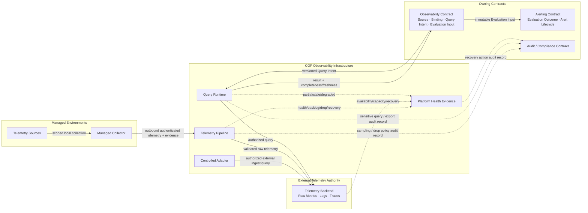

# COP Observability Stack 内容设计

## 1. 目标

将 `COP-INFRA-004` 从初始化骨架补充为可评审的 Observability Stack 架构文档，定义 Collector/Adapter、Telemetry Pipeline、Telemetry Backend、Query Runtime、Platform Health Evidence 的职责，以及 Managed-Environment Observability 与 Platform Observability 的受治理数据路径、隔离、失败、恢复、安全和演进边界。

本文只设计架构文档内容。`COP-INFRA-004` 保持 `draft`；本文和目标文档在状态变为 `accepted` 前都不构成 `cop-platform` 的强制实现约束。

## 2. 权威边界

当前相关文档均为 `draft`，只用于设计一致性检查：

- `COP-ARCH-002` 定义 Experience、Control Plane、Data Plane、Platform Operations 和跨切面能力的逻辑责任；Observability Stack 不改变领域 owner 或业务完成语义。
- `COP-ARCH-003` 定义 Managed Connector/Collector、outbound authenticated session、scoped execution grant 和 fact reporting；本文不重新定义控制连接或任务生命周期。
- `COP-ARCH-004` 与 `COP-API-002` 定义异步 Contract、at-least-once、duplicate、out-of-order、replay 和版本语义；Telemetry pipeline 不承诺 exactly-once、全局顺序或分布式事务。
- `COP-DOM-003` 拥有 Resource Identity 与 Resource Context；Telemetry pipeline 不直接生成、合并或修改 Resource 主数据。
- `COP-DOM-005` 拥有 Telemetry Source、Signal Binding、Query Intent、result completeness 和 Evaluation Input；Infrastructure 只拥有 Collector、pipeline、backend/query runtime 与 Platform Observability runtime。
- `COP-DOM-006` 拥有 Rule、Evaluation outcome、Alert Instance 和 notification orchestration；Query Runtime 不生成 Alert outcome 或 Alert lifecycle。
- `COP-INFRA-001` 定义 Telemetry Backend 的 External Infrastructure authority、Managed Environment、Platform Operations、恢复分类和三个 Evolution Profile。
- `COP-INFRA-002` 定义 Collector placement、workload identity、资源和故障边界；本文不固定 Deployment、namespace、node、cluster 或 region。
- `COP-INFRA-003` 定义 raw Telemetry authority、存储与生命周期边界，以及 COP-managed reference 的 Reconcile 语义。
- `COP-INFRA-005` 定义 Controlled Egress、Managed Session、Telemetry/Bulk traffic、backpressure 和 no implicit trust；本文不固定 protocol、port、proxy 或 NetworkPolicy。
- `COP-SEC-001` 拥有 identity、authorization、Secret/KMS、encryption 和 security control；本文只定义 Telemetry 数据路径必须保留的安全不变量。
- `COP-SEC-003` 拥有 Audit/Compliance 语义、retention、legal hold 和 export；ordinary Metrics、Logs、Traces 不自动成为 Audit Evidence。

Telemetry Backend 始终拥有 raw Metrics、Logs、Traces 及 query-engine internals 的 authority。由 COP operator 部署、与 COP 物理共置或被 COP 统一运维，不会把 raw Telemetry authority 转移给 Observability Domain、Alerting、Platform Operations 或其他 COP owner。

## 3. 方案选择

采用 `Capability + Data Path + Evidence Contract`：

1. 以 Collector/Adapter、Telemetry Pipeline、Telemetry Backend、Query Runtime、Platform Health Evidence 五类逻辑角色为核心。
2. 使用 Collection/Ingestion、Governed Query/Evaluation Input、Platform Health Evidence 三条路径表达输入、输出、authority 和 failure semantics。
3. Managed-Environment Observability 与 Platform Observability 共用逻辑 capability 模型，但 Source、Tenant、pipeline、storage/query scope、authorization 和故障传播必须可独立验证。
4. 允许物理共享 capability；共享不产生 authority、Tenant、permission、retention 或 failure inheritance。
5. 沿用 MVP Self-hosted Baseline、Resilient Self-hosted、SaaS-ready Isolation 三个 Evolution Profile，只增强隔离、冗余、扩展、恢复和治理能力。

未采用“完全双栈模型”，因为从 Collector 到 Backend 强制两套独立部署会过早固定拓扑，也无法证明所有风险都需要物理隔离。未采用“纯生命周期模型”，因为按 collect、process、store、query 展开会使同一 capability 的 authority、security 和 recovery 职责分散。未采用“Backend-first 产品模型”，因为产品组件不能成为领域或基础设施不变量。

## 4. 范围与非目标

本文负责：

- 五类 Observability infrastructure role 的责任、输入、输出、authority 和 recovery Contract。
- Managed-Environment Observability 与 Platform Observability 的共享能力和隔离边界。
- Managed Collector outbound path 与 Controlled Egress Adapter query path。
- Metrics、Logs、Traces 的采集、验证、最小化、脱敏、规范化、过滤、路由、采样、缓冲、存储和查询边界。
- `at-least-once`、bounded buffer/retry、backpressure、duplicate、delay、out-of-order、drop、sampling、throttling 和 freshness degradation。
- Query Intent、Query Runtime、query result 与 immutable Evaluation Input 的边界。
- Platform Health Evidence 的最小独立路径、blind spot 和 recovery evidence。
- Tenant/Source/signal/pipeline/query 隔离、classification、authorization、Secret/KMS Reference 和 export control。
- raw Telemetry 与 COP-owned metadata/reference/Evaluation Input 的 retention、deletion、legal hold 和 reconciliation 边界。
- failure/degradation、Resume/Replay/Reconcile/Never infer 和三个 Evolution Profile。

本文不负责：

- 固定 Collector、Metrics、Logs、Traces、Backend、Query、Dashboard 或 Alerting 产品。
- 固定 service、process、Deployment、namespace、node、cluster、region、replica 或 failure-domain 数量。
- 固定 protocol、port、endpoint、certificate、payload schema、attribute set、label、index、partition 或 storage schema。
- 固定 capacity、retention 数值、sampling ratio、queue size、batch size、timeout、retry 次数、RPO/RTO 或数值 SLO。
- 定义 Resource Identity、Telemetry Source、Signal Binding、Query Intent、Evaluation Input、Rule、Alert outcome 或 Alert lifecycle 的领域模型。
- 定义 dashboard 内容、告警规则、查询语言、runbook、Helm values 或生产部署手册。
- 把 raw Telemetry、ordinary operational log、query result、cache、health signal 或 Dashboard 状态提升为领域事实、Audit Evidence 或业务完成状态。

## 5. Observability Responsibility Model

Observability Stack 同时服务两类来源，但不合并其 authority：

- **Managed-Environment Observability：** 客户或目标环境的 Source、Binding、Query Intent、completeness 与 Evaluation Input 由 Observability Contract 拥有。Managed Collector 只执行受授权采集；Adapter 只经 Controlled Egress 调用既有 Telemetry Backend。
- **Platform Observability：** Infrastructure 对 COP 自身 runtime 提供 health、dependency、processing、freshness、backlog、drop、error 和 recovery evidence。Platform Operations 可以观察和运维 capability，但不获得业务、Tenant、authorization、lifecycle、Alert 或 raw Telemetry authority。

两类来源可以共享物理 Collector、pipeline、Backend 或 Query capability，但每段数据路径必须保留可识别的 Source、Tenant、scope、signal type、time、version、classification 和 provenance。共享 capability 必须能够独立拒绝、限流、降级、恢复和审计每个边界。

“没有返回 Telemetry”不能直接解释为“没有异常”。系统必须能区分 source silence、collection gap、pipeline drop、Backend unavailable、query partial、authorization denial 与真实零值结果。

## 6. Capability Model

| Capability role | Responsibility | Must not own or infer | Recovery contract |
| --- | --- | --- | --- |
| Collector / Adapter | 验证 Source、identity、Tenant、scope 与 task authorization；采集、最小化、脱敏、batch、checkpoint，并报告 health/freshness | 不扩大 scope，不生成 Resource、Alert 或业务事实，不复制 credential | `Resume` 或 `Reconcile`；验证 checkpoint、gap、version、scope 与 source availability |
| Telemetry Pipeline | 规范化、过滤、路由、受治理采样、有界缓冲、retry/backpressure 和 provenance preservation | 不修正领域语义，不跨 Tenant 合并 authority，不静默 drop，不承诺 exactly-once | `Replay` 或 `Resume`；保留 stable identity、Tenant、time、version 与 drop/gap evidence |
| Telemetry Backend | 保存 raw Metrics、Logs、Traces，执行其 owning Contract 的 retention/deletion/hold/export，并提供 external query capability | 不拥有 Query Intent、Resource、Alert、Audit 或业务完成语义 | `Reconcile`；恢复 association、freshness、query state，不以 COP cache 替代 raw authority |
| Query Runtime | 验证 Query Intent、Tenant、scope、time range 与 authorization；执行查询并返回 `as_of`、freshness、completeness 和 failure semantics | 不生成 Rule evaluation、Alert outcome、completed 或 authorization decision | `Reconcile`；验证 Backend、query version、coverage、freshness 与 result integrity |
| Platform Health Evidence | 暴露 component health、dependency、backlog、drop、blind spot、recovery 和自身可见性 | 不替代 Audit，不成为业务 authority，不因缺少 Telemetry 声称 healthy | `Never infer` + 最小 evidence continuity；主 pipeline 故障时仍说明不可见范围与恢复进度 |

这五项是逻辑责任角色，不表示五个固定产品、service、process、cluster 或 deployment unit。一个实现可以合并或拆分角色，但必须保持职责、identity、access、failure 和 evidence 可独立验证。

## 7. Collection and Ingestion Paths

### 7.1 Managed Collector Path

Managed Collector 位于受管环境，只主动建立 outbound authenticated session。它获取限时、限 Tenant、限 Source、限 signal/operation 的 scoped collection task，采集本地 Telemetry 并回报 checkpoint、progress、freshness、failure 与 recovery evidence。

- session identity 与 task authorization 独立验证；连接建立不表示当前任务被授权。
- Collector 不接受未受治理的 inbound control connection，不持有跨 Tenant credential，不修改 Source 或客户 workload lifecycle。
- source discovery 不能自动扩大 task scope；新 Source 需要重新授权或更新 owning Contract。
- Collector disconnect、checkpoint gap、local buffer pressure 和 source unavailable 必须按 managed environment、connection、Source 与 Tenant 隔离。

### 7.2 Controlled Adapter Path

对于已有 Telemetry Backend 或无需本地 Collector 的 Source，Adapter 经 Controlled Egress 执行受控 query/poll/stream。Adapter Contract 必须限定 external endpoint reference、identity、Tenant/account/source scope、allowed operation、time boundary、version 和 authorization context。

- network reachability、stored endpoint、cached result 或 successful authentication 不产生 query authorization。
- Adapter 不复制长期 credential；只使用受控 Secret/KMS Reference。
- external partial/stale/degraded/unavailable 必须保留，不能通过 cache 或历史结果伪装 complete/current。

### 7.3 Platform Telemetry Path

COP runtime 产生的 Metrics、Logs、Traces 进入相同逻辑 capability 模型，但使用独立 Source identity、classification、pipeline/query scope、access policy 和 failure evidence。Platform Telemetry 不得携带普通业务 payload、credential、Secret 或未经授权的跨 Tenant 内容。

## 8. Transform and Provenance Boundary

Collector 与 Telemetry Pipeline 只允许执行：

- schema/Contract validation；
- timestamp、unit、name 或 encoding 的受治理规范化；
- classification-driven filtering、redaction 和 minimization；
- Tenant/Source/signal/time/version/provenance 的补全或验证；
- routing、batching、compression、bounded buffering 和 governed sampling；
- 明确、可审计且版本化的 enrichment reference。

转换不得：

- 生成或修改 Resource Identity、Resource Context、Rule、Alert outcome、Alert Instance 或业务 lifecycle；
- 将未知 Source、Tenant、scope、time、version 或 provenance 静默映射到默认值；
- 使用 last-write-wins 隐藏 version conflict、late data 或 incompatible schema；
- 将 Secret、credential、完整敏感 payload 或未经授权 Tenant 数据复制到 attribute、label、body、metadata、log 或 error；
- 以 drop、sampling 或 normalization 改变 raw authority、classification、retention 或 legal hold。

## 9. Delivery, Backpressure, and Loss Semantics

Telemetry pipeline 使用 `at-least-once` 和有界资源模型：

- batch、queue、buffer、retry、concurrency 和 resource consumption 必须有界。
- duplicate、delay、out-of-order、replay 和 late arrival 是正常可处理情况；不能假设 exactly-once 或全局顺序。
- overload 至少按 Tenant、Source、signal type、pipeline stage、Backend dependency 和 managed environment 隔离。
- Telemetry/Bulk traffic 不得阻塞 Command control path、Managed Session authorization 或最小 Platform Health Evidence。
- sampling、drop、throttling、queue eviction、version rejection、authorization denial 和 Backend rejection 都必须产生可关联 evidence。
- 任何数据损失、覆盖缺口或 freshness degradation 必须传播到 query completeness 和 Platform Health Evidence。

未确认的 delivery outcome 保持 `unknown`。connection success、buffer acceptance、pipeline acknowledgement、Backend connectivity 或 queue drain 都不等于端到端数据连续、查询完整或 recovery success。

## 10. Telemetry Backend and Lifecycle Boundary

Telemetry Backend 保存 raw Metrics、Logs、Traces，并执行其 owning external Contract 的 classification、retention、deletion、legal hold、encryption、export 和 recovery。COP 只管理自身的 Source、Binding、Query Job、reference、association、freshness、reconciliation state 和适用的 Evaluation Input。

- raw Telemetry lifecycle 不因 COP operator 部署 Backend 而转移给 Observability Domain。
- COP 通过 reference/status/query/reconciliation 验证 external retention、deletion、hold 和 availability state，不直接推断。
- cache、projection、export、backup 或 query result 延续源 classification、Tenant、scope、retention 和 deletion Contract，不降低保护级别。
- Evaluation Input 是 Observability Contract 拥有的 immutable governed fact，具有独立的 version、classification、retention 和 audit context；它不是 raw Telemetry 的完整副本。
- raw Telemetry unavailable、deleted、held、partial 或 retention state unknown 时，对应查询与 Evaluation Input generation 必须显式失败或降级。

## 11. Governed Query and Evaluation Input

Observability Contract 提交 versioned Query Intent；Query Runtime 只负责验证和执行。每次查询至少绑定 identity、Tenant、Source/signal scope、purpose、time range、query/Contract version、authorization context 和 correlation context。

Query result 必须包含适用的：

- `as_of` 与 covered time range；
- Source、Tenant、scope 和 query version；
- freshness 与 observed lag；
- `complete`、`partial`、`stale`、`degraded` 或 `unavailable`；
- missing source、collection gap、drop/sampling、Backend failure、authorization filtering 和 version mismatch evidence；
- provenance 与 result integrity reference。

只有 Observability Contract 可以基于受治理结果形成 immutable Evaluation Input。Alerting 只消费该输入并拥有后续 evaluation outcome 与 Alert lifecycle。Query Runtime、Backend、Collector、Dashboard 或 cache 都不能直接生成 Alert outcome、completed evidence 或业务事实。

## 12. Platform Health Evidence

Platform Observability 必须提供独立于普通业务查询的最小 health/evidence path，但不要求完全独立产品或技术栈。该路径覆盖：

- Collector/Adapter identity、connection、checkpoint、source reachability 和 local pressure；
- pipeline throughput、queue/backlog、retry、drop、sampling、throttling、version rejection 和 dependency；
- Backend ingestion/query availability、capacity constrained、latency、retention/deletion operation 和 recovery state；
- Query Runtime authorization rejection、partial/stale/degraded、coverage 和 result integrity；
- evidence path 自身的 heartbeat、last-known-good、blind spot、unavailable scope 和 recovery progress。

主 pipeline 故障时，最小路径仍需说明从何时开始不可见、影响哪些 Tenant/Source/signal/pipeline stage、已知的 drop/gap、当前恢复阶段及哪些结论无法判断。缺少 operational Telemetry 不得解释为 component healthy、无 backlog、无 drop 或业务正常。

ordinary operational Metrics、Logs、Traces 不自动成为 Audit Evidence。关键配置、授权、敏感查询、export、retention/deletion/hold、sampling policy 和 recovery action 仍需按 Audit/Compliance Contract 产生结构化 audit record。

## 13. Security and Isolation

- Source registration、Collector/Adapter workload identity、Tenant、scope、task/query authorization 和 purpose 独立验证；默认拒绝并遵循 least privilege。
- 所有 Telemetry 默认视为潜在敏感数据；classification、minimization、redaction 和 access policy 从 Source 传播到 pipeline、Backend、query result、cache、export 和 Evaluation Input。
- credential 和 Secret 只通过受控 Secret/KMS Reference 使用，不进入 ordinary Metric、Log、Trace、attribute、label、body、metadata、error、checkpoint 或 queue payload。
- 物理共置、共享 endpoint、service account、network、index、cache 或 Backend 不产生 permission、Tenant、Source 或 classification inheritance。
- 跨 Tenant 默认拒绝；无法确认 identity、Tenant、Source、scope、classification、authorization、version 或 provenance 时 fail closed。
- 查询、导出、敏感字段访问、retention/deletion/hold、sampling policy、Collector enrollment 和 recovery action 保留 actor/source、target、Tenant、scope、time、version、result 和 correlation audit context。
- SaaS-ready Profile 可以增强 Tenant 级 pipeline、storage、query、key、quota、audit 和 failure-domain isolation，但不能重建或延后 MVP 的 Tenant semantics。

## 14. Failure, Degradation, and Recovery

### 14.1 Stage Semantics

| Stage | Explicit states |
| --- | --- |
| Collect | connected、delayed、denied、checkpoint-gap、source-unavailable、isolated |
| Process | accepted、sampled、throttled、dropped、duplicate、version-rejected、backlogged |
| Store | committed、duplicate、capacity-constrained、retention-blocked、unavailable |
| Query | complete、partial、stale、degraded、unavailable、authorization-denied |
| Health Evidence | current、blind-spot、degraded、unavailable、recovering |

任一阶段无法确认时，不把下游空结果解释为“无异常”。状态必须按 Tenant、Source、signal、time range、pipeline stage 和 dependency 保留适用 scope。

### 14.2 Recovery Classification

- **Resume：** 从 checkpoint 继续 collection/transfer；验证 identity、Tenant、scope、version、time continuity、gap 和 duplicate。
- **Replay：** 从受保留 source/buffer 重放；保持 stable identity、Tenant、time、version 和 provenance，接收方幂等处理。
- **Reconcile：** External Source/Backend 恢复后重建 reference、association、freshness 与 query state；COP cache 不成为 raw authority。
- **Never infer：** 无法验证 coverage、gap、deletion、authorization、query completeness 或 health evidence 时保持 unknown/partial/unavailable。

恢复成功必须验证 identity/Tenant、source/Contract version、checkpoint continuity、time coverage、drop/gap、Backend acceptance、query freshness/completeness、authorization、association consistency 和 Platform Health Evidence。进程重启、连接建立、队列清空、Backend 可读、单次查询返回或 Dashboard 显示数据都不等于恢复成功。

## 15. Evolution Profiles

| Evolution profile | Observability capability and isolation | Invariants and entry evidence |
| --- | --- | --- |
| MVP Self-hosted Baseline | 允许物理共享 Collector、pipeline、Backend 和 Query capability；具备逻辑 Tenant/Source/pipeline/query 隔离、有界缓冲、显式 drop/freshness、checkpoint 与最小 health evidence | identity、Tenant、scope、classification、authorization、provenance、failure 与 audit 可验证；不固定产品或拓扑 |
| Resilient Self-hosted | 根据已观测风险拆分 failure domain，增强 pipeline/Backend redundancy、replay/reconciliation、capacity evidence、recovery drill 和长期 health evidence | 物理拆分不改变 Source/Query/Telemetry authority；以 overload、failure、recovery 和 compliance evidence 作为演进依据 |
| SaaS-ready Isolation | 增强 Tenant 级 identity、quota、pipeline、storage/query、key、audit、noisy-neighbor 和 failure-domain isolation | 延续 MVP 的 Tenant/security semantics；不引入跨 Tenant authority、共享高权限 credential、全局顺序或分布式事务 |

## 16. Relationship Model

目标文档使用 Mermaid 表达以下逻辑关系：

箭头只表示受治理 Contract、authority-preserving Telemetry flow、evidence flow 或最小 audit record submission，不表示固定 deployment topology、共享可写存储、隐式 trust、跨 Tenant access 或分布式事务。Audit/Compliance 只拥有审计策略和记录语义；Pipeline、Query Runtime 与 Health Evidence 只提交关键管理操作的结构化记录，不获得 audit authority，ordinary Telemetry 也不自动成为 Audit Evidence。

## 17. Validation Strategy

- **Authority：** 验证 raw Telemetry、Source/Binding/Query Intent/Evaluation Input、Alert outcome/lifecycle、Resource Identity 和 Audit semantics 的 owner 可独立识别。
- **Dual observability：** 验证 Managed-Environment 与 Platform Observability 可以共享 capability，但 Source、Tenant、pipeline/query scope、authorization 和 failure propagation 不混淆。
- **Collection：** 验证 Managed Collector outbound-only、scoped task、checkpoint、freshness 和 Adapter Controlled Egress。
- **Transform：** 验证只执行允许的 validate/normalize/filter/redact/route/sample，并保留 provenance，不生成领域事实。
- **Delivery：** 注入 duplicate、delay、out-of-order、drop、sampling、throttling、backpressure 和 version mismatch，验证端到端 evidence。
- **Query：** 验证 Query Intent、authorization、time coverage、`as_of`、freshness、completeness，以及 Alerting 只消费 immutable Evaluation Input。
- **Health path：** 中断主 pipeline、Backend 或 Query，验证最小 evidence path 仍能表达 blind spot、影响范围和 recovery progress。
- **Security：** 验证跨 Tenant/Source 默认拒绝、敏感字段最小化/脱敏、Secret 泄漏阻断、query/export/administration 审计。
- **Lifecycle：** 验证 raw Telemetry 与 COP metadata/Evaluation Input 的 retention/deletion/hold authority 分离及 reconciliation。
- **Recovery：** 验证 checkpoint resume、replay、gap detection、reconciliation、query completeness 和 health evidence continuity。
- **Profile：** 验证三个 Profile 只增强 isolation、redundancy、capacity、recovery 和 governance，不改变 authority。

## 18. Success Criteria

- 读者可以判断五类 capability role 的职责、输入、输出、禁止行为、failure semantics 和 recovery Contract。
- Managed-Environment Observability 与 Platform Observability 使用一致能力模型，但不会共享 authority、Tenant、query permission 或故障结论。
- raw Telemetry 始终由 Telemetry Backend owning Contract 拥有；Observability 拥有 Query Intent/completeness/Evaluation Input，Alerting 拥有 outcome/lifecycle。
- Collector/Adapter、pipeline、Backend acknowledgement、query result、cache、Dashboard 或 health signal 不会被解释为业务事实、Alert outcome、Audit Evidence 或 completed。
- `at-least-once`、bounded buffer/retry、backpressure、duplicate/delay/out-of-order/drop/sampling/throttling 具有显式 evidence。
- empty、partial、stale、degraded、unavailable、unknown 和 blind-spot 不会伪装为 healthy、complete 或无异常。
- 主 pipeline 故障时仍存在最小可判定的 Platform Health Evidence。
- classification、Tenant、scope、authorization、Secret、retention/deletion/hold 和 provenance 随数据路径传播。
- 三个 Evolution Profile 只增强隔离和 operational capability。
- 目标文档保持 `draft`，不创建 RFC/ADR，不固定产品、schema、protocol、topology、capacity、retention 数值、RPO/RTO 或数值 SLO。

## 19. 目标文档变更

只修改 `docs/infrastructure/observability-stack.md`：

- 保持稳定 ID `COP-INFRA-004` 和 `status: draft`。
- 将版本从初始化骨架提升为内容版本，并更新 `last_updated` 与相关文档引用。
- 采用现有架构文档的 Purpose、Scope、Non-goals、Context、Architecture or Model、Constraints、Quality Attributes、Implementation Guidance、References 结构。
- 加入 capability matrix、stage semantics、Evolution Profiles 和一张 Mermaid relationship map。
- 不修改任何其他权威文档、目录索引、RFC 或 ADR；目标文件未新增、移动、废弃或 supersede，因此无需更新目录索引。

## 20. 风险与控制

- **产品绑定风险：** 只使用 capability role，不将当前候选产品写成架构约束。
- **authority 混淆风险：** 对 raw Telemetry、Observability、Alerting、Resource Metadata、Audit 和 Platform Operations 分别列出 owner 与禁止推断。
- **空结果误判风险：** 强制传播 collection gap、drop、freshness、completeness 与 dependency failure。
- **自监控循环风险：** 定义最小 health evidence path 和 blind-spot 语义，不要求完全独立技术栈，也不依赖主 pipeline 自证健康。
- **隐性数据泄漏风险：** 在采集、转换、存储、查询和导出每阶段传播 classification、Tenant、scope、redaction 和 Secret 禁止规则。
- **过早拓扑设计风险：** capability role 与 Profile 不映射固定 service、cluster、replica 或 region。
- **范围膨胀风险：** 不定义领域模型、产品配置、Dashboard、告警规则、查询语言或运维手册。
